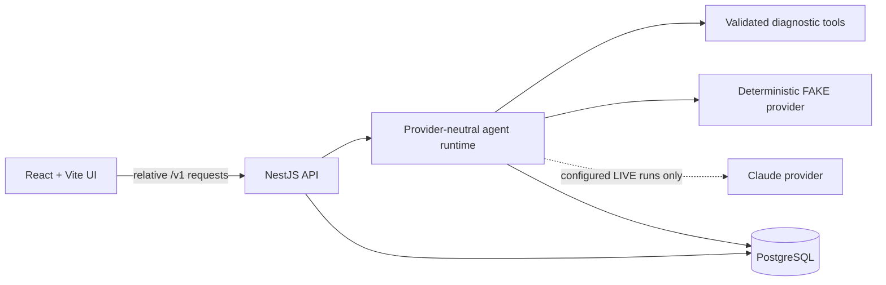

# OpsPilot

<picture>
  <source
    media="(prefers-color-scheme: dark)"
    srcset="apps/web/public/brand/opspilot-lockup-dark.png"
  />
  
</picture>

[](https://github.com/wye-ts/opspilot/actions/workflows/ci.yml)
[](https://opspilot-bkdf.onrender.com)

OpsPilot is an AI-assisted support and incident investigation system. It turns an issue summary into
a persisted investigation, runs a bounded agent with a validated diagnostic tool, produces a
structured evidence-backed report, and can record a human approval or rejection for proposed
actions.

**Live demo:** [https://opspilot-bkdf.onrender.com](https://opspilot-bkdf.onrender.com)

The public demo is a React/Vite frontend and NestJS API served from one Render Docker service and
backed by Neon PostgreSQL. It intentionally defaults to the deterministic `FAKE` provider:
`AGENT_RUN_PROVIDER_MODE=FAKE`, `LIVE_AGENT_RUNS_ENABLED=false`, and no public paid model execution.
Render's free service may need time to wake after being idle.

> **Real-model validation:** OpsPilot completed a controlled end-to-end Claude run in production,
> including diagnostic tool use, structured report generation, suggested actions, approval handoff,
> usage/cost persistence, and safe rollback to FAKE-only mode.

Three distinct modes exist, and two are public today: the **public FAKE demo** above (always
available, no token, no cost) and a **rate-limited public LIVE trial** (Turnstile-verified,
one run/visitor/day, small global run and cost ceilings, concurrency 1 — enabled on the public
deployment per [#39](https://github.com/wye-ts/opspilot/issues/39); `GET /v1/capabilities` reports
current visitor quota). A **separately verified, owner-only controlled LIVE Claude run** (evidence
linked below) also exists via the private access-token path.

The public FAKE demo was independently verified against commit `7df3d92` on 2026-08-01 — browser
walkthrough, health checks, and persistence proof via the public API. See
[Live demo evidence](docs/15-live-demo-evidence.md) for the full verification.

## Why this is more than a chatbot

The application owns the investigation lifecycle instead of handing an unconstrained conversation
to a model:

```text
Issue summary
  → persisted investigation job
  → bounded two-turn agent orchestration
  → validated diagnostic tool call
  → normalized evidence
  → structured report
  → persisted trace and result
  → optional human approval/rejection
```

The model/provider boundary is typed, tool inputs and model outputs are runtime-validated, evidence
must trace back to completed tool calls, and the run is finalized in PostgreSQL. Approval decisions
are also persisted, but **approved actions are not executed, simulated, or scheduled**.

## Architecture



Production uses a single origin: NestJS serves the built frontend at `/` and JSON endpoints at
`/v1/**`. The API executes an investigation synchronously in the request handler; there is no job
queue or background worker in the browser path. The timeline shown after completion is an ordered,
persisted audit trail, **not a real-time streamed progress display**. There is no SSE, WebSocket,
background polling, or asynchronous job execution.

Key engineering boundaries include:

- provider-neutral orchestration with deterministic and Claude adapters;
- Zod-backed model, tool, trace, report, and HTTP contracts;
- a hard five-provider-turn limit and at most three diagnostic tool calls per run;
- PostgreSQL persistence for jobs, runs, ordered trace events, reports, and approval decisions;
- fail-closed live-provider configuration and no silent provider fallback;
- controlled real-model rollout with token protection, idempotent recovery, usage accounting,
  strict structured-output validation, and fail-closed budget safeguards;
- a human decision boundary before any proposed action could be acted upon;
- deterministic unit, integration, evaluation, and Docker smoke coverage;
- GitHub Actions, a multi-stage Docker build, startup migrations, and health checks;
- frontend bundle guards for development origins, backend identifiers, provider SDK references, and
  credential patterns.

See [Technical Design](docs/03-technical-design.md), [Agent Design](docs/04-agent-design.md), and
[Engineering Challenges](docs/10-engineering-challenges.md) for the deeper design record.

## Repository capability vs public demo

The repository contains both deterministic and real-provider paths. The public deployment exposes
only the safe deterministic configuration.

| Capability | Repository | Public demo |
| --- | --- | --- |
| Deterministic investigation | Implemented with `FakeLlmProvider` | Available; default and intended mode |
| Diagnostic tool execution | Implemented with validated inputs and normalized evidence | Available with the deterministic scenario |
| Persisted trace and report | Implemented in PostgreSQL | Available through Neon PostgreSQL |
| Approval recording | Implemented; approve/reject decisions are persisted | Available for the approval demo scenario |
| Real Claude provider | Implemented for worker scripts and per-run API selection, behind a token, rate limit, concurrency lease, and durable daily budget | Disabled; no public paid model execution |
| Browser/API RAG | Implemented — deterministic retriever wired into both FAKE and LIVE run paths | Available; a matching ticket summary produces `RAG_CHUNK` evidence |
| Action execution | Not implemented | Unavailable |
| Authentication/RBAC | Not implemented | Unavailable |
| Live progress streaming | Not implemented | Unavailable; timeline is returned after synchronous completion |

### Provider selection and safety

The repository supports:

- deterministic `FAKE` execution with no model network call;
- real Claude execution through `@opspilot/provider-claude`;
- optional per-run `{"providerMode":"FAKE"}` or `{"providerMode":"LIVE"}` selection on the Agent Run
  API.

An omitted API selection uses `AGENT_RUN_PROVIDER_MODE`, which defaults to `FAKE`. A requested
`LIVE` run requires valid Anthropic configuration and `LIVE_AGENT_RUNS_ENABLED=true`.
**A requested `LIVE` run is never silently downgraded to `FAKE`**: unavailable or disabled live
execution is rejected before a run row or provider call is created.

The browser exposes a `Demo — FAKE` / `Live Claude` selector, defaulting to FAKE. The LIVE option
renders **disabled with a visible reason** unless `GET /v1/capabilities` reports it available, and a
live run additionally requires a shared demo token entered into a session-only field — held in React
state, never written to `localStorage`, `sessionStorage`, or any URL.

Availability is **dynamic, not a mount-time snapshot**: it is re-read on focus, on tab visibility,
before a live run is started, and after every live run finishes, so a tab reflects what the server
can serve now rather than what it could when the page loaded. It is a fail-closed *hint* — the
backend admission path remains authoritative.

Live runs are protected by a shared demo token, a per-client rate limit, a per-instance concurrency
lease, an atomic per-job attempt cap, and a durable PostgreSQL daily run budget with post-run cost
reconciliation. Their honest strengths differ and are documented rather than glossed:

- the **daily run count** and the **per-job attempt cap** are hard — both are reserved inside the
  same transaction that creates the run, which commits before any Anthropic call;
- the **daily cost ceiling** is post-run accounting on an **estimate**, **not** a hard cap on
  money: it stops subsequent runs once crossed, so the *observed reconciled estimate* can cross the
  ceiling by **at most one in-flight logical run** — a bound that holds because exactly one live run
  may be in flight at a time (`LIVE_RUN_MAX_CONCURRENCY` is pinned to `1` and any other value fails
  startup). **Actual provider billing may be higher**, after an ambiguous network outcome or a
  process termination;
- the **per-turn output ceiling** is hard and report-safe — the report-safe `finalizationMaxOutputTokens`
  is applied to every provider turn (`MAX_PROVIDER_TURNS = 5`), because `submit_resolution_report` is
  available on investigation turns too (issue #61 Codex MAJOR 1), giving a daily output envelope of
  `finalizationMaxOutputTokens x 5 x (maxRetries + 1) x dailyRunLimit` — `3072 x 5 x 1 x 10 = 153,600`
  output tokens/day at shipped defaults, where the `+ 1` factor is `1` only because the protected path
  requires `ANTHROPIC_MAX_RETRIES=0`;
- the **rate limit** and **concurrency lease** are per process, and reset on restart;
- **cost figures are a lower bound** — an abandoned-but-billed retry attempt is not observable,
  which is why the public path forbids SDK retries outright.

Two admission paths exist under the same `LIVE_AGENT_RUNS_ENABLED` kill switch, and a request
uses exactly one: the **private path** (`LIVE_RUN_ACCESS_TOKEN`, for the owner) and the **public
trial path** (`LIVE_PUBLIC_TRIAL_ENABLED=true`, Turnstile-verified, one run/visitor/day — issue
[#39](https://github.com/wye-ts/opspilot/issues/39)). Startup fails rather than expose a tokenless
LIVE path with neither admission control configured — there is no unauthenticated, unlimited LIVE
mode.

The public Render service currently runs with the **public trial path enabled**
(`LIVE_AGENT_RUNS_ENABLED=true`, `LIVE_PUBLIC_TRIAL_ENABLED=true`): any visitor can trigger one
Turnstile-verified LIVE Claude run per day, bounded by the public daily run/cost ceilings above.
The **private access-token path remains disabled** (no `LIVE_RUN_ACCESS_TOKEN` configured) — a
controlled, owner-authorized LIVE run was separately executed and verified against this deployment
via that path before it was turned back off; see [Live validation evidence](#live-validation-evidence).
See [CI/CD and deployment](docs/08-cicd-deployment.md) §25 for the safeguard design and rollout
history, each enablement step requiring explicit owner authorization.

See [Agent Run API](docs/12-agent-run-api.md) for the request and error contracts.

### RAG boundary

Runbook retrieval, retrieval validation, evidence grounding, deterministic RAG demos, and offline
evaluation exist in `packages/agent-runtime`; see [RAG Design](docs/05-rag-design.md). Since issue
[#72](https://github.com/wye-ts/opspilot/issues/72), the public browser/API execution path *does*
retrieve runbooks: `apps/api` constructs one deterministic `RUNBOOK_RETRIEVER` at container startup
from the corpus shipped in `runbooks/`, and every run — FAKE or LIVE — resolves a per-ticket query
against it. A matching ticket summary produces a `RAG_CHUNK` evidence entry in the persisted report;
a non-matching one produces the same tool-only evidence the deployed path has always produced.

What is still offline-only: `VoyageRunbookRetriever` (real embedding-based semantic search) stays in
`apps/worker` and is not wired into any deployed path — the deployed retrieval is deterministic
keyword/token-overlap scoring, not semantic search.

## Live validation evidence

OpsPilot was validated against a real Claude model in a controlled production rollout.

- First smoke: the provider and diagnostic tool path worked, but strict report validation correctly
  rejected a malformed report with `REPORT_SCHEMA_INVALID`.
- Fix: aligned Claude-facing report bounds with the canonical `ResolutionReportSchema` while keeping
  strict runtime validation and fail-closed behavior.
- Re-test: completed successfully in LIVE mode with `get_service_status`, a persisted resolution
  report, two suggested actions, and a pending human-approval decision.
- Final posture at the time: the private access-token LIVE path was disabled again and the
  deployed demo returned to deterministic FAKE mode. (Current status differs: the separate public
  trial path, issue #39, is enabled today — see "Provider selection and safety" above. The
  private token path described in this section remains disabled.)

Evidence:
- [Initial LIVE smoke failure](docs/evidence/06c-live-claude-smoke-failure.md)
- [Successful LIVE smoke re-test](docs/evidence/06c-live-claude-smoke-success.md)

## Local development

Requirements: Node.js `22.21.0`, pnpm `11.13.1`, and Docker for PostgreSQL-backed workflows.

### Install and unit checks

No database or provider credential is required for these checks:

```bash
pnpm install
pnpm db:generate
pnpm typecheck
pnpm test
pnpm build
pnpm --filter @opspilot/web run check:bundle
```

### Local PostgreSQL

```bash
cp .env.example .env
pnpm infra:up
pnpm db:test:ensure
pnpm db:migrate:deploy
pnpm db:migrate:test
pnpm db:generate
```

Then run the PostgreSQL suites or persisted demo:

```bash
pnpm --filter @opspilot/database run test:integration
pnpm --filter @opspilot/api run test:integration
pnpm --filter @opspilot/worker run demo:persisted
```

The two integration suites share one test database and must not run in parallel. The repository
provides the serialized equivalent:

```bash
pnpm test:integration:sequential
```

See [Agent Run Persistence](docs/11-agent-run-persistence.md) for schema, migration, and reset
details.

### API and web startup

After starting and migrating local PostgreSQL:

```bash
pnpm --filter @opspilot/api run build
pnpm --filter @opspilot/api run start
```

In another terminal:

```bash
pnpm --filter @opspilot/web run dev
```

The Vite UI runs at `http://127.0.0.1:5173` and proxies relative `/v1/**` requests to the API at
`http://127.0.0.1:3000`. To exercise the API's persisted deterministic and approval workflows:

```bash
pnpm api:demo
```

In the UI, **Approval workflow demo** uses the deterministic
`TICKET-APPROVAL-DEMO` scenario, which produces one proposed customer reply and enables the
persisted approve/reject flow. Ordinary investigations produce no suggested actions. See
[Approval Workflow](docs/13-approval-workflow.md) and [Web UI](docs/14-web-ui.md).

### Deterministic demos and evaluation

```bash
pnpm --filter @opspilot/worker run demo
pnpm --filter @opspilot/worker run demo:rag
pnpm --filter @opspilot/worker run eval
```

These commands use deterministic providers. The RAG demo and the 26-case evaluation exercise the
repository/offline retrieval path, not the public browser path.

`run eval` scores the 26-case suite against the Python/FastAPI evaluation service by default
(`EVALUATION_SERVICE_URL`, e.g. from `services/evaluation`: `make migrate; make run`) — there is no
automatic fallback if it's unreachable. Set `EVALUATION_SCORER=local` to run the frozen,
network-free TypeScript v1 oracle instead. See
[Deterministic Evaluation Harness](docs/07-evaluation-plan.md#10-scorer-selection-and-the-python-evaluation-service-opspilot-61-phases-1-4)
and [`services/evaluation/README.md`](services/evaluation/README.md).

### Optional paid live smoke

With `ANTHROPIC_API_KEY` supplied in the worker environment:

```bash
OPSPILOT_LIVE_SMOKE=1 \
AGENT_RUN_PROVIDER_MODE=LIVE \
ANTHROPIC_MODEL=claude-sonnet-5 \
pnpm --filter @opspilot/worker run test:claude:live
```

> **Warning:** This makes paid Anthropic API requests. It is excluded from normal tests and CI.
>
> The smoke is fail-closed and never falls back to `FAKE`. One run can make up to four Anthropic
> Messages API requests. Its caller-owned deadline covers provider calls, not tool, retrieval, or
> persistence work.

## CI and deployment

GitHub Actions runs type checks, unit tests, production builds, the frontend bundle guard,
PostgreSQL integration tests, migration drift checks, and a Docker smoke workflow. The production
image serves the React bundle and NestJS API together, runs committed migrations before startup,
uses a non-root runtime user, excludes worker source and Voyage AI, and — since issue #72 — ships
the `runbooks/` corpus the deployed API loads at startup.

The deployed topology is:

- one Render Docker web service;
- one Neon PostgreSQL database;
- one public origin for the frontend and API;
- deterministic `FAKE` execution by default, with public `LIVE` execution disabled.

See [CI/CD and Deployment](docs/08-cicd-deployment.md).

## Roadmap

**Milestones 1–9** (Docs & Planning through Live Investigation Timeline & Progress UX): closed. Protected LIVE Claude execution, the canonical investigation event contract, incremental trace persistence, timeline polling/resume, and the rate-limited public LIVE trial (#39, enabled on the public deployment — see above) all shipped.

**Milestone 10 — Visual System Refresh** ([milestone](https://github.com/wye-ts/opspilot/milestone/10)): closed. Refreshed the OpsPilot product identity and provider-card visual system (#41), upgraded evidence into a structured, traceable contract (#55), and mapped real trace data into a richer Agent Activity presentation (#56). See `docs/14-web-ui.md`.

**Milestone 11 — Agent Investigation Depth & Actionability** ([milestone](https://github.com/wye-ts/opspilot/milestone/11)): closed. Added bounded multi-step diagnostic investigation (#57), made diagnostic continuation depend on evidence sufficiency (#58), aligned suggested actions with report recommendations (#59), and added deterministic evaluation coverage for multi-step investigation (#60).

**Milestone 12 — Runbook Retrieval Wired to the Deployed API** ([milestone](https://github.com/wye-ts/opspilot/milestone/12)): closed. Wired runbook retrieval into both the FAKE and LIVE Agent Run API paths (#72) — see the capability table above.

**Milestone 13 — Retrieval Quality Evaluation + Adversarial Robustness** ([milestone](https://github.com/wye-ts/opspilot/milestone/13)): closed. Made retrieval quality a *measured* property rather than an asserted one, and expanded adversarial coverage — structurally in CI, behaviorally as recorded live observations.

- **Corpus + labeled query set** (#74): expanded the runbook corpus from 7 chunks / 5 files to 24 / 16, and authored a 40-query labeled retrieval set spanning four deliberately distinct classes — `exact`, `paraphrase`, `near_miss` (a plausible competing chunk sits in the retrieved top-3; the set is required to contain at least 4 of 12 where that distractor actually outranks the correct answer under the shipped retriever, so the group cannot quietly decay into easy cases), and `true_negative` (plausible domain vocabulary with no correct answer in the corpus). Queries are probed against the real retriever before being committed, so a fixture's claimed property is verified rather than assumed.
- **Retrieval metrics + BM25** (#75): added `recall@k`, MRR, and false-positive-rate metrics, plus a BM25 retriever, with read-compatibility for the new persisted metric generation.
- **Three-way comparison + recorded decision** (#76): scored the keyword, BM25, and frozen-embedding retrievers against the query set under the milestone's pre-declared selection policy. That policy left one gap — what happens when candidates tie exactly on the deciding metric — and an independent review caught it *before* the comparison ran; the tie-break ("the already-shipped retriever wins a tie") was written into the plan at that point, with the frozen-embedding numbers not yet produced, though keyword's own 10/10 paraphrase ceiling was already known and is exactly why the gap was foreseeable. Applied to the real results, the verdict was **"no change" — the incumbent keyword retriever won the tie**, even though the embedding retriever was materially better on the two hardest dimensions (`near_miss` recall@3 12/12 vs 11/12 and 10/12; false-positive rate 37.5% vs 100% and 50%). Both the decision and every losing candidate's numbers are recorded in [`docs/reviews/31-issue-76-comparison-decision.md`](docs/reviews/31-issue-76-comparison-decision.md) — the point of writing the rule down first is that it binds when the result is inconvenient.
- **Adversarial case expansion** (#77): added prompt-injection scenarios across two distinct channels — retrieved RAG content and diagnostic *tool output* — plus credential-exfiltration and role/authority-confusion probes, each in an isolated fixture corpus. Structural cases run offline against the fake provider; model-behavior claims require a real live run and are recorded as single manual observations, never as general guarantees.
- **Structural-adversarial CI readout** (#78): the three structural adversarial cases are named explicitly and reported as their own CI readout, so silent erosion of the set (dropping a case, or "correcting" the count) is visible rather than invisible. Deliberately **not** new enforcement — a failing case already failed the eval run before this. What these cases protect is orchestrator *validation* behavior against the fake provider; live-model injection resistance is not CI-gated and remains a manual, single-run observation.

A calibration threshold in one adversarial scenario rested on a premise the scenario's own wiring contradicted; [#89](https://github.com/wye-ts/opspilot/issues/89) replaced it with a check keyed on attacker-supplied vocabulary, which a correct run cannot produce.

**Milestone 14 — A Second Diagnostic Tool** ([milestone](https://github.com/wye-ts/opspilot/milestone/14)): closed. Took the diagnostic tool catalog from one entry to two, and — more to the point — used the second tool to test where the evaluation harness's guarantees actually end.

- **`get_recent_deployments`** (#93): a seeded, clock-free deployment lookup over the same three service slugs `get_service_status` knows, so the two tools describe one world a run can corroborate across. Its output carries a `knownService` boolean *separately* from an empty `deployments` list, because collapsing the two would let a model ground "no recent deploys, so deployment is ruled out" on the mere absence of a fixture entry — an absence of records is not evidence of an absence of deployments.
- **Two-tool evaluation coverage** (#94): four cases exercising a two-tool investigation chain, three of them deliberately *negative* — a `ROLLED_BACK` deployment stays an unresolved lead, `knownService: false` rules nothing out, and a `FAILED` deployment behind a later `SUCCEEDED` one supports nothing in either direction. The one case carrying a conclusion carries a narrowly-scoped negative, and four independent review rounds were spent narrowing its wording: each round caught the report claiming more than its cited evidence proved (an unrelated runbook cited only to satisfy an evidence-count threshold; criteria quoted from a chunk the run never retrieved; "deployment is excluded" dropping the word *recent* that the bounded-window tool's output actually supports). Those are the defects a fixture-scripted green case would otherwise have blessed in CI, and regression tests now pin each one.

- **Reader-visible surface and a live two-tool run** (#95): the second tool reached the UI (two-tool investigations had been rendering as two identical "Running a diagnostic tool" lines), six stale claims were corrected across the docs, and the spike's composition root stopped pinning a one-entry tool list — so a live model was offered both catalog tools for the first time.

**What this milestone does not establish:** whether a real model *chooses* the right tool — and the live run is what settled that it **cannot be established here**. `evaluation-runner.ts` builds a `FakeLlmProvider` per case, so every tool request in all 26 cases is scripted by the fixture; the spike does let a real model choose, but it is manual, non-deterministic, and single-*scenario* — its four recorded runs agree while varying nothing, since all four use one ticket, one prompt and one retrieval result. An early draft of the spike write-up did read a catalog-sizing conclusion out of it; it was withdrawn during review, because the ticket's "no release has been announced" does not rule a deployment out, so checking the deployment record was ordinary differential diagnosis rather than waste. The generalizable part: **expanding a capability whose quality is unmeasurable does not make it measurable — it only widens the surface no one can assess.** Reasoning and the mechanism-by-mechanism breakdown live in `docs/06-tool-design.md` ("What this milestone did not settle").

No milestone is currently open and there are no open issues. Tabs/workspace navigation and a historical run list remain deferred with no active issue.
