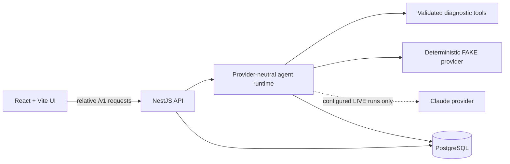

# OpsPilot

[](https://github.com/wye-ts/opspilot/actions/workflows/ci.yml)
[](https://opspilot-bkdf.onrender.com)

OpsPilot is an AI-assisted support and incident investigation system. It turns an issue summary into
a persisted investigation, runs a bounded agent with a validated diagnostic tool, produces a
structured evidence-backed report, and can record a human approval or rejection for proposed
actions.

**Live demo:** [https://opspilot-bkdf.onrender.com](https://opspilot-bkdf.onrender.com)

The public demo is a React/Vite frontend and NestJS API served from one Render Docker service and
backed by Neon PostgreSQL. It intentionally defaults to the deterministic `FAKE` provider:
`AGENT_RUN_PROVIDER_MODE=FAKE`, `LIVE_AGENT_RUNS_ENABLED=false`, and no public paid model execution.
Render's free service may need time to wake after being idle.

## Why this is more than a chatbot

The application owns the investigation lifecycle instead of handing an unconstrained conversation
to a model:

```text
Issue summary
  → persisted investigation job
  → bounded two-turn agent orchestration
  → validated diagnostic tool call
  → normalized evidence
  → structured report
  → persisted trace and result
  → optional human approval/rejection
```

The model/provider boundary is typed, tool inputs and model outputs are runtime-validated, evidence
must trace back to completed tool calls, and the run is finalized in PostgreSQL. Approval decisions
are also persisted, but **approved actions are not executed, simulated, or scheduled**.

## Architecture



Production uses a single origin: NestJS serves the built frontend at `/` and JSON endpoints at
`/v1/**`. The API executes an investigation synchronously in the request handler; there is no job
queue or background worker in the browser path. The timeline shown after completion is an ordered,
persisted audit trail, **not a real-time streamed progress display**. There is no SSE, WebSocket,
background polling, or asynchronous job execution.

Key engineering boundaries include:

- provider-neutral orchestration with deterministic and Claude adapters;
- Zod-backed model, tool, trace, report, and HTTP contracts;
- a hard two-provider-turn limit and at most one diagnostic tool call per run;
- PostgreSQL persistence for jobs, runs, ordered trace events, reports, and approval decisions;
- fail-closed live-provider configuration and no silent provider fallback;
- a human decision boundary before any proposed action could be acted upon;
- deterministic unit, integration, evaluation, and Docker smoke coverage;
- GitHub Actions, a multi-stage Docker build, startup migrations, and health checks;
- frontend bundle guards for development origins, backend identifiers, provider SDK references, and
  credential patterns.

See [Technical Design](docs/03-technical-design.md), [Agent Design](docs/04-agent-design.md), and
[Engineering Challenges](docs/10-engineering-challenges.md) for the deeper design record.

## Repository capability vs public demo

The repository contains both deterministic and real-provider paths. The public deployment exposes
only the safe deterministic configuration.

| Capability | Repository | Public demo |
| --- | --- | --- |
| Deterministic investigation | Implemented with `FakeLlmProvider` | Available; default and intended mode |
| Diagnostic tool execution | Implemented with validated inputs and normalized evidence | Available with the deterministic scenario |
| Persisted trace and report | Implemented in PostgreSQL | Available through Neon PostgreSQL |
| Approval recording | Implemented; approve/reject decisions are persisted | Available for the approval demo scenario |
| Real Claude provider | Implemented for worker scripts and per-run API selection | Disabled; no public paid model execution |
| Browser/API RAG | Not wired; RAG exists in worker/offline evaluation paths | Unavailable |
| Action execution | Not implemented | Unavailable |
| Authentication/RBAC | Not implemented | Unavailable |
| Live progress streaming | Not implemented | Unavailable; timeline is returned after synchronous completion |

### Provider selection and safety

The repository supports:

- deterministic `FAKE` execution with no model network call;
- real Claude execution through `@opspilot/provider-claude`;
- optional per-run `{"providerMode":"FAKE"}` or `{"providerMode":"LIVE"}` selection on the Agent Run
  API.

An omitted API selection uses `AGENT_RUN_PROVIDER_MODE`, which defaults to `FAKE`. A requested
`LIVE` run requires valid Anthropic configuration and `LIVE_AGENT_RUNS_ENABLED=true`.
**A requested `LIVE` run is never silently downgraded to `FAKE`**: unavailable or disabled live
execution is rejected before a run row or provider call is created.

The current browser does not expose a `FAKE`/`LIVE` selector. The public Render service sets
`AGENT_RUN_PROVIDER_MODE=FAKE` and `LIVE_AGENT_RUNS_ENABLED=false`, and does not provide public paid
Claude execution. Shared demo-token protection, rate limiting, concurrency limiting, and a durable
PostgreSQL daily cost budget are not implemented yet.

See [Agent Run API](docs/12-agent-run-api.md) for the request and error contracts.

### RAG boundary

Runbook retrieval, retrieval validation, evidence grounding, deterministic RAG demos, and offline
evaluation exist in `apps/worker` and `packages/agent-runtime`; see
[RAG Design](docs/05-rag-design.md). The public browser/API execution path does not currently
retrieve runbooks. `apps/api` wires no runbook retriever, and `runbooks/` is excluded from the
production image.

## Local development

Requirements: Node.js `22.21.0`, pnpm `11.13.1`, and Docker for PostgreSQL-backed workflows.

### Install and unit checks

No database or provider credential is required for these checks:

```bash
pnpm install
pnpm db:generate
pnpm typecheck
pnpm test
pnpm build
pnpm --filter @opspilot/web run check:bundle
```

### Local PostgreSQL

```bash
cp .env.example .env
pnpm infra:up
pnpm db:test:ensure
pnpm db:migrate:deploy
pnpm db:migrate:test
pnpm db:generate
```

Then run the PostgreSQL suites or persisted demo:

```bash
pnpm --filter @opspilot/database run test:integration
pnpm --filter @opspilot/api run test:integration
pnpm --filter @opspilot/worker run demo:persisted
```

The two integration suites share one test database and must not run in parallel. The repository
provides the serialized equivalent:

```bash
pnpm test:integration:sequential
```

See [Agent Run Persistence](docs/11-agent-run-persistence.md) for schema, migration, and reset
details.

### API and web startup

After starting and migrating local PostgreSQL:

```bash
pnpm --filter @opspilot/api run build
pnpm --filter @opspilot/api run start
```

In another terminal:

```bash
pnpm --filter @opspilot/web run dev
```

The Vite UI runs at `http://127.0.0.1:5173` and proxies relative `/v1/**` requests to the API at
`http://127.0.0.1:3000`. To exercise the API's persisted deterministic and approval workflows:

```bash
pnpm api:demo
```

In the UI, **Approval workflow demo** uses the deterministic
`TICKET-APPROVAL-DEMO` scenario, which produces one proposed customer reply and enables the
persisted approve/reject flow. Ordinary investigations produce no suggested actions. See
[Approval Workflow](docs/13-approval-workflow.md) and [Web UI](docs/14-web-ui.md).

### Deterministic demos and evaluation

```bash
pnpm --filter @opspilot/worker run demo
pnpm --filter @opspilot/worker run demo:rag
pnpm --filter @opspilot/worker run eval
```

These commands use deterministic providers. The RAG demo and the 15-case evaluation exercise the
repository/offline retrieval path, not the public browser path.

### Optional paid live smoke

With `ANTHROPIC_API_KEY` supplied in the worker environment:

```bash
OPSPILOT_LIVE_SMOKE=1 \
AGENT_RUN_PROVIDER_MODE=LIVE \
ANTHROPIC_MODEL=claude-sonnet-5 \
pnpm --filter @opspilot/worker run test:claude:live
```

> **Warning:** This makes paid Anthropic API requests. It is excluded from normal tests and CI.
>
> The smoke is fail-closed and never falls back to `FAKE`. One run can make up to two Anthropic
> Messages API requests. Its caller-owned deadline covers provider calls, not tool, retrieval, or
> persistence work.

## CI and deployment

GitHub Actions runs type checks, unit tests, production builds, the frontend bundle guard,
PostgreSQL integration tests, migration drift checks, and a Docker smoke workflow. The production
image serves the React bundle and NestJS API together, runs committed migrations before startup,
uses a non-root runtime user, and excludes worker source, Voyage AI, and runbooks.

The deployed topology is:

- one Render Docker web service;
- one Neon PostgreSQL database;
- one public origin for the frontend and API;
- deterministic `FAKE` execution by default, with public `LIVE` execution disabled.

See [CI/CD and Deployment](docs/08-cicd-deployment.md).

## Roadmap

Next:

- protect public `LIVE` execution with a shared demo access token;
- add rate and concurrency controls plus a durable PostgreSQL daily budget;
- add a browser `FAKE`/`LIVE` selector with model, latency, and estimated-cost display.

Later:

- move long-running investigations to asynchronous execution;
- expose real-time investigation stages after a durable execution model exists.
