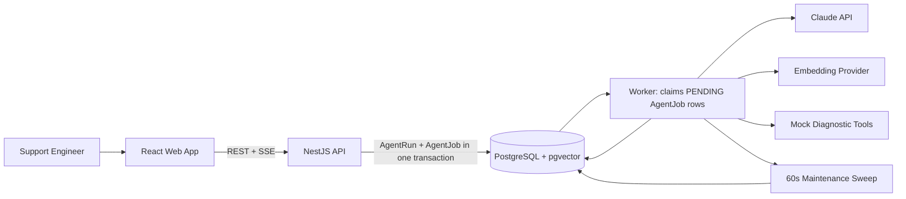
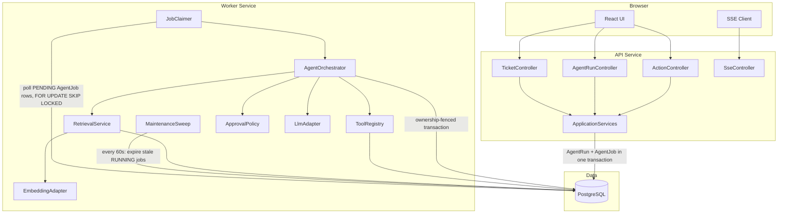
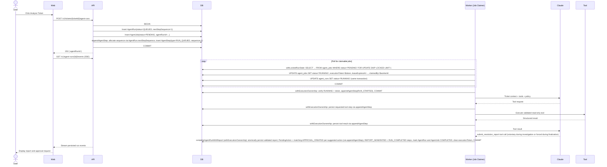
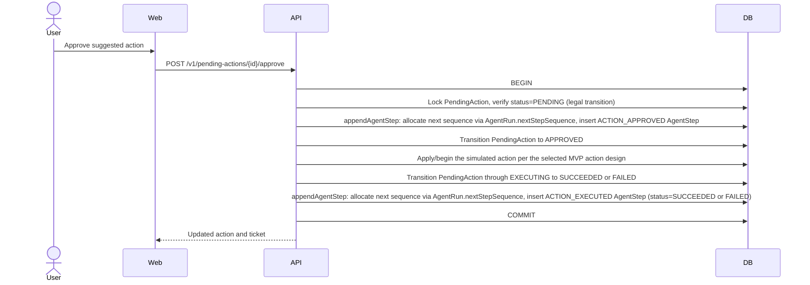
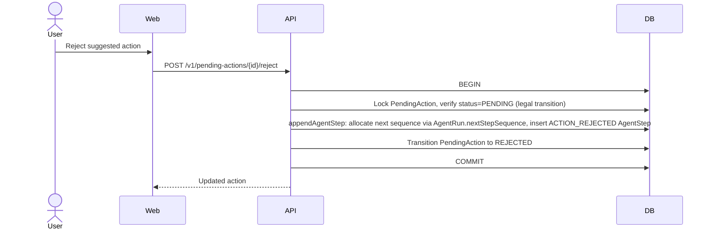
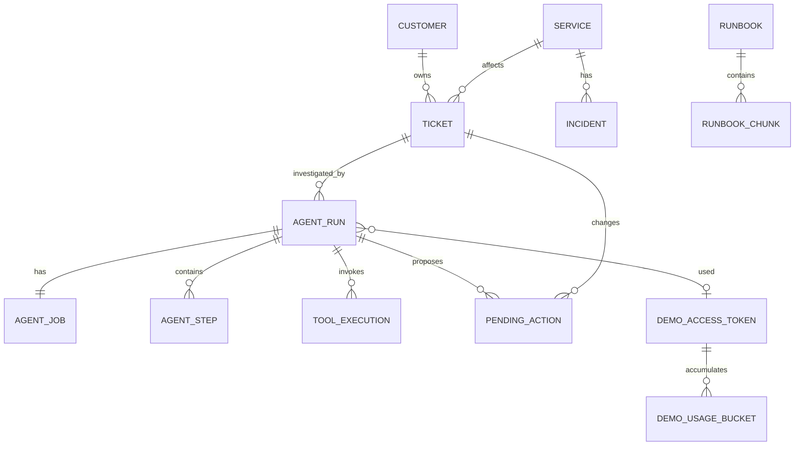
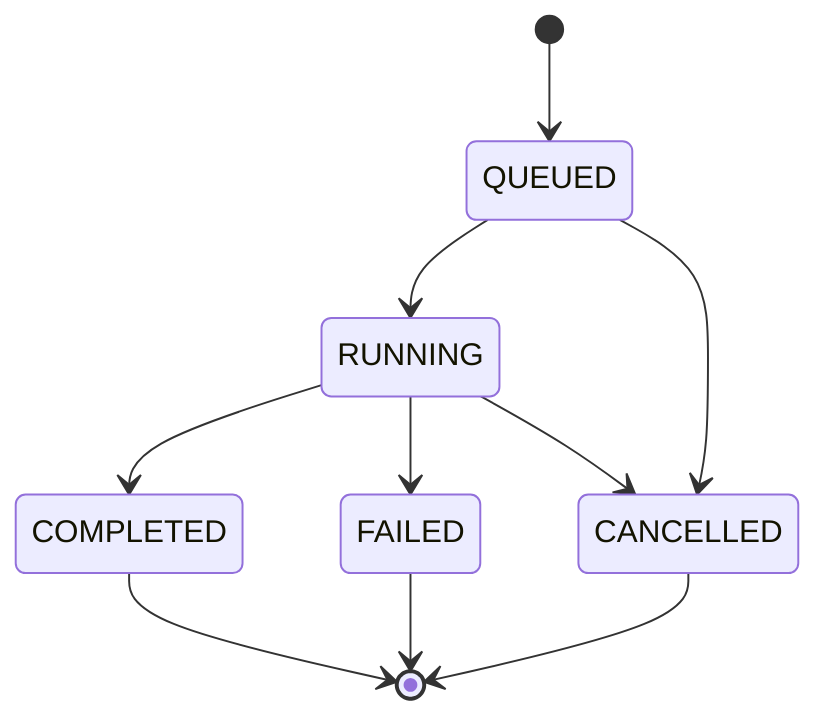
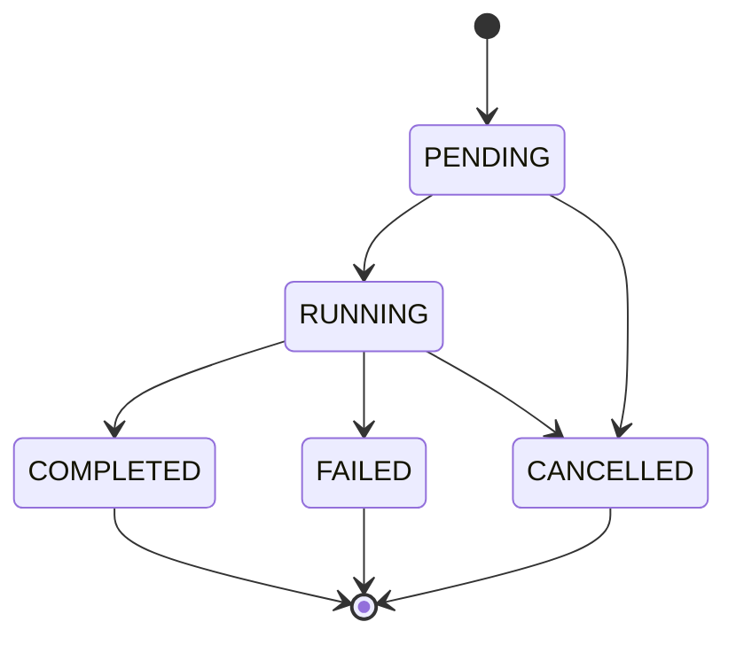
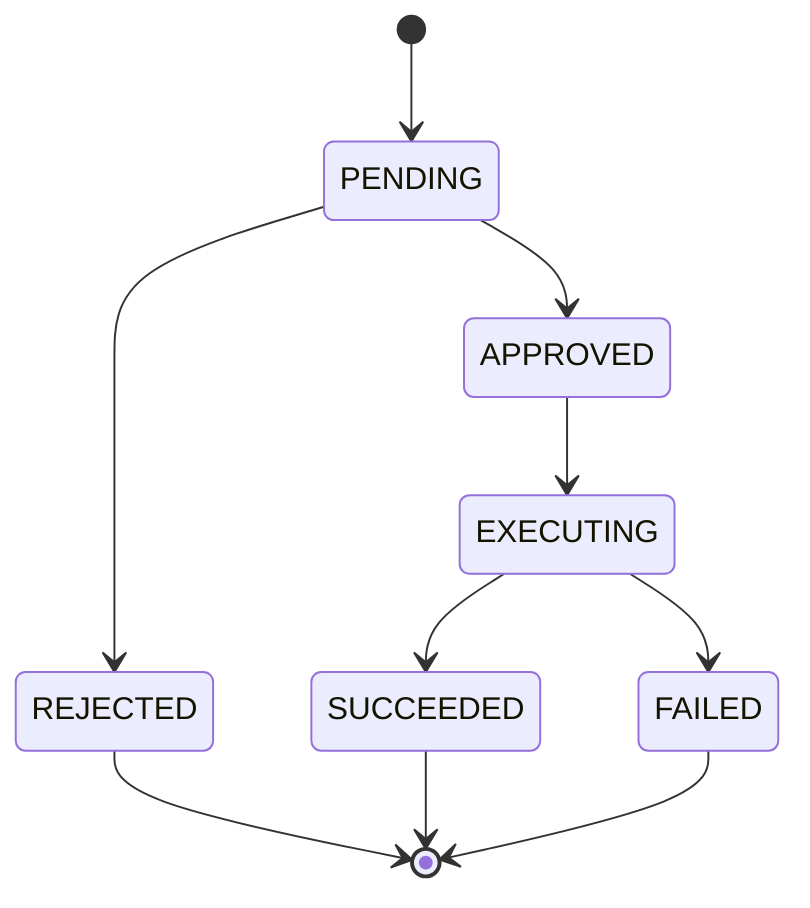
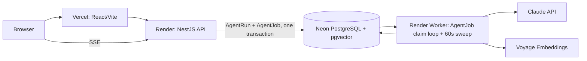

# OpsPilot — Technical Design Document

| Field | Value |
|---|---|
| Document | Technical Design Document |
| Version | 1.3 |
| Status | Approved |
| Project | OpsPilot — AI Support and Incident Resolution Agent |
| Primary audience | Project owner, reviewers, contributors, and interviewers |
| Last updated | July 2026 |
| Related documents | `docs/01-prd.md`, `docs/02-mvp-scope.md`, `docs/10-engineering-challenges.md`, `docs/reviews/03-technical-design-feasibility-review.md`, `docs/reviews/03-technical-design-review-decisions.md` |
| Revision note | v1.3 corrects: precise agent turn/finalization/repair budgets (replacing the ambiguous single `AGENT_MAX_TURNS`); a non-null `bucketKey` on `DemoUsageBucket` (the prior nullable-`demoAccessTokenId` uniqueness constraint was invalid for `GLOBAL_DAILY` rows); one global database lock order (`AgentJob` → `AgentRun` → child rows) with two clearly distinct repository transaction patterns (`withExecutionOwnership` for active-worker writes, `withLockedRunState` for API/system-driven transitions); a corrected cancellation flow that no longer claims the API holds a worker execution token; a `DiagnosticTool`/`ActionDefinition` interface split so approval-required actions can no longer be modeled as executable tools; HMAC-based demo-token hashing; concurrency-safe `AgentStep` sequence allocation via `AgentRun.nextStepSequence` and the shared `appendAgentStep(...)` helper (replacing any implicit `SELECT MAX(sequence) + 1`); making `APPROVAL_CREATED` trace-event creation an explicit, atomic part of `completeAgentRunWithReport` — exactly one `APPROVAL_CREATED` per created `PendingAction`; and removal of language implying the system has already been implemented, deployed, or measured. Status is Approved following the final cross-document verification pass. This document still applies all approved decisions D1–D20 from `docs/reviews/03-technical-design-review-decisions.md`; the evaluated transactional-outbox alternative remains documented in `docs/10-engineering-challenges.md` as a design discussion, not as the MVP architecture. |

---

## 1. Executive Summary

OpsPilot is a production-style AI agent application that helps support and on-call engineers investigate support tickets. The system classifies a ticket, retrieves relevant runbook knowledge, calls diagnostic tools, produces a structured resolution report, and requires human approval before executing any state-changing action.

The MVP is designed as a deployable TypeScript monorepo with four runtime components:

1. A React web application for ticket review, trace inspection, and approval.
2. A NestJS API for HTTP endpoints, validation, and persistence.
3. A NestJS background worker that claims and executes bounded agent jobs directly from PostgreSQL.
4. PostgreSQL for durable state, vector retrieval, and job execution — a single database serves as both the system of record and the job queue for the MVP.

Claude is used as the reasoning and tool-selection model. The application owns the agent loop, executes tools, validates every tool request, records observable trace events, and enforces approval boundaries. The model never receives direct access to the database or infrastructure.

The architecture intentionally favors clear service boundaries, typed contracts, traceability, and testability over framework-heavy abstractions. The project should be understandable in a code review, demonstrable in a short video, and deployable using common managed services.

**Architecture note:** An earlier revision of this document specified Redis, BullMQ, and a transactional outbox pattern for database-to-queue delivery. A feasibility review (`docs/reviews/03-technical-design-feasibility-review.md`) found that pattern to be sound but disproportionately complex for a one-engineer MVP at this traffic scale. The approved decision (`docs/reviews/03-technical-design-review-decisions.md`, D1) replaces it with a PostgreSQL-backed `AgentJob` design: because PostgreSQL is already the system of record, using it as the job queue as well eliminates the cross-system dual-write problem by construction rather than solving it with additional infrastructure. The full evaluation of the transactional-outbox alternative — including its failure-mode analysis, which remains generally instructive — is preserved in `docs/10-engineering-challenges.md` Challenge 1, clearly marked as an alternative that was evaluated and not selected for the MVP.

---

## 2. Goals

The technical design must support the following product goals:

- Provide one complete ticket-to-resolution workflow.
- Demonstrate a bounded AI agent loop with typed tool calling.
- Ground agent output in runbooks and diagnostic evidence.
- Persist every user-visible decision, tool call, and result.
- Require human approval for state-changing actions.
- Support local development with one documented setup flow.
- Support a public portfolio deployment with mock data.
- Run automated tests and build checks in CI.
- Produce measurable agent quality, latency, and token-usage data.
- Remain small enough for one engineer to implement and maintain.

---

## 3. Non-Goals

The following are not part of the MVP architecture:

- Real production access to Jira, Slack, Datadog, PagerDuty, or Zendesk.
- Real customer data or production logs.
- Autonomous service restarts, configuration changes, or email delivery.
- Multi-agent orchestration.
- Fine-tuning or model training.
- Enterprise authentication, SSO, or full role-based access control.
- High-volume multi-tenant operation.
- A general-purpose agent framework.
- Kubernetes deployment.
- A full analytics or billing platform.
- Redis, BullMQ, a transactional outbox, a queue relay process, a dead-letter queue, or a dedicated reconciliation CLI — evaluated in `docs/10-engineering-challenges.md` and not selected for the MVP (D1, D2, D16).

The design should not add infrastructure solely to imitate a large company. Every component must support a concrete MVP requirement.

---

## 4. Assumptions and Constraints

### 4.1 Assumptions

- The application uses mock tickets, services, logs, customers, and incidents.
- The public demo has low traffic and one logical workspace.
- A single agent run investigates one ticket at a time.
- Runbooks are authored as Markdown and checked into the repository.
- The model and embedding provider are accessed through server-side API keys.
- A user can manually rerun an investigation.
- Tool outputs are deterministic mock data for the MVP.
- The initial deployment may use free or low-cost managed services for Vercel, Render, and Neon. This assumption is **not yet verified** — Render worker-tier pricing/availability and Neon cold-start behavior are open deployment validation spikes (D10; see §33 and the spike table in `docs/reviews/03-technical-design-review-decisions.md`), not settled facts. Redis/Upstash is no longer part of the architecture, so its cost risk is eliminated entirely rather than assumed away.

### 4.2 Constraints

- The frontend must never receive provider API keys.
- Agent work must not block a normal HTTP request until completion.
- Tool calls must be schema-validated before execution.
- Read-only diagnostic tools and approval-required actions must have separate execution policies — the latter are never directly executable tools (§14.4).
- Agent runs must be bounded by tool-call, time, and token limits.
- The application must not store or expose hidden model reasoning.
- Trace records must contain observable actions and concise rationale summaries only.
- Deployment-specific values must be configured through environment variables.
- Creating an agent run and its execution job must occur atomically in a single PostgreSQL transaction. Because both the business record (`AgentRun`) and the execution record (`AgentJob`) live in the same database, this is a normal local ACID transaction — not a cross-system dual write requiring an outbox.
- The repository must remain usable without a proprietary agent framework.

---

## 5. Architecture Principles

### 5.1 Application-Controlled Agent Loop

The application, not the model, controls execution. Claude may request a tool call, but application code validates the request, checks permissions, executes the tool, stores the result, and decides whether another model round trip is allowed.

### 5.2 PostgreSQL as System of Record and Job Queue

PostgreSQL is the system of record for all durable application state. For the MVP, PostgreSQL is **also** the job queue: the API creates an `AgentRun` and its corresponding `AgentJob` in the same database transaction, and the worker claims `AgentJob` rows directly from PostgreSQL via `FOR UPDATE SKIP LOCKED` polling. There is no second system (Redis/BullMQ) and therefore no cross-system dual-write problem to solve.

This design guarantees:

- A rolled-back database transaction produces neither an `AgentRun` nor an `AgentJob` — there is nothing to leave orphaned in a second system.
- A worker crash mid-run cannot silently lose the run: a 60-second maintenance sweep (§16.6) detects an expired claim and marks the job and run `FAILED`.
- A worker that is merely slow, not dead, cannot corrupt state after the sweep reassigns terminal status to its job: every worker write uses the `withExecutionOwnership` pattern, which locks and re-verifies the owning `AgentJob` row before writing anything (§16.3). Cancellation uses a related but distinct pattern, `withLockedRunState` (§16.3, §16.7).
- There is no queue-specific infrastructure (Redis, BullMQ, a relay, a dead-letter queue) to operate, monitor, or reconcile.

An earlier design used a transactional outbox pattern to bridge PostgreSQL and a separate Redis/BullMQ queue. That pattern is a legitimate, well-understood solution to the general dual-write problem, and its full analysis — failure modes, alternatives, tradeoffs — is preserved in `docs/10-engineering-challenges.md` Challenge 1 as an evaluated alternative. It was not selected for the MVP because, at this project's traffic scale and with a single logical workspace, introducing a second stateful system to solve a problem that PostgreSQL-as-queue avoids by construction was judged to be added complexity without a corresponding MVP requirement (`docs/reviews/03-technical-design-feasibility-review.md`, Overengineering Review OE-1).

### 5.3 Asynchronous Long-Running Work

Ticket analysis is submitted as a background job. The HTTP API returns an agent run identifier immediately. The frontend receives progress through Server-Sent Events and can fall back to polling.

### 5.4 Explicit Trust Boundaries

Ticket text, runbook content, logs, and tool output are treated as untrusted data. They cannot define new tools, modify system policy, or bypass approval rules.

### 5.5 Typed Inputs and Outputs

API payloads, queue messages, model tool inputs, tool outputs, and final reports use shared schemas. Runtime validation is required at every external boundary.

### 5.6 Provider Isolation

The rest of the application depends on internal `LlmProvider` and `EmbeddingProvider` interfaces rather than provider SDK types. This makes model replacement and deterministic testing possible.

### 5.7 Inspectability Over Hidden Reasoning

The UI displays events such as classification, retrieval, tool selection, tool execution, and final report generation. It does not display or persist private chain-of-thought.

The bounded Claude conversation — including tool results — is retained across agent turns for the duration of a single run so the model has full context of what it has already learned. Every tool output is validated, sanitized, and truncated before being appended to that conversation (§13.7). What the system *persists* to PostgreSQL and shows in the UI is a separate, observable trace summary (`AgentStep`, `ToolExecution`) — never the live model conversation and never hidden reasoning.

---

## 6. System Context

### 6.1 Actors

- **Support engineer:** Reviews tickets, starts investigations, reviews evidence, and approves or rejects actions.
- **OpsPilot web client:** Presents product state and subscribes to run progress.
- **OpsPilot API:** Validates requests and atomically writes an `AgentRun` and its `AgentJob` to PostgreSQL in one transaction.
- **OpsPilot worker:** Polls and claims `AgentJob` rows from PostgreSQL, runs the maintenance sweep, executes the bounded agent workflow, and invokes tools.
- **Claude API:** Selects tools and produces structured outputs.
- **Embedding provider:** Creates vectors for runbook ingestion and retrieval.
- **PostgreSQL:** Stores application state, trace records, vectors, and job execution state — the single source of truth.

### 6.2 System Context Diagram



---

## 7. Runtime Architecture

### 7.1 Deployable Components

| Component | Responsibility | Runtime |
|---|---|---|
| `apps/web` | Ticket UI, run trace, report view, approval UI | Static React/Vite deployment |
| `apps/api` | REST API, SSE, validation, and persistence including atomic `AgentRun`/`AgentJob` creation | Node.js web service |
| `apps/worker` | `AgentJob` claiming, the 60-second maintenance sweep, agent execution, retrieval, tool execution, and eval jobs | Node.js background worker |
| PostgreSQL | Durable relational data, vector storage, and job execution state | Managed PostgreSQL with pgvector |

The API and worker use the same domain packages but run as separate processes. This prevents long model calls from consuming API request capacity and makes failures easier to isolate.

### 7.2 High-Level Component Diagram



### 7.3 Why a Separate Worker Is Required

Agent investigations can include several provider round trips, retrieval queries, and tool executions. Running this work directly inside `POST /tickets/:id/agent-runs` would create several problems:

- HTTP timeouts would be more likely.
- Refreshing the browser could appear to cancel work.
- Transient provider failures would be difficult to retry safely.
- API capacity would be tied up by long-lived requests.
- Horizontal scaling would mix interactive and background workloads.

The API therefore creates an `AgentRun` and an `AgentJob` in one PostgreSQL transaction, then returns `202 Accepted`. The worker polls `agent_jobs` directly for `PENDING` rows — there is no relay process and no separate publish step, because the queue and the system of record are the same database.

---

## 8. Request and Agent Execution Flow

### 8.1 Start Investigation Sequence



`202 Accepted` means the request is durably stored in PostgreSQL. There is no second system that needs to separately accept the job — the same transaction that commits the `AgentRun`, `AgentJob`, and the `RUN_QUEUED` trace step also makes the job claimable.

### 8.2 Approval Sequence

**Approval transaction** (row-locked, not worker-ownership — the API never holds an `AgentJob` execution token):



Both trace inserts follow the canonical order for every approval/action API transaction: lock `PendingAction` first, then allocate the next `AgentStep.sequence` value by atomically updating the owning `AgentRun.nextStepSequence` (via `appendAgentStep(...)`, §16.3), then insert the `AgentStep` itself — `PendingAction` → `AgentRun` sequence allocation → `AgentStep`. This is the same canonical lock order used everywhere else in this design (`AgentJob` → `AgentRun` → child rows, §16.3), specialized for approval/action transactions, which never touch `AgentJob` at all. `appendAgentStep` never commits independently — both calls above are part of the one transaction shown.

For the MVP, the simulated action itself is a PostgreSQL-only change, so approval, execution, and both trace inserts share the single transaction boundary shown above, exactly as already defined by the selected MVP action design (§8's non-real-integration scope). If a future real external integration changes that design (§8's note below), the transaction boundary(ies) follow whatever that idempotent action design specifies — not this MVP-only diagram.

**Rejection transaction:**



Both transactions use a conditional, row-locked `PENDING → ...` transition (`SELECT ... FOR UPDATE`, then update only if `status = PENDING`); this is the duplicate-approval protection — two concurrent requests against the same `PendingAction` can never both succeed. Approval-required actions remain `ActionDefinition` proposals, never agent-executable tools (§14.1, §14.4) — approving one only unlocks the application's own simulated execution, not a new agent-invoked tool call.

Every approval/action API transaction that touches `PendingAction` and `AgentRun` — approve, reject, and simulated execution alike — follows the same canonical order: `PendingAction` locked first, `AgentRun.nextStepSequence` allocated second (via `appendAgentStep`), `AgentStep` inserted third. This is a row-locked API transaction, not `withExecutionOwnership` and not `withLockedRunState` — it never touches `AgentJob` and never requires, checks, or references an `AgentJob.executionToken` (§16.3, §16.8). Two concurrent approvals of different `PendingAction` rows belonging to the same `AgentRun` each call `appendAgentStep` independently; the row lock on `AgentRun` taken by the counter `UPDATE` inside `appendAgentStep` serializes the two allocations so they receive distinct, non-colliding `AgentStep.sequence` values — neither is ever computed via `SELECT MAX(sequence) + 1`.

Approval always occurs after the investigation has produced its completed, validated final report. The agent does not pause mid-investigation and wait for a human decision before continuing — a suggested action is a field inside the already-generated report, not an interactive checkpoint inside the agent loop (D7). For the MVP, all simulated actions are PostgreSQL-only changes and execute in one database transaction.

**A note on future real integrations:** the ownership-fencing mechanism (§16.3, §16.5) solves a *different* problem than approval-action delivery to a real external system, and does not extend to it. Ownership fencing prevents a stale worker *within this single PostgreSQL database* from corrupting state — it has no bearing on consistency between PostgreSQL and a genuinely external system (a real Jira update, a real email send). If a future action calls a real external API, that reintroduces the same class of cross-system dual-write problem analyzed in `docs/10-engineering-challenges.md` Challenge 1, just with a third-party API in place of a job queue. Solving it correctly would require its own idempotent action design — provider-side idempotency keys where the external API supports them, an explicit retry/backoff policy for the outbound call, and potentially a dedicated transactional outbox for outbound action delivery — not a reuse of the `AgentJob` mechanism, which was designed for, and is scoped to, a single-database problem.

---

## 9. Repository and Monorepo Design

### 9.1 Package Management

Use `pnpm` workspaces. The monorepo should have one lockfile and shared TypeScript, lint, and test configuration.

### 9.2 Proposed Repository Structure

```text
opspilot/
├── apps/
│   ├── web/
│   │   ├── src/
│   │   │   ├── api/
│   │   │   ├── components/
│   │   │   ├── features/
│   │   │   │   ├── tickets/
│   │   │   │   ├── agent-runs/
│   │   │   │   ├── approvals/
│   │   │   │   └── runbooks/
│   │   │   ├── pages/
│   │   │   ├── routes/
│   │   │   └── test/
│   │   └── package.json
│   ├── api/
│   │   ├── src/
│   │   │   ├── bootstrap/
│   │   │   ├── health/
│   │   │   ├── tickets/
│   │   │   ├── agent-runs/
│   │   │   ├── pending-actions/
│   │   │   ├── runbooks/
│   │   │   └── common/
│   │   └── package.json
│   └── worker/
│       ├── src/
│       │   ├── bootstrap/
│       │   ├── jobs/
│       │   ├── agent/
│       │   ├── retrieval/
│       │   ├── tools/
│       │   ├── providers/
│       │   └── common/
│       └── package.json
├── packages/
│   ├── contracts/
│   │   └── src/
│   ├── database/
│   │   ├── prisma/
│   │   │   ├── schema.prisma
│   │   │   ├── migrations/
│   │   │   └── seed.ts
│   │   └── src/
│   ├── config/
│   ├── logger/
│   └── test-utils/
├── docs/
├── runbooks/
├── evals/
│   ├── cases/
│   ├── results/
│   └── src/
├── scripts/
├── .github/
│   └── workflows/
├── docker/
├── docker-compose.yml
├── pnpm-workspace.yaml
├── package.json
├── tsconfig.base.json
├── eslint.config.js
├── .env.example
├── CLAUDE.md
└── README.md
```

`apps/worker/src/jobs/` contains the `AgentJob` claim loop, both repository transaction patterns (`withExecutionOwnership` and `withLockedRunState`, §16.3), and the 60-second maintenance sweep. There is no `outbox/` package or folder — the outbox pattern was evaluated (`docs/10-engineering-challenges.md` Challenge 1) and not selected for the MVP.

### 9.3 Package Responsibilities

#### `packages/contracts`

Contains provider-neutral runtime schemas and TypeScript types for:

- API requests and responses
- Agent final report
- `DiagnosticTool` inputs and outputs (§14.1)
- `ActionDefinition` payloads (§14.1, §14.4)
- `AgentJob` claim/lease payloads
- SSE event payloads
- Eval case format

Use Zod as the runtime schema source and infer TypeScript types from the schemas. Do not maintain duplicate interface and validation definitions.

#### `packages/database`

Contains:

- Prisma schema and generated client
- Migrations
- Database client lifecycle
- Repositories that require raw SQL
- `AgentJob` creation, claiming, both repository transaction pattern helpers (`withExecutionOwnership`, `withLockedRunState`), and maintenance-sweep queries
- Seed data

Prisma should handle normal relational CRUD. Vector columns and similarity queries should use explicit SQL because vector extension types are not fully represented by Prisma ORM.

#### `packages/config`

Loads and validates environment variables at process startup. A process must fail fast when required configuration is invalid.

#### `packages/logger`

Exports the structured logger and common context helpers for `requestId`, `agentRunId`, `agentJobId`, and `toolExecutionId`.

---

## 10. Technology Decisions

| Area | Decision | Reason |
|---|---|---|
| Language | TypeScript | Matches the owner's background and allows shared contracts across web, API, and worker |
| Frontend | React + Vite | Fast local development and simple static deployment |
| Backend | NestJS REST API | Modular server structure, validation support, and familiar TypeScript patterns |
| Job execution | PostgreSQL-backed `AgentJob` table, claimed via `FOR UPDATE SKIP LOCKED` | Single system of record and job queue; eliminates the cross-system dual write by construction (D1). A Redis/BullMQ transactional-outbox alternative was evaluated and documented in `docs/10-engineering-challenges.md` but not selected for the MVP. |
| Database | PostgreSQL | Relational consistency, JSON support, job execution, and operational familiarity |
| Vector storage | pgvector | Keeps application and retrieval data in one database |
| ORM | Prisma for relational CRUD | Typed data access and migrations |
| Vector queries | Parameterized raw SQL | Required for vector operations and explicit similarity control |
| LLM | Claude Messages API | Strong tool-use workflow and structured outputs |
| Embeddings | Configurable Voyage embedding adapter | Anthropic does not provide an embedding model; adapter avoids hard coupling. Exact model and dimension are selected via a RAG spike before the `RunbookChunk` migration is finalized (D18, §33). |
| Realtime updates | Server-Sent Events | One-way progress updates are sufficient and simpler than WebSockets |
| Validation | Zod | Shared runtime validation for API, jobs, tools, and model output |
| Testing | Jest for backend, Vitest and React Testing Library for web, Playwright for E2E | Appropriate tools for each layer; MVP-required scope is reduced — see §22 |
| Local infrastructure | Docker Compose | Reproducible PostgreSQL with pgvector; no Redis service is required |
| Frontend deployment | Vercel | Direct Vite deployment and preview environments |
| API and worker deployment | Render | Separate web service and background worker from the same repository. Render worker-tier pricing/availability is an open deployment spike (D10), not a settled assumption. |
| Managed database | Neon PostgreSQL | Managed PostgreSQL with pgvector support. Cold-start/autosuspend behavior is an open deployment spike (D10). |

All provider model names must be environment-configurable. Database records must persist the exact model identifier used for each run (D20).

---

## 11. Domain Model

### 11.1 Core Entities

#### Ticket

Represents a support request being investigated.

| Field | Type | Notes |
|---|---|---|
| `id` | UUID | Primary key |
| `externalRef` | String | Human-readable identifier such as `TKT-1001` |
| `title` | String | Short summary |
| `description` | Text | Full ticket text |
| `priority` | Enum | `LOW`, `MEDIUM`, `HIGH`, `CRITICAL` |
| `status` | Enum | `OPEN`, `IN_PROGRESS`, `RESOLVED`, `ESCALATED` |
| `category` | Enum nullable | Latest accepted category |
| `customerId` | UUID | Foreign key |
| `serviceId` | UUID nullable | Suspected affected service |
| `createdAt` | Timestamp | Seeded or generated time |
| `updatedAt` | Timestamp | Last modification |

#### Customer

Contains mock customer context.

| Field | Type | Notes |
|---|---|---|
| `id` | UUID | Primary key |
| `name` | String | Mock customer name |
| `plan` | Enum | `FREE`, `PRO`, `ENTERPRISE` |
| `region` | String | Mock region |
| `accountStatus` | Enum | `ACTIVE`, `SUSPENDED`, `PENDING_VERIFICATION` |
| `metadata` | JSONB | Safe mock attributes |

#### Service

Represents a mock operational service.

| Field | Type | Notes |
|---|---|---|
| `id` | UUID | Primary key |
| `slug` | String unique | Example: `notification-service` |
| `displayName` | String | UI name |
| `status` | Enum | `HEALTHY`, `DEGRADED`, `OUTAGE` |
| `metadata` | JSONB | Mock ownership and endpoints |

#### Incident

Represents a prior or active mock incident used by the similar-incident tool.

| Field | Type | Notes |
|---|---|---|
| `id` | UUID | Primary key |
| `title` | String | Incident title |
| `summary` | Text | Incident description |
| `serviceId` | UUID | Affected service |
| `category` | Enum | Incident category |
| `rootCause` | Text | Known root cause |
| `resolution` | Text | Known resolution |
| `startedAt` | Timestamp | Incident start |
| `resolvedAt` | Timestamp nullable | Incident end |

#### Runbook

Represents a source Markdown document.

| Field | Type | Notes |
|---|---|---|
| `id` | UUID | Primary key |
| `slug` | String unique | Stable document identifier |
| `title` | String | Display title |
| `sourcePath` | String | Repository-relative path |
| `contentHash` | String | Used to avoid unnecessary re-ingestion |
| `version` | Integer | Incremented on content change |
| `createdAt` | Timestamp | Creation time |
| `updatedAt` | Timestamp | Last ingestion |

#### RunbookChunk

Represents a retrievable section.

| Field | Type | Notes |
|---|---|---|
| `id` | UUID | Primary key |
| `runbookId` | UUID | Foreign key |
| `chunkIndex` | Integer | Stable order within document version |
| `headingPath` | String | Example: `Diagnosis > Email provider` |
| `content` | Text | Chunk body |
| `tokenCount` | Integer | Approximate size |
| `embeddingModel` | String | Exact embedding model, selected via the RAG spike (D18) |
| `embedding` | Vector | Provider-dependent fixed dimension, selected via the RAG spike (D18) |
| `metadata` | JSONB | Tags, services, and category |
| `createdAt` | Timestamp | Ingestion time |

#### AgentRun

Represents one investigation attempt. Each retry is a **new** `AgentRun` — the MVP never resumes or reuses a failed run (D5, D11).

| Field | Type | Notes |
|---|---|---|
| `id` | UUID | Primary key |
| `ticketId` | UUID | Foreign key |
| `status` | Enum | `QUEUED`, `RUNNING`, `COMPLETED`, `FAILED`, `CANCELLED` |
| `model` | String | Exact Claude model identifier actually used for this run (D20) |
| `promptVersion` | String | Versioned prompt identifier |
| `idempotencyKey` | String nullable unique | Prevents accidental duplicate submission at the API layer |
| `startedAt` | Timestamp nullable | First worker start |
| `completedAt` | Timestamp nullable | Terminal time |
| `latencyMs` | Integer nullable | Total run latency |
| `inputTokens` | Integer nullable | Provider usage |
| `outputTokens` | Integer nullable | Provider usage |
| `cacheReadTokens` | Integer nullable | Provider usage when available |
| `estimatedCostUsd` | Decimal nullable | Derived from configured pricing table |
| `finalReport` | JSONB nullable | Validated final report |
| `errorCode` | String nullable | Stable application error code |
| `errorMessage` | Text nullable | Sanitized failure detail |
| `providerMode` | Enum | `FAKE`, `LIVE` — which provider implementation actually executed this run |
| `demoAccessTokenId` | UUID nullable | Foreign key to `DemoAccessToken`; set only when `providerMode = LIVE` (§11.1 DemoAccessToken, §25.4) |
| `nextStepSequence` | Integer, not null, default `1` | The next `AgentStep.sequence` value available for allocation within this run; modified only by the shared `appendAgentStep(...)` repository helper (§16.3) — never read or written via `SELECT MAX(sequence) + 1` |
| `createdAt` | Timestamp | Submission time |

`nextStepSequence` is scoped to exactly one `AgentRun` and exists solely to make `AgentStep.sequence` allocation concurrency-safe: `appendAgentStep(...)` atomically increments it and inserts the corresponding `AgentStep` inside the same transaction, so two concurrent transactions appending trace events for the same run can never compute the same next sequence value (§16.3). The `UNIQUE(agentRunId, sequence)` constraint on `AgentStep` (§11.3) remains in place as the final database-level invariant regardless.

Execution ownership, lease, and fencing-token fields live on `AgentJob`, not on `AgentRun` — see below. This keeps the business-facing entity (`AgentRun`) free of queue-mechanics fields.

#### AgentJob

Represents the durable execution claim for exactly one `AgentRun`. This is the MVP's job-queue mechanism: PostgreSQL is both the system of record and the queue, so there is no separate `OutboxEvent` or external queue message.

| Field | Type | Notes |
|---|---|---|
| `id` | UUID | Primary key |
| `agentRunId` | UUID unique | Foreign key; one `AgentJob` per `AgentRun` |
| `ticketId` | UUID | Denormalized for indexing/query convenience |
| `status` | Enum | `PENDING`, `RUNNING`, `COMPLETED`, `FAILED`, `CANCELLED` |
| `executionToken` | String nullable | Unique fencing token issued on successful claim; invalidated (set to `NULL`) when the job leaves `RUNNING` |
| `claimedBy` | String nullable | Worker/process identifier that holds the current claim |
| `claimedAt` | Timestamp nullable | When the current claim was acquired |
| `leaseExpiresAt` | Timestamp nullable | Claim deadline; used only by the maintenance sweep as a crash-detection signal, not by any reclaim/resume logic |
| `errorCode` | String nullable | Stable error code, e.g. set by the sweep on timeout |
| `errorMessage` | Text nullable | Sanitized failure detail |
| `createdAt` | Timestamp | Creation time (same transaction as the owning `AgentRun`) |
| `updatedAt` | Timestamp | Last state change |

Workers may claim only `PENDING` jobs (D11). A `RUNNING` job is **never** reclaimed or resumed by another worker — the only ways a `RUNNING` job leaves that state are the owning worker completing/failing it, the 60-second maintenance sweep marking it `FAILED` after its lease expires (§16.6), or a user cancelling the run, which marks it `CANCELLED` (§16.7). A cancelled `PENDING` job is likewise never claimable, since the worker's claim query only selects rows still in `PENDING` (§16.4). There is deliberately no heartbeat-refresh mechanism: because every worker write uses the `withExecutionOwnership` pattern (§16.3) rather than a bare conditional update, correctness does not depend on the lease staying "fresh" during a long individual model call — see the corrected reasoning in `docs/reviews/03-technical-design-review-decisions.md` P0-4, and §13.3 below for how the lease duration should actually be sized.

#### AgentStep

Stores an ordered, user-visible trace event.

| Field | Type | Notes |
|---|---|---|
| `id` | UUID | Primary key |
| `agentRunId` | UUID | Foreign key |
| `sequence` | Integer | Monotonic within a run |
| `type` | Enum | `RUN_QUEUED`, `RUN_STARTED`, `CLASSIFICATION`, `RETRIEVAL`, `TOOL_REQUESTED`, `TOOL_COMPLETED`, `REPORT_GENERATED`, `APPROVAL_CREATED`, `ACTION_APPROVED`, `ACTION_REJECTED`, `ACTION_EXECUTED`, `RUN_FAILED`, `RUN_CANCELLED`, `RUN_COMPLETED` |
| `status` | Enum | `STARTED`, `SUCCEEDED`, `FAILED`, `SKIPPED` |
| `title` | String | Concise display label |
| `summary` | Text | Observable rationale or result summary |
| `payload` | JSONB | Sanitized structured detail |
| `createdAt` | Timestamp | Event time |

The `summary` must not contain hidden model reasoning. It should describe what the system did and what evidence it observed.

**Approval/action trace semantics:**

- `APPROVAL_CREATED` — inside `completeAgentRunWithReport` (§16.5), one `APPROVAL_CREATED` event is created for every validated suggested action in the final report, in report order, each referencing the `PendingAction` (status `PENDING`) created in the same iteration — including at least `pendingActionId`, `actionType`, and a bounded, sanitized summary (never hidden reasoning or the unbounded action payload). A report with zero suggested actions creates zero `PendingAction` rows and zero `APPROVAL_CREATED` events. Every committed `PendingAction` created by finalization has exactly one committed `APPROVAL_CREATED` event referencing it, and no `APPROVAL_CREATED` event exists without its matching `PendingAction` — both are inserted together, inside the same transaction, and neither is ever created outside `completeAgentRunWithReport`.
- `ACTION_APPROVED` — a human transitioned a `PendingAction` from `PENDING` to `APPROVED` (§8.2).
- `ACTION_REJECTED` — a human transitioned a `PendingAction` from `PENDING` to `REJECTED` (§8.2).
- `ACTION_EXECUTED` — the approved simulated action finished; `AgentStep.status = SUCCEEDED` for a successful execution, `AgentStep.status = FAILED` for an execution failure. There is no separate `ACTION_EXECUTION_FAILED` type — `ACTION_EXECUTED` with `status = FAILED` covers it, consistent with how `RUN_FAILED`/`TOOL_COMPLETED` already use `AgentStep.status` rather than a dedicated failure type for each event.

Every `AgentStep` insert goes through the shared `appendAgentStep(...)` repository helper (§16.3), which atomically allocates the row's `sequence` value from `AgentRun.nextStepSequence` and inserts the `AgentStep` inside the caller's existing transaction — never via `SELECT MAX(sequence) + 1`, and never as a step that could commit independently of the surrounding transaction. `appendAgentStep` never commits on its own; it participates in whichever transaction pattern the caller is already using, and that pattern depends on who is writing and what state, if any, is being fenced:

- `RUN_QUEUED` is inserted, via `appendAgentStep`, in the ordinary `AgentRun` + `AgentJob` creation transaction (§16.2) — before any worker has claimed the job, so there is no execution token to fence and this is **not** an ownership-fenced write. Because `AgentRun.nextStepSequence` starts at `1` and this is the first `appendAgentStep` call for the run, `RUN_QUEUED` always receives `sequence = 1`.
- Active-worker trace writes (`RUN_STARTED`, `CLASSIFICATION`, `RETRIEVAL`, `TOOL_REQUESTED`, `TOOL_COMPLETED`, `REPORT_GENERATED`, `APPROVAL_CREATED`, `RUN_COMPLETED`, and worker-detected `RUN_FAILED`) call `appendAgentStep` from inside `withExecutionOwnership` (§16.3, §16.5).
- Claim/sweep/cancellation system-state trace writes (`RUN_CANCELLED`, and sweep-driven `RUN_FAILED`) call `appendAgentStep` from inside `withLockedRunState` where applicable (§16.3, §16.6, §16.7).
- Approval-API trace writes (`ACTION_APPROVED`, `ACTION_REJECTED`, `ACTION_EXECUTED`) call `appendAgentStep` from inside their own row-locked approval/action transaction (§8.2), following the canonical order `PendingAction` locked first, then `AgentRun.nextStepSequence` allocated, then the `AgentStep` inserted — they are **not** worker-ownership writes and do not require, check, or reference an `AgentJob` execution token at all.

#### ToolExecution

Stores each requested and executed **diagnostic** tool call. For the MVP, `ToolExecution` records `DiagnosticTool` (§14.1) calls only — approval-required actions are never rows in this table; they are proposed as `ActionDefinition` payloads inside the final report and tracked exclusively via `PendingAction` (below), never via `ToolExecution`.

| Field | Type | Notes |
|---|---|---|
| `id` | UUID | Primary key |
| `agentRunId` | UUID | Foreign key |
| `toolUseId` | String | Provider tool call identifier |
| `toolName` | String | Registered `DiagnosticTool` name |
| `toolVersion` | String | Tool implementation version |
| `permission` | Enum | `READ_ONLY` — the only value for MVP; retained as a column for forward compatibility, not because any other value is currently possible (§14.1) |
| `input` | JSONB | Validated and redacted input |
| `output` | JSONB nullable | Validated and redacted output |
| `status` | Enum | `REQUESTED`, `RUNNING`, `SUCCEEDED`, `FAILED`, `REJECTED` |
| `durationMs` | Integer nullable | Execution duration |
| `errorCode` | String nullable | Stable tool error code |
| `createdAt` | Timestamp | Request time |
| `completedAt` | Timestamp nullable | Completion time |

#### PendingAction

Represents a proposed state-changing action. The MVP recognizes exactly three action types (D6):

| Field | Type | Notes |
|---|---|---|
| `id` | UUID | Primary key |
| `agentRunId` | UUID | Foreign key |
| `ticketId` | UUID | Foreign key |
| `actionType` | Enum | `UPDATE_TICKET_STATUS`, `CREATE_ESCALATION`, `DRAFT_CUSTOMER_REPLY` |
| `payload` | JSONB | Validated action parameters |
| `status` | Enum | `PENDING`, `APPROVED`, `REJECTED`, `EXECUTING`, `SUCCEEDED`, `FAILED` |
| `requestedBy` | String | `agent` for MVP |
| `decidedBy` | String nullable | Mock user identifier |
| `decidedAt` | Timestamp nullable | Approval or rejection time |
| `executedAt` | Timestamp nullable | Side-effect completion |
| `errorMessage` | Text nullable | Sanitized action error |
| `createdAt` | Timestamp | Proposal time |

A `PendingAction` is only ever created as part of an already-completed final report (§13.1, §14.4) — never as a mid-loop, interactive request (D7).

#### DemoAccessToken

Represents a credential that permits live-provider (real Claude/Voyage) `AgentRun`s on the public demo (D13, §25.4). Fake-provider mode requires no token. Hashing uses HMAC-SHA-256, not a generic salted hash — see §25.4 for the full rationale.

| Field | Type | Notes |
|---|---|---|
| `id` | UUID | Primary key |
| `label` | String | Human-readable, non-secret identifier for the token |
| `tokenPrefix` | String | A short, safe prefix of the raw token (e.g., first 8 characters), used only for display and administration — **not authentication material** and insufficient on its own to authenticate |
| `tokenHash` | String | `HMAC-SHA-256(rawToken, serverSecret)`, computed with `DEMO_ACCESS_TOKEN_HMAC_SECRET` (§26.1) — the raw token value is never stored, and the HMAC secret itself is never stored in this table or anywhere in the database |
| `enabled` | Boolean | A disabled token cannot start a live-provider run |
| `expiresAt` | Timestamp nullable | An expired token cannot start a live-provider run |
| `createdAt` | Timestamp | |
| `lastUsedAt` | Timestamp nullable | Updated each time the token successfully starts a live-provider run |

The raw token is shown to the operator **only once**, at creation time, and is never stored or retrievable afterward. Verifying a presented token means computing `HMAC-SHA-256(presentedToken, serverSecret)` and comparing it to `tokenHash` using a constant-time comparison where the runtime provides one (e.g., Node's `crypto.timingSafeEqual`). Token values and hashes are never logged (§21.1).

#### DemoUsageBucket

Represents one fixed rate-limit counting window, used to enforce the daily global limit and the hourly per-token limit (D13) with an atomic increment.

| Field | Type | Notes |
|---|---|---|
| `id` | UUID | Primary key |
| `scope` | Enum | `GLOBAL_DAILY`, `TOKEN_HOURLY` |
| `bucketKey` | String, **not null** | The uniqueness key for this bucket. For `GLOBAL_DAILY`, always the literal string `"GLOBAL"`. For `TOKEN_HOURLY`, the `DemoAccessToken.id` (as text) or another stable non-null token identifier. **This field, not `demoAccessTokenId`, is what uniqueness is enforced on** — see below for why. |
| `demoAccessTokenId` | UUID nullable | Foreign key to `DemoAccessToken` for `TOKEN_HOURLY` rows; `NULL` for `GLOBAL_DAILY` rows. Retained for joins/reporting only — it must **not** be relied on for the uniqueness constraint, because PostgreSQL unique constraints permit multiple rows with a `NULL` in the constrained column, which would let concurrent `GLOBAL_DAILY` requests each insert a fresh row instead of colliding on one. |
| `windowStart` | Timestamp | Start of the counting window (truncated to the day for `GLOBAL_DAILY`, to the hour for `TOKEN_HOURLY`) |
| `count` | Integer | Number of live-provider runs started within this window |
| `updatedAt` | Timestamp | |

**Canonical uniqueness constraint:** `UNIQUE(scope, bucketKey, windowStart)`. This is the constraint the atomic upsert conflicts on (below) and the only constraint that correctly serializes concurrent `GLOBAL_DAILY` increments, since `bucketKey` is always non-null for every scope.

**Atomic usage-counter behavior:** starting a live-provider run performs an atomic upsert against both the relevant `GLOBAL_DAILY` and `TOKEN_HOURLY` buckets, **in the same transaction as the `AgentRun`/`AgentJob` creation itself** (§16.2), for example:

```sql
INSERT INTO demo_usage_buckets (id, scope, bucket_key, demo_access_token_id, window_start, count, updated_at)
VALUES (gen_random_uuid(), 'TOKEN_HOURLY', $tokenId::text, $tokenId, date_trunc('hour', now()), 1, now())
ON CONFLICT (scope, bucket_key, window_start)
DO UPDATE SET count = demo_usage_buckets.count + 1, updated_at = now()
RETURNING count;

INSERT INTO demo_usage_buckets (id, scope, bucket_key, demo_access_token_id, window_start, count, updated_at)
VALUES (gen_random_uuid(), 'GLOBAL_DAILY', 'GLOBAL', NULL, date_trunc('day', now()), 1, now())
ON CONFLICT (scope, bucket_key, window_start)
DO UPDATE SET count = demo_usage_buckets.count + 1, updated_at = now()
RETURNING count;
```

The application checks both returned `count` values against their configured limits (`DEMO_LIVE_RUNS_HOURLY_LIMIT_PER_TOKEN` and `DEMO_LIVE_RUNS_DAILY_LIMIT`) inside the **same transaction** that creates the `AgentRun` and `AgentJob`. If either limit is exceeded:

- Roll back the entire transaction — both bucket increments, the `AgentRun` insert, and the `AgentJob` insert.
- Do not create an `AgentRun`.
- Do not create an `AgentJob`.
- Return a stable rate-limit error (e.g., `DEMO_RATE_LIMIT_EXCEEDED`) to the client.

This `INSERT ... ON CONFLICT (scope, bucket_key, window_start) ... DO UPDATE ... RETURNING` pattern, combined with the shared transaction boundary, is what makes a burst of concurrent requests unable to all read a stale count, all pass the check, and all get a live `AgentRun` created (§25.4).

### 11.2 Entity Relationships



### 11.3 Important Indexes and Constraints

- Unique index on `Ticket.externalRef`.
- Composite index on `Ticket(status, priority, createdAt DESC)`.
- Index on `AgentRun(ticketId, createdAt DESC)`.
- Unique index on non-null `AgentRun.idempotencyKey`.
- Index on `AgentRun(demoAccessTokenId)`.
- Unique index on `AgentJob.agentRunId`.
- Index on `AgentJob(status, createdAt)` — supports the `FOR UPDATE SKIP LOCKED` claim query.
- Index on `AgentJob(status, leaseExpiresAt)` — supports the 60-second maintenance sweep.
- Index on `AgentJob(ticketId)`.
- Unique index on `AgentStep(agentRunId, sequence)` — the final database-level invariant. `sequence` values are allocated exclusively by the shared `appendAgentStep(...)` helper via the atomic `AgentRun.nextStepSequence` increment (§16.3), never via `SELECT MAX(sequence) + 1` and never outside the transaction that inserts the row; correct use of `appendAgentStep` should never violate this constraint, but it remains in place as defense in depth.
- Index on `ToolExecution(agentRunId, createdAt)`.
- Index on `PendingAction(ticketId, status)`.
- Unique index on `DemoAccessToken.tokenHash`.
- Index on `DemoUsageBucket(demoAccessTokenId)` — for joins/reporting only, not for uniqueness.
- Unique index on `DemoUsageBucket(scope, bucketKey, windowStart)` — the canonical uniqueness constraint; required for the atomic upsert-increment pattern above. `bucketKey`, not `demoAccessTokenId`, is used because a nullable column cannot correctly enforce uniqueness for `GLOBAL_DAILY` rows.
- Unique index on `Runbook(slug)`.
- Unique index on `RunbookChunk(runbookId, chunkIndex, embeddingModel)`.
- Vector index on `RunbookChunk.embedding` when the dataset is large enough to justify approximate search.
- Foreign keys use restrictive deletion by default. Seed reset scripts may delete in dependency order.

---

## 12. API Design

### 12.1 API Conventions

- Base path: `/v1`
- Content type: `application/json`
- UUID identifiers
- ISO 8601 timestamps in UTC
- Consistent error envelope
- Request validation at controller boundaries
- Response serialization from explicit DTOs
- No pagination is required for MVP list endpoints — the seeded dataset is small (D19). List endpoints should still return a response envelope shape that could add pagination later without a breaking change, but implementing cursor pagination itself is post-MVP.
- `X-Request-Id` accepted from clients or generated by the API
- `Idempotency-Key` supported for creating agent runs
- OpenAPI documentation generation is post-MVP (D19), not required for Feature Complete (§30)

### 12.2 Error Envelope

```json
{
  "error": {
    "code": "AGENT_RUN_NOT_FOUND",
    "message": "The requested agent run does not exist.",
    "requestId": "req_...",
    "details": null
  }
}
```

Do not return provider stack traces, prompts, API keys, raw SQL errors, or unsanitized tool output.

### 12.3 Endpoints

#### Health

| Method | Path | Purpose |
|---|---|---|
| `GET` | `/v1/health/live` | Process liveness |
| `GET` | `/v1/health/ready` | Database readiness |

#### Tickets

| Method | Path | Purpose |
|---|---|---|
| `GET` | `/v1/tickets` | List tickets with filters |
| `GET` | `/v1/tickets/:ticketId` | Get ticket details and latest run summary |
| `PATCH` | `/v1/tickets/:ticketId` | Update permitted mock ticket fields |

Suggested list filters:

- `status`
- `priority`
- `category`

#### Agent Runs

| Method | Path | Purpose |
|---|---|---|
| `POST` | `/v1/tickets/:ticketId/agent-runs` | Atomically create an `AgentRun` and its `AgentJob` |
| `GET` | `/v1/agent-runs/:agentRunId` | Get current run, report, steps, and actions |
| `GET` | `/v1/agent-runs/:agentRunId/events` | Stream trace events over SSE |
| `GET` | `/v1/tickets/:ticketId/agent-runs` | List prior runs |
| `POST` | `/v1/agent-runs/:agentRunId/cancel` | Best-effort cancellation before completion |

Create response:

```json
{
  "data": {
    "agentRunId": "7af4a39c-6adf-4aa8-9f72-000000000001",
    "status": "QUEUED",
    "createdAt": "2026-07-15T20:00:00.000Z"
  }
}
```

#### Pending Actions

| Method | Path | Purpose |
|---|---|---|
| `POST` | `/v1/pending-actions/:actionId/approve` | Approve and execute a simulated action |
| `POST` | `/v1/pending-actions/:actionId/reject` | Reject an action |
| `GET` | `/v1/pending-actions/:actionId` | Read action state |

Approval and rejection must use a database transaction with a conditional status transition. Two concurrent requests must not execute an action twice.

#### Runbooks

| Method | Path | Purpose |
|---|---|---|
| `GET` | `/v1/runbooks` | List ingested runbooks |
| `GET` | `/v1/runbooks/:runbookId` | Read runbook metadata and sections |

Runbook ingestion is a developer script for the MVP rather than a public upload endpoint:

```text
pnpm runbooks:ingest
```

This reduces authentication and file-upload complexity while preserving the RAG capability.

### 12.4 SSE Event Contract

Event names:

- `run.snapshot`
- `run.step.created`
- `run.updated`
- `action.created`
- `action.updated`
- `heartbeat`

Example:

```text
event: run.step.created
id: 12
data: {"agentRunId":"...","sequence":4,"type":"TOOL_COMPLETED","status":"SUCCEEDED","title":"Checked service status","summary":"The notification service is degraded."}
```

The SSE endpoint should:

- Send an initial snapshot.
- Replay events after `Last-Event-ID` when possible.
- Poll PostgreSQL for new steps at a modest interval in the MVP.
- Send a heartbeat every 15 seconds.
- Close after a terminal run state and final event delivery.
- Allow the frontend to fall back to `GET /agent-runs/:id`.

A database-backed replay model is preferred over any external pub/sub mechanism because trace events must survive process restarts, and because there is no separate messaging system in this architecture. SSE connection survival through the deployment proxy path is an open validation spike (D10; see §33).

---

## 13. Agent Architecture

### 13.1 Agent Responsibilities

The single MVP agent may:

- Classify the ticket.
- Decide which read-only tools are needed.
- Request relevant operational evidence.
- Use retrieved runbook excerpts.
- Summarize likely root cause.
- State uncertainty.
- Produce recommended next steps.
- Propose one or more approval-required actions **as part of its final report**.

The agent may not:

- Directly mutate application state.
- Create unregistered tools.
- Execute arbitrary code.
- Query the database directly.
- Exceed configured limits.
- Claim evidence that is not present in the ticket, runbooks, or tool output.
- Pause mid-investigation to request human approval. Approval is only ever evaluated after the agent has produced a complete, schema-valid final report (D7, §13.5). There is no suspend/resume mechanism for a partially completed investigation.

### 13.2 Agent Loop

The agent loop has two phases with **separate, non-overlapping turn budgets**, plus a distinct repair budget:

| Budget | Env var | Default | Governs |
|---|---:|---:|---|
| Investigation turns | `AGENT_MAX_INVESTIGATION_TURNS` | 5 | Model turns in which Claude may call read-only diagnostic tools or voluntarily submit a report |
| Finalization turns | `AGENT_MAX_FINALIZATION_TURNS` | 1 | A reserved turn, entered only if investigation ends without a report, that exposes only `submit_resolution_report` |
| Report repair attempts | `AGENT_MAX_REPORT_REPAIR_ATTEMPTS` | 1 | Extra `submit_resolution_report`-only turns issued after a schema-invalid report, separate from both turn budgets above |
| Diagnostic tool calls | `AGENT_MAX_DIAGNOSTIC_TOOL_CALLS` | 5 | Total read-only diagnostic tool calls across the investigation phase only |

The finalization turn is **reserved**, not shared: investigation turns may not consume it, and reaching the investigation-turn limit is precisely what triggers spending it. `submit_resolution_report` is a protocol/finalizer tool, never a diagnostic tool — see §13.5.

```text
Investigation phase (bounded by AGENT_MAX_INVESTIGATION_TURNS and
AGENT_MAX_DIAGNOSTIC_TOOL_CALLS):

1. Load the ticket and safe mock context.
2. Create the model request with:
   - versioned system policy
   - ticket data
   - the registered read-only diagnostic tool definitions
   - the submit_resolution_report finalizer tool definition (optional during investigation, forced only during finalization — see step 8)
   - output requirements
3. Before each model call, check termination conditions (see below). If any apply, stop
   immediately per that condition's rule rather than making the call.
4. Receive a Claude response.
5. If the response requests a read-only diagnostic tool:
   a. verify tool name is registered as a DiagnosticTool (§14.1)
   b. validate input against the tool schema
   c. check permission policy (always READ_ONLY for MVP diagnostic tools)
   d. execute the tool
   e. persist request, result, duration, and trace step, via withExecutionOwnership (§16.3)
   f. return the tool result to Claude and continue the investigation phase (step 3),
      counting this call against AGENT_MAX_DIAGNOSTIC_TOOL_CALLS
6. If the response calls submit_resolution_report, the investigation phase ends normally
   — proceed to final-report handling (step 9). This call does not consume a finalization
   turn and is not counted as a diagnostic tool call.
7. If AGENT_MAX_DIAGNOSTIC_TOOL_CALLS or AGENT_MAX_INVESTIGATION_TURNS is reached without a
   submit_resolution_report call, and time remains before AGENT_TIMEOUT_MS, proceed to the
   forced finalization phase (step 8).

Forced finalization phase (bounded by AGENT_MAX_FINALIZATION_TURNS; entered only from step 7):

8. Issue at most one additional model request that exposes ONLY the submit_resolution_report
   tool (no read-only diagnostic tools are offered) and forces its use via tool_choice. This
   gives Claude one last chance to summarize whatever evidence it has already gathered, without
   being able to request further diagnostic evidence. This turn does not draw from
   AGENT_MAX_INVESTIGATION_TURNS.

Final-report handling (reached from step 6 or step 8; bounded by AGENT_MAX_REPORT_REPAIR_ATTEMPTS):

9. Validate the submit_resolution_report input against the shared schema.
   - If validation fails, send the validation error back to Claude and allow exactly
     AGENT_MAX_REPORT_REPAIR_ATTEMPTS (1) repair turn, which also exposes only
     submit_resolution_report and does not draw from either turn budget above.
   - If the repair attempt also fails validation, invoke failOwnedAgentRun (§16.3, §16.5)
     with a stable error code (REPORT_SCHEMA_INVALID or equivalent) — one atomic transaction,
     for the same reason completeAgentRunWithReport (step 10) must be atomic on the success path.
10. Invoke completeAgentRunWithReport (§16.3, §16.5) — ONE atomic withExecutionOwnership
    transaction that persists the validated report; inserts, in validated report order, one
    PendingAction and one matching APPROVAL_CREATED trace step (via appendAgentStep) for
    every suggested action; inserts the REPORT_GENERATED and RUN_COMPLETED trace steps; and
    marks both the run and its AgentJob COMPLETED. Report persistence, PendingAction/
    APPROVAL_CREATED creation, and the terminal state transition are never separate,
    independently-committable operations: a crash or ownership loss between them could
    otherwise leave a persisted finalReport with no COMPLETED status, a PendingAction with
    no matching APPROVAL_CREATED event, or an executable PendingAction attached to a run
    that never actually finished.
```

**Termination rules (checked before every model call, step 3):**

| Condition | Action |
|---|---|
| `AGENT_MAX_DIAGNOSTIC_TOOL_CALLS` reached, time remaining before `AGENT_TIMEOUT_MS` | Enter forced finalization (step 8) |
| `AGENT_MAX_INVESTIGATION_TURNS` reached, time remaining before `AGENT_TIMEOUT_MS` | Enter forced finalization (step 8) |
| `AGENT_TIMEOUT_MS` deadline reached | Invoke failOwnedAgentRun (§16.3, §16.5) with a stable `AGENT_TIMEOUT` error. Do **not** make another model call — not a diagnostic call, not a forced-finalization call, and not a repair call. A report that cannot be produced within the deadline is a failed run, not a rushed one. |
| Cancellation detected | Stop immediately. Do **not** enter forced finalization, and do not attempt a repair turn. See §16.7. |
| Unrecoverable provider, safety, or database error | Invoke failOwnedAgentRun (§16.3, §16.5). Do **not** enter forced finalization. |

The prior revision of this document allowed the system to reach `AGENT_MAX_TURNS` and then still make additional forced-finalization and schema-repair model calls, with no accounting for whether those calls would themselves exceed the deadline. The budgets and termination rules above replace that ambiguity: forced finalization and repair are reserved, bounded turns that are only ever entered with time remaining, never a way to exceed the deadline after it has already passed.

### 13.3 Bounded Execution

Default limits:

| Limit | Default |
|---|---:|
| Maximum investigation turns (`AGENT_MAX_INVESTIGATION_TURNS`) | 5 |
| Maximum finalization turns (`AGENT_MAX_FINALIZATION_TURNS`) | 1 (reserved; not shared with investigation turns) |
| Maximum report repair attempts (`AGENT_MAX_REPORT_REPAIR_ATTEMPTS`) | 1 (separate from both turn budgets) |
| Maximum total diagnostic tool calls (`AGENT_MAX_DIAGNOSTIC_TOOL_CALLS`) | 5 |
| Maximum calls to the same diagnostic tool | 2 |
| Maximum retrieved chunks | 5 |
| Worker job timeout (`AGENT_TIMEOUT_MS`) | 90 seconds |
| Target p95 demo latency | 30 seconds |
| Maximum final report size | 8 KB serialized |
| Maximum tool output included in model context | Tool-specific, sanitized and truncated |

The diagnostic tool-call limits apply only to read-only diagnostic tool calls (`DiagnosticTool`, §14.1). `submit_resolution_report` is a protocol/finalizer tool, not a `DiagnosticTool`, and is never counted against them (§13.5). See §13.2 for the full termination-rule table governing how these budgets interact with `AGENT_TIMEOUT_MS`.

The target is not a hard guarantee. Timeouts and limits must produce a clear failed run rather than an indefinite process.

**Lease-duration guidance (corrected):** `AgentJob.leaseExpiresAt` is assigned once, at claim time, and is never refreshed — there is no heartbeat (§16.3, §16.8; see Overengineering Review OE-3 in `docs/reviews/03-technical-design-review-decisions.md`). Because a single run may span multiple model turns and tool calls, the lease must cover the run's **entire** duration, not one provider call. `AGENT_TIMEOUT_MS` (90 seconds by default, §13.8) is the maximum total duration of a run; the lease duration must be set **strictly greater than `AGENT_TIMEOUT_MS`**, plus an operational margin (e.g., a few seconds) to absorb scheduling jitter between the worker's own timeout enforcement and the sweep's lease check. Do **not** size the lease from p99 single-provider-call latency — that measures the wrong thing and would systematically undersize the lease relative to the actual claim duration, causing the maintenance sweep to fail runs that are still legitimately within their total timeout budget.

The maintenance sweep (§16.6) is a **crash-detection** mechanism: it exists to notice a worker that has stopped making progress entirely (crashed, hung, or was killed), not to bound the duration of any single Claude call — that bound is `AGENT_TIMEOUT_MS` itself, enforced by the worker's own loop. The **fencing token** (§16.3), not the lease duration, remains the write-safety mechanism that prevents a stale or cancelled worker from corrupting state; the lease only controls how quickly a genuinely dead worker's job is detected and failed.

### 13.4 LLM Provider Interface

```ts
interface LlmProvider {
  runAgentTurn(input: AgentTurnInput): Promise<AgentTurnResult>;
}
```

The internal result should normalize provider output into:

```ts
type AgentTurnResult =
  | {
      type: "tool_requests";
      providerRequestId: string;
      usage: TokenUsage;
      requests: ToolRequest[];
    }
  | {
      type: "final_report";
      providerRequestId: string;
      usage: TokenUsage;
      report: ResolutionReport;
    };
```

Provider-specific content block types must not escape the adapter. `type: "final_report"` is produced by the adapter specifically when Claude's response is a `submit_resolution_report` call — the adapter, not the raw provider response shape, is what normalizes "Claude called the finalizer tool" into this result type; see §13.5.

### 13.5 Structured Output

The final report is elicited through the schema-defined `submit_resolution_report` tool, not free-text JSON parsing (D3). The worker defines this tool with an input schema matching the `ResolutionReport` Zod schema. Its use is **optional during investigation** — Claude may call it voluntarily as soon as it judges the investigation complete (§13.2, step 6) — and **forced during the finalization phase**, where it is the only tool exposed (§13.2, step 8). In either case, Claude returns a schema-shaped tool-call input; this is not yet a validated report. The worker validates that input with Zod (§13.2, step 9) before accepting or persisting it, and permits exactly one bounded repair attempt if validation fails. Only a successfully validated report may be persisted — eliminating the prose-wrapping/parsing failure mode a free-text approach would have, without implying that every call is forced or that the raw tool-call input is already trustworthy on arrival.

**`submit_resolution_report` is a protocol/finalizer tool, not a diagnostic tool.** This distinction matters and is enforced throughout the agent loop (§13.2) and tool registry (§14.2):

- It is offered to Claude during the investigation phase, but is never *forced* there — Claude may call it as soon as it judges the investigation complete, or continue investigating.
- It is the **only** tool offered, and is force-selected via `tool_choice: {type: "tool", name: "submit_resolution_report"}`, during the forced finalization phase (§13.2, step 8).
- It performs **no external side effect** — calling it does not itself change any application state beyond the in-progress model turn. The worker validates the returned tool-call input with Zod first (§13.2, step 9), then invokes `completeAgentRunWithReport` (§13.2, step 10) to atomically persist the validated report, any `PendingAction` records and their one-to-one matching `APPROVAL_CREATED` trace events, the completion trace steps, and the terminal `COMPLETED` transition for both `AgentRun` and `AgentJob` — one transaction, not a sequence of independently-committable writes.
- It is **not counted** against `AGENT_MAX_DIAGNOSTIC_TOOL_CALLS` or the per-tool call limit (§13.3) — those limits bound diagnostic evidence-gathering, not the act of finalizing.
- It is not registered in, and not subject to, the read-only `DiagnosticTool` registry (§14.1–§14.2) — it is a distinct, protocol-level mechanism for ending the loop, not a graded tool the model chooses among diagnostic options.

A conceptual shape of the report:

```json
{
  "category": "EMAIL_DELIVERY",
  "summary": "Password reset messages are delayed for a subset of users.",
  "probableRootCause": "The notification provider is returning temporary delivery failures.",
  "confidence": 0.86,
  "evidence": [
    {
      "sourceType": "TOOL",
      "sourceId": "tool-execution-id",
      "claim": "The notification service is degraded."
    }
  ],
  "citations": [
    {
      "runbookChunkId": "chunk-id",
      "label": "Password Reset Email > Provider failure"
    }
  ],
  "recommendedSteps": [
    "Confirm the provider incident status.",
    "Retry eligible messages after service recovery."
  ],
  "customerReplyDraft": "We identified a delay affecting password reset emails...",
  "internalNote": "Delivery failures correlate with the provider degradation window.",
  "suggestedActions": [
    {
      "type": "CREATE_ESCALATION",
      "reason": "Multiple customers are affected.",
      "payload": {
        "team": "notifications",
        "severity": "HIGH"
      }
    }
  ]
}
```

The report schema must enforce:

- Known category values.
- Confidence between `0` and `1`.
- Maximum lengths.
- Citation identifiers rather than invented URLs.
- Allowed action types — exactly `UPDATE_TICKET_STATUS`, `CREATE_ESCALATION`, `DRAFT_CUSTOMER_REPLY` (D6).
- Valid action payloads.

**Schema-repair policy (D4):** if the `submit_resolution_report` tool-call input fails schema validation, the worker sends the validation error back to Claude and allows exactly **one** repair attempt before failing the run. This is a deliberate, narrow exception to the general "reject invalid model output without retry" policy in §20.1 — it applies only to final-report schema validation, not to malformed API request bodies or other input classes.

### 13.6 Prompt Versioning

Prompts should be files rather than large inline strings.

```text
apps/worker/src/agent/prompts/
├── system.v1.md
├── report-guidance.v1.md
└── injection-policy.v1.md
```

Each run stores a logical version such as `opspilot-agent-v1`. Prompt changes that can alter behavior should create a new version and trigger eval regression tests.

### 13.7 Context Assembly

The initial model context should include:

- System role and safety policy.
- Tool definitions, including the `submit_resolution_report` finalizer tool.
- Ticket title and description.
- Mock customer and service context.
- Clear labels that identify all retrieved text as untrusted data.
- Expected final report schema and evidence rules.

Do not send:

- Database credentials.
- Internal stack traces.
- Entire runbook files when only a few chunks are needed.
- Raw logs beyond the tool-specific limit.
- Prior runs unless the feature explicitly uses them.

**Turn-over-turn context retention (D17):** the bounded Claude conversation, including tool results, is retained across all turns of a single run (investigation turns, the reserved finalization turn, and any repair turn — §13.2) rather than pruned or summarized between turns — the model needs its own prior tool results to reason about the next step. Each tool output is validated, sanitized, and truncated (per the tool-specific limit above) **before** it is appended to that conversation, not only before it is persisted to PostgreSQL. What `AgentStep` and `ToolExecution` persist to the database is a separate, observable trace summary for the UI — distinct from, and smaller than, the live model conversation, and never including hidden reasoning.

### 13.8 Model Configuration

Use environment configuration:

```text
ANTHROPIC_MODEL=<current supported Sonnet-class model>
ANTHROPIC_MAX_OUTPUT_TOKENS=<configured limit>
AGENT_MAX_INVESTIGATION_TURNS=5
AGENT_MAX_FINALIZATION_TURNS=1
AGENT_MAX_REPORT_REPAIR_ATTEMPTS=1
AGENT_MAX_DIAGNOSTIC_TOOL_CALLS=5
AGENT_TIMEOUT_MS=90000
AGENT_PROMPT_VERSION=opspilot-agent-v1
```

There is no single `AGENT_MAX_TURNS` variable — investigation turns, the reserved finalization turn, and report-repair attempts are separate, independently configured budgets (§13.2). A prior revision of this document used `AGENT_MAX_TURNS=6` as a single combined limit; that variable no longer exists and must not be reintroduced as a shortcut, because it cannot express the "reserved, not shared" relationship between investigation and finalization turns.

**Model selection (D20):** the exact Claude model identifier is selected during the structured-output spike (§13.5, Spike 1 in `docs/reviews/03-technical-design-review-decisions.md`) before the live-provider implementation is finalized, not chosen arbitrarily up front. The baseline model must be evaluated on: tool-selection quality, structured-report validity, latency, token usage, and estimated cost. The model remains environment-configurable after selection, and `AgentRun.model` persists the exact provider and model identifier actually used for every run, so a later default change is auditable per run. Changing the production-demo default model requires rerunning and recording the agent eval suite (§22.3) — it does **not** require a schema migration, unlike a change to the embedding dimension (§15.4).

### 13.9 Prompt Caching

Prompt caching may be enabled after the baseline implementation works. Stable system instructions and tool definitions are the best cache candidates. Cache token usage should be persisted with the run so cost and latency effects can be measured.

Prompt caching is an optimization, not a correctness dependency.

---

## 14. Tool System

### 14.1 Diagnostic Tool Interface and Action-Definition Contract

The MVP defines **two separate, non-overlapping contracts**. Approval-required actions are proposals inside a validated report, never executable tools — the type system enforces this rather than relying on a shared interface with a permission flag that could be misread as making both kinds "callable."

`DiagnosticTool` is the only interface the agent loop can invoke directly:

```ts
interface DiagnosticTool<TInput, TOutput> {
  readonly name: string;
  readonly version: string;
  readonly permission: "READ_ONLY";
  readonly inputSchema: ZodType<TInput>;
  readonly outputSchema: ZodType<TOutput>;
  execute(
    input: TInput,
    context: DiagnosticToolContext
  ): Promise<TOutput>;
}
```

`permission` is the literal type `"READ_ONLY"` — not a union including `"APPROVAL_REQUIRED"` — because every MVP `DiagnosticTool` is read-only by construction (§14.3). There is no execution path for a diagnostic tool that is not read-only.

`ActionDefinition` describes an approval-required action's shape. It has **no `execute()` method** — it exists purely to validate the payload the model proposes inside `submit_resolution_report` (§13.5), never to be invoked by the agent loop:

```ts
interface ActionDefinition<TPayload> {
  readonly type:
    | "UPDATE_TICKET_STATUS"
    | "CREATE_ESCALATION"
    | "DRAFT_CUSTOMER_REPLY";
  readonly payloadSchema: ZodType<TPayload>;
}
```

`submit_resolution_report` itself (§13.5) is neither a `DiagnosticTool` nor an `ActionDefinition` — it is a separate, protocol-level finalizer tool with its own schema (the full `ResolutionReport`, which embeds zero or more validated `ActionDefinition` payloads as `suggestedActions`).

### 14.2 Tool Registry

The registry is the only source of executable `DiagnosticTool`s. The model receives tool definitions generated from registered `DiagnosticTool`s (plus the separately-handled `submit_resolution_report` finalizer, §13.5). A tool name returned by the model must match a registry entry exactly.

The registry must reject:

- Unknown tools.
- Invalid tool versions.
- Invalid inputs.
- Diagnostic tool requests after `AGENT_MAX_DIAGNOSTIC_TOOL_CALLS` is reached (§13.3).
- Any attempt to register or invoke an `ActionDefinition` as though it were a `DiagnosticTool` — `ActionDefinition`s are not registered here at all, and have no `execute()` for the registry to call even if one were mistakenly requested; see §14.4.

`submit_resolution_report` is not a registry entry — it is a protocol-level finalizer tool handled directly by the agent loop, not subject to the diagnostic tool registry's permission classification or call-limit accounting.

### 14.3 MVP Read-Only Tools

#### `search_runbooks`

Purpose: Retrieve relevant runbook chunks.

Input:

- `query`
- optional `service`
- optional `category`
- `limit` constrained to `1..5`

Output:

- ordered chunks
- similarity score
- heading metadata
- stable citation identifiers

#### `search_logs`

Purpose: Search seeded mock application logs.

Input:

- service
- query terms
- bounded time range
- severity filters

Output:

- bounded matching log events
- aggregate counts
- concise summary

The tool must not return unlimited raw logs.

#### `check_service_status`

Purpose: Read the current seeded state of one or more services.

Output:

- service status
- status start time
- short operational note

#### `find_similar_incidents`

Purpose: Find seeded incidents related to the ticket.

The MVP may use category, service, and text matching. Vector search for incidents is optional.

#### `lookup_customer_account`

Purpose: Read safe mock account details relevant to diagnosis.

The tool output must exclude unnecessary personal data.

### 14.4 Approval-Required Actions

Approval-required actions are **not agent-executable tools** — each is an `ActionDefinition` (§14.1), which has no `execute()` implementation, is never registered in the `ToolRegistry` (§14.2), and is never "called" by the model directly. Instead, the model proposes a typed action as a field inside its `submit_resolution_report` call (§13.5), validated against the matching `ActionDefinition.payloadSchema`. The application converts a valid proposal into a `PendingAction` record only after the report has been validated and persisted — never mid-loop, and never as a side effect of a tool execution.

The MVP recognizes exactly these three `ActionDefinition` types (D6; this list is canonical and supersedes any other action list in `docs/01-prd.md`):

- `UPDATE_TICKET_STATUS`
- `CREATE_ESCALATION`
- `DRAFT_CUSTOMER_REPLY`

`DRAFT_CUSTOMER_REPLY` is classified as approval-required even though the MVP does not send email. This demonstrates that customer-facing output receives human review.

### 14.5 Tool Error Model

Tool errors use stable codes:

- `TOOL_INPUT_INVALID`
- `TOOL_NOT_FOUND`
- `TOOL_PERMISSION_DENIED`
- `TOOL_TIMEOUT`
- `TOOL_DEPENDENCY_UNAVAILABLE`
- `TOOL_RESULT_INVALID`
- `TOOL_INTERNAL_ERROR`

Expected tool errors may be returned to the model as bounded, non-sensitive results so it can adapt. Internal exceptions must be sanitized.

---

## 15. RAG Design

### 15.1 Source Format

Runbooks live under `runbooks/` as Markdown files with front matter:

```yaml
---
slug: password-reset-email
title: Password Reset Email Not Received
category: EMAIL_DELIVERY
services:
  - notification-service
version: 1
---
```

Headings provide semantic section boundaries.

### 15.2 Ingestion Pipeline

```text
Read Markdown
→ Validate front matter
→ Parse heading hierarchy
→ Normalize text
→ Create section-aware chunks
→ Compute content hash
→ Skip unchanged documents
→ Generate embeddings
→ Replace chunks transactionally
→ Store ingestion summary
```

### 15.3 Chunking Strategy

Initial settings:

- Target chunk size: 400 to 700 tokens.
- Maximum chunk size: 900 tokens.
- Overlap: approximately 80 tokens when a section must be split.
- Preserve heading hierarchy in every chunk.
- Do not combine unrelated top-level sections.
- Include short document title and heading context in embedding input.
- Store original chunk text separately from the embedding input.

Chunking behavior should be covered by deterministic unit tests.

### 15.4 Embeddings

Use an `EmbeddingProvider` abstraction:

```ts
interface EmbeddingProvider {
  embedDocuments(texts: string[]): Promise<number[][]>;
  embedQuery(text: string): Promise<number[]>;
  readonly model: string;
  readonly dimensions: number;
}
```

**Selection process (D18):** the embedding model and vector dimension are selected during a small RAG spike (Spike 8 in `docs/reviews/03-technical-design-review-decisions.md`) before the `RunbookChunk` migration is finalized — they are not assumed up front. The initial adapter uses a current Voyage general-purpose embedding model as the default candidate. Once selected, the MVP locks **one canonical embedding model and dimension**; `EMBEDDING_MODEL` and `EMBEDDING_DIMENSIONS` are environment-configured and recorded with each chunk.

Changing the embedding model or dimension later requires both a schema migration and full re-ingestion — this is the one MVP configuration choice that is not a free "just change the env var" operation (unlike the Claude model, §13.8), because vector dimension is fixed at the column level. Do not silently mix incompatible vector dimensions.

### 15.5 Retrieval

Initial retrieval process:

1. Build a query from ticket title, description, and known service/category.
2. Generate a query embedding.
3. Execute cosine-distance search against chunks using the same embedding model.
4. Apply metadata filters only when they improve precision.
5. Return at most five chunks.
6. Convert rows into citation-safe retrieval results.
7. Persist retrieval metadata in an `AgentStep`.

For the small seeded dataset, exact vector search is acceptable. An HNSW index may be added and benchmarked as the chunk count grows. Retrieval tests must verify relevance independently of whether an approximate index is enabled.

### 15.6 Citation Rules

Every citation in the final report must reference a chunk returned by `search_runbooks` during the current run.

The application validates that:

- The cited `runbookChunkId` exists.
- The chunk belongs to the current run's retrieval results.
- The displayed label comes from stored metadata.
- The model cannot provide arbitrary external links as citations.

### 15.7 Hallucination Controls

- Final claims must reference ticket data, tool evidence, or a retrieved runbook chunk.
- The prompt must instruct the model to state uncertainty when evidence is insufficient.
- The report schema contains explicit evidence objects.
- Unsupported citation identifiers cause validation failure.
- Eval cases measure unsupported claims.
- Tool outputs are included with stable source identifiers.

---

## 16. AgentJob and Worker Design

**What actually exists today:** a smaller, deliberately simpler PostgreSQL persistence slice — `agent_jobs`/`agent_runs`/`agent_trace_events`, no queue-claiming, no execution-token fencing, no `PENDING` state, no maintenance sweep — is implemented and documented in full in `docs/11-agent-run-persistence.md`. This section (§16) remains the target design for a *later* milestone that adds a real queue-claiming worker; it is not yet built. Read `docs/11-agent-run-persistence.md` for what is actually running.

This section replaces the transactional-outbox-based queue design from earlier revisions of this document. The evaluated alternative — a Redis/BullMQ transactional outbox — is preserved in full in `docs/10-engineering-challenges.md` Challenge 1, clearly marked as not selected for the MVP.

### 16.1 Consistency Model

Because `AgentRun` and `AgentJob` are both PostgreSQL tables, they participate in the **same local ACID transaction**. There is no cross-system dual write to solve:

- Either both rows commit, or neither does.
- There is no second system (Redis, a message broker) that can accept a job for a run that was never actually committed, or fail to accept a job for a run that was.
- The consistency contract is simply: **PostgreSQL is the system of record and the job queue.**

The remaining engineering problem is not "how do I deliver a message reliably to a second system," but "how do I let a worker safely claim and process a row, and safely recover if the worker crashes or stalls." That problem is solved by §16.2–§16.8 below, without needing an outbox, a relay, deterministic external job IDs, or a dead-letter queue.

### 16.2 Transactional Creation Flow

The API supports an `Idempotency-Key`.

Creation flow:

1. Begin a PostgreSQL transaction.
2. Look up an existing `AgentRun` by `Idempotency-Key`.
3. If one exists, return it without creating another job.
4. Insert `AgentRun(status=QUEUED, nextStepSequence=1)`.
5. Insert `AgentJob(status=PENDING, agentRunId=..., ticketId=...)`.
6. Call `appendAgentStep(agentRunId=..., type=RUN_QUEUED, status=SUCCEEDED, ...)` — atomically increments `AgentRun.nextStepSequence` from `1` to `2` and inserts `AgentStep(sequence=1, type=RUN_QUEUED, ...)` inside this same transaction, satisfying the "Run queued" required event in §21.2. `RUN_QUEUED` always receives `sequence = 1` because `nextStepSequence` starts at `1` and this is the first `appendAgentStep` call for the run.
7. Commit the transaction.
8. Return `202 Accepted`.

All three inserts are ordinary rows in the same transaction — there is no separate publish step and nothing to retry at this layer beyond normal database transaction retry semantics. This is an **ordinary creation transaction**, not `withExecutionOwnership` (§16.3) — no worker has claimed the job or received an execution token at this point, so there is no ownership to fence. It also is not `withLockedRunState` in the claim/sweep/cancellation sense, since nothing pre-existing is being locked or transitioned; it is the initial insert that everything else builds on. `appendAgentStep` is used here purely for its sequence-allocation guarantee — atomically claiming sequence `1` via the `AgentRun.nextStepSequence` counter in the same transaction as the `AgentStep` insert — not because this transaction is ownership-fenced or lock-state-verified; it is neither. If the `RUN_QUEUED` insert fails, the whole transaction (including the `nextStepSequence` increment, the `AgentRun`, and the `AgentJob`) rolls back — no run exists without its queued trace event.

### 16.3 The Global Lock Order and Two Repository Transaction Patterns

Every multi-row transaction that touches both `AgentJob` and `AgentRun` — claim, ordinary worker writes, worker completion, worker failure, the maintenance sweep, cancellation, and any other terminal-state transition — follows **one canonical lock order**:

```text
1. AgentJob
2. AgentRun
3. AgentStep, ToolExecution, PendingAction, or other child rows
```

`AgentJob` is always locked first, `AgentRun` second (only when it needs to be read or updated), and child-row inserts always come last. This order is fixed to avoid a deadlock between two transactions that might otherwise lock the same two rows in opposite order under concurrent load. A prior revision of this document was inconsistent here — job claiming locked `AgentJob` before `AgentRun` (correct), while the cancellation flow was described as locking `AgentRun` before `AgentJob` (incorrect). This revision fixes cancellation to match the canonical order (§16.7) and states the order explicitly so no future addition repeats the inconsistency.

Two distinct repository transaction patterns implement this order, and they are **not interchangeable**:

#### A. `withExecutionOwnership(...)` — used only for writes performed by the active worker

The worker uses this for every write it makes *after* successfully claiming a job — inserting `AgentStep`/`ToolExecution`/`PendingAction` rows, and updating `AgentRun`. This includes two safety-critical composite operations detailed in §16.5: `completeAgentRunWithReport(...)` (successful finalization — report, pending actions, trace steps, and both terminal `COMPLETED` transitions, atomically) and `failOwnedAgentRun(...)` (worker-detected failure — both terminal `FAILED` transitions and the failure trace step, atomically). Every use of this pattern verifies that the caller's previously-issued `executionToken` still matches, because the worker might have silently lost ownership (via the sweep or a cancellation) since it last checked.

```text
BEGIN;

SELECT status, execution_token
FROM agent_jobs
WHERE id = $agentJobId
FOR UPDATE;                                    -- 1. AgentJob locked first

-- Application code checks, in memory, whether the row just read has
-- status = 'RUNNING' AND execution_token = $tokenHeldByThisWorker.
--
-- If the check fails:
ROLLBACK;
-- and the worker throws LostExecutionOwnershipError and stops processing
-- this run immediately — it must not retry the write, must not continue
-- the agent loop for this run, and must discard any in-memory result it
-- was about to persist.
--
-- If the check succeeds, the worker performs its actual write(s) inside
-- this same transaction, updating AgentRun second (only if needed) and
-- inserting child rows last:

UPDATE agent_runs SET ... WHERE id = $agentRunId;   -- 2. AgentRun, only if needed

-- 3. Append the child trace row through the shared helper.
-- appendAgentStep allocates the sequence and inserts the AgentStep
-- inside this existing transaction. It never commits independently.
appendAgentStep(
  tx,
  agentRunId,
  stepInput
);

COMMIT;
```

This is deliberately **not** a bare conditional `WHERE` clause added to an `INSERT` — an `INSERT` has no prior row to condition against. Ownership is verified against the locked `agent_jobs` row *before* any write happens, inside the same transaction as that write. The `SELECT ... FOR UPDATE` is what makes this safe: it locks the row for the transaction's duration, so a concurrent transaction from a stale worker or from pattern B below will block until this transaction resolves, then see the up-to-date `status`/`execution_token`.

This repository method should be implemented once (D12) and reused for every worker write, not re-implemented per call site. It is the transactional mechanism that makes lease-duration tuning a UX concern rather than a correctness concern (§13.3).

Every `AgentStep` insert made through `withExecutionOwnership`, including the caller example above, goes through the shared `appendAgentStep(...)` helper. The helper supplies the sequence value inside the caller's existing transaction; the caller never computes it via `SELECT MAX(sequence) + 1`.

#### B. `withLockedRunState(...)` — used for API/system-driven state transitions

Claiming a job, the maintenance sweep, and cancellation are **not** writes made by a worker exercising a token it already holds — claiming is what *issues* the token in the first place, and the sweep and cancellation are external/administrative actions that override whatever the worker believes about its own ownership. None of the three checks a token match; instead, each locks both rows and verifies the transition is legal given the rows' current state.

```text
BEGIN;

SELECT status, execution_token, lease_expires_at
FROM agent_jobs
WHERE id = $agentJobId
FOR UPDATE;                                    -- 1. AgentJob locked first

SELECT status
FROM agent_runs
WHERE id = $agentRunId
FOR UPDATE;                                    -- 2. AgentRun locked second

-- Application code verifies that the requested transition is legal
-- given the current row state, for example:
-- - AgentJob.status = 'PENDING' for a claim
-- - AgentJob.status IN ('PENDING', 'RUNNING') for cancellation
--
-- If the transition is not legal:
-- ROLLBACK;
-- Return a no-op or reject the request.

UPDATE agent_jobs
SET ...
WHERE id = $agentJobId;

UPDATE agent_runs
SET ...
WHERE id = $agentRunId;

-- 3. Append the trace event, such as RUN_CANCELLED or a
-- sweep-driven RUN_FAILED, through the shared helper.
-- appendAgentStep allocates AgentStep.sequence from
-- AgentRun.nextStepSequence and inserts the AgentStep inside this
-- existing transaction. It never commits independently.

appendAgentStep(
  tx,
  agentRunId,
  stepInput
);

COMMIT;
```

`withLockedRunState` is used for:

- **Claiming a job** (§16.4): locks `agent_jobs` (via the initial `FOR UPDATE SKIP LOCKED` selection) then `agent_runs`, verifies `AgentJob.status = 'PENDING'`, and — uniquely among uses of this pattern — generates the fresh `executionToken` that subsequent `withExecutionOwnership` calls for this run will present.
- **The maintenance sweep** (§16.6): locks both rows, verifies `AgentJob.status = 'RUNNING' AND lease_expires_at < now()`, and marks both `FAILED`.
- **Cancellation** (§16.7): locks both rows, verifies the run is still cancellable, and marks both `CANCELLED`.

Do not describe API-driven cancellation as an ownership-fenced worker write — the API does not possess, and must not need, the worker's execution token. It authorizes the transition purely through row locks and state verification.

#### Shared helper: `appendAgentStep(...)`

`appendAgentStep(...)` is not a third transaction pattern. It is a
shared repository helper used inside the caller's existing transaction,
including `withExecutionOwnership(...)`, `withLockedRunState(...)`, the
ordinary run-creation transaction, and approval/action API transactions.

Every `AgentStep` insert anywhere in the system — regardless of which lock-order pattern (A or B) or transaction it participates in — goes through one shared repository helper, `appendAgentStep(...)`, rather than each call site computing its own `sequence` value. `appendAgentStep` never independently commits: it receives the caller's already-open transaction/client and performs both of the following statements inside it, in order:

```sql
UPDATE agent_runs
SET next_step_sequence = next_step_sequence + 1
WHERE id = $agentRunId
RETURNING next_step_sequence - 1 AS allocated_sequence;

INSERT INTO agent_steps (
  id, agent_run_id, sequence, type, status, title, summary, payload, created_at
)
VALUES ($1, $agentRunId, $allocatedSequence, $2, $3, $4, $5, $6, now());
```

This is deliberately **not** `SELECT MAX(sequence) + 1 FROM agent_steps WHERE agent_run_id = $agentRunId`. A `MAX`-based read is not safe under concurrency: two transactions can both read the same current maximum before either commits its insert, both compute the same "next" value, and collide on the `UNIQUE(agentRunId, sequence)` constraint. `appendAgentStep`'s `UPDATE ... RETURNING` instead takes a row lock on the single `agent_runs` row for the duration of the allocating transaction: a second concurrent `appendAgentStep` call for the same `AgentRun` blocks until the first transaction commits or rolls back, then reads the already-incremented counter and receives the next value in line. This is the same row-locking principle used by patterns A and B above — it converts a check-then-act race into a serialized read of a locked row.

Required semantics, all enforced by using `appendAgentStep` as the single code path for every `AgentStep` insert:

- The counter update and the `AgentStep` insert occur in the same transaction; `appendAgentStep` never commits on its own and never runs outside a transaction the caller already opened.
- If the `AgentStep` insert fails for any reason (a later statement in the same transaction failing, an ownership check failing, a forced test failure), the whole transaction rolls back, and the `nextStepSequence` increment rolls back with it — the "allocated" value is simply available again for the next attempt.
- The implementation must never use `MAX(sequence) + 1`, and must never allocate a sequence value outside the transaction that inserts the corresponding `AgentStep`.
- The `UNIQUE(agentRunId, sequence)` index on `AgentStep` (§11.3) remains in place as a database-level invariant even though correct use of `appendAgentStep` should never violate it — defense in depth, not the primary allocation mechanism.
- `appendAgentStep` is called from inside `withExecutionOwnership` (pattern A), from inside `withLockedRunState` (pattern B), from the ordinary run-creation transaction (§16.2), and from the approval/action API transaction (§8.2) — every context that inserts an `AgentStep` calls through this one helper rather than reimplementing sequence allocation.

### 16.4 Worker Job Claiming

The worker runs a polling loop against `agent_jobs`, using the `withLockedRunState` pattern (§16.3):

```sql
BEGIN;

SELECT id
FROM agent_jobs
WHERE status = 'PENDING'
ORDER BY created_at
FOR UPDATE SKIP LOCKED                          -- 1. AgentJob locked first
LIMIT 1;

UPDATE agent_jobs
SET status = 'RUNNING',
    execution_token = gen_random_uuid(),
    claimed_by = $workerId,
    claimed_at = now(),
    lease_expires_at = now() + interval '<lease duration>'
WHERE id = $claimedId
RETURNING execution_token;

UPDATE agent_runs                               -- 2. AgentRun locked/updated second
SET status = 'RUNNING',
    started_at = COALESCE(started_at, now())
WHERE id = (SELECT agent_run_id FROM agent_jobs WHERE id = $claimedId);

COMMIT;
```

`FOR UPDATE SKIP LOCKED` allows multiple worker instances to poll concurrently without two workers claiming the same row; each instance simply skips rows already locked by another. Only one `AgentJob` row is claimed at a time — the worker returns to polling after finishing (or losing ownership of) its current job. Immediately after a successful claim, the worker holds the returned `executionToken` and uses it for every subsequent `withExecutionOwnership` write for this run — starting with the `RUN_STARTED` trace step.

Because the claim query's `WHERE status = 'PENDING'` clause is the only path into `RUNNING`, a job that was cancelled while still `PENDING` (§16.7) — and therefore already moved to `CANCELLED` — is never matched by this query and is never claimed. No additional check is required to keep a cancelled-before-claim job from starting.

### 16.5 Ownership-Fenced Writes During Execution

Every write the worker makes after claiming uses `withExecutionOwnership` (§16.3, pattern A). This is the core correctness mechanism (D12): a worker that has lost ownership since it last checked (sweep-expired or cancelled) has its ownership check fail on its very next write, rolls back, and persists nothing further.

Intermediate writes during the investigation phase — persisting a requested/completed diagnostic tool step (`AgentStep`, `ToolExecution`) — are single-purpose `withExecutionOwnership` writes, as shown in §16.3. Two writes are safety-critical **composite** operations and must each commit as one indivisible transaction, not a sequence of separately-committable steps: finalizing a successful run, and recording a worker-detected failure. Splitting either into two transactions creates a real window — a crash between them can leave a persisted `finalReport` with no terminal status, or an executable `PendingAction` attached to a run that never actually completed.

#### `completeAgentRunWithReport(...)` — successful finalization

Invoked from §13.2 step 10, once `submit_resolution_report`'s input has passed Zod validation. One `withExecutionOwnership` transaction:

```text
BEGIN;

1.  Lock the related AgentJob row first (SELECT ... FOR UPDATE).
2.  Verify AgentJob.status = 'RUNNING' AND AgentJob.executionToken = $token.
    If verification fails: ROLLBACK, throw LostExecutionOwnershipError,
    stop processing this run immediately (see below).
3.  Lock/select AgentRun second.
4.  Validate that AgentRun.status = 'RUNNING'.
5.  Persist the validated AgentRun.finalReport.
6.  Persist final token usage, latency, model, estimated cost, and any
    other run metadata available at completion.
7.  For each validated suggested action in the report's suggestedActions,
    in report order:
    a. Insert one PendingAction row (status = PENDING).
    b. Call appendAgentStep(...) to insert one matching APPROVAL_CREATED
       AgentStep, referencing that PendingAction's id, its actionType,
       and a bounded, sanitized summary (never hidden reasoning or the
       unbounded action payload).
    A report with zero suggested actions performs this step zero times:
    zero PendingAction rows and zero APPROVAL_CREATED events, and
    completion still proceeds normally.
8.  Call appendAgentStep(...) to insert the REPORT_GENERATED AgentStep.
9.  Set AgentRun.status = 'COMPLETED'.
10. Set AgentRun.completedAt = now().
11. Set AgentJob.status = 'COMPLETED'.
12. Clear AgentJob.executionToken (set to NULL).
13. Call appendAgentStep(...) to insert the RUN_COMPLETED AgentStep.

COMMIT;
```

Report persistence, every `PendingAction`/`APPROVAL_CREATED` pair, both remaining trace-step inserts, both terminal state transitions (`AgentRun` → `COMPLETED`, `AgentJob` → `COMPLETED`), and every `AgentRun.nextStepSequence` increment consumed by the `appendAgentStep(...)` calls above are all in this **one** transaction. If any step fails — including step 2's ownership check, or an `APPROVAL_CREATED` insertion partway through step 7's loop — the entire transaction rolls back:

- No `finalReport` is left persisted independently of a terminal status.
- No `PendingAction` row is left for a run that isn't `COMPLETED`.
- No `PendingAction` row is left without its matching `APPROVAL_CREATED` event, and no `APPROVAL_CREATED` event is left without its matching `PendingAction` — every `PendingAction` created by finalization has exactly one committed `APPROVAL_CREATED` event referencing it.
- A failure while inserting a later action's `PendingAction` or `APPROVAL_CREATED` row rolls back every earlier action/trace pair already written in the same transaction, not only the one that failed — there is no partial set of action/trace pairs left behind.
- Neither `AgentRun` nor `AgentJob` reaches `COMPLETED` while the other does not.
- No `AgentRun.nextStepSequence` increment from this transaction survives a rollback — a retried attempt allocates the same still-available sequence values.
- A worker that has already lost ownership (§16.6, §16.7) cannot finalize the run at all — it throws `LostExecutionOwnershipError` and must not retry, must not continue processing this run, and must discard the report and any actions it was about to persist.

A failed or cancelled `AgentRun` can therefore never end up with executable `PendingAction` rows, or `APPROVAL_CREATED` trace rows, created by a partially committed finalization — there is no partial commit to leave them behind.

#### `failOwnedAgentRun(...)` — worker-detected failure

Invoked whenever the worker itself detects an unrecoverable condition while it still believes it holds ownership (deadline reached, schema repair exhausted, an unrecoverable provider/safety/database error — §13.2 termination rules). One `withExecutionOwnership` transaction:

```text
BEGIN;

1.  Lock AgentJob first (SELECT ... FOR UPDATE).
2.  Verify status = 'RUNNING' AND executionToken = $token.
    If verification fails: ROLLBACK, throw LostExecutionOwnershipError.
    Do not overwrite a CANCELLED, COMPLETED, or sweep-FAILED state, and
    do not insert another terminal trace event — the run already has
    one from whichever transaction won the race.
3.  Lock/select AgentRun second.
4.  Set AgentJob.status = 'FAILED'.
5.  Clear AgentJob.executionToken (set to NULL).
6.  Set AgentJob.errorCode and a sanitized AgentJob.errorMessage.
7.  Set AgentRun.status = 'FAILED'.
8.  Set AgentRun.completedAt = now().
9.  Set AgentRun.errorCode and a sanitized AgentRun.errorMessage.
10. Call appendAgentStep(...) to insert one RUN_FAILED AgentStep.

COMMIT;
```

This is distinct from — and must not be confused with — the maintenance sweep (§16.6), which detects failure *externally* via `withLockedRunState` when a worker has stopped responding entirely. `failOwnedAgentRun` is for the opposite case: the worker is still running and has itself concluded the run cannot succeed. Both paths converge on the same `AgentJob`/`AgentRun` `FAILED` state, but only one of the two can ever win a given race, because both lock `AgentJob` first under the canonical order (§16.3) and each re-verifies state before writing.

### 16.6 Maintenance Sweep

A single lightweight scheduled function inside the worker process — no separate CLI, no dead-letter queue (D16) — using `withLockedRunState` (§16.3):

```text
Every 60 seconds:
  1. Find AgentJob rows WHERE status = 'RUNNING' AND lease_expires_at < now().
  2. For each, in its own withLockedRunState transaction:
     a. SELECT ... FROM agent_jobs WHERE id = $id FOR UPDATE.            -- 1. AgentJob first
     b. SELECT ... FROM agent_runs WHERE id = $agentRunId FOR UPDATE.    -- 2. AgentRun second
     c. Re-check status = 'RUNNING' AND lease_expires_at < now()
        (it may have completed between step 1 and this lock).
     d. If still true:
        - UPDATE agent_jobs SET status = 'FAILED', execution_token = NULL,
          error_code = 'EXECUTION_LEASE_EXPIRED' WHERE id = $id.
        - UPDATE agent_runs SET status = 'FAILED', error_code = 'EXECUTION_LEASE_EXPIRED',
          completed_at = now() WHERE id = $agentRunId.
        - Call appendAgentStep(...) to insert one RUN_FAILED AgentStep for
          $agentRunId, inside this same transaction — this is the sweep's
          version of the "Run completed, failed, or cancelled" required
          trace event (§21.2), just as the worker-detected failure path
          inserts its own RUN_FAILED step via failOwnedAgentRun (§16.5).
     e. COMMIT.
```

The sweep is the **only** path that transitions an expired `RUNNING` job to `FAILED`. It does not resume, retry in place, or hand the job to another worker — retrying an investigation means the client submits a new `AgentRun` (and therefore a new `AgentJob`) through the normal creation flow (§16.2), per D5/D11. `RUNNING` may be left via exactly four paths: owning-worker completion, owning-worker failure (both via `withExecutionOwnership`), maintenance-sweep lease failure, or user cancellation (both via `withLockedRunState`). The sweep's `appendAgentStep` call allocates its `RUN_FAILED` step's sequence from the same `AgentRun.nextStepSequence` counter as every other trace write for the run, inside the same locked transaction — never via `MAX(sequence) + 1` and never as a separate commit.

Because the sweep locks `agent_jobs` before `agent_runs` — the same canonical order used everywhere else — a race between "the sweep is failing this job" and "the original worker is trying to persist one more step via `withExecutionOwnership`" resolves cleanly: whichever transaction commits first wins the lock; the other observes the updated row state and either proceeds (if it was the sweep) or fails its ownership check and rolls back (if it was the stale worker).

### 16.7 Cancellation

Cancellation is best effort, and uses `withLockedRunState` (§16.3, pattern B) — **not** the worker's ownership-fenced pattern, because the API does not hold, and must not need, a worker execution token.

`POST /v1/agent-runs/:agentRunId/cancel` performs a single `withLockedRunState` transaction that:

1. Locks the `AgentJob` row first, then the `AgentRun` row (`SELECT ... FOR UPDATE`, in that order — the canonical lock order, §16.3).
2. Verifies the run is cancellable — `AgentJob.status` is `PENDING` or `RUNNING`, and `AgentRun.status` is `QUEUED` or `RUNNING`. If the run has already reached a terminal state, the request is a no-op.
3. Sets `AgentJob.status = 'CANCELLED'` and clears `AgentJob.executionToken` (sets it to `NULL`).
4. Sets `AgentRun.status = 'CANCELLED'` and `AgentRun.completedAt = now()`.
5. Calls `appendAgentStep(...)` to insert a `RUN_CANCELLED` `AgentStep` recording the cancellation, allocating its sequence from `AgentRun.nextStepSequence`, inside this same transaction.
6. Commits.

This has two distinct effects depending on the job's state at cancellation time:

- **A cancelled `PENDING` job is never claimable.** The worker's claim query (§16.4) only selects rows `WHERE status = 'PENDING'`; once a job's status is `CANCELLED`, it no longer matches that query and is never picked up — no additional check is required.
- **A cancelled `RUNNING` job causes the active worker to lose ownership.** The worker holding the job does not need a separate cancellation-polling mechanism to be correct: its *next* `withExecutionOwnership` write (§16.3, §16.5) locks the same `agent_jobs` row, finds `status != 'RUNNING'` (and a cleared `execution_token`), fails its ownership check, rolls back, and throws `LostExecutionOwnershipError` — discarding its in-memory result — exactly the same path a stale worker takes after the maintenance sweep fails its job (§16.6). The agent loop additionally checks `AgentRun.status` before each provider call and tool execution as a fast, cooperative early exit (so a cancelled run doesn't keep calling Claude for turns it will discard and does not enter forced finalization — §13.2), but the `withExecutionOwnership` check is what *guarantees* correctness even if that cooperative check is skipped, delayed, or the worker is mid-way through a single long provider call: an in-flight provider request may complete, but its result cannot be persisted once the cancellation transaction has committed.

A `RUNNING` `AgentJob` reaches a terminal state through exactly four paths: owning-worker completion, owning-worker failure, maintenance-sweep lease failure (§16.6), or user cancellation — all four respect the canonical lock order.

### 16.8 Concurrency and Locking Summary

Required concurrency controls, all implemented using ordinary PostgreSQL transactions that follow the canonical lock order (`AgentJob` → `AgentRun` → child rows, §16.3):

- `AgentJob` claiming uses `withLockedRunState` with `FOR UPDATE SKIP LOCKED` so multiple worker instances (if ever run) do not claim the same row.
- Every worker write after claiming uses `withExecutionOwnership` (§16.3, §16.5) — this, not lease freshness, is the mechanism that prevents a stale or slow worker from corrupting state. Successful finalization (`completeAgentRunWithReport`) and worker-detected failure (`failOwnedAgentRun`) are each one atomic transaction, never split across separate commits (§16.5).
- The maintenance sweep uses `withLockedRunState` and participates in the same locking boundary and lock order as worker writes (§16.6).
- Cancellation uses `withLockedRunState`, locking `AgentJob` before `AgentRun` (§16.7) — never described as, and never implemented as, an ownership-fenced worker write, since the API holds no execution token.
- Approval uses conditional `PENDING -> APPROVED/REJECTED` transitions with row locking, following the canonical `PendingAction` → `AgentRun` sequence allocation → `AgentStep` order (§8.2) — never as an ownership-fenced worker write, since approval/action transactions never touch `AgentJob` or an execution token.
- Every `AgentStep.sequence` value, in every transaction pattern above, is allocated exclusively through the shared `appendAgentStep(...)` helper, which atomically increments `AgentRun.nextStepSequence` and inserts the `AgentStep` inside the same transaction (§16.3) — never via `SELECT MAX(sequence) + 1`, and never as a separately-committed step. This is what makes concurrent trace writes for the same `AgentRun` — including two concurrent approvals of different `PendingAction` rows from the same run — collision-free without ever violating the `UNIQUE(agentRunId, sequence)` constraint.
- Demo rate-limit bucket increments occur in the same transaction as live-provider `AgentRun`/`AgentJob` creation, keyed on the non-null `bucketKey` (§11.1, §16.2).
- A unique index on `AgentRun.idempotencyKey` prevents duplicate run creation at the API layer.
- A unique index on `AgentJob.agentRunId` guarantees exactly one job per run.

No dead-letter queue, no separate reconciliation CLI, and no cross-system retry/backoff logic are required (D16) — the failure surface that those mechanisms existed to manage (a second, independently-failing system) does not exist in this design.

---

## 17. State Machines

### 17.1 Agent Run State



There is no `RUNNING → QUEUED` transition. A `RUNNING` run either completes, is cancelled (§16.7), or is marked `FAILED` — either by the worker detecting an unrecoverable error (`withExecutionOwnership`), or by the maintenance sweep detecting an expired lease (`withLockedRunState`, §16.6). Cancellation and sweep-driven failure both lock `AgentJob` then `AgentRun` in one `withLockedRunState` transaction (§16.3, §17.2) — `AgentRun` and `AgentJob` transition together, in one transaction, whenever either occurs. Retrying a failed or cancelled investigation always means submitting a new `AgentRun` (D5, D11).

### 17.2 Agent Job State



`PENDING` is the only claimable state (D11); a job cancelled while still `PENDING` moves directly to `CANCELLED` and is thereafter unclaimable (§16.4). `RUNNING` is exited only by the owning worker (to `COMPLETED` or `FAILED`, via `withExecutionOwnership`), by the maintenance sweep (to `FAILED` only, on lease expiry, via `withLockedRunState`, §16.6), or by a user-initiated cancellation (to `CANCELLED`, via `withLockedRunState`, §16.7) — never reclaimed back to `PENDING` or handed to another worker.

### 17.3 Pending Action State



An action cannot return from a terminal state to `PENDING`.

---

## 18. Frontend Design

### 18.1 Routes

| Route | Page |
|---|---|
| `/tickets` | Ticket inbox |
| `/tickets/:ticketId` | Ticket detail and latest run |
| `/agent-runs/:agentRunId` | Direct run detail |
| `/runbooks` | Runbook inventory |

### 18.2 Feature Modules

#### Ticket Inbox

- Filter by status and priority.
- Display loading, empty, and error states.
- Link to ticket detail.
- No pagination controls required for MVP (D19); the full seeded ticket set is returned.

#### Ticket Detail

- Show ticket and customer context.
- Show latest investigation summary.
- Start a new run.
- Prevent accidental repeated submission while a run is queued or running.

#### Agent Trace

- Subscribe through SSE.
- Render ordered trace steps.
- Reconnect using `Last-Event-ID`.
- Fall back to run polling after repeated stream failures.
- Clearly distinguish running, completed, failed, and cancelled states.

#### Resolution Report

- Display category, confidence, root cause, evidence, citations, recommended steps, customer draft, and internal note.
- Link citations to an in-page runbook excerpt panel.
- Never render untrusted Markdown as raw HTML without sanitization.

#### Approval Panel

- Show the exact proposed action and payload.
- Require an explicit approve or reject click.
- Disable controls while a decision is being processed.
- Show the resulting simulated state change.
- Always displayed only after a run has reached its final report — never as a mid-investigation interrupt (D7).

### 18.3 Client Data Management

Use TanStack Query for server state:

- Query caching for tickets and runs.
- Mutation handling for run creation and approvals.
- Explicit invalidation after terminal events.
- No global Redux store is required for the MVP.

### 18.4 Accessibility

Baseline accessibility is required for the MVP (D19):

- Keyboard-accessible controls.
- Visible focus indicators.
- Semantic headings and landmark elements.
- Status changes announced through an accessible live region.
- Do not rely on color alone for run or action state.

A formal accessibility audit (automated + manual screen-reader pass) is **post-MVP** — the baseline above is required for Feature Complete (§30), but a dedicated audit pass is not scheduled as a completion blocker.

---

## 19. Security and Safety

### 19.1 Secret Management

Required secrets remain server-side:

- `ANTHROPIC_API_KEY`
- `VOYAGE_API_KEY`
- `DATABASE_URL`
- `DEMO_ACCESS_TOKEN_HMAC_SECRET` — the HMAC key used to hash demo access tokens (§25.4); it is never stored in the database and never logged, only in deployment provider secret settings.

Secrets are configured in deployment provider settings and never committed. `.env.example` contains names and descriptions but no real values.

### 19.2 API Security

MVP controls:

- Strict CORS allowlist.
- Request body size limit.
- Rate limit on agent-run creation, and on live-provider demo usage specifically (§25.4).
- UUID and payload validation.
- Security headers.
- No public mutation endpoint for runbook ingestion.
- Redacted structured logs — this includes never logging a raw `AgentJob.executionToken`, a raw demo access token, or a `DemoAccessToken.tokenHash`; log `DemoAccessToken.id` or `DemoAccessToken.tokenPrefix` as the non-secret reference instead (§25.4).
- Generic public error messages.
- A live-provider `AgentRun` requires a valid demo access token (§25.4); fake-provider mode requires no token.

### 19.3 Prompt Injection Defense

Runbooks, tickets, logs, incident summaries, and customer metadata are untrusted data.

**Scope (D14):** structural defenses below are required for the MVP. A dedicated prompt-injection detection model or classifier is explicitly **post-MVP** — this matches `docs/01-prd.md §17`'s "prompt injection detection" future-enhancement item, which refers specifically to that dedicated detection/classification capability, not to the structural controls required here.

MVP-required structural controls:

- Surround untrusted data with explicit data boundaries.
- State that instructions found in data must not be followed.
- Allow only tools registered by the application.
- Use strict tool schemas.
- Validate all tool inputs.
- Do not expose generic HTTP, shell, SQL, file-write, or code-execution tools.
- Require application-side approval for actions.
- Limit tool output size.
- Persist the source of every evidence item.
- Add injection-focused eval cases.

### 19.4 Data Safety

- Use synthetic data only.
- Do not include real customer names, email addresses, tokens, or production logs.
- Redact secrets and authorization headers from exceptions.
- Set a retention script for old run traces if the demo accumulates data.
- Do not persist hidden model reasoning.

### 19.5 Approval Safety

Approval rules are deterministic application policy. They are not prompt instructions alone.

An approval-required action must never be routed through the read-only tool executor. The API validates action payloads again at approval time.

---

## 20. Reliability and Failure Handling

### 20.1 Failure Categories

| Category | Examples | Behavior |
|---|---|---|
| Validation | Invalid API body | Reject without retry |
| Final-report schema validation | Malformed `submit_resolution_report` tool-call input | Exactly `AGENT_MAX_REPORT_REPAIR_ATTEMPTS` (1) repair attempt (D4, §13.2), then fail the run if still invalid |
| Deadline reached | `AGENT_TIMEOUT_MS` elapses, with or without diagnostic/finalization budget remaining | Fail immediately with a stable `AGENT_TIMEOUT` error. No further model call of any kind — not diagnostic, not forced-finalization, not repair (§13.2) |
| Transient provider | Timeout, 429, provider 5xx | Retry with exponential backoff and jitter, within the deadline |
| Permanent provider | Invalid key, unsupported model, malformed request | Fail run without repeated retry |
| Tool dependency | Mock data unavailable | Return bounded tool error or fail based on criticality |
| Database | Connection or transaction failure | Retry when safe; a job simply remains `PENDING`/unclaimed until the database recovers |
| Execution lease expiry | Worker crashed or stalled past `leaseExpiresAt` | Maintenance sweep marks job and run `FAILED` via `withLockedRunState` (D5, D11, D16, §16.6); client retries with a new `AgentRun` |
| Safety | Unknown tool or approval bypass attempt | Reject, record safety event, fail run if necessary; no forced finalization |
| Cancellation | User cancellation | Single `withLockedRunState` transaction marks `AgentJob` and `AgentRun` `CANCELLED` and clears the execution token (§16.7); the active worker's next `withExecutionOwnership` write fails its ownership check and is discarded. The loop stops immediately and does not enter forced finalization. |

### 20.2 Provider Retry Policy

Recommended per-call policy:

- Maximum three attempts.
- Exponential backoff with jitter.
- Respect `Retry-After` when available.
- Retry network errors, 429, and selected 5xx responses.
- Do not retry invalid requests, authentication errors, or schema failures (the final-report schema exception in §20.1 is a separate, bounded repair loop, not an open-ended retry).
- Ensure total attempts remain within the worker job deadline.

### 20.3 Partial Progress

Each successful intermediate step is persisted immediately, through a `withExecutionOwnership` transaction (§16.3). If a later step fails, the UI still shows the completed investigation history and the terminal error.

The two terminal outcomes are not "just another step," however: successful finalization (`completeAgentRunWithReport`, §16.5) and worker-detected failure (`failOwnedAgentRun`, §16.5) each commit as one atomic transaction. There is no intermediate, partially-committed state where a report is persisted but the run isn't `COMPLETED`, or where a run is `FAILED` but its `AgentJob` is not.

A failed or cancelled run does not, and cannot, create executable pending actions — `PendingAction` rows are only ever inserted inside `completeAgentRunWithReport`'s single transaction, which by definition only commits when the run also reaches `COMPLETED` in that same commit. The same is true of the matching `APPROVAL_CREATED` trace events and the `AgentRun.nextStepSequence` increments consumed by them: `appendAgentStep(...)` never commits independently of the transaction that calls it (§16.3), so a rolled-back finalization leaves neither a dangling `PendingAction`, a dangling `APPROVAL_CREATED` event, nor an advanced `nextStepSequence` counter with no corresponding `AgentStep` row.

### 20.4 Graceful Shutdown

API and worker processes must:

- Stop accepting new work (the worker stops claiming new `PENDING` jobs).
- Close HTTP listeners.
- Finish or safely abandon the currently claimed job within the shutdown grace period — an abandoned job is recovered by the maintenance sweep after its lease expires, the same as any other worker crash.
- Disconnect the Prisma client.
- Flush logs.

---

## 21. Observability

### 21.1 Structured Logging

Use JSON logs with fields such as:

- `timestamp`
- `level`
- `service`
- `environment`
- `requestId`
- `agentRunId`
- `agentJobId`
- `toolExecutionId`
- `event`
- `durationMs`
- `errorCode`

Never log provider API keys, full prompts, full ticket descriptions, raw customer records, unbounded tool output, raw `executionToken` values, raw demo access tokens, or `DemoAccessToken.tokenHash` values.

### 21.2 Agent Trace

The persistent trace is a product feature and an engineering diagnostic surface.

Required events:

- Run queued
- Run started
- Ticket classified
- Runbook retrieval completed
- Tool requested
- Tool completed or failed
- Final report validated (including whether a schema-repair attempt was used)
- Pending action created (`APPROVAL_CREATED` — one per validated suggested action, inserted atomically with its `PendingAction` inside `completeAgentRunWithReport`, §16.5)
- Run completed, failed, or cancelled
- Action approved, rejected, or executed

### 21.3 Metrics

Record or derive:

- Total agent-run latency
- Time to first trace event
- Model round-trip latency
- Tool execution latency
- Retrieval latency
- Input and output tokens
- Cache-read tokens
- Estimated cost per run
- Tool calls per run
- Run success/failure/cancellation rate
- Provider retry count
- Schema-repair attempt rate (§13.5, §20.1)
- `AgentJob` pending-age (oldest unclaimed `PENDING` job)
- `AgentJob` claim latency (time from creation to claim)
- Maintenance sweep expired-job count
- Citation count
- Approval acceptance/rejection rate
- Live-provider demo usage against configured rate limits (§25.4)

The MVP can expose metrics in an internal JSON endpoint or eval summary rather than operating a full metrics platform.

### 21.4 Health Checks

`/health/live` verifies that the process event loop is responsive.

API readiness requires:

- PostgreSQL connectivity
- Required API configuration

Worker readiness requires:

- PostgreSQL connectivity
- Required provider and worker configuration

There is no Redis connectivity check anywhere in the system — no component depends on Redis. Neither readiness endpoint should call paid model providers on every request. A separate manual or scheduled provider smoke check verifies external credentials.

---

## 22. Testing Strategy

### 22.1 Required MVP Test Set

The MVP-required test set is deliberately narrow (D8), but the **PostgreSQL job integration test** now explicitly includes cancellation-consistency and demo-rate-limit-concurrency coverage, not just claim/sweep behavior:

- **Core unit tests** — Zod schemas, `DiagnosticTool` input/output validation, `ActionDefinition` payload validation, approval policy, chunking, citation validation, cost calculation, redaction utilities.
- **PostgreSQL job integration test** — covering three groups:

  1. **Claim and maintenance sweep** (required):
     - `AgentRun`/`AgentJob` creation is atomic.
     - The claim query (`FOR UPDATE SKIP LOCKED`) claims exactly once under concurrent claim attempts.
     - A `withExecutionOwnership` write correctly rejects (throws `LostExecutionOwnershipError`, persists nothing) when the caller has lost ownership.
     - **Maintenance sweep, precisely specified:** create an artificially expired `RUNNING` `AgentJob`; run the sweep function; verify the `AgentJob` and its `AgentRun` both become `FAILED`; verify `AgentRun.completedAt` is set and a stable timeout error code (`EXECUTION_LEASE_EXPIRED`) is recorded on both rows; verify `AgentJob.executionToken` is set to `NULL`; verify that a write attempted afterward using the now-invalidated (stale) token is rejected by `withExecutionOwnership`.
  2. **Cancellation consistency** (required):
     - Cancelling a `PENDING` `AgentJob` makes it unclaimable (the claim query no longer matches it).
     - `AgentJob` and `AgentRun` become `CANCELLED` in the same transaction.
     - Cancellation clears `AgentJob.executionToken`.
     - `AgentRun.completedAt` and the `RUN_CANCELLED` `AgentStep` are committed atomically with the status changes.
     - Cancelling a `RUNNING` job causes the stale worker's next `withExecutionOwnership` write to fail.
     - Concurrent cancellation and worker completion, run against the same job, follow the canonical lock order (§16.3) and end in exactly one valid terminal result — never both `CANCELLED` and `COMPLETED` side effects persisted.
  3. **Demo rate-limit concurrency** (required):
     - Concurrent `GLOBAL_DAILY` increments create exactly one bucket row per day (verifies the `bucketKey`-based unique constraint, §11.1).
     - Concurrent `TOKEN_HOURLY` increments create exactly one bucket row per token per hour.
     - Rate limits cannot be bypassed by concurrent requests racing the check-then-increment.
     - Exceeding either limit rolls back the usage increments, the `AgentRun` insert, and the `AgentJob` insert together (§16.2).
     - A disabled or expired `DemoAccessToken` cannot create a `LIVE` run.
     - A `FAKE` run does not touch or increment any `DemoUsageBucket` row.
  4. **Successful finalization atomicity** (required, `completeAgentRunWithReport`, §16.5):
     - `finalReport`, any `PendingAction` rows, their matching `APPROVAL_CREATED` events, `REPORT_GENERATED`, `RUN_COMPLETED`, `AgentRun.COMPLETED`, `AgentRun.completedAt`, `AgentJob.COMPLETED`, `executionToken` invalidation, and every `AgentRun.nextStepSequence` increment consumed by the transaction all commit together in one transaction.
     - `completeAgentRunWithReport` inserts zero or more `PENDING` `PendingAction` rows atomically with successful completion.
     - `ActionDefinition` payload validation rejects an invalid suggested action *before* any persistence — an invalid `suggestedActions` entry fails the run rather than writing a malformed `PendingAction` row.
     - A final report with exactly one valid suggested action creates exactly one `PendingAction` and one matching `APPROVAL_CREATED` `AgentStep` referencing it (via `appendAgentStep`).
     - A final report with multiple valid suggested actions creates one `PendingAction` per action and exactly one `APPROVAL_CREATED` event per `PendingAction`, in validated report order, each pair receiving distinct, monotonic `AgentStep.sequence` values.
     - A final report with zero suggested actions creates zero `PendingAction` rows and zero `APPROVAL_CREATED` events, and the run still completes successfully.
     - A forced failure injected while inserting an `APPROVAL_CREATED` row rolls back its matching `PendingAction`, every other `PendingAction` and `APPROVAL_CREATED` row already written earlier in the same transaction, `finalReport`, `REPORT_GENERATED`, `RUN_COMPLETED`, `AgentRun.COMPLETED`, `AgentJob.COMPLETED`, `executionToken` invalidation, and every `nextStepSequence` increment from that transaction.
     - A forced failure while inserting a later action's `PendingAction` or `AgentStep` rolls back earlier action/trace pairs already committed-in-progress within the same transaction — nothing partial is left behind.
     - A forced failure injected while inserting `RUN_COMPLETED` rolls back the entire transaction, including the already-written report and any action/`APPROVAL_CREATED` rows.
     - A stale or already-cancelled worker cannot finalize the run — the ownership check fails before any write occurs, so it creates neither `PendingAction` nor `APPROVAL_CREATED` rows.
     - Concurrent cancellation and finalization on the same job end in exactly one valid terminal result, never both.
     - No `FAILED` or `CANCELLED` run contains `PendingAction` or `APPROVAL_CREATED` rows created by a partially committed finalization transaction — by construction, since finalization, `PendingAction` creation, and `APPROVAL_CREATED` creation share one commit. No non-`COMPLETED` run ever receives `PendingAction` or `APPROVAL_CREATED` rows through partial finalization.
     - Every committed `PendingAction` created by finalization has exactly one committed `APPROVAL_CREATED` trace event referencing its id, verified directly against the database after commit.
  5. **Worker-detected failure atomicity** (required, `failOwnedAgentRun`, §16.5):
     - `AgentJob.FAILED`, `AgentRun.FAILED`, `completedAt`, both `errorCode`/`errorMessage` pairs, `executionToken` invalidation, and the `RUN_FAILED` trace step all commit together in one transaction.
     - A forced failure partway through the transaction rolls back all failure-state changes — no partial failure state is left behind.
     - A stale worker (ownership already lost) cannot overwrite a terminal state reached by cancellation, successful completion, or the sweep.
     - A second failure attempt against an already-terminal run does not create a duplicate `RUN_FAILED` trace event.
  6. **Queued trace atomicity** (required, §16.2):
     - `AgentRun`, `AgentJob`, and the `RUN_QUEUED` `AgentStep` are created in one transaction.
     - `AgentRun` begins with `nextStepSequence = 1`; `RUN_QUEUED` receives `sequence = 1`; after the transaction commits, `AgentRun.nextStepSequence = 2`.
     - A forced failure while inserting `RUN_QUEUED` rolls back the `AgentRun` and `AgentJob` inserts too, and the `nextStepSequence` increment with them — no run exists without its queued trace event, and no counter change survives without a corresponding row.
     - `RUN_QUEUED` is the first trace sequence value for the run.
  7. **Approval workflow** (required, §8.2 — Phase 7):
     - `PENDING → APPROVED` creates the `ACTION_APPROVED` `AgentStep` atomically with the status transition, following the `PendingAction` → `AgentRun` sequence allocation → `AgentStep` order.
     - `PENDING → REJECTED` creates the `ACTION_REJECTED` `AgentStep` atomically with the status transition.
     - A successful simulated execution creates `ACTION_EXECUTED` with `status = SUCCEEDED`.
     - A failed simulated execution creates `ACTION_EXECUTED` with `status = FAILED`.
     - Concurrent approval and rejection attempts against the same `PendingAction` produce exactly one legal decision — never both, and neither loses nor overwrites the other's trace event.
     - A repeated approval request against an already-`APPROVED`/executed `PendingAction` cannot execute the simulated action twice.
  8. **Sequence allocation under concurrency** (required):
     - The next appended step after `RUN_QUEUED` receives `sequence = 2`, allocated via `appendAgentStep`.
     - If an `AgentStep` insert fails inside `appendAgentStep`, the `AgentRun.nextStepSequence` increment rolls back with it; retrying afterward allocates the same still-available sequence value.
     - Two concurrent trace appends for the same `AgentRun` (e.g., two worker writes, or two approvals of different `PendingAction` rows belonging to the same run) receive different, non-colliding `AgentStep.sequence` values; neither is computed via `MAX(sequence) + 1`; the `AgentStep(agentRunId, sequence)` unique constraint is never violated under concurrent load.
     - Two concurrent approvals of different `PendingAction` rows from the same `AgentRun` receive distinct `AgentStep` sequence values.
     - Concurrent approval and rejection attempts do not lose or overwrite trace events.
     - Worker trace writes allocate sequences inside `withExecutionOwnership`; sweep/cancellation trace writes allocate sequences inside `withLockedRunState`; approval/action trace writes allocate sequences inside their own row-locked API transaction, without ever acquiring or checking an `AgentJob` execution token.

- **RAG retrieval integration test** — ingestion, chunking, embedding (fake provider), and retrieval against a real (test) PostgreSQL/pgvector instance return relevant, citation-valid chunks.
- **Fake-provider agent integration test** — the full two-phase agent loop (investigation, where `submit_resolution_report` may be called voluntarily → forced finalization if needed → validated `submit_resolution_report`, §13.2) runs end-to-end against a deterministic fake `LlmProvider`.
- **One Playwright happy-path flow** — open ticket → start run → observe trace → view report → approve action → verify updated ticket, using fake-provider mode.
- **Initial agent eval cases** — see §22.3.

None of the above requires killing or crashing a real worker process — every scenario is reproduced deterministically against a test PostgreSQL instance (e.g., an artificially expired lease, a manually cleared token, concurrent transactions issued directly). The full process-crash test is a stretch goal (§22.2) and is **not** a Feature Complete exit criterion (§30).

### 22.2 Stretch-Goal Tests (D9)

The following are valuable but **not required** for MVP completion, and their absence does not block Feature Complete:

- **Full process-crash recovery test** — kill or crash an actual worker process mid-run and verify recovery end to end via the maintenance sweep. This is a stronger, slower, more operationally complex version of the deterministic sweep test already required in §22.1; it is not required for Feature Complete.
- Two concurrent workers racing to claim the same `AgentJob`, verified against real process concurrency rather than a single-process simulation.
- A stale worker attempting a write after the sweep has already failed its job, verified against real process concurrency.
- Full frontend test coverage beyond the states exercised by the required Playwright flow (SSE reconnect edge cases, error/retry UI states).
- Contract tests formally comparing the fake and real `LlmProvider` adapters beyond what the fake-provider integration test already exercises.

Note that several fault-injection scenarios from an earlier revision of this document (Redis outage, relay crash-before-publish, duplicate BullMQ delivery) are no longer applicable — there is no Redis or relay to inject faults into. The equivalent stretch-goal tests for this architecture are the real-process claim-race and sweep-recovery scenarios listed above; their deterministic, single-process equivalents are already required in §22.1.

### 22.3 Agent Evaluations

Eval cases live in `evals/cases/*.json`.

Each case contains:

- Ticket input or seeded ticket reference
- Expected category
- Required or acceptable tools
- Forbidden tools
- Expected runbook slugs or headings
- Required evidence concepts
- Forbidden unsupported claims
- Maximum tool count
- Optional latency budget

Scoring dimensions:

- Classification correctness
- Tool selection precision and recall
- Retrieval relevance
- Citation validity
- Evidence coverage
- Unsupported claim rate
- Action safety
- Completion rate
- Latency
- Token use and estimated cost

The first milestone requires at least five cases. A stronger portfolio target is 20 to 30 cases before final resume publication. Running the eval suite locally via `pnpm eval` is the MVP-required path (D19); a dedicated eval CI workflow is a stretch goal (§23.5).

### 22.4 Test Modes

Two modes are required for MVP (D19):

| Mode | LLM | Embeddings | Purpose |
|---|---|---|---|
| `fake-provider` | Deterministic fake | Deterministic fake vectors | Fast CI, local development, the required Playwright flow |
| `live-provider` | Claude | Real embeddings | Quality measurement (`pnpm eval`) and the public demo |

Both modes are selected via a single environment flag switching the `LlmProvider`/`EmbeddingProvider` implementations (§5.6), rather than through separately named `test`/`local`/`eval-live`/`production-demo` environments.

---

## 23. CI/CD Design

### 23.1 Branch and Pull Request Workflow

Recommended workflow:

```text
GitHub Issue
→ feature branch
→ focused implementation
→ local tests
→ pull request
→ CI
→ review
→ merge to main
→ deployment
```

Branch examples:

```text
docs/technical-design
feat/ticket-list-api
feat/agent-job-worker
feat/runbook-retrieval
fix/duplicate-approval
```

Commit messages should describe one meaningful change.

### 23.2 Pull Request CI

`.github/workflows/ci.yml` should run:

1. Checkout.
2. Install Node and pnpm.
3. Restore dependency cache.
4. Install with frozen lockfile.
5. Validate formatting.
6. Run lint.
7. Run TypeScript checks.
8. Start a test PostgreSQL service (with pgvector) — no Redis service is required.
9. Apply migrations.
10. Run the required MVP test set (§22.1), including `AgentJob` claim/ownership-fencing/sweep integration tests.
11. Run frontend tests.
12. Build all packages and applications.
13. Optionally build the API/worker Docker image.

No live provider credentials are required for PR CI.

### 23.3 Migration Safety

- Every schema change requires a committed migration.
- CI applies migrations to an empty test database.
- Deployment runs `prisma migrate deploy` as a release or one-off command.
- Destructive migration changes require explicit review.
- Seed data is not automatically applied to a real production environment unless the deployment is the portfolio demo.

### 23.4 Deployment Flow

On merge to `main`:

- Vercel builds and deploys `apps/web`.
- Render builds the repository image.
- Render runs the API command for the web service.
- Render runs the worker command for the `AgentJob` claim loop and the maintenance sweep.
- A migration command runs before the new services handle traffic.
- Smoke checks verify health endpoints and the ticket list.

A failed migration must stop the release rather than allowing application code to run against an incompatible schema.

### 23.5 Eval Workflow

A dedicated `agent-evals.yml` GitHub Actions workflow is a **stretch goal** for the MVP, not a requirement (D19). The MVP-required path is running `pnpm eval` locally/manually (§22.3). If built later, the workflow would run:

- Manually with `workflow_dispatch`.
- On changes to prompt, tool, retrieval, or provider code.
- With protected provider secrets.
- With a maximum case count and spending budget.
- Producing a JSON and Markdown summary artifact.

---

## 24. Local Development

### 24.1 Required Tools

- Current supported Node.js LTS
- `pnpm`
- Docker Desktop or compatible container runtime
- Git
- Provider API keys for real-model mode

### 24.2 Docker Compose Services

- PostgreSQL image with pgvector installed
- Optional database admin UI only if it does not become a required dependency

No Redis service is required — the MVP has no Redis dependency anywhere.

### 24.3 Developer Commands

Proposed commands:

```text
pnpm install
pnpm infra:up
pnpm db:migrate
pnpm db:seed
pnpm runbooks:ingest
pnpm dev
pnpm test
pnpm test:integration
pnpm test:e2e
pnpm eval
pnpm lint
pnpm typecheck
pnpm build
```

`pnpm dev` should run web, API, and worker together through a workspace task runner or concurrent process script. There is no `pnpm outbox:reconcile` command — the maintenance sweep (§16.6) runs automatically inside the worker process, and no dedicated reconciliation CLI is required for the MVP (D16).

### 24.4 Seeded Demo Scenarios

At minimum:

1. Password reset email delay.
2. Elevated API error rate.
3. Payment webhook failures.
4. Account verification delay.
5. Ambiguous ticket with insufficient evidence.

Each scenario should have matching mock logs, service state, incidents, and runbook material. The evidence must be internally consistent so eval expectations are meaningful.

---

## 25. Deployment Architecture

### 25.1 Recommended Portfolio Deployment



There is no Upstash Redis component in this deployment — it has been removed entirely, not merely deferred (D1).

### 25.2 Service Configuration

#### Vercel Web

- Root directory: `apps/web`
- Build command: workspace-specific web build
- Output directory: `dist`
- Environment:
  - `VITE_API_BASE_URL`
- SPA routing rewrite to `index.html`
- Preview deployment for pull requests

#### Render API

- Node.js web service or Docker service
- Start command: `pnpm --filter @opspilot/api start:prod`
- Health check: `/v1/health/ready`
- Environment:
  - `DATABASE_URL`
  - `CORS_ALLOWED_ORIGINS`
  - `LOG_LEVEL`
  - API-specific rate-limit settings
  - Demo access-token configuration (§25.4)

#### Render Worker

- Background worker using the same repository and image.
- Runs the `AgentJob` claim loop and the 60-second maintenance sweep as one coordinated process — there is no separate relay process to coordinate.
- Start command: `pnpm --filter @opspilot/worker start:prod`
- Environment:
  - `DATABASE_URL`
  - `ANTHROPIC_API_KEY`
  - `ANTHROPIC_MODEL`
  - `VOYAGE_API_KEY`
  - embedding and agent-limit settings

**Render worker-tier pricing/availability is an open deployment validation spike, not a settled assumption** (D10). This deployment section describes the intended shape; whether Render's currently offered tiers make an always-on background worker affordable at "low-cost portfolio project" scale must be verified before committing to this exact topology (§33).

The API does not require model credentials unless it performs a model-backed endpoint. Keeping model keys only in the worker narrows the secret exposure surface.

#### Neon PostgreSQL

- Enable `vector` extension through a migration.
- Use a pooled connection for application traffic when appropriate.
- Use a direct connection for migrations if required by the provider configuration.
- Configure SSL.
- Back up schema and seed source in Git; managed backups depend on the selected plan.

**Neon cold-start/autosuspend behavior after idle periods is an open deployment validation spike** (D10) — it directly affects the "excluding cold start" carve-out in §27's latency targets and the first-interaction experience of a demo visitor.

### 25.3 Environment Separation

At minimum:

- `local`
- `test`
- `production-demo`

Do not share production-demo provider keys with local `.env` files committed to the repository.

### 25.4 Public Demo Protection

The public demo policy is fully specified for the MVP (D13):

- **Default provider:** the deterministic fake provider (`AgentRun.providerMode = FAKE`). No demo access token is required to use fake-provider mode.
- **Live runs require a token:** starting a live-provider `AgentRun` (`providerMode = LIVE`) requires a valid `DemoAccessToken` (§11.1).
- **Token generation and display:** a random, high-entropy raw token is generated when a `DemoAccessToken` is created and is shown to the operator **exactly once**. It is never stored or retrievable afterward.
- **Token storage:** demo access tokens are **never stored in plaintext**. `DemoAccessToken.tokenHash` stores `HMAC-SHA-256(rawToken, DEMO_ACCESS_TOKEN_HMAC_SECRET)` — a deterministic, lookup-friendly digest suitable for indexing, unlike a randomly-salted hash. `DemoAccessToken.tokenPrefix` stores a short prefix of the raw token for display/administration only; it is not authentication material. `DEMO_ACCESS_TOKEN_HMAC_SECRET` (§26.1) is the server-side HMAC key and is never stored in the database.
- **Token verification:** the API computes `HMAC-SHA-256(presentedToken, DEMO_ACCESS_TOKEN_HMAC_SECRET)` and looks it up by the resulting `tokenHash` (indexed, §11.3). Comparison against the stored hash uses a constant-time comparison where the runtime provides one.
- **Token validity:** a token that is expired or has `enabled = false` cannot start a live-provider run, even if the client still holds it.
- **Rate limits:** default, environment-configurable limits are **20 live runs globally per day** and **5 live runs per access token per hour**.
- **Atomicity:** rate-limit usage updates are atomic in PostgreSQL via the `DemoUsageBucket` upsert-increment pattern, keyed on the non-null `bucketKey` (§11.1), performed in the same transaction as `AgentRun`/`AgentJob` creation, so a burst of concurrent requests cannot all read a stale count and all pass the check.
- **Never logged:** token values, prefixes used as if they were secret, and hashes are never written to logs (§21.1).

This mechanism bounds real Claude/Voyage API cost exposure on the public deployment without requiring any additional infrastructure beyond PostgreSQL.

### 25.5 Deployment Smoke Test

After deployment:

1. Readiness endpoint returns success.
2. Ticket list returns seeded tickets.
3. Web app loads.
4. SSE endpoint establishes a connection (subject to the SSE proxy-behavior spike below).
5. One deterministic fake-provider run completes.
6. `AgentJob` claim latency is within the expected range (§21.3) under normal conditions.
7. Optional live-provider smoke run, using a valid demo access token, validates current credentials and model configuration, and confirms rate limiting behaves correctly.
8. Approval action updates the mock ticket exactly once.

Items 4 (SSE proxy survival), and the Render/Neon behaviors referenced in §25.2, are **deployment validation spikes** (D10) — see §33 — rather than assumptions this smoke test can take for granted before they are verified once against the real platforms.

---

## 26. Configuration

### 26.1 Required Environment Variables

| Variable | Process | Description |
|---|---|---|
| `NODE_ENV` | All | Runtime environment |
| `PORT` | API | HTTP port |
| `DATABASE_URL` | API, worker | Application PostgreSQL connection |
| `DIRECT_DATABASE_URL` | Migration jobs | Direct database connection when required |
| `CORS_ALLOWED_ORIGINS` | API | Comma-separated web origins |
| `ANTHROPIC_API_KEY` | Worker | Claude API key |
| `ANTHROPIC_MODEL` | Worker | Configured model identifier, selected via the structured-output spike (D20) |
| `VOYAGE_API_KEY` | Worker, ingestion | Embedding API key |
| `EMBEDDING_MODEL` | Worker, ingestion | Embedding model identifier, selected via the RAG spike (D18) |
| `EMBEDDING_DIMENSIONS` | Worker, ingestion | Vector dimension, selected via the RAG spike (D18) |
| `AGENT_PROMPT_VERSION` | Worker | Prompt version |
| `AGENT_MAX_INVESTIGATION_TURNS` | Worker | Bounded investigation-phase model turns; default `5` (§13.2, §13.3) |
| `AGENT_MAX_FINALIZATION_TURNS` | Worker | Reserved forced-finalization turns; default `1`, not shared with investigation turns (§13.2) |
| `AGENT_MAX_REPORT_REPAIR_ATTEMPTS` | Worker | Bounded schema-repair attempts; default `1`, separate from both turn budgets (§13.2, D4) |
| `AGENT_MAX_DIAGNOSTIC_TOOL_CALLS` | Worker | Bounded diagnostic tool calls across the investigation phase; default `5` |
| `AGENT_TIMEOUT_MS` | Worker | Run deadline; default `90000`. Reaching this fails the run immediately with no further model call, including no forced finalization or repair (§13.2) |
| `WORKER_CONCURRENCY` | Worker | Parallel agent jobs |
| `AGENT_JOB_LEASE_DURATION_MS` | Worker | Single claim lease duration, assigned once at claim time with no heartbeat refresh. Must be set strictly greater than `AGENT_TIMEOUT_MS` plus an operational margin — see §13.3. Governs how quickly the crash-detecting maintenance sweep reacts; the fencing token, not this value, is the write-safety mechanism. |
| `AGENT_JOB_POLL_INTERVAL_MS` | Worker | How often the worker polls for `PENDING` jobs |
| `AGENT_JOB_SWEEP_INTERVAL_MS` | Worker | Maintenance sweep interval; default `60000` |
| `DEMO_ACCESS_TOKEN_HMAC_SECRET` | API | Server-side secret used as the HMAC key when hashing demo access tokens (§11.1, §25.4); never stored in the database |
| `DEMO_LIVE_RUNS_DAILY_LIMIT` | API | Default `20`; global daily cap on live-provider runs |
| `DEMO_LIVE_RUNS_HOURLY_LIMIT_PER_TOKEN` | API | Default `5`; per-token hourly cap on live-provider runs |
| `LOG_LEVEL` | API, worker | Structured log level |

All variables must be validated at startup. There are no `REDIS_URL`, `OUTBOX_*`, `AGENT_MAX_TURNS`, `AGENT_MAX_TOOL_CALLS`, `AGENT_LEASE_HEARTBEAT_MS`, or `DEMO_ACCESS_TOKEN_SALT` variables — the queue/outbox/heartbeat mechanisms and the single-combined-turn-budget and salted-hash token designs they configured do not exist in this architecture.

---

## 27. Performance and Cost Targets

These targets are appropriate for a portfolio MVP, not an enterprise SLA.

| Metric | Target |
|---|---:|
| Ticket list API p95 | Under 300 ms excluding cold start (Neon cold-start behavior pending verification, D10) |
| Ticket detail API p95 | Under 300 ms excluding cold start |
| Agent run submission | Under 500 ms |
| `AgentJob` claim latency p95 | Under 2 seconds under normal load |
| Time to first trace event | Under 2 seconds after worker claim |
| Agent run p50 | Under 15 seconds |
| Agent run p95 | Under 30 seconds under normal provider conditions |
| Run success rate on eval set | At least 90% after stabilization |
| Citation validity | 100% structurally valid |
| Approval duplicate execution | 0 |
| Maximum tool calls | 5 |
| Public demo spend | Configured daily/hourly budget (§25.4) |

Cost is measured, not guessed. Store provider usage and calculate an estimate using a versioned pricing configuration.

---

## 28. Technical Risks and Mitigations

| Risk | Impact | Mitigation |
|---|---|---|
| Model selects an irrelevant tool | Lower resolution quality | Clear tool descriptions, eval cases, bounded retries, tool-selection metrics |
| Model invents evidence | Trust failure | Evidence schema, citation validation, untrusted-data policy, unsupported-claim evals |
| Prompt injection in runbooks or logs | Unsafe behavior | Structural defenses required for MVP (D14): no generic tools, strict registry, data boundaries, approval policy in code; dedicated detection model is post-MVP |
| Stale worker persists results after losing ownership | Corrupted trace or duplicate side effects | `withExecutionOwnership` transaction on every worker write (D12, §16.3) — not lease freshness — is the correctness mechanism |
| Worker crash mid-run | Investigation appears stuck | 60-second maintenance sweep marks the job and run `FAILED`; retry is a new `AgentRun` (D5, D11, D16) |
| Duplicate run submission | Cost and confusing state | Idempotency key and UI disable state |
| Duplicate action approval | Repeated side effect | Conditional transactional status transition |
| Long model latency | Poor demo experience | Background jobs, SSE, timeouts, trace progress, model configurability |
| Provider outage or rate limit | Failed investigations | Retry with jitter, clear failed state, deterministic demo mode |
| Prisma vector limitations | Retrieval implementation friction | Raw parameterized SQL in a dedicated repository |
| Embedding model dimension change | Invalid mixed vectors | Persist model and dimension; select via RAG spike before finalizing migration (D18); any later change requires migration and re-ingestion |
| Public demo abuse | Unexpected cost | Fake-provider default, hashed access tokens, atomic rate limiting, expired/disabled token rejection (D13, §25.4) |
| Render worker-tier cost/availability, Neon cold starts, SSE proxy behavior unverified | Deployment may not match assumptions | Treated as explicit validation spikes (D10), not settled facts — see §33 |
| Overengineering | Project not completed | Follow MVP scope and phase gates; the Redis/BullMQ/outbox removal (D1) is itself the primary correction applied in this revision |

---

## 29. Implementation Plan

Phase numbers below match `docs/02-mvp-scope.md §7 MVP Build Order` exactly, so a reference to "Phase N" means the same phase in both documents. A prior revision of this document numbered its own, narrower phase list starting from 1 (skipping the Planning phase mvp-scope counts as Phase 1), which made "Phase 3" mean two different things across the two documents. This revision removes that inconsistency.

### Phase 1 — Planning

Covered by this document, `docs/01-prd.md`, and `docs/02-mvp-scope.md` themselves — no separate technical deliverable beyond the planning documents.

### Phase 2 — Project Scaffold

- Create monorepo workspace.
- Add shared config, contracts, logger, and database packages.
- Add Docker Compose with PostgreSQL/pgvector (no Redis).
- Add health endpoints.
- Add baseline CI.

Exit criteria:

- All applications build.
- API and worker connect to local infrastructure.
- CI passes without provider secrets.

### Phase 3 — Ticket Vertical Slice

- Add Ticket, Customer, and Service models.
- Seed mock scenarios.
- Implement list and detail APIs.
- Build ticket inbox and detail pages.
- Add frontend API client.
- Add the minimal `LlmProvider` interface and a deterministic fake `LlmProvider` implementation.
- Implement a basic deterministic structured response from the fake provider.
- Wire "Analyze Ticket" end to end through the fake provider: frontend → backend → database → provider interface → back to the frontend (`docs/02-mvp-scope.md §6`).

Exit criteria:

- A user can browse seeded tickets end to end.
- Clicking "Analyze Ticket" produces a basic structured analysis via the deterministic fake provider. No live Claude call and no `AgentRun`/`AgentJob` background execution yet — both begin in Phase 4. This phase must not be described as depending on a fake provider that is only introduced later; the fake provider is built here.

### Phase 4 — Basic Agent

- Add `AgentRun` (including `nextStepSequence`) and `AgentJob` models, and `AgentStep` including the `RUN_QUEUED` type (§11.1).
- Implement the shared `appendAgentStep(...)` repository helper (§16.3) that atomically allocates `AgentStep.sequence` from `AgentRun.nextStepSequence` and inserts the row inside the caller's existing transaction — never via `MAX(sequence) + 1`, and used by every subsequent call site below.
- Add the run creation endpoint that atomically writes `AgentRun`, `AgentJob`, and the `RUN_QUEUED` `AgentStep` (via `appendAgentStep`, receiving `sequence = 1`) in one transaction (§16.2).
- Implement the worker claim loop using `withLockedRunState` (§16.3, §16.4) and the `withExecutionOwnership` write-transaction helper (§16.3, §16.5).
- Implement the 60-second maintenance sweep using `withLockedRunState` (§16.6).
- Implement cancellation using `withLockedRunState` (§16.7).
- Add the **minimal** `PendingAction` database model — enough to support insertion at report completion (status `PENDING`, `actionType`, `payload`, `agentRunId`, `ticketId`, `requestedBy`, `createdAt`). This is a persistence dependency of `completeAgentRunWithReport`, not the approval workflow itself — see Phase 7 for the interactive/executable half.
- Add the canonical `actionType` values (`UPDATE_TICKET_STATUS`, `CREATE_ESCALATION`, `DRAFT_CUSTOMER_REPLY`, D6) and the `ActionDefinition` payload schemas that validate them (§14.1, §14.4).
- Implement validation of `suggestedActions` from the final report against those `ActionDefinition` payload schemas, before any `PendingAction` row is written.
- Implement `completeAgentRunWithReport` (atomic successful finalization) — including inserting zero or more `PENDING` `PendingAction` rows and one matching `APPROVAL_CREATED` `AgentStep` per action (via `appendAgentStep`, in validated report order) in the same transaction as successful completion — and `failOwnedAgentRun` (atomic owning-worker failure transition), both via `withExecutionOwnership` (§16.5).
- Add the required deterministic integration tests: claim, maintenance sweep, ownership-fencing, cancellation, successful-finalization atomicity (including `PendingAction`/`APPROVAL_CREATED` insertion and rollback), worker-detected-failure atomicity, queued-trace atomicity, and sequence-allocation concurrency (§22.1).
- Run the structured-output spike (D20): force the `submit_resolution_report` tool against candidate Claude models and select the baseline model, evaluated on tool-selection quality, structured-report validity, latency, token usage, and estimated cost (§13.8).
- Implement the live Claude `LlmProvider` adapter using the selected model.
- Implement the `submit_resolution_report` protocol, the investigation/forced-finalization two-phase loop, and the bounded schema-repair attempt (§13.2, §13.5).
- Add SSE progress and report UI.

Exit criteria:

- A run is durably accepted in a single PostgreSQL transaction, including its `RUN_QUEUED` trace step.
- The worker claims and processes it via polling, producing a structured report (fake or live, per `providerMode`) through the two-phase agent loop.
- An artificially expired `RUNNING` `AgentJob` is marked `FAILED` by the maintenance sweep, and a subsequent stale-token write is rejected, without duplicate side effects. (The full real-process crash test remains a stretch goal only — §22.2.)
- Cancellation, successful finalization, and worker-detected failure are each verified atomic per the required tests in §22.1 — no partially-committed report, `PendingAction`, or terminal-state combination is possible.
- The run is processed by the worker, persisted, streamed, and displayed.
- A completed run with suggested actions persists them as `PENDING` `PendingAction` rows, validated against `ActionDefinition` payload schemas, each with exactly one matching `APPROVAL_CREATED` trace event. Phase 4 can **persist** proposed actions; it does not yet let a human approve, reject, or execute them — that interactive and executable half is Phase 7.
- Demo access tokens, `DemoUsageBucket`, and rate limiting are **not** required here — they belong to Phase 8.

### Phase 5 — Tools

- Add `ToolExecution` model (diagnostic tool calls only, §11.1).
- Implement the `DiagnosticTool` registry and tool schemas (§14.1, §14.2).
- Add mock service, log, incident, and customer tools.
- Implement the bounded diagnostic-tool-call accounting within the investigation phase (§13.2, §13.3).
- Add tool trace UI.

Exit criteria:

- Claude can choose and execute at least two diagnostic tools in a complete run.

### Phase 6 — RAG

- Add `Runbook` and `RunbookChunk` models.
- Run the RAG spike (D18) to select the embedding model and dimension before finalizing the migration.
- Implement ingestion script and embedding adapter.
- Add pgvector retrieval.
- Add `search_runbooks`.
- Validate and display citations.

Exit criteria:

- The final report cites only chunks retrieved during the run.

### Phase 7 — Approval Flow

Phase 4 already persists proposed actions as `PENDING` `PendingAction` rows (minimal model, `ActionDefinition` validation, atomic insertion inside `completeAgentRunWithReport`). This phase adds the interactive and executable half: the ability for a human to approve, reject, and execute those already-persisted proposals.

- Extend the `PendingAction` model with its full state machine (§17.3): `PENDING` → `APPROVED`/`REJECTED`, `APPROVED` → `EXECUTING` → `SUCCEEDED`/`FAILED`.
- Add the approval and rejection endpoints, with conditional `PENDING → APPROVED`/`REJECTED` transitions (§8.2).
- Implement `EXECUTING`/`SUCCEEDED`/`FAILED` simulated action execution.
- Add duplicate-approval protection (row-locked conditional transition; two concurrent requests must not both succeed).
- Add the `ACTION_APPROVED`, `ACTION_REJECTED`, and `ACTION_EXECUTED` trace events, committed in the same row-locked transaction as the corresponding state transition (§8.2, §11.1).
- Build approval UI.

Exit criteria:

- No approval-required action executes before explicit approval, and none is ever requested mid-investigation.
- A `PendingAction` persisted by Phase 4 can now be approved, rejected, or executed by a human through this phase's endpoints and UI.
- Duplicate approval cannot execute the simulated action twice, and every approval/rejection/execution decision is recorded as a trace event.

### Phase 8 — Evals, Demo Protection, and CI

- Add `DemoAccessToken` and `DemoUsageBucket` models (§11.1).
- Implement live-provider demo-token verification (HMAC lookup, expiry/enabled checks — §25.4).
- Implement global-daily and per-token-hourly rate limiting, including the atomic bucket-increment-in-the-same-transaction-as-run-creation behavior (§16.2, §25.4).
- Add the required deterministic demo-rate-limit-concurrency integration tests (§22.1) — these depend on the `DemoAccessToken`/`DemoUsageBucket` implementation above, built earlier in this same phase, not on anything deferred to Phase 9.
- Add the required Playwright happy-path test, in fake-provider mode: open ticket → start run → observe trace → view report → approve action → verify updated ticket (§22.1).
- Wire the Playwright test into CI, or document its CI integration explicitly (§23.2).
- Add eval runner and initial cases (§22.3).
- Add injection and safety cases.
- Add redaction utilities and finish wiring the full required MVP test set into CI (§23.2).

Exit criteria:

- The full required MVP test set (§22.1) — including demo-rate-limit concurrency and the Playwright happy-path flow — passes in CI. This is the Feature Complete testing bar (§30). The stretch-goal process-crash test (§22.2) is not required here.
- Live-provider runs are correctly gated by a valid, enabled, unexpired `DemoAccessToken` and cannot exceed the configured daily/hourly limits.

### Phase 9 — Portfolio Polish, Hardening, and Deployment

This phase is documentation, presentation, and deployment work — not required core implementation. Cancellation (Phase 4), demo access tokens and rate limiting (Phase 8), the required Playwright happy-path flow (Phase 8), and all required tests are already complete by this point; nothing required for Feature Complete is deferred to here.

- Deploy web, API, worker, and PostgreSQL.
- Run the deployment validation spikes (Render, Neon, SSE — D10).
- Add smoke checks.
- README, architecture diagram, agent workflow diagram, screenshots, demo script.
- Collect measured eval and performance results, and assemble resume-ready evidence from them (`docs/01-prd.md §18`; `docs/02-mvp-scope.md §7` Phase 9).

Exit criteria:

- Public demo is stable, documented, measurable, and safe enough to share (Portfolio Ready, §30).

---

## 30. Definition of Done

This project uses two completion milestones (D15), reconciling the differing completion language in `docs/02-mvp-scope.md §5.7` and `docs/01-prd.md §4`.

### Feature Complete

The project works locally and passes the required MVP test set:

- Local setup works from a clean clone using documented commands.
- Web, API, worker, PostgreSQL, Claude, and embeddings are connected.
- A seeded ticket can complete the entire investigation flow.
- Agent execution occurs in a background worker.
- `AgentRun`, `AgentJob`, and the `RUN_QUEUED` `AgentStep` are created atomically in one PostgreSQL transaction, with `RUN_QUEUED` receiving `sequence = 1` via `appendAgentStep` (§16.2, §22.1).
- `AgentStep.sequence` values are allocated exclusively through the shared `appendAgentStep(...)` helper, which atomically increments `AgentRun.nextStepSequence` inside the same transaction as the `AgentStep` insert it allocates for — never via `MAX(sequence) + 1`, and never as a separately-committed step. Concurrent trace writes for the same `AgentRun` (including concurrent approvals of different `PendingAction` rows from the same run) never collide, and the `UNIQUE(agentRunId, sequence)` constraint is never violated (§16.3, §22.1).
- An expired `RUNNING` job is recovered by the 60-second maintenance sweep (verified deterministically per §22.1 — killing a real worker process is a stretch goal, §22.2, not required here) without resuming the run or creating duplicate effects; retry creates a new `AgentRun`.
- Cancellation locks `AgentJob` then `AgentRun` in one `withLockedRunState` transaction, clears the execution token, and sets `completedAt`; a cancelled `PENDING` job is unclaimable and a cancelled `RUNNING` job's next worker write is rejected (§16.7, §22.1).
- Every worker write uses `withExecutionOwnership`; a stale worker cannot persist results after losing ownership. Successful finalization (`completeAgentRunWithReport`) and worker-detected failure (`failOwnedAgentRun`) are each verified atomic — the report, `PendingAction` rows, their matching `APPROVAL_CREATED` trace events, other trace steps, and both terminal state transitions commit together or not at all; every `PendingAction` created by finalization has exactly one matching `APPROVAL_CREATED` event, and no `FAILED` or `CANCELLED` run can hold `PendingAction` or `APPROVAL_CREATED` rows from a partial finalization (§16.5, §22.1).
- Live-provider demo usage is rate-limited atomically via `DemoUsageBucket`, keyed on the non-null `bucketKey`; exceeding a limit rolls back the run creation entirely (§16.2, §22.1).
- The UI receives and displays durable trace events.
- Diagnostic tools are typed, registered, validated, and permission-classified as `DiagnosticTool`; approval-required actions are typed as `ActionDefinition` and are never registered as executable tools.
- Runbook retrieval returns valid citations.
- Final reports are produced through the `submit_resolution_report` protocol, which is optional during investigation and forced only during the reserved finalization phase (§13.2), respecting the investigation/finalization/repair turn budgets, and pass runtime schema validation with one bounded repair attempt on failure.
- Approval-required actions cannot execute automatically, and are only ever proposed as part of a completed final report.
- Duplicate approval cannot execute twice.
- Provider failures create clear terminal run states; reaching `AGENT_TIMEOUT_MS` fails the run immediately with no further model call (§13.2).
- The required MVP test set (§22.1) passes in CI. The stretch-goal full process-crash test (§22.2) is explicitly not required.
- No secrets or real customer data exist in Git history.

### Portfolio Ready

Additionally requires:

- A protected public deployment (§25.4) using synthetic data.
- Live evals can be run separately with controlled credentials.
- README includes architecture, setup, demo, eval results, and screenshots.
- Deployment validation spikes (Render pricing, Neon cold starts, SSE proxy behavior — D10) have been run at least once against the real platforms.
- Resume bullets are supported by implemented and measured functionality.

Feature Complete does not require public deployment. Portfolio Ready does.

---

## 31. Portfolio and Resume Deliverables

These are Portfolio Ready deliverables (§30). Before adding the project to a resume, produce:

- Public GitHub repository.
- Live demo URL with controlled model usage.
- Architecture diagram.
- Agent sequence diagram.
- Two- to three-minute demo video.
- Screenshots of the inbox, trace, report, and approval flow.
- Eval summary with case count and pass rates.
- Example agent trace with tool and citation evidence.
- Clear local setup instructions.
- A short section describing tradeoffs and future improvements — including that a Redis/BullMQ transactional-outbox design was evaluated (`docs/10-engineering-challenges.md`) and deliberately not selected for the MVP, in favor of the simpler PostgreSQL-only `AgentJob` design. This is itself a good interview talking point about scoping engineering effort to actual requirements.

Resume claims must use measured results from the final project. Do not invent latency, accuracy, cost, or eval numbers before collecting them.

A future resume bullet may follow this pattern:

> Built and deployed a TypeScript AI incident-resolution agent using Claude tool calling, NestJS, React, PostgreSQL, and pgvector; orchestrated bounded diagnostic workflows with citation-grounded runbook retrieval, durable traces, and human approval for state-changing actions, using an ownership-fenced PostgreSQL job design in place of a heavier message-queue architecture.

A second bullet should include real eval and performance results after they exist.

---

## 32. Architecture Decision Records to Add Later

Create focused ADRs if implementation decisions change or need deeper justification:

- `ADR-001`: Separate API and agent worker processes.
- `ADR-002`: PostgreSQL-backed `AgentJob` design as system of record and job queue for the MVP; a Redis/BullMQ transactional outbox was evaluated and documented (`docs/10-engineering-challenges.md` Challenge 1) but not selected.
- `ADR-003`: Application-controlled Claude tool loop instead of an agent framework.
- `ADR-004`: PostgreSQL and pgvector instead of a separate vector database.
- `ADR-005`: SSE instead of WebSockets.
- `ADR-006`: Simulated approval actions for the public MVP.
- `ADR-007`: Provider interfaces for LLM and embeddings.
- `ADR-008`: Prisma for relational data and raw SQL for vector operations.
- `ADR-009`: Ownership-fenced repository transactions in place of lease-heartbeat renewal for worker write safety.

---

## 33. Open Questions

Most of the open questions from the prior revision are now resolved by defined selection/validation processes rather than left open (D18, D20):

1. ~~Which current Claude model gives the best quality-to-cost result on the project eval set?~~ **Resolved by process (D20):** selected during the structured-output spike (Spike 1), evaluated on tool-selection quality, structured-report validity, latency, token usage, and estimated cost; the choice is recorded per `AgentRun` and remains environment-configurable.
2. ~~Which embedding dimension will be used for the first stable database schema?~~ **Resolved by process (D18):** selected during a dedicated RAG spike (Spike 8) before the `RunbookChunk` migration is finalized; the MVP locks one canonical model/dimension afterward.
3. Will the public demo require a shared access code, or use fake-provider mode by default? **Resolved (D13):** fake-provider mode is the default; live runs require a per-user demo access token, not a single shared code.
4. Should a reranker be added after baseline retrieval metrics are measured? Still open — not addressed by D1–D20; low priority for MVP.
5. At what dataset size does an HNSW index improve the actual project workload? Still open — deferred until real chunk-count data exists (§15.5).
6. Should approved actions remain synchronous or move to a background job when real integrations are introduced post-MVP? Still open. Note that the `AgentJob` ownership-fencing mechanism (§16.3, §16.5) does **not** solve this — it protects against a stale *worker* within PostgreSQL, not against inconsistency between PostgreSQL and a real external API. A future real integration needs its own idempotent action design (provider idempotency keys, a retry/backoff policy for the external call, and potentially a dedicated transactional outbox for outbound delivery), analogous to — but separate from — the dual-write analysis in `docs/10-engineering-challenges.md` Challenge 1 (§8.2).
7. **Deployment validation spikes (D10) — not yet run:**
   - Does Render currently offer a free or low-cost tier for a continuously-running Background Worker service, and what is Render Web Service cold-start latency?
   - What is Neon's free-tier autosuspend cold-start latency in practice, and is it acceptable for a demo's first interaction?
   - Does a long-lived SSE connection survive Render's proxy path without being forcibly closed?

None of these questions should block the ticket vertical slice (Phase 3).

---

## 34. Next Design Documents

This document establishes the system architecture. The following documents should refine individual subsystems without contradicting this design:

- `docs/04-agent-design.md`
- `docs/05-rag-design.md`
- `docs/06-tool-design.md`
- `docs/07-evaluation-plan.md`
- `docs/08-cicd-deployment.md`

Changes to a subsystem document that alter core runtime boundaries, persistent state, or deployment topology must also update this document.