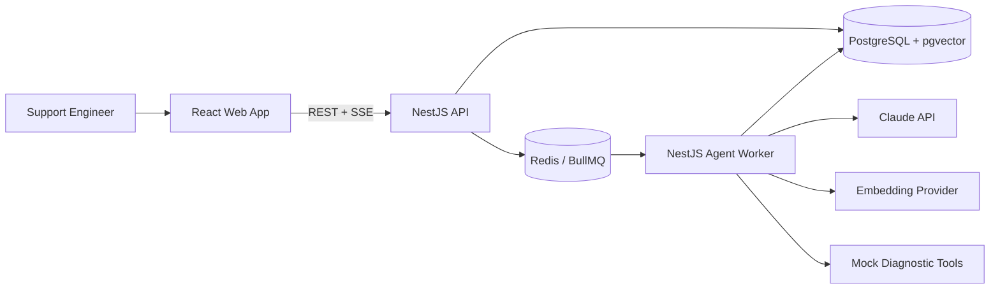
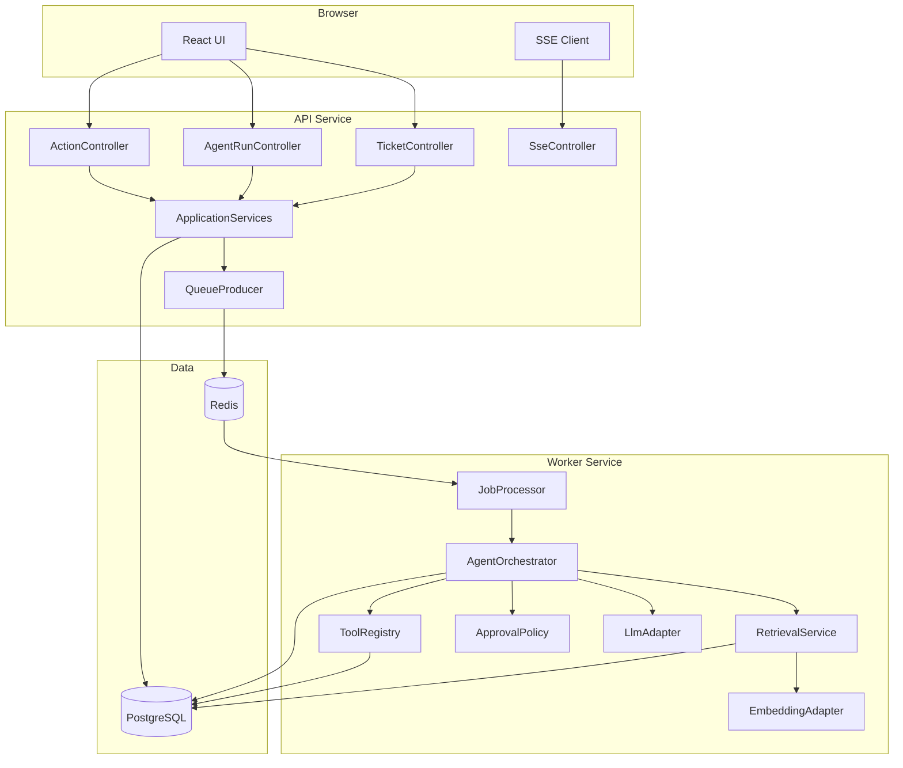
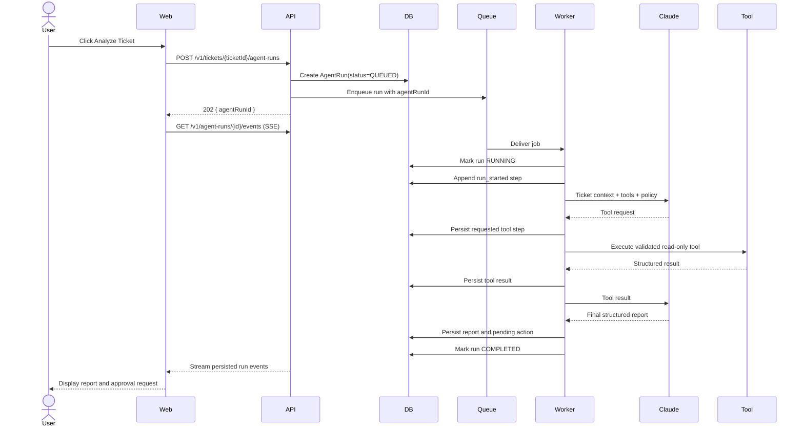
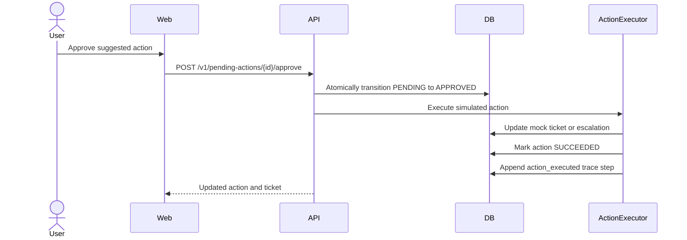
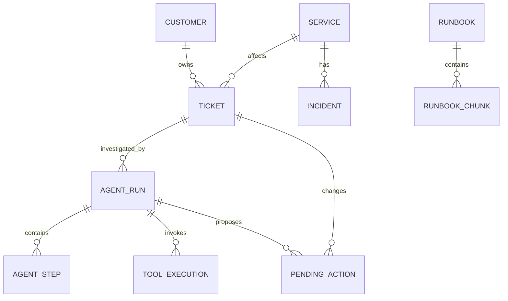
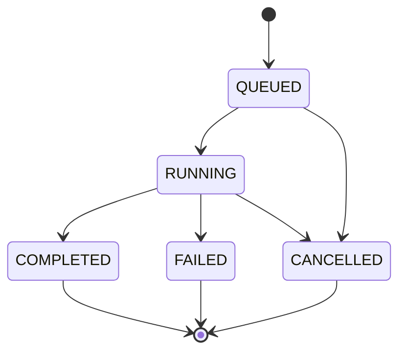
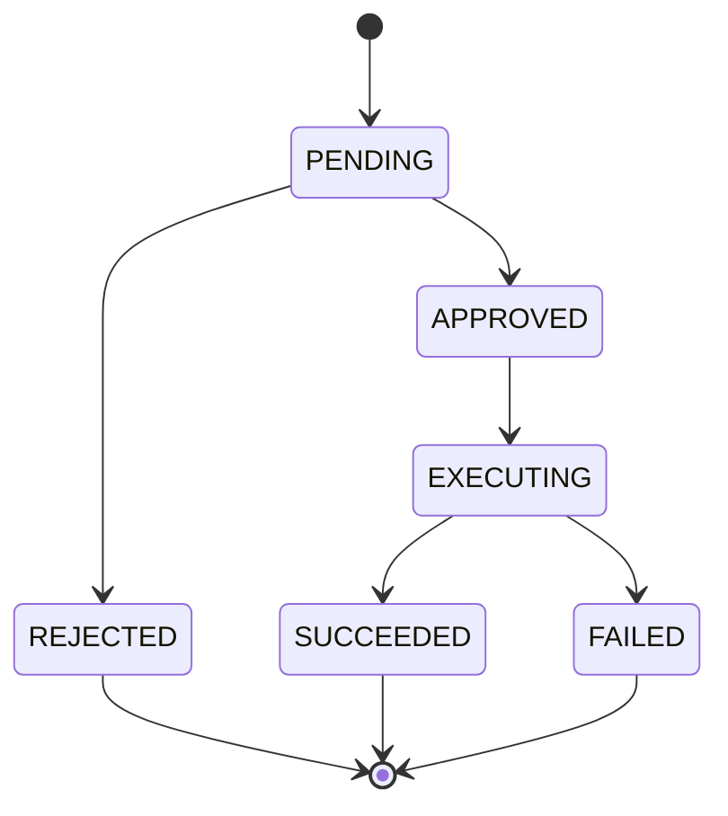
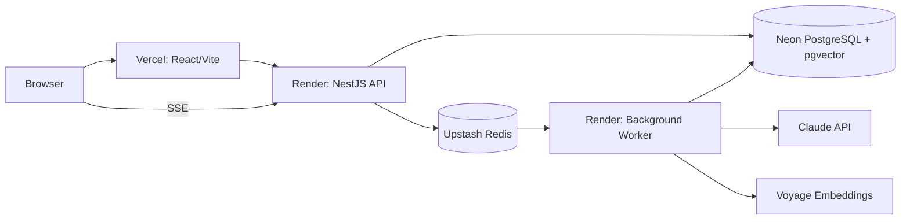

# OpsPilot — Technical Design Document

| Field | Value |
|---|---|
| Document | Technical Design Document |
| Version | 1.0 |
| Status | Proposed |
| Project | OpsPilot — AI Support and Incident Resolution Agent |
| Primary audience | Project owner, reviewers, contributors, and interviewers |
| Last updated | July 2026 |
| Related documents | `docs/01-prd.md`, `docs/02-mvp-scope.md` |

---

## 1. Executive Summary

OpsPilot is a production-style AI agent application that helps support and on-call engineers investigate support tickets. The system classifies a ticket, retrieves relevant runbook knowledge, calls diagnostic tools, produces a structured resolution report, and requires human approval before executing any state-changing action.

The MVP is designed as a deployable TypeScript monorepo with four runtime components:

1. A React web application for ticket review, trace inspection, and approval.
2. A NestJS API for HTTP endpoints, validation, persistence, and event delivery.
3. A NestJS background worker for long-running agent jobs.
4. PostgreSQL and Redis infrastructure for durable state, vector retrieval, and job orchestration.

Claude is used as the reasoning and tool-selection model. The application owns the agent loop, executes tools, validates every tool request, records observable trace events, and enforces approval boundaries. The model never receives direct access to the database or infrastructure.

The architecture intentionally favors clear service boundaries, typed contracts, traceability, and testability over framework-heavy abstractions. The project should be understandable in a code review, demonstrable in a short video, and deployable using common managed services.

---

## 2. Goals

The technical design must support the following product goals:

- Provide one complete ticket-to-resolution workflow.
- Demonstrate a bounded AI agent loop with typed tool calling.
- Ground agent output in runbooks and diagnostic evidence.
- Persist every user-visible decision, tool call, and result.
- Require human approval for state-changing actions.
- Support local development with one documented setup flow.
- Support a public portfolio deployment with mock data.
- Run automated tests and build checks in CI.
- Produce measurable agent quality, latency, and token-usage data.
- Remain small enough for one engineer to implement and maintain.

---

## 3. Non-Goals

The following are not part of the MVP architecture:

- Real production access to Jira, Slack, Datadog, PagerDuty, or Zendesk.
- Real customer data or production logs.
- Autonomous service restarts, configuration changes, or email delivery.
- Multi-agent orchestration.
- Fine-tuning or model training.
- Enterprise authentication, SSO, or full role-based access control.
- High-volume multi-tenant operation.
- A general-purpose agent framework.
- Kubernetes deployment.
- A full analytics or billing platform.

The design should not add infrastructure solely to imitate a large company. Every component must support a concrete MVP requirement.

---

## 4. Assumptions and Constraints

### 4.1 Assumptions

- The application uses mock tickets, services, logs, customers, and incidents.
- The public demo has low traffic and one logical workspace.
- A single agent run investigates one ticket at a time.
- Runbooks are authored as Markdown and checked into the repository.
- The model and embedding provider are accessed through server-side API keys.
- A user can manually rerun an investigation.
- Tool outputs are deterministic mock data for the MVP.
- The initial deployment may use free or low-cost managed services.

### 4.2 Constraints

- The frontend must never receive provider API keys.
- Agent work must not block a normal HTTP request until completion.
- Tool calls must be schema-validated before execution.
- Read-only and state-changing tools must have separate execution policies.
- Agent runs must be bounded by tool-call, time, and token limits.
- The application must not store or expose hidden model reasoning.
- Trace records must contain observable actions and concise rationale summaries only.
- Deployment-specific values must be configured through environment variables.
- The repository must remain usable without a proprietary agent framework.

---

## 5. Architecture Principles

### 5.1 Application-Controlled Agent Loop

The application, not the model, controls execution. Claude may request a tool call, but application code validates the request, checks permissions, executes the tool, stores the result, and decides whether another model round trip is allowed.

### 5.2 Durable State Before Side Effects

Important state transitions are written to PostgreSQL before queued work or simulated actions proceed. The database is the system of record.

### 5.3 Asynchronous Long-Running Work

Ticket analysis is submitted as a background job. The HTTP API returns an agent run identifier immediately. The frontend receives progress through Server-Sent Events and can fall back to polling.

### 5.4 Explicit Trust Boundaries

Ticket text, runbook content, logs, and tool output are treated as untrusted data. They cannot define new tools, modify system policy, or bypass approval rules.

### 5.5 Typed Inputs and Outputs

API payloads, queue messages, model tool inputs, tool outputs, and final reports use shared schemas. Runtime validation is required at every external boundary.

### 5.6 Provider Isolation

The rest of the application depends on internal `LlmProvider` and `EmbeddingProvider` interfaces rather than provider SDK types. This makes model replacement and deterministic testing possible.

### 5.7 Inspectability Over Hidden Reasoning

The UI displays events such as classification, retrieval, tool selection, tool execution, and final report generation. It does not display or persist private chain-of-thought.

---

## 6. System Context

### 6.1 Actors

- **Support engineer:** Reviews tickets, starts investigations, reviews evidence, and approves or rejects actions.
- **OpsPilot web client:** Presents product state and subscribes to run progress.
- **OpsPilot API:** Validates requests, reads and writes application data, and enqueues work.
- **OpsPilot worker:** Runs the bounded agent workflow and invokes tools.
- **Claude API:** Selects tools and produces structured outputs.
- **Embedding provider:** Creates vectors for runbook ingestion and retrieval.
- **PostgreSQL:** Stores application state, trace records, and vectors.
- **Redis:** Stores BullMQ jobs and short-lived queue coordination state.

### 6.2 System Context Diagram



---

## 7. Runtime Architecture

### 7.1 Deployable Components

| Component | Responsibility | Runtime |
|---|---|---|
| `apps/web` | Ticket UI, run trace, report view, approval UI | Static React/Vite deployment |
| `apps/api` | REST API, SSE, validation, persistence, queue producer | Node.js web service |
| `apps/worker` | Agent execution, retrieval, tool execution, eval jobs | Node.js background worker |
| PostgreSQL | Durable relational data and vector storage | Managed PostgreSQL with pgvector |
| Redis | Job queue, retries, distributed locks, queue events | Managed Redis-compatible service |

The API and worker use the same domain packages but run as separate processes. This prevents long model calls from consuming API request capacity and makes failures easier to isolate.

### 7.2 High-Level Component Diagram



### 7.3 Why a Separate Worker Is Required

Agent investigations can include several provider round trips, retrieval queries, and tool executions. Running this work directly inside `POST /tickets/:id/agent-runs` would create several problems:

- HTTP timeouts would be more likely.
- Refreshing the browser could appear to cancel work.
- Transient provider failures would be difficult to retry safely.
- API capacity would be tied up by long-lived requests.
- Horizontal scaling would mix interactive and background workloads.

The API therefore creates an `AgentRun`, enqueues a job, and returns `202 Accepted`.

---

## 8. Request and Agent Execution Flow

### 8.1 Start Investigation Sequence



### 8.2 Approval Sequence



For the MVP, the simulated action may execute inside the API after approval because it is fast and deterministic. If real integrations are added later, approved actions should use a separate queue.

---

## 9. Repository and Monorepo Design

### 9.1 Package Management

Use `pnpm` workspaces. The monorepo should have one lockfile and shared TypeScript, lint, and test configuration.

### 9.2 Proposed Repository Structure

```text
opspilot/
├── apps/
│   ├── web/
│   │   ├── src/
│   │   │   ├── api/
│   │   │   ├── components/
│   │   │   ├── features/
│   │   │   │   ├── tickets/
│   │   │   │   ├── agent-runs/
│   │   │   │   ├── approvals/
│   │   │   │   └── runbooks/
│   │   │   ├── pages/
│   │   │   ├── routes/
│   │   │   └── test/
│   │   └── package.json
│   ├── api/
│   │   ├── src/
│   │   │   ├── bootstrap/
│   │   │   ├── health/
│   │   │   ├── tickets/
│   │   │   ├── agent-runs/
│   │   │   ├── pending-actions/
│   │   │   ├── runbooks/
│   │   │   ├── queue/
│   │   │   └── common/
│   │   └── package.json
│   └── worker/
│       ├── src/
│       │   ├── bootstrap/
│       │   ├── jobs/
│       │   ├── agent/
│       │   ├── retrieval/
│       │   ├── tools/
│       │   ├── providers/
│       │   └── common/
│       └── package.json
├── packages/
│   ├── contracts/
│   │   └── src/
│   ├── database/
│   │   ├── prisma/
│   │   │   ├── schema.prisma
│   │   │   ├── migrations/
│   │   │   └── seed.ts
│   │   └── src/
│   ├── config/
│   ├── logger/
│   └── test-utils/
├── docs/
├── runbooks/
├── evals/
│   ├── cases/
│   ├── results/
│   └── src/
├── scripts/
├── .github/
│   └── workflows/
├── docker/
├── docker-compose.yml
├── pnpm-workspace.yaml
├── package.json
├── tsconfig.base.json
├── eslint.config.js
├── .env.example
├── CLAUDE.md
└── README.md
```

### 9.3 Package Responsibilities

#### `packages/contracts`

Contains provider-neutral runtime schemas and TypeScript types for:

- API requests and responses
- Agent final report
- Tool inputs and outputs
- Queue job payloads
- SSE event payloads
- Eval case format

Use Zod as the runtime schema source and infer TypeScript types from the schemas. Do not maintain duplicate interface and validation definitions.

#### `packages/database`

Contains:

- Prisma schema and generated client
- Migrations
- Database client lifecycle
- Repositories that require raw SQL
- Seed data

Prisma should handle normal relational CRUD. Vector columns and similarity queries should use explicit SQL because vector extension types are not fully represented by Prisma ORM.

#### `packages/config`

Loads and validates environment variables at process startup. A process must fail fast when required configuration is invalid.

#### `packages/logger`

Exports the structured logger and common context helpers for `requestId`, `agentRunId`, `jobId`, and `toolExecutionId`.

---

## 10. Technology Decisions

| Area | Decision | Reason |
|---|---|---|
| Language | TypeScript | Matches the owner's background and allows shared contracts across web, API, and worker |
| Frontend | React + Vite | Fast local development and simple static deployment |
| Backend | NestJS REST API | Modular server structure, validation support, and familiar TypeScript patterns |
| Queue | BullMQ + Redis | Durable background execution, retries, and worker separation |
| Database | PostgreSQL | Relational consistency, JSON support, and operational familiarity |
| Vector storage | pgvector | Keeps application and retrieval data in one database |
| ORM | Prisma for relational CRUD | Typed data access and migrations |
| Vector queries | Parameterized raw SQL | Required for vector operations and explicit similarity control |
| LLM | Claude Messages API | Strong tool-use workflow and structured outputs |
| Embeddings | Configurable Voyage embedding adapter | Anthropic does not provide an embedding model; adapter avoids hard coupling |
| Realtime updates | Server-Sent Events | One-way progress updates are sufficient and simpler than WebSockets |
| Validation | Zod | Shared runtime validation for API, queue, tools, and model output |
| Testing | Jest for backend, Vitest and React Testing Library for web, Playwright for E2E | Appropriate tools for each layer |
| Local infrastructure | Docker Compose | Reproducible PostgreSQL, pgvector, and Redis setup |
| Frontend deployment | Vercel | Direct Vite deployment and preview environments |
| API and worker deployment | Render | Separate web service and background worker from the same repository |
| Managed database | Neon PostgreSQL | Managed PostgreSQL with pgvector support |
| Managed queue | Upstash Redis-compatible endpoint | Managed Redis connection with TLS |

All provider model names must be environment-configurable. Database records must persist the exact model identifier used for each run.

---

## 11. Domain Model

### 11.1 Core Entities

#### Ticket

Represents a support request being investigated.

| Field | Type | Notes |
|---|---|---|
| `id` | UUID | Primary key |
| `externalRef` | String | Human-readable identifier such as `TKT-1001` |
| `title` | String | Short summary |
| `description` | Text | Full ticket text |
| `priority` | Enum | `LOW`, `MEDIUM`, `HIGH`, `CRITICAL` |
| `status` | Enum | `OPEN`, `IN_PROGRESS`, `RESOLVED`, `ESCALATED` |
| `category` | Enum nullable | Latest accepted category |
| `customerId` | UUID | Foreign key |
| `serviceId` | UUID nullable | Suspected affected service |
| `createdAt` | Timestamp | Seeded or generated time |
| `updatedAt` | Timestamp | Last modification |

#### Customer

Contains mock customer context.

| Field | Type | Notes |
|---|---|---|
| `id` | UUID | Primary key |
| `name` | String | Mock customer name |
| `plan` | Enum | `FREE`, `PRO`, `ENTERPRISE` |
| `region` | String | Mock region |
| `accountStatus` | Enum | `ACTIVE`, `SUSPENDED`, `PENDING_VERIFICATION` |
| `metadata` | JSONB | Safe mock attributes |

#### Service

Represents a mock operational service.

| Field | Type | Notes |
|---|---|---|
| `id` | UUID | Primary key |
| `slug` | String unique | Example: `notification-service` |
| `displayName` | String | UI name |
| `status` | Enum | `HEALTHY`, `DEGRADED`, `OUTAGE` |
| `metadata` | JSONB | Mock ownership and endpoints |

#### Incident

Represents a prior or active mock incident used by the similar-incident tool.

| Field | Type | Notes |
|---|---|---|
| `id` | UUID | Primary key |
| `title` | String | Incident title |
| `summary` | Text | Incident description |
| `serviceId` | UUID | Affected service |
| `category` | Enum | Incident category |
| `rootCause` | Text | Known root cause |
| `resolution` | Text | Known resolution |
| `startedAt` | Timestamp | Incident start |
| `resolvedAt` | Timestamp nullable | Incident end |

#### Runbook

Represents a source Markdown document.

| Field | Type | Notes |
|---|---|---|
| `id` | UUID | Primary key |
| `slug` | String unique | Stable document identifier |
| `title` | String | Display title |
| `sourcePath` | String | Repository-relative path |
| `contentHash` | String | Used to avoid unnecessary re-ingestion |
| `version` | Integer | Incremented on content change |
| `createdAt` | Timestamp | Creation time |
| `updatedAt` | Timestamp | Last ingestion |

#### RunbookChunk

Represents a retrievable section.

| Field | Type | Notes |
|---|---|---|
| `id` | UUID | Primary key |
| `runbookId` | UUID | Foreign key |
| `chunkIndex` | Integer | Stable order within document version |
| `headingPath` | String | Example: `Diagnosis > Email provider` |
| `content` | Text | Chunk body |
| `tokenCount` | Integer | Approximate size |
| `embeddingModel` | String | Exact embedding model |
| `embedding` | Vector | Provider-dependent fixed dimension |
| `metadata` | JSONB | Tags, services, and category |
| `createdAt` | Timestamp | Ingestion time |

#### AgentRun

Represents one investigation attempt.

| Field | Type | Notes |
|---|---|---|
| `id` | UUID | Primary key |
| `ticketId` | UUID | Foreign key |
| `status` | Enum | `QUEUED`, `RUNNING`, `COMPLETED`, `FAILED`, `CANCELLED` |
| `model` | String | Exact Claude model identifier |
| `promptVersion` | String | Versioned prompt identifier |
| `idempotencyKey` | String nullable unique | Prevents accidental duplicate submission |
| `startedAt` | Timestamp nullable | Worker start |
| `completedAt` | Timestamp nullable | Terminal time |
| `latencyMs` | Integer nullable | Total run latency |
| `inputTokens` | Integer nullable | Provider usage |
| `outputTokens` | Integer nullable | Provider usage |
| `cacheReadTokens` | Integer nullable | Provider usage when available |
| `estimatedCostUsd` | Decimal nullable | Derived from configured pricing table |
| `finalReport` | JSONB nullable | Validated final report |
| `errorCode` | String nullable | Stable application error code |
| `errorMessage` | Text nullable | Sanitized failure detail |
| `createdAt` | Timestamp | Submission time |

#### AgentStep

Stores an ordered, user-visible trace event.

| Field | Type | Notes |
|---|---|---|
| `id` | UUID | Primary key |
| `agentRunId` | UUID | Foreign key |
| `sequence` | Integer | Monotonic within a run |
| `type` | Enum | `RUN_STARTED`, `CLASSIFICATION`, `RETRIEVAL`, `TOOL_REQUESTED`, `TOOL_COMPLETED`, `REPORT_GENERATED`, `APPROVAL_CREATED`, `RUN_FAILED`, `RUN_COMPLETED` |
| `status` | Enum | `STARTED`, `SUCCEEDED`, `FAILED`, `SKIPPED` |
| `title` | String | Concise display label |
| `summary` | Text | Observable rationale or result summary |
| `payload` | JSONB | Sanitized structured detail |
| `createdAt` | Timestamp | Event time |

The `summary` must not contain hidden model reasoning. It should describe what the system did and what evidence it observed.

#### ToolExecution

Stores each requested and executed tool call.

| Field | Type | Notes |
|---|---|---|
| `id` | UUID | Primary key |
| `agentRunId` | UUID | Foreign key |
| `toolUseId` | String | Provider tool call identifier |
| `toolName` | String | Registered tool name |
| `toolVersion` | String | Tool implementation version |
| `permission` | Enum | `READ_ONLY`, `APPROVAL_REQUIRED` |
| `input` | JSONB | Validated and redacted input |
| `output` | JSONB nullable | Validated and redacted output |
| `status` | Enum | `REQUESTED`, `RUNNING`, `SUCCEEDED`, `FAILED`, `REJECTED` |
| `durationMs` | Integer nullable | Execution duration |
| `errorCode` | String nullable | Stable tool error code |
| `createdAt` | Timestamp | Request time |
| `completedAt` | Timestamp nullable | Completion time |

#### PendingAction

Represents a proposed state-changing action.

| Field | Type | Notes |
|---|---|---|
| `id` | UUID | Primary key |
| `agentRunId` | UUID | Foreign key |
| `ticketId` | UUID | Foreign key |
| `actionType` | Enum | `UPDATE_TICKET_STATUS`, `CREATE_ESCALATION`, `DRAFT_CUSTOMER_REPLY` |
| `payload` | JSONB | Validated action parameters |
| `status` | Enum | `PENDING`, `APPROVED`, `REJECTED`, `EXECUTING`, `SUCCEEDED`, `FAILED` |
| `requestedBy` | String | `agent` for MVP |
| `decidedBy` | String nullable | Mock user identifier |
| `decidedAt` | Timestamp nullable | Approval or rejection time |
| `executedAt` | Timestamp nullable | Side-effect completion |
| `errorMessage` | Text nullable | Sanitized action error |
| `createdAt` | Timestamp | Proposal time |

### 11.2 Entity Relationships



### 11.3 Important Indexes and Constraints

- Unique index on `Ticket.externalRef`.
- Composite index on `Ticket(status, priority, createdAt DESC)`.
- Index on `AgentRun(ticketId, createdAt DESC)`.
- Unique index on non-null `AgentRun.idempotencyKey`.
- Unique index on `AgentStep(agentRunId, sequence)`.
- Index on `ToolExecution(agentRunId, createdAt)`.
- Index on `PendingAction(ticketId, status)`.
- Unique index on `Runbook(slug)`.
- Unique index on `RunbookChunk(runbookId, chunkIndex, embeddingModel)`.
- Vector index on `RunbookChunk.embedding` when the dataset is large enough to justify approximate search.
- Foreign keys use restrictive deletion by default. Seed reset scripts may delete in dependency order.

---

## 12. API Design

### 12.1 API Conventions

- Base path: `/v1`
- Content type: `application/json`
- UUID identifiers
- ISO 8601 timestamps in UTC
- Consistent error envelope
- Request validation at controller boundaries
- Response serialization from explicit DTOs
- Cursor pagination for list endpoints that can grow
- `X-Request-Id` accepted from clients or generated by the API
- `Idempotency-Key` supported for creating agent runs
- OpenAPI documentation generated from the NestJS API

### 12.2 Error Envelope

```json
{
  "error": {
    "code": "AGENT_RUN_NOT_FOUND",
    "message": "The requested agent run does not exist.",
    "requestId": "req_...",
    "details": null
  }
}
```

Do not return provider stack traces, prompts, API keys, raw SQL errors, or unsanitized tool output.

### 12.3 Endpoints

#### Health

| Method | Path | Purpose |
|---|---|---|
| `GET` | `/v1/health/live` | Process liveness |
| `GET` | `/v1/health/ready` | Database and Redis readiness |

#### Tickets

| Method | Path | Purpose |
|---|---|---|
| `GET` | `/v1/tickets` | List tickets with filters and pagination |
| `GET` | `/v1/tickets/:ticketId` | Get ticket details and latest run summary |
| `PATCH` | `/v1/tickets/:ticketId` | Update permitted mock ticket fields |

Suggested list filters:

- `status`
- `priority`
- `category`
- `cursor`
- `limit`

#### Agent Runs

| Method | Path | Purpose |
|---|---|---|
| `POST` | `/v1/tickets/:ticketId/agent-runs` | Create and enqueue an investigation |
| `GET` | `/v1/agent-runs/:agentRunId` | Get current run, report, steps, and actions |
| `GET` | `/v1/agent-runs/:agentRunId/events` | Stream trace events over SSE |
| `GET` | `/v1/tickets/:ticketId/agent-runs` | List prior runs |
| `POST` | `/v1/agent-runs/:agentRunId/cancel` | Best-effort cancellation before completion |

Create response:

```json
{
  "data": {
    "agentRunId": "7af4a39c-6adf-4aa8-9f72-000000000001",
    "status": "QUEUED",
    "createdAt": "2026-07-15T20:00:00.000Z"
  }
}
```

#### Pending Actions

| Method | Path | Purpose |
|---|---|---|
| `POST` | `/v1/pending-actions/:actionId/approve` | Approve and execute a simulated action |
| `POST` | `/v1/pending-actions/:actionId/reject` | Reject an action |
| `GET` | `/v1/pending-actions/:actionId` | Read action state |

Approval and rejection must use a database transaction with a conditional status transition. Two concurrent requests must not execute an action twice.

#### Runbooks

| Method | Path | Purpose |
|---|---|---|
| `GET` | `/v1/runbooks` | List ingested runbooks |
| `GET` | `/v1/runbooks/:runbookId` | Read runbook metadata and sections |

Runbook ingestion is a developer script for the MVP rather than a public upload endpoint:

```text
pnpm runbooks:ingest
```

This reduces authentication and file-upload complexity while preserving the RAG capability.

### 12.4 SSE Event Contract

Event names:

- `run.snapshot`
- `run.step.created`
- `run.updated`
- `action.created`
- `action.updated`
- `heartbeat`

Example:

```text
event: run.step.created
id: 12
data: {"agentRunId":"...","sequence":4,"type":"TOOL_COMPLETED","status":"SUCCEEDED","title":"Checked service status","summary":"The notification service is degraded."}
```

The SSE endpoint should:

- Send an initial snapshot.
- Replay events after `Last-Event-ID` when possible.
- Poll PostgreSQL for new steps at a modest interval in the MVP.
- Send a heartbeat every 15 seconds.
- Close after a terminal run state and final event delivery.
- Allow the frontend to fall back to `GET /agent-runs/:id`.

A database-backed replay model is preferred over Redis-only pub/sub because trace events must survive process restarts.

---

## 13. Agent Architecture

### 13.1 Agent Responsibilities

The single MVP agent may:

- Classify the ticket.
- Decide which read-only tools are needed.
- Request relevant operational evidence.
- Use retrieved runbook excerpts.
- Summarize likely root cause.
- State uncertainty.
- Produce recommended next steps.
- Propose one or more approval-required actions.

The agent may not:

- Directly mutate application state.
- Create unregistered tools.
- Execute arbitrary code.
- Query the database directly.
- Exceed configured limits.
- Claim evidence that is not present in the ticket, runbooks, or tool output.

### 13.2 Agent Loop

```text
1. Load the ticket and safe mock context.
2. Create the initial model request with:
   - versioned system policy
   - ticket data
   - tool definitions
   - output requirements
3. Receive a Claude response.
4. If the response requests tools:
   a. verify tool name is registered
   b. validate input against the tool schema
   c. check permission policy
   d. execute read-only tools
   e. persist request, result, duration, and trace step
   f. return tool results to Claude
5. Repeat until:
   - Claude returns a final report,
   - the maximum tool-call count is reached,
   - the deadline is reached,
   - cancellation is requested, or
   - an unrecoverable error occurs.
6. Validate the final report against the shared schema.
7. Persist the report and any pending actions.
8. Mark the run terminal.
```

### 13.3 Bounded Execution

Default limits:

| Limit | Default |
|---|---:|
| Maximum model turns | 6 |
| Maximum total tool calls | 5 |
| Maximum calls to the same tool | 2 |
| Maximum retrieved chunks | 5 |
| Worker job timeout | 90 seconds |
| Target p95 demo latency | 30 seconds |
| Maximum final report size | 8 KB serialized |
| Maximum tool output included in model context | Tool-specific, sanitized and truncated |

The target is not a hard guarantee. Timeouts and limits must produce a clear failed run rather than an indefinite process.

### 13.4 LLM Provider Interface

```ts
interface LlmProvider {
  runAgentTurn(input: AgentTurnInput): Promise<AgentTurnResult>;
}
```

The internal result should normalize provider output into:

```ts
type AgentTurnResult =
  | {
      type: "tool_requests";
      providerRequestId: string;
      usage: TokenUsage;
      requests: ToolRequest[];
    }
  | {
      type: "final_report";
      providerRequestId: string;
      usage: TokenUsage;
      report: ResolutionReport;
    };
```

Provider-specific content block types must not escape the adapter.

### 13.5 Structured Output

The final report must conform to a runtime-validated schema. A conceptual shape is:

```json
{
  "category": "EMAIL_DELIVERY",
  "summary": "Password reset messages are delayed for a subset of users.",
  "probableRootCause": "The notification provider is returning temporary delivery failures.",
  "confidence": 0.86,
  "evidence": [
    {
      "sourceType": "TOOL",
      "sourceId": "tool-execution-id",
      "claim": "The notification service is degraded."
    }
  ],
  "citations": [
    {
      "runbookChunkId": "chunk-id",
      "label": "Password Reset Email > Provider failure"
    }
  ],
  "recommendedSteps": [
    "Confirm the provider incident status.",
    "Retry eligible messages after service recovery."
  ],
  "customerReplyDraft": "We identified a delay affecting password reset emails...",
  "internalNote": "Delivery failures correlate with the provider degradation window.",
  "suggestedActions": [
    {
      "type": "CREATE_ESCALATION",
      "reason": "Multiple customers are affected.",
      "payload": {
        "team": "notifications",
        "severity": "HIGH"
      }
    }
  ]
}
```

The report schema must enforce:

- Known category values.
- Confidence between `0` and `1`.
- Maximum lengths.
- Citation identifiers rather than invented URLs.
- Allowed action types.
- Valid action payloads.

### 13.6 Prompt Versioning

Prompts should be files rather than large inline strings.

```text
apps/worker/src/agent/prompts/
├── system.v1.md
├── report-guidance.v1.md
└── injection-policy.v1.md
```

Each run stores a logical version such as `opspilot-agent-v1`. Prompt changes that can alter behavior should create a new version and trigger eval regression tests.

### 13.7 Context Assembly

The initial model context should include:

- System role and safety policy.
- Tool definitions.
- Ticket title and description.
- Mock customer and service context.
- Clear labels that identify all retrieved text as untrusted data.
- Expected final report schema and evidence rules.

Do not send:

- Database credentials.
- Internal stack traces.
- Entire runbook files when only a few chunks are needed.
- Raw logs beyond the tool-specific limit.
- Prior runs unless the feature explicitly uses them.

### 13.8 Model Configuration

Use environment configuration:

```text
ANTHROPIC_MODEL=<current supported Sonnet-class model>
ANTHROPIC_MAX_OUTPUT_TOKENS=<configured limit>
AGENT_MAX_TURNS=6
AGENT_MAX_TOOL_CALLS=5
AGENT_TIMEOUT_MS=90000
AGENT_PROMPT_VERSION=opspilot-agent-v1
```

A Sonnet-class model is the default target for balanced capability, latency, and cost. The application must not assume that one model identifier will remain current forever.

### 13.9 Prompt Caching

Prompt caching may be enabled after the baseline implementation works. Stable system instructions and tool definitions are the best cache candidates. Cache token usage should be persisted with the run so cost and latency effects can be measured.

Prompt caching is an optimization, not a correctness dependency.

---

## 14. Tool System

### 14.1 Tool Interface

```ts
interface AgentTool<TInput, TOutput> {
  readonly name: string;
  readonly version: string;
  readonly permission: "READ_ONLY" | "APPROVAL_REQUIRED";
  readonly inputSchema: ZodType<TInput>;
  readonly outputSchema: ZodType<TOutput>;
  execute(input: TInput, context: ToolContext): Promise<TOutput>;
}
```

### 14.2 Tool Registry

The registry is the only source of executable tools. The model receives definitions generated from registered tools. A tool name returned by the model must match a registry entry exactly.

The registry must reject:

- Unknown tools.
- Invalid tool versions.
- Invalid inputs.
- Tool requests after the run limit.
- Direct execution of approval-required tools.

### 14.3 MVP Read-Only Tools

#### `search_runbooks`

Purpose: Retrieve relevant runbook chunks.

Input:

- `query`
- optional `service`
- optional `category`
- `limit` constrained to `1..5`

Output:

- ordered chunks
- similarity score
- heading metadata
- stable citation identifiers

#### `search_logs`

Purpose: Search seeded mock application logs.

Input:

- service
- query terms
- bounded time range
- severity filters

Output:

- bounded matching log events
- aggregate counts
- concise summary

The tool must not return unlimited raw logs.

#### `check_service_status`

Purpose: Read the current seeded state of one or more services.

Output:

- service status
- status start time
- short operational note

#### `find_similar_incidents`

Purpose: Find seeded incidents related to the ticket.

The MVP may use category, service, and text matching. Vector search for incidents is optional.

#### `lookup_customer_account`

Purpose: Read safe mock account details relevant to diagnosis.

The tool output must exclude unnecessary personal data.

### 14.4 Approval-Required Actions

The model does not directly execute these tools. It proposes a typed action in the final report. The application converts valid proposals into `PendingAction` records.

- `UPDATE_TICKET_STATUS`
- `CREATE_ESCALATION`
- `DRAFT_CUSTOMER_REPLY`

`DRAFT_CUSTOMER_REPLY` is classified as approval-required even though the MVP does not send email. This demonstrates that customer-facing output receives human review.

### 14.5 Tool Error Model

Tool errors use stable codes:

- `TOOL_INPUT_INVALID`
- `TOOL_NOT_FOUND`
- `TOOL_PERMISSION_DENIED`
- `TOOL_TIMEOUT`
- `TOOL_DEPENDENCY_UNAVAILABLE`
- `TOOL_RESULT_INVALID`
- `TOOL_INTERNAL_ERROR`

Expected tool errors may be returned to the model as bounded, non-sensitive results so it can adapt. Internal exceptions must be sanitized.

---

## 15. RAG Design

### 15.1 Source Format

Runbooks live under `runbooks/` as Markdown files with front matter:

```yaml
---
slug: password-reset-email
title: Password Reset Email Not Received
category: EMAIL_DELIVERY
services:
  - notification-service
version: 1
---
```

Headings provide semantic section boundaries.

### 15.2 Ingestion Pipeline

```text
Read Markdown
→ Validate front matter
→ Parse heading hierarchy
→ Normalize text
→ Create section-aware chunks
→ Compute content hash
→ Skip unchanged documents
→ Generate embeddings
→ Replace chunks transactionally
→ Store ingestion summary
```

### 15.3 Chunking Strategy

Initial settings:

- Target chunk size: 400 to 700 tokens.
- Maximum chunk size: 900 tokens.
- Overlap: approximately 80 tokens when a section must be split.
- Preserve heading hierarchy in every chunk.
- Do not combine unrelated top-level sections.
- Include short document title and heading context in embedding input.
- Store original chunk text separately from the embedding input.

Chunking behavior should be covered by deterministic unit tests.

### 15.4 Embeddings

Use an `EmbeddingProvider` abstraction:

```ts
interface EmbeddingProvider {
  embedDocuments(texts: string[]): Promise<number[][]>;
  embedQuery(text: string): Promise<number[]>;
  readonly model: string;
  readonly dimensions: number;
}
```

The initial adapter may use a current Voyage general-purpose embedding model. The exact model and vector dimension are environment-configured and recorded with each chunk.

Changing embedding dimensions requires a migration or a new embedding column/table. Do not silently mix incompatible vector dimensions.

### 15.5 Retrieval

Initial retrieval process:

1. Build a query from ticket title, description, and known service/category.
2. Generate a query embedding.
3. Execute cosine-distance search against chunks using the same embedding model.
4. Apply metadata filters only when they improve precision.
5. Return at most five chunks.
6. Convert rows into citation-safe retrieval results.
7. Persist retrieval metadata in an `AgentStep`.

For the small seeded dataset, exact vector search is acceptable. An HNSW index may be added and benchmarked as the chunk count grows. Retrieval tests must verify relevance independently of whether an approximate index is enabled.

### 15.6 Citation Rules

Every citation in the final report must reference a chunk returned by `search_runbooks` during the current run.

The application validates that:

- The cited `runbookChunkId` exists.
- The chunk belongs to the current run's retrieval results.
- The displayed label comes from stored metadata.
- The model cannot provide arbitrary external links as citations.

### 15.7 Hallucination Controls

- Final claims must reference ticket data, tool evidence, or a retrieved runbook chunk.
- The prompt must instruct the model to state uncertainty when evidence is insufficient.
- The report schema contains explicit evidence objects.
- Unsupported citation identifiers cause validation failure.
- Eval cases measure unsupported claims.
- Tool outputs are included with stable source identifiers.

---

## 16. Queue and Worker Design

### 16.1 Queue

Queue name:

```text
agent-investigations
```

Job payload:

```json
{
  "agentRunId": "uuid",
  "ticketId": "uuid",
  "requestedAt": "ISO timestamp"
}
```

The job payload contains identifiers, not full ticket content. The worker loads the current durable state from PostgreSQL.

### 16.2 Job Options

Recommended defaults:

- Attempts: `3`
- Backoff: exponential with jitter
- Remove completed queue metadata after a retention period
- Retain failed job metadata long enough for debugging
- Timeout: `90 seconds`
- Concurrency: `2` locally, environment-configurable in deployment

Provider 4xx errors, schema incompatibilities, and safety-policy failures are unrecoverable. Network failures, 429 responses, and provider 5xx responses may be retried.

### 16.3 Idempotency

The API supports an `Idempotency-Key`.

Creation flow:

1. Begin a database transaction.
2. If the key already exists, return the existing run.
3. Create the `AgentRun`.
4. Commit.
5. Enqueue a job using `agentRunId` as the BullMQ job identifier.

The worker checks the durable run state before executing. If the run is already terminal, it acknowledges the duplicate job without rerunning the model.

### 16.4 Cancellation

Cancellation is best effort.

- API changes `QUEUED` or `RUNNING` to `CANCELLED` when allowed.
- The worker checks cancellation before every provider call and tool execution.
- An in-flight provider request may complete, but its result is not used after cancellation.
- Cancellation is recorded as a trace step.

### 16.5 Concurrency and Locking

BullMQ prevents normal duplicate processing, but database state transitions must still be conditional.

Example:

```text
UPDATE agent_runs
SET status = 'RUNNING', started_at = now()
WHERE id = $1 AND status = 'QUEUED'
RETURNING id;
```

If no row is returned, the worker exits because another worker or terminal transition already owns the run.

---

## 17. State Machines

### 17.1 Agent Run State



Only explicit service methods may transition states.

### 17.2 Pending Action State



An action cannot return from a terminal state to `PENDING`.

---

## 18. Frontend Design

### 18.1 Routes

| Route | Page |
|---|---|
| `/tickets` | Ticket inbox |
| `/tickets/:ticketId` | Ticket detail and latest run |
| `/agent-runs/:agentRunId` | Direct run detail |
| `/runbooks` | Runbook inventory |

### 18.2 Feature Modules

#### Ticket Inbox

- Filter by status and priority.
- Display loading, empty, and error states.
- Link to ticket detail.

#### Ticket Detail

- Show ticket and customer context.
- Show latest investigation summary.
- Start a new run.
- Prevent accidental repeated submission while a run is queued or running.

#### Agent Trace

- Subscribe through SSE.
- Render ordered trace steps.
- Reconnect using `Last-Event-ID`.
- Fall back to run polling after repeated stream failures.
- Clearly distinguish running, completed, failed, and cancelled states.

#### Resolution Report

- Display category, confidence, root cause, evidence, citations, recommended steps, customer draft, and internal note.
- Link citations to an in-page runbook excerpt panel.
- Never render untrusted Markdown as raw HTML without sanitization.

#### Approval Panel

- Show the exact proposed action and payload.
- Require an explicit approve or reject click.
- Disable controls while a decision is being processed.
- Show the resulting simulated state change.

### 18.3 Client Data Management

Use TanStack Query for server state:

- Query caching for tickets and runs.
- Mutation handling for run creation and approvals.
- Explicit invalidation after terminal events.
- No global Redux store is required for the MVP.

### 18.4 Accessibility

- Keyboard-accessible controls.
- Visible focus indicators.
- Semantic headings and landmark elements.
- Status changes announced through an accessible live region.
- Do not rely on color alone for run or action state.

---

## 19. Security and Safety

### 19.1 Secret Management

Required secrets remain server-side:

- `ANTHROPIC_API_KEY`
- `VOYAGE_API_KEY`
- `DATABASE_URL`
- `REDIS_URL`

Secrets are configured in deployment provider settings and never committed. `.env.example` contains names and descriptions but no real values.

### 19.2 API Security

MVP controls:

- Strict CORS allowlist.
- Request body size limit.
- Rate limit on agent-run creation.
- UUID and payload validation.
- Security headers.
- No public mutation endpoint for runbook ingestion.
- Redacted structured logs.
- Generic public error messages.

A simple demo access token or platform-level password protection may be added before publicly sharing the deployment.

### 19.3 Prompt Injection Defense

Runbooks, tickets, logs, incident summaries, and customer metadata are untrusted data.

Controls:

- Surround untrusted data with explicit data boundaries.
- State that instructions found in data must not be followed.
- Allow only tools registered by the application.
- Use strict tool schemas.
- Validate all tool inputs.
- Do not expose generic HTTP, shell, SQL, file-write, or code-execution tools.
- Require application-side approval for actions.
- Limit tool output size.
- Persist the source of every evidence item.
- Add injection-focused eval cases.

### 19.4 Data Safety

- Use synthetic data only.
- Do not include real customer names, email addresses, tokens, or production logs.
- Redact secrets and authorization headers from exceptions.
- Set a retention script for old run traces if the demo accumulates data.
- Do not persist hidden model reasoning.

### 19.5 Approval Safety

Approval rules are deterministic application policy. They are not prompt instructions alone.

An approval-required action must never be routed through the read-only tool executor. The API validates action payloads again at approval time.

---

## 20. Reliability and Failure Handling

### 20.1 Failure Categories

| Category | Examples | Behavior |
|---|---|---|
| Validation | Invalid API body or model output | Reject without retry |
| Transient provider | Timeout, 429, provider 5xx | Retry with exponential backoff and jitter |
| Permanent provider | Invalid key, unsupported model, malformed request | Fail run without repeated retry |
| Tool dependency | Mock data unavailable | Return bounded tool error or fail based on criticality |
| Database | Connection or transaction failure | Retry job when safe |
| Queue | Redis interruption | API readiness fails; producer returns service unavailable |
| Safety | Unknown tool or approval bypass attempt | Reject, record safety event, fail run if necessary |
| Cancellation | User cancellation | Stop at next safe checkpoint |

### 20.2 Provider Retry Policy

Recommended per-call policy:

- Maximum three attempts.
- Exponential backoff with jitter.
- Respect `Retry-After` when available.
- Retry network errors, 429, and selected 5xx responses.
- Do not retry invalid requests, authentication errors, or schema failures.
- Ensure total attempts remain within the worker job deadline.

The queue-level retry is a second recovery layer. The run orchestration must remain idempotent enough to restart safely.

### 20.3 Partial Progress

Each successful step is persisted immediately. If a later step fails, the UI still shows the completed investigation history and the terminal error.

A failed run does not create executable pending actions.

### 20.4 Graceful Shutdown

API and worker processes must:

- Stop accepting new work.
- Close HTTP listeners.
- Pause or close BullMQ workers.
- Finish or safely release active jobs within the shutdown grace period.
- Disconnect Prisma and Redis clients.
- Flush logs.

---

## 21. Observability

### 21.1 Structured Logging

Use JSON logs with fields such as:

- `timestamp`
- `level`
- `service`
- `environment`
- `requestId`
- `agentRunId`
- `jobId`
- `toolExecutionId`
- `event`
- `durationMs`
- `errorCode`

Never log provider API keys, full prompts, full ticket descriptions, raw customer records, or unbounded tool output.

### 21.2 Agent Trace

The persistent trace is a product feature and an engineering diagnostic surface.

Required events:

- Run queued
- Run started
- Ticket classified
- Runbook retrieval completed
- Tool requested
- Tool completed or failed
- Final report validated
- Pending action created
- Run completed, failed, or cancelled
- Action approved, rejected, or executed

### 21.3 Metrics

Record or derive:

- Total agent-run latency
- Time to first trace event
- Model round-trip latency
- Tool execution latency
- Retrieval latency
- Input and output tokens
- Cache-read tokens
- Estimated cost per run
- Tool calls per run
- Run success/failure/cancellation rate
- Provider retry count
- Citation count
- Approval acceptance/rejection rate

The MVP can expose metrics in an internal JSON endpoint or eval summary rather than operating a full metrics platform.

### 21.4 Health Checks

`/health/live` verifies that the process event loop is responsive.

`/health/ready` verifies:

- PostgreSQL connectivity
- Redis connectivity
- Required configuration presence

It should not call paid model providers on every readiness request.

---

## 22. Testing Strategy

### 22.1 Test Pyramid

#### Unit Tests

Cover:

- Zod schemas
- Agent state transitions
- Tool input and output validation
- Approval policy
- Chunking
- Citation validation
- Retry classification
- Cost calculation
- Redaction utilities
- Prompt assembly with snapshots where useful

#### Integration Tests

Cover:

- Repositories against PostgreSQL
- Vector insertion and retrieval
- API endpoints with a test database
- Queue producer and worker using test Redis
- Agent loop using a deterministic fake LLM provider
- Action approval transaction and duplicate-click protection
- SSE event replay

Use Docker-based PostgreSQL with pgvector and Redis in CI where practical.

#### Contract Tests

The fake provider and real Claude adapter must satisfy the same internal contract.

Tool schemas must be tested against examples supplied to the model.

#### Frontend Tests

Use Vitest and React Testing Library for:

- Ticket list states
- Run creation behavior
- Trace rendering
- SSE reconnect logic
- Report and citation display
- Approval controls
- Error and retry states

#### End-to-End Tests

Use Playwright for the primary mock-provider flow:

```text
Open ticket
→ start run
→ observe trace
→ view report
→ approve action
→ verify updated ticket
```

E2E tests should use a deterministic fake LLM mode and seeded infrastructure.

### 22.2 Live Provider Tests

Live Claude tests are:

- Excluded from normal PR CI.
- Marked with a separate test tag.
- Run manually or on a controlled schedule.
- Protected by a spending limit.
- Allowed to assert schema validity and broad behavior, not exact prose.

### 22.3 Agent Evaluations

Eval cases live in `evals/cases/*.json`.

Each case contains:

- Ticket input or seeded ticket reference
- Expected category
- Required or acceptable tools
- Forbidden tools
- Expected runbook slugs or headings
- Required evidence concepts
- Forbidden unsupported claims
- Maximum tool count
- Optional latency budget

Scoring dimensions:

- Classification correctness
- Tool selection precision and recall
- Retrieval relevance
- Citation validity
- Evidence coverage
- Unsupported claim rate
- Action safety
- Completion rate
- Latency
- Token use and estimated cost

The first milestone requires at least five cases. A stronger portfolio target is 20 to 30 cases before final resume publication.

### 22.4 Test Modes

| Mode | LLM | Embeddings | Purpose |
|---|---|---|---|
| `test` | Deterministic fake | Deterministic fake vectors | Fast CI |
| `local` | Claude or fake | Voyage or fake | Development |
| `eval-live` | Claude | Real embeddings | Quality measurement |
| `production-demo` | Claude | Real embeddings | Public demo |

---

## 23. CI/CD Design

### 23.1 Branch and Pull Request Workflow

Recommended workflow:

```text
GitHub Issue
→ feature branch
→ focused implementation
→ local tests
→ pull request
→ CI
→ review
→ merge to main
→ deployment
```

Branch examples:

```text
docs/technical-design
feat/ticket-list-api
feat/agent-run-worker
feat/runbook-retrieval
fix/duplicate-approval
```

Commit messages should describe one meaningful change.

### 23.2 Pull Request CI

`.github/workflows/ci.yml` should run:

1. Checkout.
2. Install Node and pnpm.
3. Restore dependency cache.
4. Install with frozen lockfile.
5. Validate formatting.
6. Run lint.
7. Run TypeScript checks.
8. Start test PostgreSQL and Redis services.
9. Apply migrations.
10. Run backend unit and integration tests.
11. Run frontend tests.
12. Build all packages and applications.
13. Optionally build the API/worker Docker image.

No live provider credentials are required for PR CI.

### 23.3 Migration Safety

- Every schema change requires a committed migration.
- CI applies migrations to an empty test database.
- Deployment runs `prisma migrate deploy` as a release or one-off command.
- Destructive migration changes require explicit review.
- Seed data is not automatically applied to a real production environment unless the deployment is the portfolio demo.

### 23.4 Deployment Flow

On merge to `main`:

- Vercel builds and deploys `apps/web`.
- Render builds the repository image.
- Render runs the API command for the web service.
- Render runs the worker command for the background worker.
- A migration command runs before the new services handle traffic.
- Smoke checks verify health endpoints and the ticket list.

A failed migration must stop the release rather than allowing application code to run against an incompatible schema.

### 23.5 Eval Workflow

A separate workflow such as `agent-evals.yml` may run:

- Manually with `workflow_dispatch`.
- On changes to prompt, tool, retrieval, or provider code.
- With protected provider secrets.
- With a maximum case count and spending budget.
- Producing a JSON and Markdown summary artifact.

Live eval failures should initially be advisory until the baseline is stable. Deterministic safety checks should be blocking.

---

## 24. Local Development

### 24.1 Required Tools

- Current supported Node.js LTS
- `pnpm`
- Docker Desktop or compatible container runtime
- Git
- Provider API keys for real-model mode

### 24.2 Docker Compose Services

- PostgreSQL image with pgvector installed
- Redis
- Optional database admin UI only if it does not become a required dependency

### 24.3 Developer Commands

Proposed commands:

```text
pnpm install
pnpm infra:up
pnpm db:migrate
pnpm db:seed
pnpm runbooks:ingest
pnpm dev
pnpm test
pnpm test:integration
pnpm test:e2e
pnpm eval
pnpm lint
pnpm typecheck
pnpm build
```

`pnpm dev` should run web, API, and worker together through a workspace task runner or concurrent process script.

### 24.4 Seeded Demo Scenarios

At minimum:

1. Password reset email delay.
2. Elevated API error rate.
3. Payment webhook failures.
4. Account verification delay.
5. Ambiguous ticket with insufficient evidence.

Each scenario should have matching mock logs, service state, incidents, and runbook material. The evidence must be internally consistent so eval expectations are meaningful.

---

## 25. Deployment Architecture

### 25.1 Recommended Portfolio Deployment



### 25.2 Service Configuration

#### Vercel Web

- Root directory: `apps/web`
- Build command: workspace-specific web build
- Output directory: `dist`
- Environment:
  - `VITE_API_BASE_URL`
- SPA routing rewrite to `index.html`
- Preview deployment for pull requests

#### Render API

- Node.js web service or Docker service
- Start command: `pnpm --filter @opspilot/api start:prod`
- Health check: `/v1/health/ready`
- Environment:
  - `DATABASE_URL`
  - `REDIS_URL`
  - `CORS_ALLOWED_ORIGINS`
  - `LOG_LEVEL`
  - API-specific rate-limit settings

#### Render Worker

- Background worker using the same repository and image
- Start command: `pnpm --filter @opspilot/worker start:prod`
- Environment:
  - `DATABASE_URL`
  - `REDIS_URL`
  - `ANTHROPIC_API_KEY`
  - `ANTHROPIC_MODEL`
  - `VOYAGE_API_KEY`
  - embedding and agent limit settings

The API does not require model credentials unless it performs a model-backed endpoint. Keeping model keys only in the worker narrows the secret exposure surface.

#### Neon PostgreSQL

- Enable `vector` extension through a migration.
- Use a pooled connection for application traffic when appropriate.
- Use a direct connection for migrations if required by the provider configuration.
- Configure SSL.
- Back up schema and seed source in Git; managed backups depend on the selected plan.

#### Upstash Redis-Compatible Service

- Use the TLS Redis connection URL supported by BullMQ/ioredis.
- Do not use an HTTP-only Redis adapter for BullMQ processing.
- Configure connection retry behavior and readiness checks.
- Treat Redis as queue coordination, not the source of truth.

### 25.3 Environment Separation

At minimum:

- `local`
- `test`
- `production-demo`

Do not share production-demo provider keys with local `.env` files committed to the repository.

### 25.4 Public Demo Protection

Because model calls have real cost, the public deployment should include at least one of:

- A simple demo access code.
- Platform-level password protection.
- Strict per-IP rate limits.
- A daily run budget.
- A fake-provider demo mode with a clearly labeled optional live run.

The strongest portfolio setup is deterministic demo data plus a limited number of live Claude runs.

### 25.5 Deployment Smoke Test

After deployment:

1. Readiness endpoint returns success.
2. Ticket list returns seeded tickets.
3. Web app loads.
4. SSE endpoint establishes a connection.
5. One deterministic fake-provider run completes.
6. Optional live provider smoke run validates current credentials and model configuration.
7. Approval action updates the mock ticket exactly once.

---

## 26. Configuration

### 26.1 Required Environment Variables

| Variable | Process | Description |
|---|---|---|
| `NODE_ENV` | All | Runtime environment |
| `PORT` | API | HTTP port |
| `DATABASE_URL` | API, worker | Application PostgreSQL connection |
| `DIRECT_DATABASE_URL` | Migration jobs | Direct database connection when required |
| `REDIS_URL` | API, worker | TLS Redis connection |
| `CORS_ALLOWED_ORIGINS` | API | Comma-separated web origins |
| `ANTHROPIC_API_KEY` | Worker | Claude API key |
| `ANTHROPIC_MODEL` | Worker | Configured model identifier |
| `VOYAGE_API_KEY` | Worker, ingestion | Embedding API key |
| `EMBEDDING_MODEL` | Worker, ingestion | Embedding model identifier |
| `EMBEDDING_DIMENSIONS` | Worker, ingestion | Vector dimension |
| `AGENT_PROMPT_VERSION` | Worker | Prompt version |
| `AGENT_MAX_TURNS` | Worker | Bounded model turns |
| `AGENT_MAX_TOOL_CALLS` | Worker | Bounded tool calls |
| `AGENT_TIMEOUT_MS` | Worker | Run deadline |
| `WORKER_CONCURRENCY` | Worker | Parallel jobs |
| `LOG_LEVEL` | API, worker | Structured log level |
| `DEMO_ACCESS_TOKEN` | API | Optional public-demo protection |

All variables must be validated at startup.

---

## 27. Performance and Cost Targets

These targets are appropriate for a portfolio MVP, not an enterprise SLA.

| Metric | Target |
|---|---:|
| Ticket list API p95 | Under 300 ms excluding cold start |
| Ticket detail API p95 | Under 300 ms excluding cold start |
| Agent run submission | Under 500 ms |
| Time to first trace event | Under 2 seconds after worker pickup |
| Agent run p50 | Under 15 seconds |
| Agent run p95 | Under 30 seconds under normal provider conditions |
| Run success rate on eval set | At least 90% after stabilization |
| Citation validity | 100% structurally valid |
| Approval duplicate execution | 0 |
| Maximum tool calls | 5 |
| Public demo spend | Configured daily budget |

Cost is measured, not guessed. Store provider usage and calculate an estimate using a versioned pricing configuration.

---

## 28. Technical Risks and Mitigations

| Risk | Impact | Mitigation |
|---|---|---|
| Model selects an irrelevant tool | Lower resolution quality | Clear tool descriptions, eval cases, bounded retries, tool-selection metrics |
| Model invents evidence | Trust failure | Evidence schema, citation validation, untrusted-data policy, unsupported-claim evals |
| Prompt injection in runbooks or logs | Unsafe behavior | No generic tools, strict registry, data boundaries, approval policy in code |
| Duplicate run submission | Cost and confusing state | Idempotency key and UI disable state |
| Duplicate action approval | Repeated side effect | Conditional transactional status transition |
| Long model latency | Poor demo experience | Background jobs, SSE, timeouts, trace progress, model configurability |
| Provider outage or rate limit | Failed investigations | Retry with jitter, clear failed state, deterministic demo mode |
| Prisma vector limitations | Retrieval implementation friction | Raw parameterized SQL in a dedicated repository |
| Embedding model dimension change | Invalid mixed vectors | Persist model and dimension; migration and re-ingestion |
| Redis interruption | New work cannot be queued | Readiness failure, durable run state, safe retry after recovery |
| Public demo abuse | Unexpected cost | Access control, rate limits, run budget, fake-provider mode |
| Overengineering | Project not completed | Follow MVP scope and phase gates |

---

## 29. Implementation Plan

### Phase 1 — Architecture Foundation

- Create monorepo workspace.
- Add shared config, contracts, logger, and database packages.
- Add Docker Compose with PostgreSQL/pgvector and Redis.
- Add health endpoints.
- Add baseline CI.

Exit criteria:

- All applications build.
- API and worker connect to local infrastructure.
- CI passes without provider secrets.

### Phase 2 — Ticket Vertical Slice

- Add Ticket, Customer, and Service models.
- Seed mock scenarios.
- Implement list and detail APIs.
- Build ticket inbox and detail pages.
- Add frontend API client.

Exit criteria:

- A user can browse seeded tickets end to end.

### Phase 3 — Asynchronous Basic Agent

- Add AgentRun and AgentStep models.
- Add run creation endpoint and BullMQ job.
- Implement fake LLM provider.
- Implement Claude provider for one structured analysis turn.
- Add SSE progress and report UI.

Exit criteria:

- A run is queued, processed by the worker, persisted, streamed, and displayed.

### Phase 4 — Tool Calling

- Add ToolExecution model.
- Implement registry and tool schemas.
- Add mock service, log, incident, and customer tools.
- Implement bounded multi-turn loop.
- Add tool trace UI.

Exit criteria:

- Claude can choose and execute at least two tools in a complete run.

### Phase 5 — RAG and Citations

- Add Runbook and RunbookChunk models.
- Implement ingestion script and embedding adapter.
- Add pgvector retrieval.
- Add `search_runbooks`.
- Validate and display citations.

Exit criteria:

- The final report cites only chunks retrieved during the run.

### Phase 6 — Approval Workflow

- Add PendingAction model and state machine.
- Convert model proposals into pending records.
- Add approve and reject endpoints.
- Implement simulated actions transactionally.
- Build approval UI.

Exit criteria:

- No state-changing action executes before explicit approval.

### Phase 7 — Evals, Hardening, and Deployment

- Add eval runner and initial cases.
- Add injection and safety cases.
- Add retry, cancellation, rate limiting, and redaction.
- Add E2E tests.
- Deploy web, API, worker, PostgreSQL, and Redis.
- Add smoke checks and README.

Exit criteria:

- Public demo is stable, documented, measurable, and safe enough to share.

---

## 30. Definition of Done

The technical MVP is done when:

- Local setup works from a clean clone using documented commands.
- Web, API, worker, PostgreSQL, Redis, Claude, and embeddings are connected.
- A seeded ticket can complete the entire investigation flow.
- Agent execution occurs in a background worker.
- The UI receives and displays durable trace events.
- Tools are typed, registered, validated, and permission-classified.
- Runbook retrieval returns valid citations.
- Final reports pass runtime schema validation.
- Approval-required actions cannot execute automatically.
- Duplicate approval cannot execute twice.
- Provider failures create clear terminal run states.
- Unit, integration, frontend, and one E2E flow pass in CI.
- Live evals can be run separately with controlled credentials.
- The application is deployed and uses synthetic data.
- README includes architecture, setup, demo, eval results, and screenshots.
- No secrets or real customer data exist in Git history.
- Resume bullets are supported by implemented and measured functionality.

---

## 31. Portfolio and Resume Deliverables

Before adding the project to a resume, produce:

- Public GitHub repository.
- Live demo URL with controlled model usage.
- Architecture diagram.
- Agent sequence diagram.
- Two- to three-minute demo video.
- Screenshots of the inbox, trace, report, and approval flow.
- Eval summary with case count and pass rates.
- Example agent trace with tool and citation evidence.
- Clear local setup instructions.
- A short section describing tradeoffs and future improvements.

Resume claims must use measured results from the final project. Do not invent latency, accuracy, cost, or eval numbers before collecting them.

A future resume bullet may follow this pattern:

> Built and deployed a TypeScript AI incident-resolution agent using Claude tool calling, NestJS, React, BullMQ, PostgreSQL, and pgvector; orchestrated bounded diagnostic workflows with citation-grounded runbook retrieval, durable traces, and human approval for state-changing actions.

A second bullet should include real eval and performance results after they exist.

---

## 32. Architecture Decision Records to Add Later

Create focused ADRs if implementation decisions change or need deeper justification:

- `ADR-001`: Separate API and agent worker processes.
- `ADR-002`: Application-controlled Claude tool loop instead of an agent framework.
- `ADR-003`: PostgreSQL and pgvector instead of a separate vector database.
- `ADR-004`: SSE instead of WebSockets.
- `ADR-005`: Simulated approval actions for the public MVP.
- `ADR-006`: Provider interfaces for LLM and embeddings.
- `ADR-007`: Prisma for relational data and raw SQL for vector operations.

---

## 33. Open Questions

These questions should be resolved before or during implementation:

1. Which current Claude model gives the best quality-to-cost result on the project eval set?
2. Which embedding dimension will be used for the first stable database schema?
3. Will the public demo require a shared access code or use fake-provider mode by default?
4. Should the API poll PostgreSQL for SSE events or use Redis notifications as an optimization?
5. What daily model-call and cost budget is acceptable for the public deployment?
6. Should a reranker be added after baseline retrieval metrics are measured?
7. At what dataset size does an HNSW index improve the actual project workload?
8. Should approved actions remain synchronous or move to a second queue when real integrations are introduced?

None of these questions should block the ticket vertical slice.

---

## 34. Next Design Documents

This document establishes the system architecture. The following documents should refine individual subsystems without contradicting this design:

- `docs/04-agent-design.md`
- `docs/05-rag-design.md`
- `docs/06-tool-design.md`
- `docs/07-evaluation-plan.md`
- `docs/08-cicd-deployment.md`

Changes to a subsystem document that alter core runtime boundaries, persistent state, or deployment topology must also update this document.