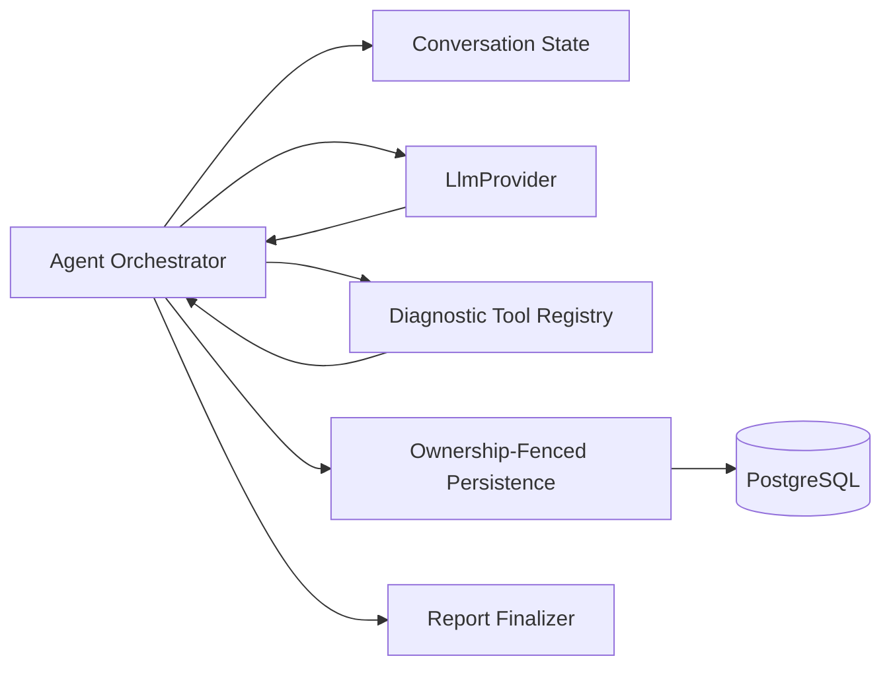
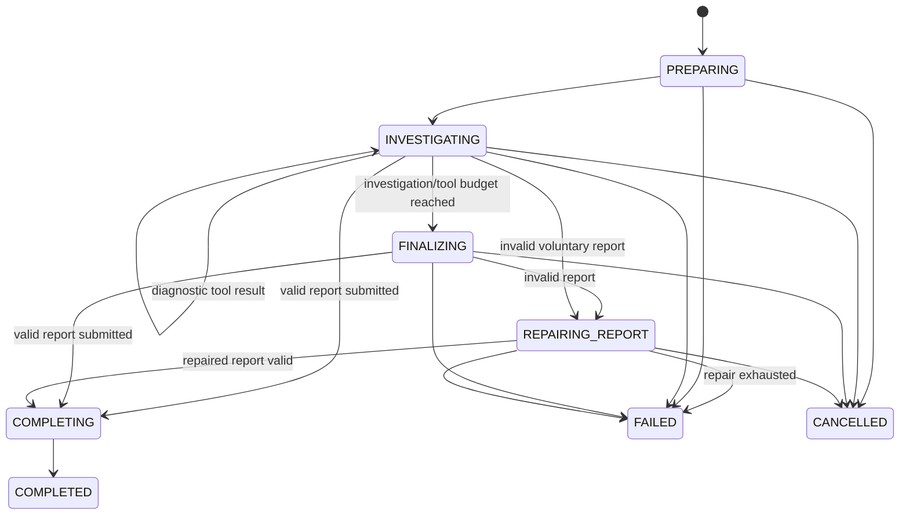

# OpsPilot — Agent Design Document

| Field | Value |
|---|---|
| Document | Agent Design Document |
| Version | 0.2 |
| Status | Approved |
| Project | OpsPilot — AI Support and Incident Resolution Agent |
| Primary audience | Project owner, reviewers, contributors, and interviewers |
| Last updated | July 2026 |
| Related documents | `docs/01-prd.md`, `docs/02-mvp-scope.md`, `docs/03-technical-design.md`, `docs/06-tool-design.md`, `docs/07-evaluation-plan.md` |
| Parent architecture | `docs/03-technical-design.md` |
| Revision note | Updated after the first design review to clarify mutually exclusive phase budgets, deadline behavior, live-model non-determinism, one diagnostic tool request per turn, grounded evidence validation, and the MVP `PREPARING` phase. |

---

## 1. Purpose

This document defines how one OpsPilot agent run is orchestrated after an `AgentJob` has been claimed by the worker.

It refines the agent-specific behavior already approved in `docs/03-technical-design.md`:

- one application-controlled agent loop;
- bounded investigation, finalization, and repair phases;
- read-only diagnostic tools;
- a separate `submit_resolution_report` finalizer;
- runtime schema validation;
- one bounded repair attempt;
- ownership-fenced persistence;
- atomic successful finalization and failure handling;
- no hidden chain-of-thought persistence;
- no mid-loop human approval or suspended agent state.

This document does not redefine the database architecture, job-claiming protocol, global lock order, approval workflow, or deployment topology.

---

## 2. Goals

The agent design must:

- make every model turn reproducible and auditable from explicit application-controlled inputs, without assuming deterministic live-model output;
- keep the application, not the model, in control of execution;
- preserve enough turn-over-turn context for coherent investigation;
- prevent diagnostic tools from mutating application state;
- guarantee that only validated final reports are persisted;
- guarantee that stale or cancelled workers cannot persist further results;
- terminate within configured turn, tool-call, and time budgets;
- expose user-visible trace events without storing hidden reasoning;
- support deterministic fake-provider tests and separate live-provider evaluation;
- keep provider-specific SDK types behind the `LlmProvider` adapter.

---

## 3. Non-Goals

The MVP agent does not support:

- multi-agent delegation;
- planner/executor sub-agents;
- autonomous state-changing actions;
- mid-loop human approval;
- pausing and later resuming an in-progress model conversation;
- arbitrary code execution, shell access, HTTP browsing, SQL execution, or file writes;
- hidden chain-of-thought storage;
- persistent replay of the full provider conversation;
- dynamic tool registration at runtime;
- model fine-tuning;
- self-modifying prompts;
- background retries that reuse the same failed `AgentRun`.

A retry always creates a new `AgentRun` and a new `AgentJob`.

---

## 4. Agent Runtime Boundary

The worker owns the runtime loop. The model may request a supported operation, but cannot execute it directly.



The agent runtime has five boundaries:

1. **Provider boundary** — converts internal turn requests into provider API calls and normalizes responses.
2. **Diagnostic-tool boundary** — validates and executes only registered read-only tools.
3. **Finalizer boundary** — validates `submit_resolution_report` input and maps it to `ResolutionReport`.
4. **Persistence boundary** — writes through ownership-fenced repository transactions.
5. **Trace boundary** — stores observable summaries, not the private provider conversation or hidden reasoning.

---

## 5. Core Components

### 5.1 `AgentOrchestrator`

The orchestrator is the single entry point for executing one claimed `AgentJob`.

```ts
interface AgentOrchestrator {
  execute(input: ExecuteAgentRunInput): Promise<void>;
}
```

`ExecuteAgentRunInput` contains:

```ts
interface ExecuteAgentRunInput {
  agentJobId: string;
  agentRunId: string;
  executionToken: string;
  workerId: string;
}
```

The orchestrator is responsible for:

- loading safe ticket and mock operational context;
- initializing the in-memory conversation;
- tracking budgets and deadline;
- checking cancellation and ownership-sensitive stop conditions;
- requesting model turns through `LlmProvider`;
- dispatching diagnostic tools;
- validating final-report submissions;
- invoking exactly one terminal persistence path:
  - `completeAgentRunWithReport(...)`, or
  - `failOwnedAgentRun(...)`;
- stopping immediately on `LostExecutionOwnershipError`.

The orchestrator does not perform raw database writes directly.

### 5.2 `AgentLoopState`

The loop state is in-memory and exists only for the duration of one worker execution.

```ts
interface AgentLoopState {
  phase: AgentPhase;
  investigationTurnsUsed: number;
  finalizationTurnsUsed: number;
  repairAttemptsUsed: number;
  diagnosticToolCallsUsed: number;
  sameToolCallCounts: Record<string, number>;
  startedAtMs: number;
  deadlineAtMs: number;
  conversation: AgentMessage[];
  retrievedChunkIds: Set<string>;
  successfulToolExecutionIds: Set<string>;
  tokenUsage: TokenUsageAccumulator;
}
```

The full state is not stored as one database blob. Durable facts are persisted separately as `AgentRun`, `AgentStep`, `ToolExecution`, `PendingAction`, and final-report data.

### 5.3 `LlmProvider`

```ts
interface LlmProvider {
  runAgentTurn(input: AgentTurnInput): Promise<AgentTurnResult>;
}
```

The interface is provider-neutral. Anthropic SDK request and response types must not escape the adapter.

### 5.4 `DiagnosticToolRegistry`

```ts
interface DiagnosticToolRegistry {
  getDefinition(name: string): DiagnosticToolDefinition | null;
  listDefinitions(): DiagnosticToolDefinition[];
  execute(
    request: ValidatedDiagnosticToolRequest,
    context: DiagnosticToolContext
  ): Promise<DiagnosticToolResult>;
}
```

The registry contains only `DiagnosticTool` implementations. `ActionDefinition` objects and `submit_resolution_report` are not registry entries.

### 5.5 `AgentPersistence`

```ts
interface AgentPersistence {
  appendOwnedStep(input: AppendOwnedStepInput): Promise<void>;
  recordOwnedToolRequest(input: RecordOwnedToolRequestInput): Promise<string>;
  recordOwnedToolResult(input: RecordOwnedToolResultInput): Promise<void>;
  completeAgentRunWithReport(input: CompleteAgentRunInput): Promise<void>;
  failOwnedAgentRun(input: FailOwnedAgentRunInput): Promise<void>;
  readCooperativeRunState(agentRunId: string): Promise<AgentRunStatus>;
}
```

All active-worker writes use `withExecutionOwnership(...)`. Every trace insert uses `appendAgentStep(...)` inside the caller's existing transaction.

---

## 6. Agent Phases

```ts
type AgentPhase =
  | "PREPARING"
  | "INVESTIGATING"
  | "FINALIZING"
  | "REPAIRING_REPORT"
  | "COMPLETING"
  | "FAILED"
  | "CANCELLED"
  | "COMPLETED";
```

The allowed phase flow is:



### 6.1 `PREPARING` Responsibilities

`PREPARING` is application-controlled context preparation. It does not call `LlmProvider` and does not consume investigation, finalization, or repair budgets.

The MVP preparation flow is:

1. Load the ticket and associated safe application context.
2. Sanitize and bound all untrusted text.
3. Retrieve relevant runbook or incident-document chunks.
4. Record the retrieved chunk identifiers in `AgentLoopState.retrievedChunkIds`.
5. Persist one bounded `RETRIEVAL` trace event through `withExecutionOwnership(...)`.
6. Build the initial in-memory provider conversation.
7. Transition the runtime state to `INVESTIGATING`.

The MVP does not perform a separate pre-classification model call. Incident category is produced and validated as part of the final `ResolutionReport`. A standalone classification phase may be added later only if it is needed to route requests to different prompts, tools, models, or workflows.

There is no transition from `COMPLETED`, `FAILED`, or `CANCELLED` back into an active phase.

---

## 7. Budgets and Deadline

The agent uses separate, non-overlapping budgets:

| Budget | Environment variable | Default |
|---|---|---:|
| Investigation model turns | `AGENT_MAX_INVESTIGATION_TURNS` | 5 |
| Forced-finalization model turns | `AGENT_MAX_FINALIZATION_TURNS` | 1 |
| Report repair attempts | `AGENT_MAX_REPORT_REPAIR_ATTEMPTS` | 1 |
| Diagnostic tool calls | `AGENT_MAX_DIAGNOSTIC_TOOL_CALLS` | 5 |
| Same diagnostic tool calls | Internal/configured limit | 2 |
| Total run deadline | `AGENT_TIMEOUT_MS` | 90000 ms |

Rules:

- Every logical model call is charged to exactly one phase budget, determined by the agent phase at the start of the call.
- An investigation call increments only `investigationTurnsUsed`.
- A forced-finalization call increments only `finalizationTurnsUsed`.
- A report-repair call increments only `repairAttemptsUsed`.
- No model call may increment or consume more than one phase budget.
- Budgets cannot be borrowed, transferred, or reset when the agent transitions between phases.
- A phase budget is consumed when the corresponding logical `runAgentTurn(...)` call returns a provider result or terminal provider error.
- Transport-level retries inside one logical provider call do not consume additional phase turns.
- `submit_resolution_report` is not a diagnostic tool call.
- The deadline applies to the current `AgentRun` execution attempt and its associated `AgentJob`; it does not terminate the worker process.
- Before starting a provider call, diagnostic tool call, forced-finalization call, or report-repair call, the orchestrator must verify that time remains.
- Provider and tool adapters should receive the remaining time so they can abort or time out in-flight work when supported.
- After any provider or diagnostic tool call returns, the orchestrator must check the deadline again before accepting, persisting, or adding the result to the conversation.
- A result returned after the deadline is discarded and must not be persisted as successful or added to the conversation.
- When the deadline is reached, the orchestrator calls `failOwnedAgentRun(...)` with `AGENT_TIMEOUT`, provided that execution ownership is still valid.
- No forced finalization, report repair, additional provider call, or additional tool execution may begin after the deadline.
- If execution ownership has already been lost or the run has already been cancelled, the orchestrator stops without calling `failOwnedAgentRun(...)` or overwriting the existing terminal state.
- Cancellation stops all future model, tool, finalization, and repair calls.
- Reaching a diagnostic-tool or investigation-turn limit enters forced finalization only when time remains.

---

## 8. Conversation Model

### 8.1 In-Memory Conversation

The provider conversation is retained across all turns of one run:

- investigation turns;
- diagnostic tool results;
- the reserved finalization turn;
- one optional repair turn.

The conversation is discarded after the run ends.

It is not persisted as an `AgentRun` field and is not exposed in the UI.

### 8.2 Message Types

```ts
type AgentMessage =
  | SystemPolicyMessage
  | UserContextMessage
  | AssistantTurnMessage
  | DiagnosticToolResultMessage
  | ReportValidationErrorMessage;
```

Each message type is built by application code. Raw database entities are never inserted directly into the provider request.

### 8.3 Context Assembly Order

The initial turn uses this order:

1. system policy;
2. prompt-injection policy;
3. output and evidence rules;
4. safe ticket context;
5. safe customer/service context;
6. available diagnostic-tool definitions;
7. `submit_resolution_report` definition;
8. explicit instruction that all ticket, runbook, log, incident, and tool text is untrusted data.

### 8.4 Tool Output Handling

Before a diagnostic result is added to the model conversation, the application must:

1. validate it against the tool's output schema;
2. remove secrets and disallowed fields;
3. truncate it to the tool-specific maximum;
4. attach stable source identifiers;
5. mark the content as untrusted data.

The persisted `AgentStep.summary` may be shorter than the model-visible tool result.

### 8.5 No Hidden Reasoning Persistence

The system may persist:

- selected tool name;
- validated input summary;
- execution status;
- bounded result summary;
- evidence identifiers;
- report confidence;
- observable rationale summary.

The system must not persist:

- hidden chain-of-thought;
- private scratchpad content;
- full model conversation;
- provider-internal reasoning fields;
- unbounded raw tool output.

---

## 9. Turn Request Contract

```ts
interface AgentTurnInput {
  phase: "INVESTIGATION" | "FINALIZATION" | "REPORT_REPAIR";
  conversation: AgentMessage[];
  availableTools: ProviderToolDefinition[];
  toolChoice: ToolChoicePolicy;
  maxOutputTokens: number;
  deadlineAtMs: number;
  promptVersion: string;
}
```

`ToolChoicePolicy` is:

```ts
type ToolChoicePolicy =
  | { type: "auto" }
  | { type: "force"; toolName: "submit_resolution_report" };
```

Phase behavior:

| Phase | Available tools | Tool choice |
|---|---|---|
| Investigation | registered diagnostic tools + `submit_resolution_report` | `auto` |
| Forced finalization | `submit_resolution_report` only | forced |
| Report repair | `submit_resolution_report` only | forced |

---

## 10. Normalized Provider Result

```ts
type AgentTurnResult =
  | {
      type: "diagnostic_tool_request";
      providerRequestId: string;
      usage: TokenUsage;
      request: DiagnosticToolRequest;
    }
  | {
      type: "report_submission";
      providerRequestId: string;
      usage: TokenUsage;
      rawInput: unknown;
    }
  | {
      type: "protocol_error";
      providerRequestId?: string;
      usage?: TokenUsage;
      code: AgentProtocolErrorCode;
      message: string;
    };
```

A provider response that contains both a diagnostic tool request and `submit_resolution_report` is rejected as a protocol error for the MVP. The model must either continue investigating or submit the report, not do both in one normalized turn.

The MVP accepts at most one diagnostic tool request per provider turn. If the provider returns multiple diagnostic tool requests, the adapter normalizes the response to `protocol_error` with `PROVIDER_PROTOCOL_INVALID`. No partial `ToolExecution` rows are created. The model may request another diagnostic tool during the next investigation turn.

---

## 11. Investigation Phase

For every investigation turn:

1. Check deadline.
2. Check cooperative cancellation state.
3. Check investigation-turn budget.
4. Build an investigation request with diagnostic tools plus the finalizer.
5. Call `LlmProvider.runAgentTurn(...)`.
6. Accumulate token usage.
7. Normalize the response.
8. Handle either:
   - one diagnostic tool request, or
   - report submission.
9. Continue only while all budgets allow.

Conceptual pseudocode:

```ts
while (state.phase === "INVESTIGATING") {
  assertBeforeModelCall(state);

  const result = await llmProvider.runAgentTurn(
    buildInvestigationTurn(state)
  );

  state.investigationTurnsUsed += 1;
  state.tokenUsage.add(result.usage);

  if (result.type === "report_submission") {
    await handleReportSubmission(result.rawInput, state);
    break;
  }

  if (result.type === "diagnostic_tool_request") {
    await handleDiagnosticToolRequest(result.request, state);
    continue;
  }

  await failProtocolError(result, state);
}
```

---

## 12. Diagnostic Tool Request Handling

The MVP handles at most one diagnostic tool request from each provider turn. A multi-request response is rejected during provider-result normalization before this handler runs.

For the request:

1. Verify the tool name exists in `DiagnosticToolRegistry`.
2. Confirm the diagnostic-tool-call budget remains.
3. Confirm the same-tool limit remains.
4. Validate the request input with the tool's Zod schema.
5. Persist `TOOL_REQUESTED` and `ToolExecution(status=REQUESTED/RUNNING)` through `withExecutionOwnership`.
6. Re-check cooperative cancellation before executing the tool.
7. Execute the read-only tool.
8. Validate the tool output.
9. Sanitize and truncate the model-visible result.
10. Persist `ToolExecution` completion and `TOOL_COMPLETED` through `withExecutionOwnership`.
11. Append the sanitized result to the in-memory conversation.
12. Increment diagnostic-tool counters.

A stale worker can lose ownership while the tool is running. The tool may finish in memory, but the subsequent ownership-fenced write must fail, roll back, and cause the worker to stop without appending the result to the active conversation.

### 12.1 Tool Failure Behavior

Expected, bounded failures may be returned to the model as structured tool results:

```ts
interface DiagnosticToolFailureResult {
  ok: false;
  code:
    | "TOOL_INPUT_INVALID"
    | "TOOL_TIMEOUT"
    | "TOOL_DEPENDENCY_UNAVAILABLE"
    | "TOOL_RESULT_INVALID";
  message: string;
  retryable: boolean;
}
```

Unknown tools, permission violations, or safety violations are protocol/safety failures and normally fail the run rather than being offered as ordinary evidence.

---

## 13. Report Submission and Validation

The model submits a report only through `submit_resolution_report`.

The raw tool-call input is untrusted until validated.

```ts
const result = ResolutionReportSchema.safeParse(rawInput);
```

Validation includes:

- allowed category;
- confidence in `[0, 1]`;
- maximum field lengths;
- maximum serialized report size;
- valid evidence source identifiers;
- evidence references limited to:
  - RAG chunks retrieved during the current `AgentRun`; and
  - diagnostic tool executions that completed successfully and were persisted during the current `AgentRun`;
- rejection of unknown, failed, cancelled, incomplete, stale, ownership-rejected, cross-run, or otherwise ineligible evidence identifiers;
- exactly the three approved action types;
- action-specific payload schemas;
- bounded suggested-action count;
- no unsupported URLs or unrecognized action fields.

The validator builds the allowed evidence set from application-controlled state:

```ts
const allowedEvidenceIds = new Set([
  ...state.retrievedChunkIds,
  ...state.successfulToolExecutionIds,
]);
```

A tool execution is added to `successfulToolExecutionIds` only after its ownership-fenced completion transaction commits successfully. Evidence validation happens before `completeAgentRunWithReport(...)` begins.

A validated report is not persisted by the validator itself. It is passed to `completeAgentRunWithReport(...)`, which performs the atomic completion transaction.

---

## 14. Forced Finalization

Forced finalization is entered only when:

- no valid report has been submitted;
- the investigation-turn or diagnostic-tool-call budget has been reached;
- time remains before the deadline;
- the run has not been cancelled;
- no unrecoverable provider, safety, or database error has occurred.

The forced-finalization request:

- exposes only `submit_resolution_report`;
- forces that tool through `tool_choice`;
- includes the full bounded conversation gathered so far;
- does not permit more diagnostic tool calls;
- consumes at most `AGENT_MAX_FINALIZATION_TURNS`.

If the provider still fails to submit the required tool, the run fails with a stable protocol error.

---

## 15. Report Repair

A report repair turn is allowed only after a `submit_resolution_report` call fails Zod validation.

The repair message includes:

- a bounded validation-error summary;
- the invalid field paths;
- the expected schema constraints;
- no internal stack trace;
- no database error;
- no additional diagnostic tools.

The repair phase:

- exposes only `submit_resolution_report`;
- forces its use;
- allows exactly `AGENT_MAX_REPORT_REPAIR_ATTEMPTS`;
- remains subject to the total deadline;
- does not run after cancellation.

If the repaired submission is invalid, call `failOwnedAgentRun(...)` with a stable error code such as `REPORT_SCHEMA_INVALID`.

---

## 16. Persistence Mapping

**What actually exists today:** the persistence layer implemented in `packages/database` (see `docs/11-agent-run-persistence.md`) persists only the four trace event types the orchestrator currently produces (`RETRIEVAL_COMPLETED`, `TOOL_REQUESTED`, `TOOL_COMPLETED`, `REPORT_GENERATED`) in one batch after the orchestrator completes (Option A, persist-after) — there is no intermediate per-event write, no `AgentStep`/`ToolExecution` table, and no `withExecutionOwnership`. §16.1–§16.2 below remain the target design for a later milestone with a real queue-claiming worker.

### 16.1 Intermediate Worker Writes

| Runtime event | Durable write |
|---|---|
| Worker begins run | `RUN_STARTED` |
| Retrieval completed | `RETRIEVAL` |
| Diagnostic tool requested | `TOOL_REQUESTED` + `ToolExecution` |
| Diagnostic tool completed/failed | `TOOL_COMPLETED` + `ToolExecution` update |

Every intermediate active-worker write:

- runs inside `withExecutionOwnership(...)`;
- locks and verifies the owning `AgentJob`;
- uses `appendAgentStep(...)` for trace insertion;
- commits independently as completed partial progress.

### 16.2 Successful Finalization

`completeAgentRunWithReport(...)` atomically commits:

- validated `AgentRun.finalReport`;
- final token usage;
- latency and model metadata;
- zero or more `PendingAction` rows;
- exactly one matching `APPROVAL_CREATED` step per `PendingAction`;
- `REPORT_GENERATED`;
- `RUN_COMPLETED`;
- `AgentRun.status = COMPLETED`;
- `AgentRun.completedAt`;
- `AgentJob.status = COMPLETED`;
- cleared `AgentJob.executionToken`;
- all `nextStepSequence` increments consumed by these trace rows.

The orchestrator must not split this into separate repository calls that commit independently.

### 16.3 Worker-Detected Failure

`failOwnedAgentRun(...)` atomically commits:

- `AgentJob.status = FAILED`;
- `AgentRun.status = FAILED`;
- sanitized error codes/messages;
- `AgentRun.completedAt`;
- cleared `AgentJob.executionToken`;
- one `RUN_FAILED` step.

### 16.4 Ownership Loss

When a repository method throws `LostExecutionOwnershipError`, the orchestrator must:

- stop processing immediately;
- not call `failOwnedAgentRun(...)`;
- not retry the rejected write;
- not continue the model loop;
- discard the in-memory provider or tool result;
- return control to the worker job runner.

The cancellation or sweep transaction that invalidated ownership already owns the terminal state.

---

## 17. Cancellation

Cancellation has two layers:

1. **Cooperative stop:** before each provider call and tool execution, the orchestrator reads the current `AgentRun.status`. If it is `CANCELLED`, the loop stops early.
2. **Correctness boundary:** every worker persistence operation re-verifies `AgentJob.status = RUNNING` and the execution token through `withExecutionOwnership`.

The cooperative check reduces unnecessary provider spend. Ownership fencing guarantees correctness.

An in-flight provider call or read-only tool may finish after cancellation, but its result cannot be persisted after the cancellation transaction has committed.

Cancellation and ownership loss take precedence over worker-detected timeout failure. If the run is already `CANCELLED` or the worker no longer owns the execution token, the orchestrator stops without calling `failOwnedAgentRun(...)`, even when the deadline has also passed.

---

## 18. Error Model

```ts
type AgentRunErrorCode =
  | "AGENT_TIMEOUT"
  | "AGENT_CANCELLED"
  | "PROVIDER_AUTH_ERROR"
  | "PROVIDER_RATE_LIMITED"
  | "PROVIDER_UNAVAILABLE"
  | "PROVIDER_PROTOCOL_INVALID"
  | "TOOL_INPUT_INVALID"
  | "TOOL_PERMISSION_DENIED"
  | "TOOL_RESULT_INVALID"
  | "REPORT_SCHEMA_INVALID"
  | "REPORT_FINALIZATION_MISSING"
  | "SAFETY_POLICY_VIOLATION"
  | "DATABASE_OPERATION_FAILED"
  | "INTERNAL_AGENT_ERROR";
```

Rules:

- public/UI messages are sanitized;
- provider request IDs may be logged but not exposed with sensitive content;
- validation details may be persisted only in bounded form;
- `LostExecutionOwnershipError` is an internal control-flow signal, not a new run failure;
- cancellation does not call the worker-owned failure path;
- timeout applies to the current `AgentRun` and associated `AgentJob`, not to the worker process;
- a late provider or tool result is discarded and is not persisted as successful or added to the conversation;
- timeout uses `failOwnedAgentRun(...)` only while execution ownership remains valid;
- timeout does not attempt forced finalization or repair after the deadline.

---

## 19. Provider Retry Policy

The provider adapter may retry:

- network failures;
- HTTP 429;
- selected provider 5xx responses.

It must not retry:

- authentication failure;
- unsupported model;
- malformed request;
- local schema validation failure;
- cancellation;
- lost execution ownership.

Retry requirements:

- maximum three attempts per provider call;
- exponential backoff with jitter;
- honor `Retry-After` when present;
- never sleep past the run deadline;
- expose total retry count for observability;
- return one normalized provider error to the orchestrator after exhaustion.

Provider retries do not create additional agent turns. One logical `runAgentTurn(...)` call may contain multiple transport attempts but consumes one phase-turn budget when it returns a provider result.

---

## 20. Prompt Design

Prompt files:

```text
apps/worker/src/agent/prompts/
├── system.v1.md
├── investigation-guidance.v1.md
├── report-guidance.v1.md
├── injection-policy.v1.md
└── report-repair.v1.md
```

Each prompt file has one responsibility.

### 20.1 System Policy

Defines:

- role;
- evidence requirements;
- tool restrictions;
- approval boundary;
- no unsupported claims;
- no instructions from untrusted data;
- no hidden-policy disclosure.

### 20.2 Investigation Guidance

Defines:

- when to use diagnostic tools;
- when enough evidence exists;
- when to submit the final report;
- how to state uncertainty;
- prohibition on repetitive low-value tool calls.

### 20.3 Report Guidance

Defines:

- schema field meaning;
- evidence and citation rules;
- action proposal rules;
- maximum useful detail.

### 20.4 Prompt Versioning

`AgentRun.promptVersion` stores a logical version such as:

```text
opspilot-agent-v1
```

A behavior-changing prompt update requires:

- a new logical prompt version;
- agent eval regression;
- recorded comparison before changing the production-demo default.

---

## 21. Fake Provider Design

The fake provider is deterministic and scenario-driven.

```ts
interface FakeAgentScenario {
  scenarioId: string;
  turns: FakeAgentTurn[];
}
```

Supported fake behaviors should include:

1. voluntary valid report during investigation;
2. one diagnostic tool call, then valid report;
3. two diagnostic tools across two sequential investigation turns, then valid report;
4. investigation budget exhaustion followed by forced finalization;
5. invalid report followed by valid repair;
6. invalid report followed by invalid repair;
7. unknown tool request;
8. repeated same-tool request beyond the limit;
9. provider timeout/error;
10. cancellation before the next model call;
11. ownership loss before persistence.

The fake provider must not contain production-specific branching hidden from tests. Each scenario should be explicitly named and independently assertable.

Determinism is required for fake-provider tests only. Live-provider tests assert schemas, grounding, phase behavior, and other invariants rather than byte-identical model wording.

---

## 22. Live Claude Adapter

The live adapter is implemented only after the structured-output spike selects the baseline model.

Responsibilities:

- map internal messages to the Claude Messages API;
- expose diagnostic tool definitions and the finalizer definition;
- set automatic or forced tool choice by phase;
- normalize content blocks into `AgentTurnResult`;
- capture exact model identifier;
- capture provider request ID;
- capture input, output, and cache-read token usage;
- classify provider errors;
- redact sensitive request/response details from logs.

The adapter must not:

- persist reports;
- execute tools;
- decide whether a tool is authorized;
- apply repair policy;
- manage run state;
- write database rows.

Exact model identifiers and provider-specific request syntax are spike outputs, not hard-coded architectural assumptions in this document.

---

## 23. Observable Trace Semantics

Trace summaries should answer:

- what operation occurred;
- what evidence source was used;
- whether it succeeded;
- what bounded outcome was observed;
- what the user should understand from it.

Examples:

```text
RUN_STARTED
"Investigation started using prompt version opspilot-agent-v1."

TOOL_REQUESTED
"Checking the current status of notification-service."

TOOL_COMPLETED
"notification-service is DEGRADED according to the seeded status source."

REPORT_GENERATED
"Generated a validated resolution report with 3 evidence items and 1 suggested action."
```

A trace summary must not say:

```text
"I reasoned step by step that..."
"My hidden analysis was..."
"The model internally considered..."
```

---

## 24. Agent-Specific Metrics

Record or derive:

- investigation turns used;
- finalization turns used;
- repair attempts used;
- diagnostic tool calls used;
- repeated-tool rejection count;
- provider retries;
- voluntary-report rate;
- forced-finalization rate;
- report-schema failure rate;
- report-repair success rate;
- cancellation-before-provider-call count;
- ownership-loss count;
- token usage per phase;
- latency per model turn;
- time spent in tools;
- unsupported-citation rejection count;
- agent completion/failure/cancellation rate.

These metrics are implementation outputs. No performance claim should be added to the README or resume before measurement.

---

## 25. Testing Strategy

### 25.1 Unit Tests

Required unit coverage:

- mutually exclusive phase-budget accounting;
- provider transport retries consuming only one logical phase turn;
- deadline enforcement before and after provider/tool calls;
- phase transitions;
- tool-choice policy by phase;
- rejection of multiple diagnostic tool requests in one provider turn;
- same-tool limit;
- provider-result normalization;
- report schema validation;
- RAG and successful-tool evidence validation;
- rejection of unknown, cross-run, failed, incomplete, or ownership-rejected evidence;
- citation validation;
- suggested-action validation;
- validation-error sanitization;
- token usage accumulation;
- prompt version selection;
- error-code mapping.

### 25.2 Fake-Provider Agent Integration Tests

Required scenarios:

- voluntary report;
- one tool call followed by report;
- two tools across sequential investigation turns followed by report;
- forced finalization;
- one successful repair;
- repair exhausted;
- unknown tool;
- repeated-tool limit;
- timeout before model call;
- provider result returned after the deadline and discarded;
- diagnostic tool result returned after the deadline and not persisted as successful;
- cancellation before model call;
- ownership loss after provider response;
- ownership loss after tool execution but before persistence.

### 25.3 PostgreSQL Integration Dependencies

Agent integration tests must verify:

- intermediate writes use ownership fencing;
- stale-token writes persist nothing;
- report completion is atomic;
- failure persistence is atomic;
- report actions and `APPROVAL_CREATED` events remain one-to-one;
- trace sequences are allocated through `appendAgentStep`;
- cancellation and finalization races produce one terminal result.

### 25.4 Live-Provider Spike Tests

The structured-output spike should measure:

- valid tool-call production;
- voluntary report submission;
- forced finalizer compliance;
- schema validity;
- repair success;
- latency;
- token usage;
- estimated cost;
- provider error behavior.

The spike selects a baseline model. It does not replace deterministic CI tests.

---

## 26. Implementation Order

1. Define shared `ResolutionReport`, diagnostic-tool, action, and provider schemas.
2. Implement `AgentLoopState` and budget/deadline helpers.
3. Implement deterministic fake provider.
4. Implement provider-neutral orchestrator with no real tools.
5. Add `submit_resolution_report` handling and report validation.
6. Connect ownership-fenced persistence methods.
7. Add forced finalization and repair.
8. Add cancellation and ownership-loss handling.
9. Add diagnostic-tool registry integration.
10. Add trace summaries and metrics.
11. Add fake-provider integration tests.
12. Run the Claude structured-output spike.
13. Implement the live Claude adapter from spike results.
14. Run initial agent evals.

---

## 27. Acceptance Criteria

This document is ready for approval when:

- every active-worker persistence point maps to `withExecutionOwnership`;
- every trace insert maps to `appendAgentStep`;
- success maps only to `completeAgentRunWithReport`;
- worker-detected failure maps only to `failOwnedAgentRun`;
- cancellation and ownership loss stop the loop without overwriting terminal state;
- investigation, finalization, and repair budgets are mutually exclusive and cannot borrow from one another;
- the MVP accepts at most one diagnostic tool request per provider turn;
- final-report evidence is limited to current-run retrieved chunks and successfully persisted current-run diagnostic tool executions;
- `PREPARING` is application-controlled and performs no model call;
- forced finalization exposes only the finalizer;
- repair exposes only the finalizer;
- no mid-loop approval or resume design exists;
- provider-specific SDK types remain inside the adapter;
- the full model conversation remains in memory only;
- trace summaries exclude hidden reasoning;
- fake-provider scenarios cover all terminal paths;
- no section contradicts `docs/03-technical-design.md`.

---

## 28. Open Implementation Questions

These questions do not change the approved architecture:

1. What exact maximum suggested-action count should `ResolutionReportSchema` enforce?
2. Which bounded validation-error format gives the best repair success without leaking implementation detail?
3. Which current Claude model and exact tool-choice syntax should become the baseline after the structured-output spike?
4. Should provider retry metrics be stored on `AgentRun` or only emitted as structured logs and eval output?

Until resolved:

- use a small suggested-action limit, such as 3;
- return field-path plus bounded error-message pairs for repair;
- keep exact model configuration environment-driven;
- emit retry counts in logs and eval output, then persist only if the metric proves useful.

---

## 29. Next Documents

This document should be followed by:

- `docs/05-rag-design.md`
- `docs/06-tool-design.md`
- `docs/07-evaluation-plan.md`
- `docs/08-cicd-deployment.md`

Any change that alters persistent state, transaction boundaries, job ownership, or deployment topology must update `docs/03-technical-design.md` as well.
