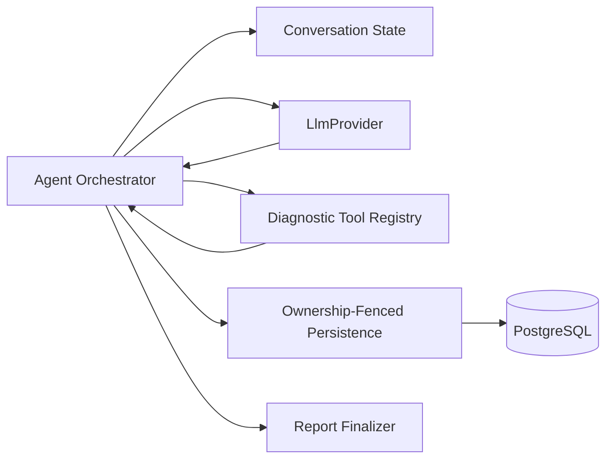
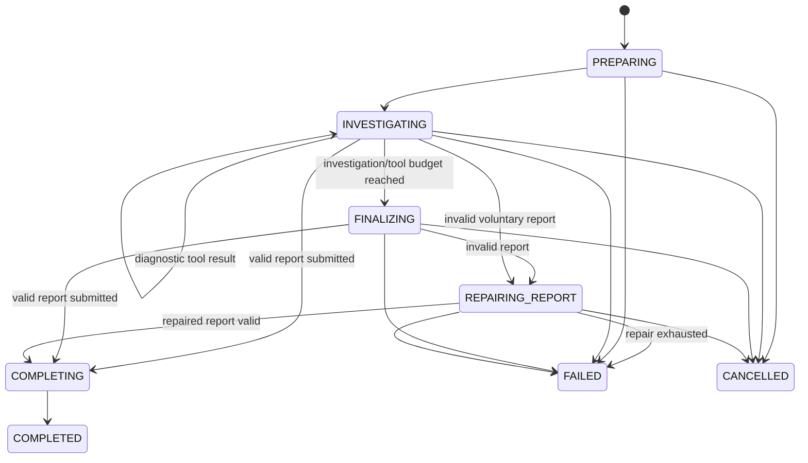

# OpsPilot — Agent Design Document

| Field | Value |
|---|---|
| Document | Agent Design Document |
| Version | 0.2 |
| Status | Approved |
| Project | OpsPilot — AI Support and Incident Resolution Agent |
| Primary audience | Project owner, reviewers, contributors, and interviewers |
| Last updated | July 2026 |
| Related documents | `docs/01-prd.md`, `docs/02-mvp-scope.md`, `docs/03-technical-design.md`, `docs/06-tool-design.md`, `docs/07-evaluation-plan.md` |
| Parent architecture | `docs/03-technical-design.md` |
| Revision note | Updated after the first design review to clarify mutually exclusive phase budgets, deadline behavior, live-model non-determinism, one diagnostic tool request per turn, grounded evidence validation, and the MVP `PREPARING` phase. |

---

## 1. Purpose

This document defines how one OpsPilot agent run is orchestrated after an `AgentJob` has been claimed by the worker.

It refines the agent-specific behavior already approved in `docs/03-technical-design.md`:

- one application-controlled agent loop;
- bounded investigation, finalization, and repair phases;
- read-only diagnostic tools;
- a separate `submit_resolution_report` finalizer;
- runtime schema validation;
- one bounded repair attempt;
- ownership-fenced persistence;
- atomic successful finalization and failure handling;
- no hidden chain-of-thought persistence;
- no mid-loop human approval or suspended agent state.

This document does not redefine the database architecture, job-claiming protocol, global lock order, approval workflow, or deployment topology.

---

## 2. Goals

The agent design must:

- make every model turn reproducible and auditable from explicit application-controlled inputs, without assuming deterministic live-model output;
- keep the application, not the model, in control of execution;
- preserve enough turn-over-turn context for coherent investigation;
- prevent diagnostic tools from mutating application state;
- guarantee that only validated final reports are persisted;
- guarantee that stale or cancelled workers cannot persist further results;
- terminate within configured turn, tool-call, and time budgets;
- expose user-visible trace events without storing hidden reasoning;
- support deterministic fake-provider tests and separate live-provider evaluation;
- keep provider-specific SDK types behind the `LlmProvider` adapter.

---

## 3. Non-Goals

The MVP agent does not support:

- multi-agent delegation;
- planner/executor sub-agents;
- autonomous state-changing actions;
- mid-loop human approval;
- pausing and later resuming an in-progress model conversation;
- arbitrary code execution, shell access, HTTP browsing, SQL execution, or file writes;
- hidden chain-of-thought storage;
- persistent replay of the full provider conversation;
- dynamic tool registration at runtime;
- model fine-tuning;
- self-modifying prompts;
- background retries that reuse the same failed `AgentRun`.

A retry always creates a new `AgentRun` and a new `AgentJob`.

---

## 4. Agent Runtime Boundary

The worker owns the runtime loop. The model may request a supported operation, but cannot execute it directly.


```mermaid
flowchart LR
    Worker[Agent Orchestrator]
    Context[Conversation State]
    Provider[LlmProvider]
    Registry[Diagnostic Tool Registry]
    Persistence[Ownership-Fenced Persistence]
    Finalizer[Report Finalizer]
    DB[(PostgreSQL)]

    Worker --> Context
    Worker --> Provider
    Provider --> Worker
    Worker --> Registry
    Registry --> Worker
    Worker --> Finalizer
    Worker --> Persistence
    Persistence --> DB
```

The agent runtime has five boundaries:

1. **Provider boundary** — converts internal turn requests into provider API calls and normalizes responses.
2. **Diagnostic-tool boundary** — validates and executes only registered read-only tools.
3. **Finalizer boundary** — validates `submit_resolution_report` input and maps it to `ResolutionReport`.
4. **Persistence boundary** — writes through ownership-fenced repository transactions.
5. **Trace boundary** — stores observable summaries, not the private provider conversation or hidden reasoning.

---

## 5. Core Components

### 5.1 `AgentOrchestrator`

The orchestrator is the single entry point for executing one claimed `AgentJob`.

```ts
interface AgentOrchestrator {
  execute(input: ExecuteAgentRunInput): Promise<void>;
}
```

`ExecuteAgentRunInput` contains:

```ts
interface ExecuteAgentRunInput {
  agentJobId: string;
  agentRunId: string;
  executionToken: string;
  workerId: string;
}
```

The orchestrator is responsible for:

- loading safe ticket and mock operational context;
- initializing the in-memory conversation;
- tracking budgets and deadline;
- checking cancellation and ownership-sensitive stop conditions;
- requesting model turns through `LlmProvider`;
- dispatching diagnostic tools;
- validating final-report submissions;
- invoking exactly one terminal persistence path:
  - `completeAgentRunWithReport(...)`, or
  - `failOwnedAgentRun(...)`;
- stopping immediately on `LostExecutionOwnershipError`.

The orchestrator does not perform raw database writes directly.

### 5.2 `AgentLoopState`

The loop state is in-memory and exists only for the duration of one worker execution.

```ts
interface AgentLoopState {
  phase: AgentPhase;
  investigationTurnsUsed: number;
  finalizationTurnsUsed: number;
  repairAttemptsUsed: number;
  diagnosticToolCallsUsed: number;
  sameToolCallCounts: Record<string, number>;
  startedAtMs: number;
  deadlineAtMs: number;
  conversation: AgentMessage[];
  retrievedChunkIds: Set<string>;
  successfulToolExecutionIds: Set<string>;
  tokenUsage: TokenUsageAccumulator;
}
```

The full state is not stored as one database blob. Durable facts are persisted separately as `AgentRun`, `AgentStep`, `ToolExecution`, `PendingAction`, and final-report data.

### 5.3 `LlmProvider`

```ts
interface LlmProvider {
  runAgentTurn(input: AgentTurnInput): Promise<AgentTurnResult>;
}
```

The interface is provider-neutral. Anthropic SDK request and response types must not escape the adapter.

### 5.4 `DiagnosticToolRegistry`

```ts
interface DiagnosticToolRegistry {
  getDefinition(name: string): DiagnosticToolDefinition | null;
  listDefinitions(): DiagnosticToolDefinition[];
  execute(
    request: ValidatedDiagnosticToolRequest,
    context: DiagnosticToolContext
  ): Promise<DiagnosticToolResult>;
}
```

The registry contains only `DiagnosticTool` implementations. `ActionDefinition` objects and `submit_resolution_report` are not registry entries.

### 5.5 `AgentPersistence`

```ts
interface AgentPersistence {
  appendOwnedStep(input: AppendOwnedStepInput): Promise<void>;
  recordOwnedToolRequest(input: RecordOwnedToolRequestInput): Promise<string>;
  recordOwnedToolResult(input: RecordOwnedToolResultInput): Promise<void>;
  completeAgentRunWithReport(input: CompleteAgentRunInput): Promise<void>;
  failOwnedAgentRun(input: FailOwnedAgentRunInput): Promise<void>;
  readCooperativeRunState(agentRunId: string): Promise<AgentRunStatus>;
}
```

All active-worker writes use `withExecutionOwnership(...)`. Every trace insert uses `appendAgentStep(...)` inside the caller's existing transaction.

---

## 6. Agent Phases

```ts
type AgentPhase =
  | "PREPARING"
  | "INVESTIGATING"
  | "FINALIZING"
  | "REPAIRING_REPORT"
  | "COMPLETING"
  | "FAILED"
  | "CANCELLED"
  | "COMPLETED";
```

The allowed phase flow is:


```mermaid
stateDiagram-v2
    [*] --> PREPARING
    PREPARING --> INVESTIGATING

    INVESTIGATING --> INVESTIGATING: diagnostic tool result
    INVESTIGATING --> COMPLETING: valid report submitted
    INVESTIGATING --> FINALIZING: investigation/tool budget reached

    FINALIZING --> COMPLETING: valid report submitted
    FINALIZING --> REPAIRING_REPORT: invalid report

    INVESTIGATING --> REPAIRING_REPORT: invalid voluntary report
    REPAIRING_REPORT --> COMPLETING: repaired report valid
    REPAIRING_REPORT --> FAILED: repair exhausted

    PREPARING --> CANCELLED
    INVESTIGATING --> CANCELLED
    FINALIZING --> CANCELLED
    REPAIRING_REPORT --> CANCELLED

    PREPARING --> FAILED
    INVESTIGATING --> FAILED
    FINALIZING --> FAILED
    REPAIRING_REPORT --> FAILED

    COMPLETING --> COMPLETED
```

### 6.1 `PREPARING` Responsibilities

`PREPARING` is application-controlled context preparation. It does not call `LlmProvider` and does not consume investigation, finalization, or repair budgets.

The MVP preparation flow is:

1. Load the ticket and associated safe application context.
2. Sanitize and bound all untrusted text.
3. Retrieve relevant runbook or incident-document chunks.
4. Record the retrieved chunk identifiers in `AgentLoopState.retrievedChunkIds`.
5. Persist one bounded `RETRIEVAL` trace event through `withExecutionOwnership(...)`.
6. Build the initial in-memory provider conversation.
7. Transition the runtime state to `INVESTIGATING`.

The MVP does not perform a separate pre-classification model call. Incident category is produced and validated as part of the final `ResolutionReport`. A standalone classification phase may be added later only if it is needed to route requests to different prompts, tools, models, or workflows.

There is no transition from `COMPLETED`, `FAILED`, or `CANCELLED` back into an active phase.

---

## 7. Budgets and Deadline

The agent uses separate, non-overlapping budgets:

| Budget | Environment variable | Default |
|---|---|---:|
| Investigation model turns | `AGENT_MAX_INVESTIGATION_TURNS` | 5 |
| Forced-finalization model turns | `AGENT_MAX_FINALIZATION_TURNS` | 1 |
| Report repair attempts | `AGENT_MAX_REPORT_REPAIR_ATTEMPTS` | 1 |
| Diagnostic tool calls | `AGENT_MAX_DIAGNOSTIC_TOOL_CALLS` | 5 |
| Same diagnostic tool calls | Internal/configured limit | 2 |
| Total run deadline | `AGENT_TIMEOUT_MS` | 90000 ms |

The `AGENT_MAX_*` rows above are the **aspirational, unwired** budget settings
from the design target — the orchestrator does not read any of them yet. What
the runtime actually enforces today (issue #57 Checkpoint B) is the reviewed
source bound:

| Implemented source bound | Value |
|---|---:|
| Provider turns per run | `4` (`MAX_PROVIDER_TURNS`) |
| Diagnostic tool calls per run | `3` (`MAX_DIAGNOSTIC_TOOL_CALLS`) |
| Reserved finalization turn | `1` (the final turn is forced FINALIZATION) |

with `MAX_DIAGNOSTIC_TOOL_CALLS <= MAX_PROVIDER_TURNS - 1` (equality holds
today): turns 0–2 each accept at most one diagnostic request, and turn 3 is
forced finalization. A voluntary report may be submitted earlier, on any
investigation turn.

**Per-turn output ceiling is the report-safe `finalizationMaxOutputTokens` on
EVERY report-capable turn (issue #61 Codex MAJOR 1).** Each `runAgentTurn` call
carries a `maxOutputTokens` value the orchestrator resolves to
`outputBudget.finalizationMaxOutputTokens` for every provider turn — the 3
`INVESTIGATION` turns 0–2 AND the forced `FINALIZATION` turn 3. Selecting a
smaller ceiling by phase name alone is insufficient because
`submit_resolution_report` is available on every investigation turn too, so an
investigation-phase provider call can legitimately produce the final report.
`investigationMaxOutputTokens` is carried for shape parity but is not used for
ceiling selection. The split from the earlier single scalar exists because a
report must never be truncated mid-emission (the confirmed production incident
this ceiling was built to prevent — see §18, `PROVIDER_OUTPUT_TRUNCATED`).
Configured via `LIVE_RUN_MAX_OUTPUT_TOKENS` /
`LIVE_RUN_FINALIZATION_MAX_OUTPUT_TOKENS` (`run-execution-config.ts`).

When `LIVE_RUN_FINALIZATION_MAX_OUTPUT_TOKENS` is absent or blank (issue #61
Codex MAJOR 2 — the variable predates this split, so a pre-existing valid high
`LIVE_RUN_MAX_OUTPUT_TOKENS` override must not break startup):
`finalizationMaxOutputTokens = max(3072, investigationMaxOutputTokens)`.
An EXPLICIT finalization ceiling below the investigation ceiling is still
rejected at startup — a deliberate unsafe operator number is never silently
overridden.

These bounds are the mechanical **capability** — *can* another diagnostic
safely execute? Issue #58 adds the evidence-sufficiency **policy** layered on
top — *should* another diagnostic execute, given what has been gathered so
far? The two are deliberately separate: `diagnosticCallsRemaining` (derived
from these bounds) is exposed to the model as harness **capacity**, never as
a quota to spend — reaching zero forces finalization regardless of whether
the model has asked for every remaining call, and having calls left is never
by itself a reason to make one. See §13.1 for the full policy.

Rules:

- Every logical model call is charged to exactly one phase budget, determined by the agent phase at the start of the call.
- An investigation call increments only `investigationTurnsUsed`.
- A forced-finalization call increments only `finalizationTurnsUsed`.
- A report-repair call increments only `repairAttemptsUsed`.
- No model call may increment or consume more than one phase budget.
- Budgets cannot be borrowed, transferred, or reset when the agent transitions between phases.
- A phase budget is consumed when the corresponding logical `runAgentTurn(...)` call returns a provider result or terminal provider error.
- Transport-level retries inside one logical provider call do not consume additional phase turns.
- `submit_resolution_report` is not a diagnostic tool call.
- The deadline applies to the current `AgentRun` execution attempt and its associated `AgentJob`; it does not terminate the worker process.
- Before starting a provider call, diagnostic tool call, forced-finalization call, or report-repair call, the orchestrator must verify that time remains.
- Provider and tool adapters should receive the remaining time so they can abort or time out in-flight work when supported.
- After any provider or diagnostic tool call returns, the orchestrator must check the deadline again before accepting, persisting, or adding the result to the conversation.
- A result returned after the deadline is discarded and must not be persisted as successful or added to the conversation.
- When the deadline is reached, the orchestrator calls `failOwnedAgentRun(...)` with `AGENT_TIMEOUT`, provided that execution ownership is still valid.
- No forced finalization, report repair, additional provider call, or additional tool execution may begin after the deadline.
- If execution ownership has already been lost or the run has already been cancelled, the orchestrator stops without calling `failOwnedAgentRun(...)` or overwriting the existing terminal state.
- Cancellation stops all future model, tool, finalization, and repair calls.
- Reaching a diagnostic-tool or investigation-turn limit enters forced finalization only when time remains.

---

## 8. Conversation Model

### 8.1 In-Memory Conversation

The provider conversation is retained across all turns of one run:

- investigation turns;
- diagnostic tool results;
- the reserved finalization turn;
- one optional repair turn.

The conversation is discarded after the run ends.

It is not persisted as an `AgentRun` field and is not exposed in the UI.

### 8.2 Message Types

```ts
type AgentMessage =
  | SystemPolicyMessage
  | UserContextMessage
  | AssistantTurnMessage
  | DiagnosticToolResultMessage
  | ReportValidationErrorMessage;
```

Each message type is built by application code. Raw database entities are never inserted directly into the provider request.

### 8.3 Context Assembly Order

The initial turn uses this order:

1. system policy;
2. prompt-injection policy;
3. output and evidence rules;
4. safe ticket context;
5. safe customer/service context;
6. available diagnostic-tool definitions;
7. `submit_resolution_report` definition;
8. explicit instruction that all ticket, runbook, log, incident, and tool text is untrusted data.

### 8.4 Tool Output Handling

Before a diagnostic result is added to the model conversation, the application must:

1. validate it against the tool's output schema;
2. remove secrets and disallowed fields;
3. truncate it to the tool-specific maximum;
4. attach stable source identifiers;
5. mark the content as untrusted data.

The persisted `AgentStep.summary` may be shorter than the model-visible tool result.

### 8.5 No Hidden Reasoning Persistence

The system may persist:

- selected tool name;
- validated input summary;
- execution status;
- bounded result summary;
- evidence identifiers;
- report confidence;
- observable rationale summary;
- the closed-vocabulary evidence assessment (`evidenceState`, `continuationReason`,
  `supportedBy` evidence locators) that accompanies every new diagnostic
  request (issue #58, §13.1) — never a free-form rationale or chain-of-thought
  field. The model states *what* it concluded from a closed vocabulary and
  *which* already-existing evidence supports that conclusion; it never gets a
  prose field to explain *why* in its own words.

The system must not persist:

- hidden chain-of-thought;
- private scratchpad content;
- full model conversation;
- provider-internal reasoning fields;
- unbounded raw tool output.

---

## 9. Turn Request Contract

```ts
interface AgentTurnInput {
  phase: "INVESTIGATION" | "FINALIZATION" | "REPORT_REPAIR";
  conversation: AgentMessage[];
  availableTools: ProviderToolDefinition[];
  toolChoice: ToolChoicePolicy;
  maxOutputTokens: number;
  deadlineAtMs: number;
  promptVersion: string;
}
```

`ToolChoicePolicy` is:

```ts
type ToolChoicePolicy =
  | { type: "auto" }
  | { type: "force"; toolName: "submit_resolution_report" };
```

Phase behavior:

| Phase | Available tools | Tool choice |
|---|---|---|
| Investigation | registered diagnostic tools + `submit_resolution_report` | `auto` |
| Forced finalization | `submit_resolution_report` only | forced |
| Report repair | `submit_resolution_report` only | forced |

---

## 10. Normalized Provider Result

```ts
type AgentTurnResult =
  | {
      type: "diagnostic_tool_request";
      providerRequestId: string;
      usage: TokenUsage;
      request: DiagnosticToolRequest;
    }
  | {
      type: "report_submission";
      providerRequestId: string;
      usage: TokenUsage;
      rawInput: unknown;
    }
  | {
      type: "protocol_error";
      providerRequestId?: string;
      usage?: TokenUsage;
      code: AgentProtocolErrorCode;
      message: string;
    };
```

A provider response that contains both a diagnostic tool request and `submit_resolution_report` is rejected as a protocol error for the MVP. The model must either continue investigating or submit the report, not do both in one normalized turn.

The MVP accepts at most one diagnostic tool request per provider turn. If the provider returns multiple diagnostic tool requests, the adapter normalizes the response to `protocol_error` with `PROVIDER_PROTOCOL_INVALID`. No partial `ToolExecution` rows are created. The model may request another diagnostic tool during the next investigation turn.

---

## 11. Investigation Phase

For every investigation turn:

1. Check deadline.
2. Check cooperative cancellation state.
3. Check investigation-turn budget.
4. Build an investigation request with diagnostic tools plus the finalizer.
5. Call `LlmProvider.runAgentTurn(...)`.
6. Accumulate token usage.
7. Normalize the response.
8. Handle either:
   - one diagnostic tool request, or
   - report submission.
9. Continue only while all budgets allow.

Conceptual pseudocode:

```ts
while (state.phase === "INVESTIGATING") {
  assertBeforeModelCall(state);

  const result = await llmProvider.runAgentTurn(
    buildInvestigationTurn(state)
  );

  state.investigationTurnsUsed += 1;
  state.tokenUsage.add(result.usage);

  if (result.type === "report_submission") {
    await handleReportSubmission(result.rawInput, state);
    break;
  }

  if (result.type === "diagnostic_tool_request") {
    await handleDiagnosticToolRequest(result.request, state);
    continue;
  }

  await failProtocolError(result, state);
}
```

---

## 12. Diagnostic Tool Request Handling

The MVP handles at most one diagnostic tool request from each provider turn. A multi-request response is rejected during provider-result normalization before this handler runs.

For the request:

1. Verify the tool name exists in `DiagnosticToolRegistry`.
2. Confirm the diagnostic-tool-call budget remains.
3. Confirm the same-tool limit remains.
4. Validate the request input with the tool's Zod schema.
5. Persist `TOOL_REQUESTED` and `ToolExecution(status=REQUESTED/RUNNING)` through `withExecutionOwnership`.
6. Re-check cooperative cancellation before executing the tool.
7. Execute the read-only tool.
8. Validate the tool output.
9. Sanitize and truncate the model-visible result.
10. Persist `ToolExecution` completion and `TOOL_COMPLETED` through `withExecutionOwnership`.
11. Append the sanitized result to the in-memory conversation.
12. Increment diagnostic-tool counters.

A stale worker can lose ownership while the tool is running. The tool may finish in memory, but the subsequent ownership-fenced write must fail, roll back, and cause the worker to stop without appending the result to the active conversation.

### 12.1 Tool Failure Behavior

Expected, bounded failures may be returned to the model as structured tool results:

```ts
interface DiagnosticToolFailureResult {
  ok: false;
  code:
    | "TOOL_INPUT_INVALID"
    | "TOOL_TIMEOUT"
    | "TOOL_DEPENDENCY_UNAVAILABLE"
    | "TOOL_RESULT_INVALID";
  message: string;
  retryable: boolean;
}
```

Unknown tools, permission violations, or safety violations are protocol/safety failures and normally fail the run rather than being offered as ordinary evidence.

---

## 13. Report Submission and Validation

The model submits a report only through `submit_resolution_report`.

The raw tool-call input is untrusted until validated.

```ts
const result = ResolutionReportSchema.safeParse(rawInput);
```

Validation includes:

- allowed category;
- confidence in `[0, 1]`;
- maximum field lengths;
- maximum serialized report size;
- valid evidence source identifiers;
- evidence references limited to:
  - RAG chunks retrieved during the current `AgentRun`; and
  - diagnostic tool executions that completed successfully and were persisted during the current `AgentRun`;
- rejection of unknown, failed, cancelled, incomplete, stale, ownership-rejected, cross-run, or otherwise ineligible evidence identifiers;
- exactly the three approved action types;
- action-specific payload schemas;
- bounded suggested-action count;
- no unsupported URLs or unrecognized action fields.

The validator builds the allowed evidence set from application-controlled state:

```ts
const allowedEvidenceIds = new Set([
  ...state.retrievedChunkIds,
  ...state.successfulToolExecutionIds,
]);
```

A tool execution is added to `successfulToolExecutionIds` only after its ownership-fenced completion transaction commits successfully. Evidence validation happens before `completeAgentRunWithReport(...)` begins.

A validated report is not persisted by the validator itself. It is passed to `completeAgentRunWithReport(...)`, which performs the atomic completion transaction.

---

### 13.1 Evidence Sufficiency Policy (Issue #58)

§7 established the **mechanical capability** the bounded loop enforces: *can*
another diagnostic safely execute (budget, deadline, cancellation)? Issue #58
adds the layer on top — the **policy** of *should* another diagnostic
execute, given what has been gathered so far. The two never collapse into
one: a run can be well within its mechanical bounds and still be required to
stop, because the evidence already gathered settles the question (or because
no further diagnostic is justified even though evidence remains thin).

**Responsibility split.**

| | Model | Harness |
|---|---|---|
| Judges `evidenceState` (`SUFFICIENT` / `INSUFFICIENT` / `CONFLICTING`) | ✓ | |
| Chooses a `continuationReason` from the closed vocabulary (`NO_EVIDENCE_YET`, `STATUS_UNRESOLVED`, `SCOPE_NOT_COVERED`, `CONFLICT_UNRESOLVED`) | ✓ | |
| Cites already-existing evidence supporting that judgment | ✓ | |
| Decides whether another specific diagnostic is justified | ✓ | |
| Calibrates report `confidence` semantically | ✓ | |
| Exposes prior tool/RAG context to the model | | ✓ |
| Exposes `diagnosticCallsRemaining` as a cap, never a quota | | ✓ |
| Validates the assessment (schema + cross-checks against run state) | | ✓ |
| Enforces source-aware grounding (a `TOOL_EXECUTION` id must actually be a completed tool call, not a RAG chunk, and vice versa) | | ✓ |
| Enforces run-state consistency (e.g. `NO_EVIDENCE_YET` is illegal once any evidence exists) | | ✓ |
| Enforces the §7 mechanical bounds | | ✓ |
| Persists the validated assessment on every new `TOOL_REQUESTED` | | ✓ |
| Reconstructs `stopReason` from canonical records (never stores it) | | ✓ |
| Fails closed on any violation | | ✓ |

The harness never claims to have verified the model's *judgment* was
correct — only that the judgment is internally consistent with the evidence
actually gathered this run and expressed in the closed vocabulary. Whether
`SUFFICIENT`/`INSUFFICIENT`/`CONFLICTING` was the *right* call is issue #59's
evaluation job, not something the orchestrator can decide.

**Evidence sourcing.** Two source types exist, and they are not
interchangeable: `TOOL_EXECUTION` (a diagnostic tool call completed this run)
is current telemetry; `RAG_CHUNK` (a retrieved runbook chunk) is documentary
and contextual — it may justify *what to inspect next*, but it is never
current telemetry by itself and can never substitute for a tool observation
when the report claims a live operational fact. A model-stated hypothesis or
rationale is never itself evidence; only a real, grounded locator
(`sourceType` + `evidenceId`) counts.

**`rootCause` may be `null` even when `SUFFICIENT`.** Sufficiency and
causality are separate claims: a grounded "service is OPERATIONAL, no fault
observed" verdict is a legitimate `SUFFICIENT` conclusion with `rootCause:
null` — the evidence was enough to answer the question, and the honest
answer has no causal root cause to name. Every non-`SUFFICIENT` report
carries `rootCause: null` unconditionally (the one-way anti-fabrication
invariant); a `SUFFICIENT` report is simply never *forced* to invent one.

**Legacy report compatibility.** A report stored before issue #58 shipped
carries no `evidenceState` at all. Reading it applies the exact pre-#58
contract (non-null `rootCause`, at least one evidence entry) rather than the
new conditional rules — a legacy row is read exactly as strictly as it would
have been validated the day it was written, never more permissively.

**No new canonical event, no new persisted field.** The evidence assessment
rides the existing `TOOL_REQUESTED` event as an additional `assessment`
field; nothing new is added to the canonical event taxonomy, and the derived
investigation `stopReason` (below) is never itself written to the database.

#### Investigation `stopReason` — derived, never stored

```ts
type InvestigationStopReason = "SUFFICIENT_EVIDENCE" | "NO_JUSTIFIED_DIAGNOSTIC" | "BOUND_EXHAUSTED";
```

| `forcedFinalization` | Report `evidenceState` | `stopReason` |
|---|---|---|
| `true` | any | `BOUND_EXHAUSTED` |
| `false` | `SUFFICIENT` | `SUFFICIENT_EVIDENCE` |
| `false` | `INSUFFICIENT` / `CONFLICTING` | `NO_JUSTIFIED_DIAGNOSTIC` |
| `false` | absent (legacy report) | `null` |

`forcedFinalization` is read from the canonical ledger's `REPORT_GENERATION_STARTED`
fact (present only when the §7 bound, not the model, ended the run — issue
#57 guarantees a voluntary early report never emits it). `BOUND_EXHAUSTED` is
therefore a genuine harness-owned fact, independent of model judgment; it
wins regardless of what the final report's `evidenceState` says, because the
bound is what actually stopped the run. `SUFFICIENT_EVIDENCE` and
`NO_JUSTIFIED_DIAGNOSTIC` are the model-declared / protocol-implied stop
judgment — a voluntary non-sufficient report *means* "no further allowed
diagnostic was justified," which is a claim the protocol defines, not a
harness-proven fact. `deriveInvestigationStopReason` (`@opspilot/contracts`)
is a pure function of exactly these two inputs; `GET
/v1/agent-jobs/:jobId/investigation`'s `mapInvestigationStateResponse`
(`apps/api/src/agent-jobs/dto/agent-job-response.mapper.ts`) is its only
production caller, deriving `stopReason` from the persisted COMPLETED
report's `evidenceState` and the ledger's `REPORT_GENERATION_STARTED`
presence — never from wall-clock timing, tool-call count alone, or any
provider implementation detail. The additive `stopReason` field is not added
to the separate `/v1/agent-runs/:runId` detail endpoint, which has no
canonical event stream to derive `forcedFinalization` from.

---

## 14. Forced Finalization

Forced finalization is entered only when:

- no valid report has been submitted;
- the investigation-turn or diagnostic-tool-call budget has been reached;
- time remains before the deadline;
- the run has not been cancelled;
- no unrecoverable provider, safety, or database error has occurred.

The forced-finalization request:

- exposes only `submit_resolution_report`;
- forces that tool through `tool_choice`;
- includes the full bounded conversation gathered so far;
- does not permit more diagnostic tool calls;
- consumes at most `AGENT_MAX_FINALIZATION_TURNS`.

If the provider still fails to submit the required tool, the run fails with a stable protocol error.

---

## 15. Report Repair

A report repair turn is allowed only after a `submit_resolution_report` call fails Zod validation.

The repair message includes:

- a bounded validation-error summary;
- the invalid field paths;
- the expected schema constraints;
- no internal stack trace;
- no database error;
- no additional diagnostic tools.

The repair phase:

- exposes only `submit_resolution_report`;
- forces its use;
- allows exactly `AGENT_MAX_REPORT_REPAIR_ATTEMPTS`;
- remains subject to the total deadline;
- does not run after cancellation.

If the repaired submission is invalid, call `failOwnedAgentRun(...)` with a stable error code such as `REPORT_SCHEMA_INVALID`.

---

## 16. Persistence Mapping

**What actually exists today:** the persistence layer implemented in `packages/database` (see `docs/11-agent-run-persistence.md`) persists only the four trace event types the orchestrator currently produces (`RETRIEVAL_COMPLETED`, `TOOL_REQUESTED`, `TOOL_COMPLETED`, `REPORT_GENERATED`) in one batch after the orchestrator completes (Option A, persist-after) — there is no intermediate per-event write, no `AgentStep`/`ToolExecution` table, and no `withExecutionOwnership`. §16.1–§16.2 below remain the target design for a later milestone with a real queue-claiming worker.

### 16.1 Intermediate Worker Writes

| Runtime event | Durable write |
|---|---|
| Worker begins run | `RUN_STARTED` |
| Retrieval completed | `RETRIEVAL` |
| Diagnostic tool requested | `TOOL_REQUESTED` + `ToolExecution` |
| Diagnostic tool completed/failed | `TOOL_COMPLETED` + `ToolExecution` update |

Every intermediate active-worker write:

- runs inside `withExecutionOwnership(...)`;
- locks and verifies the owning `AgentJob`;
- uses `appendAgentStep(...)` for trace insertion;
- commits independently as completed partial progress.

### 16.2 Successful Finalization

`completeAgentRunWithReport(...)` atomically commits:

- validated `AgentRun.finalReport`;
- final token usage;
- latency and model metadata;
- zero or more `PendingAction` rows;
- exactly one matching `APPROVAL_CREATED` step per `PendingAction`;
- `REPORT_GENERATED`;
- `RUN_COMPLETED`;
- `AgentRun.status = COMPLETED`;
- `AgentRun.completedAt`;
- `AgentJob.status = COMPLETED`;
- cleared `AgentJob.executionToken`;
- all `nextStepSequence` increments consumed by these trace rows.

The orchestrator must not split this into separate repository calls that commit independently.

### 16.3 Worker-Detected Failure

`failOwnedAgentRun(...)` atomically commits:

- `AgentJob.status = FAILED`;
- `AgentRun.status = FAILED`;
- sanitized error codes/messages;
- `AgentRun.completedAt`;
- cleared `AgentJob.executionToken`;
- one `RUN_FAILED` step.

### 16.4 Ownership Loss

When a repository method throws `LostExecutionOwnershipError`, the orchestrator must:

- stop processing immediately;
- not call `failOwnedAgentRun(...)`;
- not retry the rejected write;
- not continue the model loop;
- discard the in-memory provider or tool result;
- return control to the worker job runner.

The cancellation or sweep transaction that invalidated ownership already owns the terminal state.

---

## 17. Cancellation

Cancellation has two layers:

1. **Cooperative stop:** before each provider call and tool execution, the orchestrator reads the current `AgentRun.status`. If it is `CANCELLED`, the loop stops early.
2. **Correctness boundary:** every worker persistence operation re-verifies `AgentJob.status = RUNNING` and the execution token through `withExecutionOwnership`.

The cooperative check reduces unnecessary provider spend. Ownership fencing guarantees correctness.

An in-flight provider call or read-only tool may finish after cancellation, but its result cannot be persisted after the cancellation transaction has committed.

Cancellation and ownership loss take precedence over worker-detected timeout failure. If the run is already `CANCELLED` or the worker no longer owns the execution token, the orchestrator stops without calling `failOwnedAgentRun(...)`, even when the deadline has also passed.

---

## 18. Error Model

```ts
type AgentRunErrorCode =
  | "AGENT_TIMEOUT"
  | "AGENT_CANCELLED"
  | "PROVIDER_AUTH_ERROR"
  | "PROVIDER_RATE_LIMITED"
  | "PROVIDER_UNAVAILABLE"
  | "PROVIDER_PROTOCOL_INVALID"
  | "TOOL_INPUT_INVALID"
  | "TOOL_PERMISSION_DENIED"
  | "TOOL_RESULT_INVALID"
  | "REPORT_SCHEMA_INVALID"
  | "REPORT_FINALIZATION_MISSING"
  | "SAFETY_POLICY_VIOLATION"
  | "DATABASE_OPERATION_FAILED"
  | "INTERNAL_AGENT_ERROR";
```

### 18.1 What is actually implemented (PR 6B1)

`AgentOrchestratorErrorCodeSchema` in `packages/contracts` is the narrower set the shipped
orchestrator really produces. PR 6B1 added its three transport-level members, which correspond to
this aspirational set's `AGENT_TIMEOUT` / `AGENT_CANCELLED` / `PROVIDER_*` group but are grouped by
**operator response** rather than by vendor error class:

| Implemented code | Covers | Why grouped this way |
| --- | --- | --- |
| `PROVIDER_UNAVAILABLE` | authentication, billing, rate limit, connectivity, server error, malformed request, unknown | All four aspirational `PROVIDER_*` codes collapse here. A public caller must not learn whether the deployment's credential is rejected, out of credit, or merely throttled; the precise category goes to the server-side structured log. |
| `PROVIDER_TIMEOUT` | the caller-owned deadline, or the transport's own | Distinct because it is not a provider fault — the run outlived its budget. |
| `PROVIDER_CANCELLED` | the caller disconnected before the response completed | Distinct because nobody is at fault, and reporting it as a provider failure would be wrong. |

The last two are separated for a concrete reason: `AbortSignal.any([...])` merges the deadline and
disconnect signals, and the SDK reports both as the same user-abort error, so the merged signal alone
cannot tell them apart. `RunAbortContext` keeps the two source signals so `AgentRunService` can
recover which fired, with the deadline taking precedence when both did.

**These are results, not exceptions.** The orchestrator converts a thrown `LlmProviderError` into an
ordinary failed result, so an expected live-provider failure finalizes the run as `FAILED` with a
persisted `failure_code`. Before PR 6B1 such a throw escaped to the caller, which left the
`agent_runs` row `RUNNING` forever with no recovery path — acceptable while the only provider in the
persisted path was deterministic and a throw genuinely meant "should never happen", and not
acceptable once a network call is involved. Only `LlmProviderError` is converted; a genuine defect
still propagates.

### 18.2 `PROVIDER_OUTPUT_TRUNCATED`

Added to `AgentProtocolErrorCodeSchema` and `AgentOrchestratorErrorCodeSchema` for
`stop_reason === "max_tokens"` — the provider was cut off by its configured output
ceiling before it finished responding. `claude-response-normalization.ts` checks
for this immediately after the `refusal` check and before the content decision
tree, so it takes precedence over whatever partial content happens to be
present. This matters concretely: a truncated finalization turn can still carry
a partially-filled `submit_resolution_report` tool_use block, which — without
this check — normalizes to `report_submission` and then fails
`ResolutionReportSchema` validation as `REPORT_SCHEMA_INVALID`, truthfully
rejecting an incomplete report but naming the wrong cause (a model contract
defect that never happened, rather than a harness output-budget mistake). This
was a confirmed production incident.

Because the check runs before the `report_submission` branch, `REPORT_SUBMITTED`
is never emitted and no partial report is ever persisted for a truncated turn.
It is deliberately not scoped to the finalization turn — a truncated
investigation turn is equally misclassified without it. See §7 for the
stage-aware output ceiling this failure mode motivated.

Rules:

- public/UI messages are sanitized;
- provider request IDs may be logged but not exposed with sensitive content;
- validation details may be persisted only in bounded form;
- `LostExecutionOwnershipError` is an internal control-flow signal, not a new run failure;
- cancellation does not call the worker-owned failure path;
- timeout applies to the current `AgentRun` and associated `AgentJob`, not to the worker process;
- a late provider or tool result is discarded and is not persisted as successful or added to the conversation;
- timeout uses `failOwnedAgentRun(...)` only while execution ownership remains valid;
- timeout does not attempt forced finalization or repair after the deadline.

---

## 19. Provider Retry Policy

The provider adapter may retry:

- network failures;
- HTTP 429;
- selected provider 5xx responses.

It must not retry:

- authentication failure;
- unsupported model;
- malformed request;
- local schema validation failure;
- cancellation;
- lost execution ownership.

Retry requirements:

- maximum three attempts per provider call;
- exponential backoff with jitter;
- honor `Retry-After` when present;
- never sleep past the run deadline;
- expose total retry count for observability;
- return one normalized provider error to the orchestrator after exhaustion.

Provider retries do not create additional agent turns. One logical `runAgentTurn(...)` call may contain multiple transport attempts but consumes one phase-turn budget when it returns a provider result.

---

## 20. Prompt Design

Prompt files:

```text
apps/worker/src/agent/prompts/
├── system.v1.md
├── investigation-guidance.v1.md
├── report-guidance.v1.md
├── injection-policy.v1.md
└── report-repair.v1.md
```

Each prompt file has one responsibility.

### 20.1 System Policy

Defines:

- role;
- evidence requirements;
- tool restrictions;
- approval boundary;
- no unsupported claims;
- no instructions from untrusted data;
- no hidden-policy disclosure.

### 20.2 Investigation Guidance

Defines:

- when to use diagnostic tools;
- when enough evidence exists;
- when to submit the final report;
- how to state uncertainty;
- prohibition on repetitive low-value tool calls.

### 20.3 Report Guidance

Defines:

- schema field meaning;
- evidence and citation rules;
- action proposal rules;
- maximum useful detail.

### 20.4 Prompt Versioning

`AgentRun.promptVersion` stores a logical version such as:

```text
opspilot-agent-v4
```

`opspilot-agent-v4` supersedes `opspilot-agent-v3`: Issue #80 fixed a
prompt-clarity gap in `REPORT_FIELD_BOUNDS` — nothing told the model that an
inconclusive/UNKNOWN diagnostic tool result must still be listed as its own
`evidence` entry before a `suggestedActions[].groundedBy` locator may cite
it, which a real LIVE run hit (`evidence: []` + a groundedBy locator citing
an uncited tool-call id, rejected by the existing "groundedBy entries must
each appear in report.evidence" invariant). The schema/validation behavior
itself is unchanged; only the model-facing prose was tightened.

`opspilot-agent-v3` supersedes `opspilot-agent-v2`: Issue #60 (Checkpoint A)
changed final-report behavior in the model-facing contract
(`claude-message-mapping.ts` `REPORT_FIELD_BOUNDS` and the generated
`submit_resolution_report` tool schema):

- `recommendationDisposition` is explicit (`ACTIONABLE` | `ADVISORY`);
- ACTIONABLE/ADVISORY ↔ `suggestedActions` cardinality is explicit;
- Suggested Actions carry evidence grounding (`groundedBy`, 1..10 locators);
- model guidance allows grounded actions under INSUFFICIENT/CONFLICTING
  evidence (no sufficiency gate);
- human approval semantics themselves are unchanged.

`opspilot-agent-v2` superseded `opspilot-agent-v1`: Issue #58 Checkpoint B
added the investigation-only evidence-assessment guidance
(claude-message-mapping.ts), a behavior-changing prompt update that warranted a
new logical version.

A behavior-changing prompt update requires:

- a new logical prompt version;
- agent eval regression;
- recorded comparison before changing the production-demo default.

#### Issue #60 v3 agent-eval regression (before/after)

Per the §20.4 policy, the v3 bump required an agent-eval regression recorded
before changing the production-demo default.

- **BEFORE ref:** `5cc6b98e9000ea472561fbb61ae0a20e47e07f01` (merged pre-#60 baseline)
- **AFTER identity:** Checkpoint-C working tree on `feat/60-suggested-action-alignment`
  at HEAD `e72bf95e705f05c230830f9f187d48793d63203` plus the uncommitted C changes.
- **Command:** `EVALUATION_SCORER=local pnpm --filter @opspilot/worker eval`
  (run in a detached worktree for BEFORE; in the C working tree for AFTER).
- **Result summary:** all 15 existing evaluation cases pass identically
  (score unchanged) on both BEFORE and AFTER.
- **Limitation:** the deterministic eval drives the fake provider from typed
  fixtures and the observed-facts contract reads only `suggestedActions[].type`;
  it does **not** score `groundedBy` or any other new #60 field. The prompt text
  itself cannot influence these results, so this regression does **not** prove
  grounding quality or any behavioral model-quality change — it detects
  regressions in the existing evaluation contract only. Grounding correctness
  is proven by the deterministic contract/provider/runtime/persistence tests.

---

## 21. Fake Provider Design

The fake provider is deterministic and scenario-driven.

```ts
interface FakeAgentScenario {
  scenarioId: string;
  turns: FakeAgentTurn[];
}
```

Supported fake behaviors should include:

1. voluntary valid report during investigation;
2. one diagnostic tool call, then valid report;
3. two diagnostic tools across two sequential investigation turns, then valid report;
4. investigation budget exhaustion followed by forced finalization;
5. invalid report followed by valid repair;
6. invalid report followed by invalid repair;
7. unknown tool request;
8. repeated same-tool request beyond the limit;
9. provider timeout/error;
10. cancellation before the next model call;
11. ownership loss before persistence.

The fake provider must not contain production-specific branching hidden from tests. Each scenario should be explicitly named and independently assertable.

Determinism is required for fake-provider tests only. Live-provider tests assert schemas, grounding, phase behavior, and other invariants rather than byte-identical model wording.

---

## 22. Live Claude Adapter

The live adapter is implemented only after the structured-output spike selects the baseline model.

Responsibilities:

- map internal messages to the Claude Messages API;
- expose diagnostic tool definitions and the finalizer definition;
- set automatic or forced tool choice by phase;
- normalize content blocks into `AgentTurnResult`;
- capture exact model identifier;
- capture provider request ID;
- capture input, output, and cache-read token usage;
- classify provider errors;
- redact sensitive request/response details from logs.

The adapter must not:

- persist reports;
- execute tools;
- decide whether a tool is authorized;
- apply repair policy;
- manage run state;
- write database rows.

Exact model identifiers and provider-specific request syntax are spike outputs, not hard-coded architectural assumptions in this document.

### 22.1 Provider Selection (implemented)

The adapter is now selected by validated configuration rather than reachable only from a spike script.

`AGENT_RUN_PROVIDER_MODE` is the execution mode and stays **provider-neutral**:

| Value | Provider |
|---|---|
| `FAKE` (default) | `FakeLlmProvider` |
| `LIVE` | `ClaudeLlmProvider` |

There is deliberately no `CLAUDE` value. `FAKE | LIVE` is already what `agent_runs.provider_mode` persists, and the vendor belongs in provider/model metadata rather than in the execution-mode enum. A future multi-vendor selector (`LIVE_LLM_PROVIDER=ANTHROPIC`) is not introduced while Anthropic is the only live provider.

Selection is expressed as a discriminated union so invalid pairings cannot be represented, and — importantly — it carries no database types, which is what allows the adapter to move to `packages/provider-claude` later without dragging Prisma into every consumer:

```ts
type LlmProviderSelection =
  | { providerMode: "FAKE"; modelIdentifier?: null }
  | { providerMode: "LIVE"; modelIdentifier: "claude-sonnet-5" };
```

After configuration parsing, `selection.modelIdentifier` is the single source of truth for the live model. Nothing downstream re-reads `ANTHROPIC_MODEL`.

### 22.2 Supported Model Set

`claude-sonnet-5` is the **only** supported model, and `ANTHROPIC_MODEL` must name it explicitly. Validation happens at configuration time, before any usable live-provider path exists — an unsupported value never reaches a request.

This is a capability constraint, not caution for its own sake. The adapter sends `thinking: { type: "disabled" }` on every call because Sonnet 5's default adaptive thinking is incompatible with the forced `tool_choice` the finalization turn requires, and the provider-neutral conversation shape carries no thinking blocks to replay. Other models differ materially here — thinking cannot be disabled at all on some, and is effort-gated on others — so supporting one means a capability-aware request policy and its own tests, not merely a new pricing row.

### 22.3 Cancellation, Timeout, and Retry

Three distinct concerns, deliberately not conflated:

| Concern | Owner | Mechanism |
|---|---|---|
| Per-attempt timeout | Anthropic SDK | `ANTHROPIC_TIMEOUT_MS` (default 45 000) |
| Retry count and backoff | Anthropic SDK **only** | `ANTHROPIC_MAX_RETRIES` (default 1) |
| Deadline covering Anthropic provider calls | the caller | an `AbortSignal` threaded through `AgentTurnInput.signal` |

The SDK is the sole retry owner; the application and the orchestrator add none, so no compounded retry stack can exist. Both knobs are set explicitly on every client rather than inherited, since the SDK's own defaults (10-minute timeout, 2 retries) suit a batch job rather than an interactive demo.

**Total duration is not `timeout × attempts`.** Retry backoff and any honoured `retry-after` delay add time no per-attempt timeout bounds, and a full agent run invokes the provider twice.

**Scope of the caller-owned signal.** It is threaded to every provider turn, so it is a caller-owned deadline covering Anthropic provider calls across the run — the live smoke supplies `AbortSignal.timeout(120_000)`. It is **not** a strict deadline for the entire agent run: **tool, retrieval, and persistence cancellation are not wired in PR 6A**. PR 6A ships the seam only; PR 6B decides the complete API-run deadline behaviour, with `AgentRunService` as the intended owner.

### 22.4 Error Taxonomy

Transport and auth failures **throw** a sanitized `LlmProviderError`; response-shape failures **return** `protocol_error`. That split is unchanged.

Classification order is load-bearing: abort first (it extends the base API error), then timeout before connection (the timeout class extends the connection class), then numeric status before the `>= 500` check (the SDK maps every 5xx to one class, so a 504 would otherwise be lost).

| Signal | Category |
|---|---|
| Deliberate abort | `CANCELLED` |
| HTTP 402 | `BILLING` |
| HTTP 401 / 403 | `AUTHENTICATION` |
| HTTP 504, client timeout | `TIMEOUT` |
| HTTP 500 / 529 | `SERVER_ERROR` |
| HTTP 429 | `RATE_LIMIT` |
| HTTP 400 / 404 / 409 / 413 | `REQUEST_INVALID` |
| Network / DNS / TLS | `CONNECTION` |

`BILLING` is distinct from `AUTHENTICATION` because a rejected key, a missing permission, and an exhausted balance need three different operator responses. `CANCELLED` is distinct from `TIMEOUT` because a caller aborting deliberately is not a provider failure.

Every user-facing message is one of a fixed set of sanitized strings. No raw provider body, header, `cause`, prompt content, or credential ever reaches one.

### 22.5 Cost Estimation and Pricing Validity

Cost is estimated from a versioned local rate table, never from the API response — the Messages response contains no monetary field.

- The five token categories are priced **separately**: input, output, cache read, 5-minute cache write, and 1-hour cache write. The two cache-write TTLs carry different rates and are never summed.
- Pricing uses the model the API **actually returned** (`message.model`), not the requested one.
- Rates are integer nanoUSD per token, so the arithmetic is exact rather than accumulating floating-point noise.
- The estimator takes an **injected observation time**; it reads no clock, so no test depends on the calendar.

An estimate that cannot be produced correctly is `null` with a reason, never a guess:

| `pricingStatus` | Meaning |
|---|---|
| `CURRENT` | Priced against a rate valid on the observation date |
| `STALE` | The table's validity window does not cover the observation date |
| `UNKNOWN_MODEL` | No rate entry for the returned model |
| `INSUFFICIENT_USAGE_DETAIL` | Cache-creation tokens were reported without the TTL breakdown needed to price them |

`claude-sonnet-5`'s current entry is the introductory rate, valid through **2026-08-31**. When that passes, every estimate becomes `STALE` with a null cost until the table is deliberately updated — the estimate stops claiming to be current rather than silently applying a wrong rate.

### 22.6 Recorded Metadata

Provider, model, request and message IDs, latency, stop reason, the five token categories, `configuredMaxRetries`, the cost estimate with its full pricing basis, the normalized result type, and — on failure — the terminal error category.

`configuredMaxRetries` is the *configured ceiling*, not an observed attempt count. The Messages response exposes no reliable standard field for how many attempts the SDK actually made, so an `attempts` number would be an invention; this is a configuration fact, true by construction.

All of it lives in the adapter's log event. None of it is persisted to PostgreSQL, and no raw request or response payload is persisted anywhere.

### 22.7 Future Package Move

The adapter lives in `apps/worker/src/providers/` and imports nothing from the rest of `apps/worker` — a property enforced by `module-boundary.test.ts`. That keeps the planned move to `packages/provider-claude` a mechanical relocation rather than a rewrite.

It cannot move into `packages/agent-runtime`: that package ships inside the API production image, and the Anthropic SDK must stay out of it (see `docs/08-cicd-deployment.md` §13).

---

## 23. Observable Trace Semantics

Trace summaries should answer:

- what operation occurred;
- what evidence source was used;
- whether it succeeded;
- what bounded outcome was observed;
- what the user should understand from it.

Examples:

```text
RUN_STARTED
"Investigation started using prompt version opspilot-agent-v3."

TOOL_REQUESTED
"Checking the current status of notification-service."

TOOL_COMPLETED
"notification-service is DEGRADED according to the seeded status source."

REPORT_GENERATED
"Generated a validated resolution report with 3 evidence items and 1 suggested action."
```

A trace summary must not say:

```text
"I reasoned step by step that..."
"My hidden analysis was..."
"The model internally considered..."
```

---

## 24. Agent-Specific Metrics

Record or derive:

- investigation turns used;
- finalization turns used;
- repair attempts used;
- diagnostic tool calls used;
- repeated-tool rejection count;
- provider retries;
- voluntary-report rate;
- forced-finalization rate;
- report-schema failure rate;
- report-repair success rate;
- cancellation-before-provider-call count;
- ownership-loss count;
- token usage per phase;
- latency per model turn;
- time spent in tools;
- unsupported-citation rejection count;
- agent completion/failure/cancellation rate.

These metrics are implementation outputs. No performance claim should be added to the README or resume before measurement.

---

## 25. Testing Strategy

### 25.1 Unit Tests

Required unit coverage:

- mutually exclusive phase-budget accounting;
- provider transport retries consuming only one logical phase turn;
- deadline enforcement before and after provider/tool calls;
- phase transitions;
- tool-choice policy by phase;
- rejection of multiple diagnostic tool requests in one provider turn;
- same-tool limit;
- provider-result normalization;
- report schema validation;
- RAG and successful-tool evidence validation;
- rejection of unknown, cross-run, failed, incomplete, or ownership-rejected evidence;
- citation validation;
- suggested-action validation;
- validation-error sanitization;
- token usage accumulation;
- prompt version selection;
- error-code mapping.

### 25.2 Fake-Provider Agent Integration Tests

Required scenarios:

- voluntary report;
- one tool call followed by report;
- two tools across sequential investigation turns followed by report;
- forced finalization;
- one successful repair;
- repair exhausted;
- unknown tool;
- repeated-tool limit;
- timeout before model call;
- provider result returned after the deadline and discarded;
- diagnostic tool result returned after the deadline and not persisted as successful;
- cancellation before model call;
- ownership loss after provider response;
- ownership loss after tool execution but before persistence.

Issue #57 Checkpoint B implements the bounded multi-step loop behind the
scenarios above: the orchestrator accepts one diagnostic request per
investigation turn, up to `MAX_DIAGNOSTIC_TOOL_CALLS` calls, and forces
finalization on the reserved final turn. The `agent-orchestrator.test.ts`
suite pins the multi-step shapes (two-tool voluntary report, three-tool forced
finalization, per-stage failure attribution) with deterministic fake providers.

### 25.3 PostgreSQL Integration Dependencies

Agent integration tests must verify:

- intermediate writes use ownership fencing;
- stale-token writes persist nothing;
- report completion is atomic;
- failure persistence is atomic;
- report actions and `APPROVAL_CREATED` events remain one-to-one;
- trace sequences are allocated through `appendAgentStep`;
- cancellation and finalization races produce one terminal result.

### 25.4 Live-Provider Spike Tests

The structured-output spike should measure:

- valid tool-call production;
- voluntary report submission;
- forced finalizer compliance;
- schema validity;
- repair success;
- latency;
- token usage;
- estimated cost;
- provider error behavior.

The spike selects a baseline model. It does not replace deterministic CI tests.

---

## 26. Implementation Order

1. Define shared `ResolutionReport`, diagnostic-tool, action, and provider schemas.
2. Implement `AgentLoopState` and budget/deadline helpers.
3. Implement deterministic fake provider.
4. Implement provider-neutral orchestrator with no real tools.
5. Add `submit_resolution_report` handling and report validation.
6. Connect ownership-fenced persistence methods.
7. Add forced finalization and repair.
8. Add cancellation and ownership-loss handling.
9. Add diagnostic-tool registry integration.
10. Add trace summaries and metrics.
11. Add fake-provider integration tests.
12. Run the Claude structured-output spike.
13. Implement the live Claude adapter from spike results.
14. Run initial agent evals.

---

## 27. Acceptance Criteria

This document is ready for approval when:

- every active-worker persistence point maps to `withExecutionOwnership`;
- every trace insert maps to `appendAgentStep`;
- success maps only to `completeAgentRunWithReport`;
- worker-detected failure maps only to `failOwnedAgentRun`;
- cancellation and ownership loss stop the loop without overwriting terminal state;
- investigation, finalization, and repair budgets are mutually exclusive and cannot borrow from one another;
- the MVP accepts at most one diagnostic tool request per provider turn;
- final-report evidence is limited to current-run retrieved chunks and successfully persisted current-run diagnostic tool executions;
- `PREPARING` is application-controlled and performs no model call;
- forced finalization exposes only the finalizer;
- repair exposes only the finalizer;
- no mid-loop approval or resume design exists;
- provider-specific SDK types remain inside the adapter;
- the full model conversation remains in memory only;
- trace summaries exclude hidden reasoning;
- fake-provider scenarios cover all terminal paths;
- no section contradicts `docs/03-technical-design.md`.

---

## 28. Open Implementation Questions

These questions do not change the approved architecture:

1. What exact maximum suggested-action count should `ResolutionReportSchema` enforce?
2. Which bounded validation-error format gives the best repair success without leaking implementation detail?
3. Which current Claude model and exact tool-choice syntax should become the baseline after the structured-output spike?
4. Should provider retry metrics be stored on `AgentRun` or only emitted as structured logs and eval output?

Until resolved:

- use a small suggested-action limit, such as 3;
- return field-path plus bounded error-message pairs for repair;
- keep exact model configuration environment-driven;
- emit retry counts in logs and eval output, then persist only if the metric proves useful.

---

## 29. Next Documents

This document should be followed by:

- `docs/05-rag-design.md`
- `docs/06-tool-design.md`
- `docs/07-evaluation-plan.md`
- `docs/08-cicd-deployment.md`

Any change that alters persistent state, transaction boundaries, job ownership, or deployment topology must update `docs/03-technical-design.md` as well.
