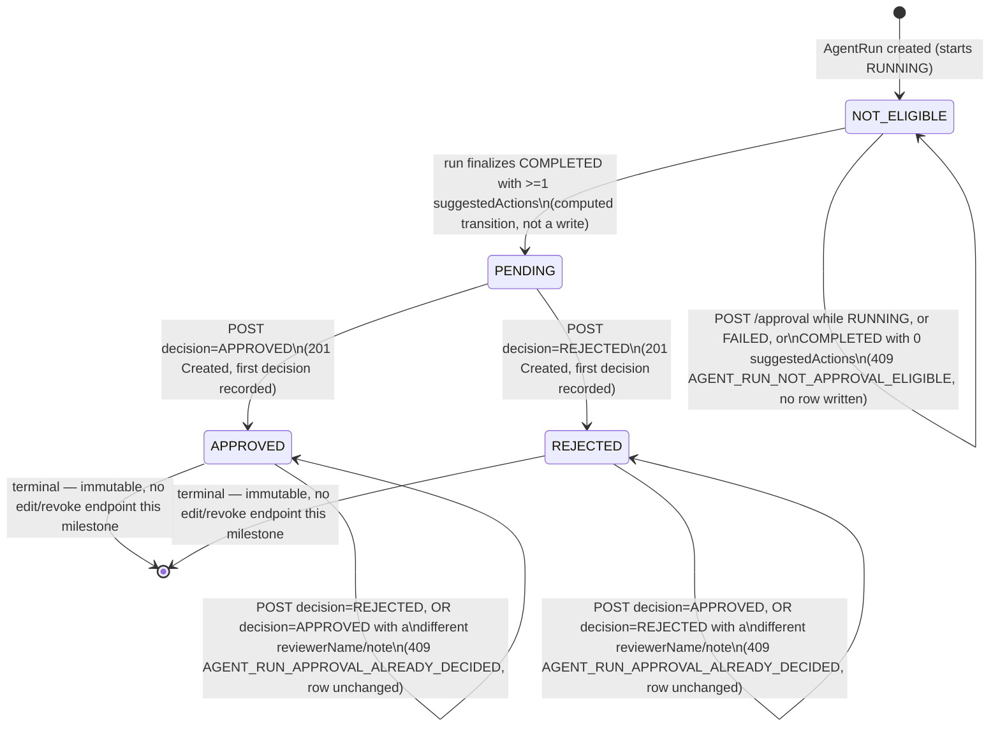

# OpsPilot — Approval Workflow (Milestone 6C)

| Field | Value |
|---|---|
| Document | Approval Workflow (Milestone 6C) — Design Record |
| Status | Persistence implemented; HTTP API pending |
| Revision | 5 — aligns the design record with the implemented PR 3A database timestamp, migration transaction, corruption-check ordering, and rollback coverage: `decidedAt` is documented as PostgreSQL-generated (`@default(now())` / `DEFAULT CURRENT_TIMESTAMP`), not application-supplied (§8); the migration SQL sketch is wrapped in explicit `BEGIN`/`COMMIT`, matching the actually-applied migration (§8); the `toRecordApprovalDecisionWrite` sketch uses `validateOrThrow` (the actual implementation), not a bare `.parse()` that throws a raw `ZodError` (§8); `recordApprovalDecision`'s pseudocode is corrected to read and shape-validate any existing approval row *before* branching on eligibility — the prior sketch incorrectly rejected an ineligible run before ever reading an existing row, unable to distinguish an ordinary rejection from the impossible existing-row-on-an-ineligible-run state (§9); and the testing section gains the `recordApprovalDecision`-side impossible-state test and the full mid-transaction `AFTER INSERT` rollback-trigger test description, both already implemented but previously undocumented (§13). Does not change the `Status` field — the HTTP API remains not implemented. Revision 4 makes stored-row validation reject non-canonical whitespace instead of silently trimming it (§8, §13), makes `toRecordApprovalDecisionWrite` the single parse/normalization boundary for the write path with the repository never parsing the request schema separately (§8, §9), collapses `RecordApprovalDecisionParams` into a type alias of the schema-derived `RecordApprovalDecisionInput` and has the controller pass the parsed body straight through with no reconstruction (§8, §11), and corrects the PR 3A/3B document-status transition wording (§14, §17). Revision 3 corrected note `undefined`/`null` normalization boundaries (§8), `decidedAt` serialization and an undefined `toView` reference (§8, §9, §11), replaced an unconditional/unsafe demo-scenario change with an opt-in one keyed on a specific ticket ID (§14), corrected an overclaimed database-level immutability guarantee (§5), added stored-row runtime revalidation on read (§8, §9, §13), and fixed which PR creates vs. updates this document (§14, §17). |
| Project | OpsPilot |
| Purpose | Design a minimal, auditable human-approval workflow for `AgentRun` `suggestedActions` — records a human decision only, never executes it |
| Related documents | `docs/11-agent-run-persistence.md` (the persistence layer this design extends), `docs/12-agent-run-api.md` (the HTTP API this design adds two endpoints to) |

---

## 1. Purpose and Non-Goals

**Purpose.** Add a minimal, auditable mechanism for a human to record an APPROVE or REJECT decision against the `suggestedActions` produced by a `COMPLETED` `AgentRun`, on top of the PostgreSQL persistence (`packages/database`) and local NestJS API (`apps/api`) shipped in Milestones 6A/6B. The workflow **records a decision only** — it never executes, simulates executing, or schedules execution of the approved action.

**Non-goals (explicitly excluded from this milestone):**

- No React/UI work of any kind.
- No authentication, authorization, or real reviewer-identity verification — `reviewerName` is a self-asserted, unverified string (§7).
- No BullMQ/background workers, no SSE/WebSockets, no notifications.
- No deployment or CI/CD changes.
- No live LLM/provider changes — the deterministic `FakeLlmProvider` path is untouched.
- No automatic execution of an approved action.
- No multi-step or multi-reviewer approval chains — exactly one decision per `AgentRun`, ever.
- No editing or revoking a final decision — `APPROVED`/`REJECTED` are immutable once recorded, in the application-layer sense defined precisely in §5 (no UPDATE/DELETE code path in the repository or HTTP API; not a database-enforced guarantee).
- No changes to `agent_runs.status`, no new `agent_trace_events` event types, no migration touching either table's existing CHECK constraints.

## 2. Current-System Constraints

These are load-bearing and are not re-litigated elsewhere in this document:

1. **`agent_runs.status` is closed to 3 values** (`agent_runs_status_chk`: `RUNNING | COMPLETED | FAILED`). There is no room for a `PENDING_APPROVAL`-style 4th status without touching a hand-authored CHECK constraint on an already-shipped table — out of scope. Approval state must live entirely outside this column.
2. **`agent_trace_events.event_type` is closed to exactly 4 orchestrator-only values** (`RETRIEVAL_COMPLETED | TOOL_REQUESTED | TOOL_COMPLETED | REPORT_GENERATED`), mirrored 1:1 against `AgentTraceEventSchema`'s discriminated union in `@opspilot/contracts`, and checked (`agent_trace_events_event_type_matches_chk`) against `payload->>'type'`. This table is the orchestrator's own execution trace, not a general-purpose audit log. A human-review decision is a fundamentally different kind of event and must not be inserted here — doing so would blur exactly the trace/review boundary this milestone must keep clean.
3. **`agent_runs.report` is a single embedded JSONB blob**, set only when `status = 'COMPLETED'` (enforced by `agent_runs_terminal_outcome_chk`), containing `suggestedActions: SuggestedAction[]` (`max(3)`, **not** `min(1)` — can be empty). There is no `AgentStep`/`PendingAction` table and no per-report identity separate from the owning `AgentRun`.
4. **No stable per-action identity exists.** `SuggestedActionSchema` (`z.discriminatedUnion("type", [...])` over `UPDATE_TICKET_STATUS | CREATE_ESCALATION | DRAFT_CUSTOMER_REPLY`) has no `id`/`actionId` field. Inventing one would ripple into the orchestrator's LLM-output validation, the fake-provider scenario fixtures, and the evaluation harness — a change disproportionate to this milestone (§3).
5. **Lock order discipline**: `AgentJob → AgentRun → child row`, applied consistently by every existing transaction in `agent-run-repository.ts`. `startRun` is the only function that locks `AgentJob` (to serialize `attempt_number` allocation); `finalizeCompleted`/`finalizeFailed` lock only the target `AgentRun` row, never `AgentJob`. Any new child-row table must slot in after `AgentRun`, following the finalize* precedent.
6. **Exact-replay idempotency** is the established pattern for "did my write already happen" safety (`finalizeCompleted`/`finalizeFailed`): compare the full incoming write against the full stored write via Postgres equality; identical → no-op success; any mismatch on an already-terminal row → `PersistenceError("PERSISTENCE_CONFLICT", …)`. This is reused verbatim for approval-decision idempotency (§6).
7. **`apps/api` conventions are closed and must not be deviated from**: no `class-validator`, no DTO classes, no `@nestjs/swagger`; Zod schemas + `ZodValidationPipe`/`ZodParamValidationPipe`; `{ data: … }` success envelope; `{ error: { code, message, requestId, runId? } }` error envelope from a single `ApiError`/`API_ERROR_CATALOG`; `mapDomainError(error, context)` context-sensitive dispatch; hand-written response mappers (never a raw spread); string DI tokens in `*.tokens.ts`; three-tier test pyramid.
8. **Package graph is closed**: `apps/api → @opspilot/contracts, @opspilot/database, @opspilot/agent-runtime` only, never `apps/worker`.

## 3. Approval Target Decision

**Candidates considered:** (a) per-individual-`suggestedAction`, (b) per-`ResolutionReport`, (c) per-`AgentRun`.

**(b) and (c) are structurally the same thing** given constraint §2.3: `report` is a 1:1 embedded JSONB column on `AgentRun`, set exactly once (`COMPLETED` only), never revised, never has its own row/id. "Approve this report" and "approve this run's terminal outcome" are the same event under this schema — there is no independent report identity to key a decision against. This collapses the real choice to (a) vs (c).

**Decision: per-`AgentRun` (whole-run) approval.** A single decision (`APPROVED` or `REJECTED`) covers the entire `suggestedActions` array as a unit, keyed by `runId`.

**Justification:**

- **No invented identity required.** `runId` (a real, stable, already-indexed UUID primary key) is the natural key. Per-action approval would require inventing action identity — either (i) array index, which is fragile because it silently shifts meaning if the report is ever regenerated or reordered (not possible today, but a latent trap for future work), or (ii) a real `actionId` added to `SuggestedActionSchema`, which is exactly the "bigger, riskier, cross-package change" this milestone is scoped to avoid (§2.4).
- **MVP-proportionate.** `suggestedActions.length` is capped at 3 and is frequently 0 or 1 in practice; per-run approval is the smallest workflow that gives a human reviewer a meaningful "yes, act on this run's recommendation" / "no, don't" gate — exactly what "gating suggested actions before they take effect" (the deferred item named in both `docs/11` and `docs/12`) requires as a first cut.
- **Audit clarity.** One decision row per run is trivially auditable without reconciling partial per-action states against a report that has no independent versioning.
- **API ergonomics.** One `GET`/`POST` pair per run is simpler than an array of per-action approval sub-resources with no way to reference an action stably.

**Extensibility is left open, not foreclosed.** Because the new table is keyed by `runId` (not embedded in `agent_runs`) and lives in its own migration, a future milestone can add a `agent_run_action_approvals` table keyed by `(runId, actionIndex)` — or a real `actionId` once one exists — as an additive refinement, without touching this table (§15.1, §18.1).

## 4. Domain Model and Eligibility Rules

**Eligibility.** An `AgentRun` is *approval-eligible* if and only if:

```sql
status = 'COMPLETED' AND jsonb_array_length(COALESCE(report -> 'suggestedActions', '[]'::jsonb)) >= 1
```

- `RUNNING` → not eligible (no report exists yet; may become eligible later).
- `FAILED` → not eligible, **permanently** (a `FAILED` run never has a report — `agent_runs_terminal_outcome_chk` forbids it — and `status` is immutable once terminal).
- `COMPLETED` with `suggestedActions = []` (a legal, zero-length report per `ResolutionReportSchema.suggestedActions: z.array(...).max(3)`, no `.min(1)`) → not eligible, **permanently** (nothing to approve).
- `COMPLETED` with `suggestedActions.length >= 1` → eligible, **permanently** (once `COMPLETED`+`report` is set, it is immutable — `finalizeCompleted`'s exact-replay semantics mean the report can never silently change under an already-terminal run).

Because `agent_runs.status`/`report` are write-once-terminal (§2.3, §2.6), **eligibility can only ever transition `false → true`, never flap or regress** — this materially simplifies the state machine (§5): there is no need to handle "a previously eligible run became ineligible."

**Decision states (persisted):** `APPROVED`, `REJECTED`. There is **no persisted `PENDING`/`NOT_ELIGIBLE` row** — mirroring the existing "no `PENDING` `AgentRun` row ever exists" precedent (`startRun` inserts directly as `RUNNING`). `PENDING`/`NOT_ELIGIBLE` are *computed read-model* states, synthesized at `GET` time from `(run.status, run.report, existence of a decision row)` — never materialized.

**Read-model status (four values, computed, never stored as a column):**

```
NOT_ELIGIBLE  — run exists, not approval-eligible, no decision row exists (permanent, per above)
PENDING       — run exists, approval-eligible, no decision row exists yet
APPROVED      — a decision row exists with decision = 'APPROVED'
REJECTED      — a decision row exists with decision = 'REJECTED'
```

## 5. State Machine

Decisions are **immutable** once recorded — no edit/revoke endpoint exists in this milestone. `APPROVED` and `REJECTED` are therefore true terminal states.

**Scope of the immutability guarantee (corrected in Revision 3 — an earlier draft overstated this as if it were database-enforced).** "Immutable" here means: this milestone's repository functions and HTTP API expose no UPDATE or DELETE code path for an `agent_run_approvals` row. `recordApprovalDecision` only ever `INSERT`s (first decision) or performs a no-op read-compare (replay, §6) — there is no `updateApprovalDecision`, no `DELETE`-capable endpoint, and no admin/internal bypass anywhere in `packages/database` or `apps/api`. This is an **application-layer** guarantee, not a database-enforced one:

- `UNIQUE(run_id)` (§8) enforces *at most one row per run*. It says nothing about whether that one row's *contents* can change.
- Nothing in the schema prevents a direct `UPDATE agent_run_approvals SET decision = 'REJECTED' WHERE run_id = $1` or `DELETE FROM agent_run_approvals WHERE run_id = $1` issued outside this repository — via `psql`, a future migration, a maintenance script, or a bug that bypasses the Prisma client. No immutability trigger, no `REVOKE UPDATE`/`REVOKE DELETE` grant, and no append-only/event-sourcing mechanism is introduced in this milestone (§15.4 already declined the append-only alternative for a related reason).
- This is not a new or different risk relative to the rest of this schema: nothing in `agent_jobs`/`agent_runs`/`agent_trace_events` prevents a direct SQL `UPDATE` either (docs/11 documents no such trigger for those tables). `agent_run_approvals` inherits the existing trust boundary rather than introducing a weaker one.

Every other reference to "immutable" in this document (§1, §6, §8, §16) means exactly this — repository/API-layer immutability — and should be read with this scope in mind.



Explicit coverage of every named scenario:

| Scenario | Outcome |
|---|---|
| `PENDING → APPROVED` | `201 Created`, row inserted |
| `PENDING → REJECTED` | `201 Created`, row inserted |
| Duplicate `APPROVED` (same reviewer+note) | `200 OK`, no write (idempotent replay) |
| Duplicate `REJECTED` (same reviewer+note) | `200 OK`, no write (idempotent replay) |
| `APPROVED → REJECTED` (flip) | `409 AGENT_RUN_APPROVAL_ALREADY_DECIDED`, row unchanged |
| `REJECTED → APPROVED` (flip) | `409 AGENT_RUN_APPROVAL_ALREADY_DECIDED`, row unchanged |
| Decision before completion (`RUNNING`) | `409 AGENT_RUN_NOT_APPROVAL_ELIGIBLE`, no row |
| Decision on a `FAILED` run | `409 AGENT_RUN_NOT_APPROVAL_ELIGIBLE`, no row |
| Decision on a `COMPLETED` run with 0 `suggestedActions` | `409 AGENT_RUN_NOT_APPROVAL_ELIGIBLE`, no row |

## 6. Idempotency and Concurrency Semantics

The exact-replay pattern from `finalizeCompleted`/`finalizeFailed` (§2.6) is reused verbatim, comparing the **full** `(decision, reviewerName, note)` tuple, not `decision` alone:

| Case | Semantics |
|---|---|
| **Same decision + same note** (and same `reviewerName`) | Idempotent replay, compared via Postgres equality (`= ` / `IS NOT DISTINCT FROM` for the nullable `note`). Zero writes. `200 OK`, returns the existing (unchanged) row. Safety net for a client that retries after a dropped connection without knowing whether its original `POST` committed. |
| **Same decision, different note** | **Conflict, not a silent update.** Decisions are immutable (§1); silently accepting a different note under the same decision either discards the original audit note or ignores the new one — neither acceptable. Treated identically to an opposite-decision conflict: `409 AGENT_RUN_APPROVAL_ALREADY_DECIDED`. The caller can `GET` the resource to see what was actually recorded. |
| **Opposite decision** (`APPROVED` vs stored `REJECTED` or vice versa) | `409 AGENT_RUN_APPROVAL_ALREADY_DECIDED`. First committed decision wins, permanently. |
| **Client retry after timeout** | Safe by construction: retry with the *same* request body → idempotent replay (`200 OK`); retry with a *different* body → conflict, surfaced explicitly rather than silently accepted. |
| **Two concurrent reviewers** (racing `POST`s on the same run) | Both transactions attempt `SELECT … FROM agent_runs WHERE id = $runId FOR UPDATE`. One acquires the lock first, reads the run (revalidating eligibility), finds no existing `agent_run_approvals` row, and inserts. The second blocks on the row lock, then — once unblocked — re-reads eligibility (unchanged, since eligibility never regresses, §4) and now finds the first reviewer's committed row: if its own requested `(decision, reviewerName, note)` matches, it gets an idempotent `200 OK`; if it differs, it gets `409 AGENT_RUN_APPROVAL_ALREADY_DECIDED`. First committer always wins; no lost update, no silent overwrite. |

**Why the `agent_runs` row lock alone is a sufficient serialization point** (no separate lock needed on `agent_run_approvals`): every writer for a given `runId` must first acquire the `FOR UPDATE` lock on that run's `agent_runs` row (§9), so all concurrent decision-recording attempts for the same run are already fully serialized before either transaction ever touches `agent_run_approvals`. The table's `UNIQUE(run_id)` constraint is kept as a **defense-in-depth backstop** (not the primary correctness mechanism) against any future code path that might bypass this repository function — a concurrent unique-violation there is caught by the existing `normalizeDatabaseError` (already handles `23505`/`P2002` → `PERSISTENCE_CONFLICT`, no changes needed).

## 7. Reviewer Identity and Trust Boundary

`apps/api` has **no authentication or authorization** — there is no session, no user table, no verified identity of any kind.

**What is persisted:** `reviewerName`, a client-supplied, free-text string (`z.string().min(1).max(100)`), required on every `POST`. This is **self-asserted and unverified** — structurally identical in trust level to how `TicketContextSchema`'s `ticketId`/`summary` are trusted verbatim from the caller today.

> **Trust-boundary warning.** `reviewerName` is an unverified, client-supplied audit label, not an authenticated identity. Any caller with network access to this local-only API can record a decision under any name. This is acceptable for a single-developer local demo of the workflow shape, and is explicitly **not** acceptable once this API is exposed beyond a local developer machine — authentication/authorization remains future work (unchanged from `docs/12-agent-run-api.md` §7/§9).

**Why require it at all, given it can't be verified:** an unverified label is still strictly more useful for audit purposes than no label. Making it required (not optional/defaulted) keeps every recorded decision self-describing without inventing a fixed "local-reviewer" placeholder identity that would look authenticated but isn't.

## 8. Persistence Schema

**New table: `agent_run_approvals`** — a new class of `AgentRun` child row, sibling to `agent_trace_events`, never inserted into `agent_trace_events` itself (§2.2).

Prisma model addition (`packages/database/prisma/schema.prisma`):

```prisma
model AgentRun {
  // ...existing fields unchanged...
  traceEvents AgentTraceEvent[]
  approval    AgentRunApproval?    // NEW — 0-or-1, enforced by AgentRunApproval.runId's unique constraint

  @@map("agent_runs")
}

model AgentRunApproval {
  id           String   @id @default(dbgenerated("gen_random_uuid()")) @db.Uuid
  runId        String   @unique @map("run_id") @db.Uuid
  decision     String                                    // APPROVED | REJECTED — CHECK constraint, not a Prisma enum
  reviewerName String   @map("reviewer_name")
  note         String?
  decidedAt    DateTime @default(now()) @map("decided_at") @db.Timestamptz(6)

  run AgentRun @relation(fields: [runId], references: [id], onDelete: Cascade)

  @@map("agent_run_approvals")
}
```

Design notes, each following an existing named convention exactly:

- **Enum-as-CHECK, not a Prisma enum** — matches `status`/`providerMode`/`failureCode`/`eventType`, all hand-authored `TEXT` + `CHECK` rather than Prisma's native enum type.
- **`runId String @unique`** (not a composite `@@unique`) — DB-enforced: *at most one row per run, ever*. This is a genuine structural (database-level) guarantee, distinct from row-content immutability, which is not database-enforced (§5's corrected scope note). It doubles as the lookup index for both `GET`/`POST` by `runId`.
- **No separate `createdAt` column.** This milestone's repository provides no UPDATE code path for this table (§5) and exactly one row is ever inserted per run through it — `decidedAt` already carries the row's only meaningful timestamp. **`decidedAt` is generated by PostgreSQL through the column default (`@default(now())` / `DEFAULT CURRENT_TIMESTAMP`), not supplied by application code** — the repository's `INSERT` (§9) deliberately omits `decidedAt` from its column list entirely, exactly the way `AgentJob.createdAt`/`AgentRun.createdAt`/`AgentTraceEvent.createdAt` are already database-generated rather than application-generated. A second `createdAt` column would always hold the same instant as `decidedAt` (both are the same database-generated timestamp on the same `INSERT`, §9) and would only ever diverge from it if a future milestone added an update path — at which point it should be added deliberately, not carried speculatively from day one.
- **`onDelete: Cascade`** — matches the existing `AgentRun → AgentTraceEvent` and `AgentJob → AgentRun` cascade convention exactly.
- **No `AgentJob` foreign key on this table** — matches §2.5's lock-order note: this table only ever needs to reach `AgentRun`, never `AgentJob` directly (a caller can still reach the job via `AgentRunApproval.run.job`, exactly as `AgentTraceEvent` does today).

**New named CHECK constraints** (hand-authored SQL, following the existing 12-constraint convention, now 14 total):

```sql
ALTER TABLE "agent_run_approvals" ADD CONSTRAINT "agent_run_approvals_decision_chk"
  CHECK ("decision" IN ('APPROVED', 'REJECTED'));

ALTER TABLE "agent_run_approvals" ADD CONSTRAINT "agent_run_approvals_reviewer_name_not_blank_chk"
  CHECK (char_length(btrim("reviewer_name")) > 0);
```

No CHECK constraint duplicates Zod's `note`/`reviewerName` upper-bound length limits — matching existing precedent (e.g. `ResolutionReport`'s text fields are Zod-bounded only, never DB-length-CHECKed).

**Migration SQL — exact implemented shape** (`packages/database/prisma/migrations/20260724183209_add_agent_run_approvals/migration.sql` — already authored and applied; the checked-in `init` migration is never edited, and this migration itself must not be edited further now that it is applied, §9 of the PR 3A implementation plan). Wrapped in explicit `BEGIN`/`COMMIT` — this is the SQL's own guarantee of atomic application, not an assumption about Prisma's engine behavior:

```sql
BEGIN;

CREATE TABLE "agent_run_approvals" (
    "id" UUID NOT NULL DEFAULT gen_random_uuid(),
    "run_id" UUID NOT NULL,
    "decision" TEXT NOT NULL,
    "reviewer_name" TEXT NOT NULL,
    "note" TEXT,
    "decided_at" TIMESTAMPTZ(6) NOT NULL DEFAULT CURRENT_TIMESTAMP,

    CONSTRAINT "agent_run_approvals_pkey" PRIMARY KEY ("id")
);

CREATE UNIQUE INDEX "agent_run_approvals_run_id_key"
  ON "agent_run_approvals"("run_id");

ALTER TABLE "agent_run_approvals"
  ADD CONSTRAINT "agent_run_approvals_run_id_fkey"
  FOREIGN KEY ("run_id")
  REFERENCES "agent_runs"("id")
  ON DELETE CASCADE
  ON UPDATE CASCADE;

ALTER TABLE "agent_run_approvals"
  ADD CONSTRAINT "agent_run_approvals_decision_chk"
  CHECK ("decision" IN ('APPROVED', 'REJECTED'));

ALTER TABLE "agent_run_approvals"
  ADD CONSTRAINT "agent_run_approvals_reviewer_name_not_blank_chk"
  CHECK (char_length(btrim("reviewer_name")) > 0);

COMMIT;
```

This migration was authored with `prisma migrate dev --create-only` (generating the file without applying it), hand-edited to add the `BEGIN`/`COMMIT` wrapper and the 2 CHECK constraints while still unapplied, then applied with a plain `prisma migrate dev` — never the reverse order, since a migration must never be hand-edited after it has already been applied to any database.

`packages/database/src/schema-constraints.integration.test.ts` asserts these 2 new constraint names by exact name, bringing the asserted total to 14 (matching how the existing 12 are exhaustively checked against `pg_constraint`).

### Types and runtime validation across boundaries (added in Revision 3)

An earlier draft left `RecordApprovalDecisionParams`/`RecordApprovalDecisionResult`/`AgentRunApprovalView` as bare names imported from `@opspilot/database` without ever spelling out their exact shapes, let an `undefined -> null` conversion for `note` happen ambiguously (sometimes implied in the controller, sometimes implied in the repository), let an undefined `toView(...)` helper appear in the controller sketch with no definition anywhere, and — as a further Revision 4 correction — let `RecordApprovalDecisionParams` be an independently hand-written interface that could silently drift from `RecordApprovalDecisionInputSchema`'s actual parsed shape. This subsection is the single source of truth for every type at every boundary, closing all of these gaps.

**`RecordApprovalDecisionParams` is not its own interface — it is the schema-derived type itself, so there is exactly one place either can drift from the other: nowhere.**

```ts
// packages/database/src/types.ts
import type { RecordApprovalDecisionInput } from "@opspilot/contracts";

// The schema-derived type IS the single source of truth (Revision 4) — not a
// separately hand-written interface that has to be kept in sync with it by hand.
// `note` is OPTIONAL (present-or-absent), never `null`, exactly mirroring
// RecordApprovalDecisionInputSchema's parsed output. The controller passes the
// parsed request body straight through as this type, unmodified — it does not
// reconstruct a new object, and it does not convert an absent `note` to `null`
// itself (§11); only toRecordApprovalDecisionWrite (below) does that, and only
// internally, inside packages/database.
export type RecordApprovalDecisionParams = RecordApprovalDecisionInput;
```

**`toRecordApprovalDecisionWrite` is the single input-validation *and* normalization boundary for the entire write path (Revision 4) — it parses `RecordApprovalDecisionInputSchema` itself, exactly once, rather than trusting an already-typed argument:**

```ts
// packages/database/src/mappers.ts
import { RecordApprovalDecisionInputSchema } from "@opspilot/contracts";

// Database write shape — what actually gets bound into the INSERT/comparison in §9.
// NOT the same type as RecordApprovalDecisionParams: `note` here is `string | null`,
// never `undefined`, because SQL has no "absent" — only NULL.
export interface AgentRunApprovalWrite {
  readonly decision: ApprovalDecision;
  readonly reviewerName: string;
  readonly note: string | null;
}

// Accepts `unknown`, not RecordApprovalDecisionParams — this function IS the parse
// boundary, not a post-parse formatter. It calls RecordApprovalDecisionInputSchema
// (the same schema the API's ZodValidationPipe already validated the HTTP body
// against, §11) exactly once, inside this one function, via the existing shared
// validateOrThrow helper (packages/database/src/validation.ts) — the same helper
// every other toXWrite mapper in this file uses, not a bare .parse() call. The
// repository (recordApprovalDecision, §9) calls ONLY this function and never
// separately calls RecordApprovalDecisionInputSchema.parse/safeParse itself —
// re-validating an argument that arrived pre-typed is deliberate defense-in-depth
// (docs/11 §6: "TypeScript types are never trusted alone"), matching how
// toReportWrite/toFailureCodeWrite re-validate already-typed values before every
// write.
export function toRecordApprovalDecisionWrite(input: unknown): AgentRunApprovalWrite {
  // validateOrThrow throws PersistenceError("PERSISTENCE_VALIDATION_FAILED",
  // "Approval decision input failed contract validation.", { cause }) on failure —
  // never a raw, unnormalized ZodError.
  const parsed = validateOrThrow(RecordApprovalDecisionInputSchema, input, "Approval decision input");
  return {
    decision: parsed.decision,
    reviewerName: parsed.reviewerName,
    note: parsed.note ?? null,   // the one and only undefined -> null conversion
  };
}
```

**`decidedAt` is a `Date` (or `Date | null`) everywhere below the HTTP boundary, and an ISO string (or `null`) only in the HTTP response — converted in exactly one place, the response mapper:**

```ts
// Raw persisted-row shape, always fully populated (decided_at is NOT NULL, §8) —
// produced by fromAgentRunApprovalRow after runtime revalidation (below).
export interface AgentRunApprovalRecord {
  readonly id: string;
  readonly runId: string;
  readonly decision: ApprovalDecision;
  readonly reviewerName: string;
  readonly note: string | null;
  readonly decidedAt: Date;                 // never null — a Record only exists for a real row
}

// GET-time (and POST-response-time) computed read model — may represent "no
// decision row exists yet", hence the nullable fields.
export interface AgentRunApprovalView {
  readonly runId: string;
  readonly status: "NOT_ELIGIBLE" | "PENDING" | "APPROVED" | "REJECTED";
  readonly reviewerName: string | null;
  readonly note: string | null;
  readonly decidedAt: Date | null;          // Date, not a string, at this layer
}

// recordApprovalDecision's result. Revision 3 change: this now carries a
// ready-to-respond AgentRunApprovalView directly ("view"), not an
// AgentRunApprovalRecord under a field the controller had to separately convert
// via an undefined toView(...) helper. There is no toView(...) function anywhere
// in this design — the repository builds the view itself (§9) and the controller
// passes it straight to mapAgentRunApprovalResponse (§11).
export interface RecordApprovalDecisionResult {
  readonly view: AgentRunApprovalView;
  readonly outcome: "created" | "replayed";
}
```

The HTTP-layer response mapper (§11) is the **only** place `Date -> string` conversion happens, and it is explicit rather than a bare field pass-through:

```ts
decidedAt: view.decidedAt?.toISOString() ?? null
```

**Runtime validation of stored rows on read** (mirrors `docs/11-agent-run-persistence.md` §6's boundary discipline — "TypeScript types are never trusted alone" — applied to this table for the first time). **Revision 4 correction: this schema must not silently re-trim a stored value — it must reject one that isn't already canonical.** An earlier draft's `AgentRunApprovalRowSchema` used `.trim()` on read, which would silently *normalize* a corrupted/non-canonical stored value (e.g. `" jacky "`) back into a clean one on every read — masking exactly the kind of write-path bug or manual-`INSERT` corruption this schema exists to catch. The corrected schema instead requires the stored string to already equal its own trimmed form, and fails validation if it doesn't:

```ts
// packages/database/src/validation.ts (addition, alongside the existing TicketContextSchema)
import { ApprovalDecisionSchema } from "@opspilot/contracts";

const isCanonicallyTrimmed = (value: string): boolean => value === value.trim();

const CanonicalReviewerNameSchema = z
  .string()
  .min(1)
  .max(100)
  .refine(isCanonicallyTrimmed, {
    message: "reviewerName must not have leading or trailing whitespace",
  });

const CanonicalNoteSchema = z
  .string()
  .min(1)
  .max(1000)
  .refine(isCanonicallyTrimmed, {
    message: "note must not have leading or trailing whitespace",
  });

export const AgentRunApprovalRowSchema = z
  .object({
    id: z.string().uuid(),
    runId: z.string().uuid(),
    decision: ApprovalDecisionSchema,
    reviewerName: CanonicalReviewerNameSchema,
    note: z.union([z.null(), CanonicalNoteSchema]),
    decidedAt: z.date(),
  })
  .strict();
```

A stored `reviewer_name` of `" jacky "` or a stored `note` of `" note "` now fails this schema (`" jacky ".trim() !== " jacky "`) and produces `PERSISTENCE_VALIDATION_FAILED`, rather than being silently normalized into `"jacky"`/`"note"` on the way out. `RecordApprovalDecisionInputSchema` (§11) still uses `.trim()` — request-time normalization is correct and unchanged; only the *read-time revalidation* schema must reject non-canonical input instead of correcting it, because its job is to detect corruption, not repair it.

`fromAgentRunApprovalRow(row)` (`packages/database/src/mappers.ts`) parses every row through this schema — via a Prisma-mapped, already-camelCased input — **before** constructing an `AgentRunApprovalRecord`, on every read path without exception: after the `INSERT` in `recordApprovalDecision` (§9 step 6), after the replay-match `SELECT` in `recordApprovalDecision` (§9 step 5), and after the `SELECT` in `getApprovalDecision` (§9). A `ZodError` is caught and re-thrown as `PersistenceError("PERSISTENCE_VALIDATION_FAILED", <fixed message>, { cause })` — the raw Zod issue array stays in `.cause` only, never in `.message`, matching `docs/11` §6's exact convention. `apps/api`'s existing `mapDomainError` already maps `PERSISTENCE_VALIDATION_FAILED -> INTERNAL_DATA_INVALID` (500, §12) — no new error code or status mapping is needed for this.

**Why this check matters despite the CHECK constraints (§8):** `agent_run_approvals_decision_chk` closes the `decision` enum at the database level, but nothing in the schema enforces `reviewer_name`'s or `note`'s upper bound, and nothing enforces that they lack leading/trailing whitespace either — §8 says so explicitly for length ("No CHECK constraint duplicates Zod's `note`/`reviewerName` upper-bound length limits"), and the same gap applies to whitespace: `agent_run_approvals_reviewer_name_not_blank_chk` is `char_length(btrim(reviewer_name)) > 0`, which a padded value like `" jacky "` satisfies trivially (`btrim` only decides *blank-or-not*, not *canonical-or-not*). A row with a 500-character `reviewer_name`, or one with stray padding, written by some future code path that bypasses this repository's own Zod-validated `RecordApprovalDecisionInputSchema` (a maintenance script, a fixed-up manual `INSERT`, a future migration's data backfill), would pass every CHECK constraint in `migration.sql` and still be nonsense by this design's own contract. `AgentRunApprovalRowSchema` is what actually catches both on read — the same gap `docs/11` §6 identifies between `agent_trace_events_event_type_matches_chk` (checks `event_type` matches `payload->>'type'`) and full payload-shape validation.

## 9. Transaction and Locking Design

**Lock order — extends, does not replace, `AgentJob → AgentRun → child row`:** `agent_run_approvals` is locked/written only after acquiring the `agent_runs` row lock, exactly following the `finalizeCompleted`/`finalizeFailed` precedent (lock `AgentRun` only, never `AgentJob`). This is a second, independent child-row branch off `AgentRun`, sibling to `AgentTraceEvent`:

```
AgentJob
  └── AgentRun            (locked by startRun; locked by finalizeCompleted/Failed AND by recordApprovalDecision)
        ├── AgentTraceEvent      (existing child row — orchestrator trace only)
        └── AgentRunApproval    (NEW child row — human decision only, 0-or-1 per run)
```

**`recordApprovalDecision(prisma, runId, input)` — pseudocode**, in the exact style of `docs/11-agent-run-persistence.md` §5:

**Corrected order (Revision 5) — an earlier draft rejected an ineligible run before ever reading an existing approval row, which meant it could never distinguish an ordinary "not yet eligible" rejection from the impossible state of an approval row already existing for a run that is not currently eligible. The corrected order always reads and shape-validates any existing row first, then branches on the combination of `(existing row present?, eligible?)`:**

```text
1.  write := toRecordApprovalDecisionWrite(input) — BEFORE opening a transaction
    (mirrors toReportWrite/toFailureCodeWrite). This is the ONLY place
    RecordApprovalDecisionInputSchema is parsed on this write path (§8), via the
    shared validateOrThrow helper — the repository does not separately call
    .parse/.safeParse on it anywhere else. Parsing also TRIMS reviewerName/note
    (§11) and converts an absent note to null, producing an AgentRunApprovalWrite
    (note: string | null). A validation failure -> PersistenceError
    ("PERSISTENCE_VALIDATION_FAILED", …) thrown before BEGIN — an invalid write
    never touches the database. Every step from here on operates on `write`,
    never on the original `input`.
2.  BEGIN
3.  SELECT status,
           jsonb_array_length(COALESCE(report -> 'suggestedActions', '[]'::jsonb)) AS suggested_action_count
      FROM agent_runs WHERE id = $runId FOR UPDATE
    -- not found -> PersistenceError("PERSISTENCE_NOT_FOUND", …)
    --    [context "recordApprovalDecision" -> 404 AGENT_RUN_NOT_FOUND]
4.  eligible := (status = 'COMPLETED' AND suggested_action_count >= 1)
    -- computed here, but NOT branched on yet — see step 6.
5.  SELECT id, run_id, decision, reviewer_name, note, decided_at
      FROM agent_run_approvals WHERE run_id = $runId
    -- always executed, regardless of `eligible` — serialized entirely by the
    -- agent_runs row lock acquired in step 3 (§6); no separate FOR UPDATE
    -- needed here; UNIQUE(run_id) is a defense-in-depth backstop only.
    IF a row was found:
      existing := fromAgentRunApprovalRow(row)   -- §8: Zod-revalidates the stored row's shape
      -- validation failure -> PersistenceError("PERSISTENCE_VALIDATION_FAILED", …)
      --    [500 INTERNAL_DATA_INVALID] — thrown here, before any comparison touches
      --    a value that hasn't been shape-checked (§8's "why this check matters")
6.  NOW branch on the combination of (existing row present?, eligible?):
    a. existing row present AND NOT eligible:
       -- Structurally impossible via this repository's own write path — a row
       -- can only ever have been inserted here under eligible = true (branch
       -- 6c below), and eligibility never regresses (§4). A manually restored
       -- backup, a future migration bug, or a write that bypasses this
       -- repository could still produce it. Treated as a data-integrity fault,
       -- not an ordinary "not eligible" rejection — the same distinction
       -- getApprovalDecision draws (below).
       -> PersistenceError("PERSISTENCE_VALIDATION_FAILED", …)
       -> [500 INTERNAL_DATA_INVALID]
       ROLLBACK
    b. no existing row AND NOT eligible:
       -> AgentRunApprovalError("RUN_NOT_APPROVAL_ELIGIBLE", runId, …)
       -> [409 AGENT_RUN_NOT_APPROVAL_ELIGIBLE]
       ROLLBACK
    c. no existing row AND eligible:
       INSERT INTO agent_run_approvals (run_id, decision, reviewer_name, note)
         VALUES ($runId, write.decision, write.reviewerName, write.note)
         RETURNING id, run_id, decision, reviewer_name, note, decided_at
       -- decided_at is NOT in the column list — PostgreSQL's own
       -- DEFAULT CURRENT_TIMESTAMP (§8) generates it, not application code.
       inserted := fromAgentRunApprovalRow(row)   -- §8: Zod-revalidates what was just written
       view := { runId, status: inserted.decision, reviewerName: inserted.reviewerName,
                 note: inserted.note, decidedAt: inserted.decidedAt }
       COMMIT
       -- return { view, outcome: "created" }
    d. existing row present AND eligible, exact full-record match
       (existing.decision = write.decision AND existing.reviewerName = write.reviewerName
        AND existing.note IS NOT DISTINCT FROM write.note):
       view := { runId, status: existing.decision, reviewerName: existing.reviewerName,
                 note: existing.note, decidedAt: existing.decidedAt }
       COMMIT
       -- return { view, outcome: "replayed" } — zero writes, existing row unchanged
    e. existing row present AND eligible, mismatch:
       -> AgentRunApprovalError("APPROVAL_ALREADY_DECIDED", runId, …)
       -> [409 AGENT_RUN_APPROVAL_ALREADY_DECIDED]
       ROLLBACK
```

**Both repository entry points detect this same impossible state identically:** an approval row existing for a run that is not currently eligible produces `PersistenceError("PERSISTENCE_VALIDATION_FAILED", …)` from `recordApprovalDecision` (branch 6a above) exactly as it does from `getApprovalDecision` (below) — the same check, applied on both the write path and the read path.

**`getApprovalDecision(prisma, runId)` — pseudocode:**

```text
One RepeatableRead-isolated transaction (mirrors getAgentRun's own consistency guarantee):
  SELECT id, status,
         jsonb_array_length(COALESCE(report -> 'suggestedActions', '[]'::jsonb)) AS suggested_action_count
    FROM agent_runs WHERE id = $runId
  -- not found -> PersistenceError("PERSISTENCE_NOT_FOUND", …) [context "getApprovalDecision" -> 404 AGENT_RUN_NOT_FOUND]
  SELECT id, run_id, decision, reviewer_name, note, decided_at FROM agent_run_approvals WHERE run_id = $runId

  IF a row was found:
    existing := fromAgentRunApprovalRow(row)   -- §8: Zod-revalidates the stored row's shape
    -- validation failure -> PersistenceError("PERSISTENCE_VALIDATION_FAILED", …) [500 INTERNAL_DATA_INVALID]
    --    thrown here, before eligibility-consistency or status computation touches an
    --    unvalidated value (§8's "why this check matters")

  -- Defensive eligibility-consistency check (mirrors getAgentRun's own read-time revalidation,
  -- docs/11 §6: "TypeScript types are never trusted alone" / trace-contiguity is validated on
  -- read, not just assumed). Given recordApprovalDecision only ever inserts a row inside a
  -- transaction that has just verified eligible = true (step 4, §9), and eligibility never
  -- regresses once true (§4), a row existing for a run that is NOT currently eligible should be
  -- structurally impossible through this repository's own write path. It is checked anyway,
  -- because "impossible through this code path" is not the same guarantee as "impossible in the
  -- database" — a manually restored backup, a future migration bug, or a write that bypasses
  -- this repository could still produce it:
  IF existing is set AND NOT eligible (per §4, computed from the same status/suggested_action_count read above):
    -> PersistenceError("PERSISTENCE_VALIDATION_FAILED", …)
    -> [500 INTERNAL_DATA_INVALID]
    -- an approval row attached to a run that is not COMPLETED-with-actions is never returned as if
    -- it were a legitimate decision — this is a data-integrity fault, not a normal "no decision yet"
    -- read, and must not silently resolve to APPROVED/REJECTED/PENDING/NOT_ELIGIBLE.

  status :=
    existing is set (and eligible, per the check above)  -> existing.decision  ("APPROVED" | "REJECTED")
    existing is not set AND eligible (per §4)             -> "PENDING"
    existing is not set AND NOT eligible                  -> "NOT_ELIGIBLE"
  return { runId, status, reviewerName: existing?.reviewerName ?? null,
           note: existing?.note ?? null, decidedAt: existing?.decidedAt ?? null }
  -- this return value IS an AgentRunApprovalView (§8) — decidedAt is a Date | null here,
  -- never a string; only the HTTP response mapper (§11) converts it to ISO-string-or-null.
```

**Stable domain error conditions and their mapping** (§12 has the full HTTP table):

| Condition | Thrown as | Code |
|---|---|---|
| `input` fails `toRecordApprovalDecisionWrite`'s `RecordApprovalDecisionInputSchema` parse (§8) — expected to be caught earlier by the API's own `ZodValidationPipe`, §11, but re-validated here as defense-in-depth | `PersistenceError` | `PERSISTENCE_VALIDATION_FAILED` (existing, reused) |
| `runId` doesn't exist (`agent_runs` row not found) | `PersistenceError` | `PERSISTENCE_NOT_FOUND` (existing, reused) |
| Run exists but not approval-eligible | `AgentRunApprovalError` (new) | `RUN_NOT_APPROVAL_ELIGIBLE` |
| Run exists, eligible, but a conflicting decision already recorded | `AgentRunApprovalError` (new) | `APPROVAL_ALREADY_DECIDED` |
| Database unreachable / driver failure | `PersistenceError` | `PERSISTENCE_UNAVAILABLE` (existing, unchanged) |
| Stored row fails `AgentRunApprovalRowSchema` shape revalidation (§8) — e.g. `reviewer_name`/`note` exceeding their Zod max length, which no CHECK constraint enforces | `PersistenceError` | `PERSISTENCE_VALIDATION_FAILED` (existing, reused) |
| An approval row exists for a run that is not currently eligible — structurally impossible via this repository's own write path, checked anyway as defense-in-depth | `PersistenceError` | `PERSISTENCE_VALIDATION_FAILED` (existing, reused) |

**Why a new error type (`AgentRunApprovalError`) rather than extending `PersistenceErrorCode` or overloading `PERSISTENCE_CONFLICT`:** `PersistenceErrorCode` is a closed 4-value union describing structural database-operation outcomes (not found / conflict / unavailable / validation-failed). "Not eligible" and "already decided" are **domain-level** facts discovered *from* persisted data, not database-operation failures — the same category distinction the codebase already draws between `PersistenceError` (structural DB failure) and `AgentRunServiceError` (orchestrator crash, kept strictly separate, never converted into each other). Reusing bare `PERSISTENCE_CONFLICT` for both "not eligible" and "already decided" would collapse two HTTP-distinguishable conditions into one `mapDomainError` branch with no way to tell them apart from `context` alone (both occur inside the same `recordApprovalDecision` context). A third, closed, purpose-built error type — `AgentRunApprovalError extends Error { code: "RUN_NOT_APPROVAL_ELIGIBLE" | "APPROVAL_ALREADY_DECIDED"; runId: string }`, defined in `packages/database/src/approval-errors.ts` alongside (but separate from) `PersistenceError` — extends this exact established taxonomy pattern with one more sibling.

## 10. Package Ownership and Dependency Direction

No new packages. The dependency graph for this feature is narrower than the general `apps/api → @opspilot/contracts, @opspilot/database, @opspilot/agent-runtime` graph: approval touches only `@opspilot/contracts` and `@opspilot/database` — **`@opspilot/agent-runtime` gains nothing from this milestone.**

| Package | New responsibility |
|---|---|
| `@opspilot/contracts` | `ApprovalDecisionSchema`, `RecordApprovalDecisionInputSchema` (request-body validation, reused at both the API boundary and re-validated inside the repository). |
| `@opspilot/database` | Prisma model + migration (§8); `approval-errors.ts` (`AgentRunApprovalError`); `types.ts` additions (`RecordApprovalDecisionParams`, `AgentRunApprovalWrite`, `AgentRunApprovalRecord`, `ApprovalDecision`, `AgentRunApprovalView`, `RecordApprovalDecisionResult`); `validation.ts` addition (`AgentRunApprovalRowSchema`, read-time revalidation, §8) — a narrow read-side schema kept in `packages/database`, not `packages/contracts`, matching the existing `TicketContextSchema` precedent for validation that isn't a public request/response contract; `mappers.ts` additions (`toRecordApprovalDecisionWrite`, `fromAgentRunApprovalRow`); `repositories/agent-run-approval-repository.ts` (`recordApprovalDecision`, `getApprovalDecision`), following `agent-run-repository.ts`'s exact conventions; `index.ts` value-then-const re-exports. **This package is the sole owner of the approval repository functions** — no adapter layer sits above it. |
| `@opspilot/agent-runtime` | **Untouched.** No new files, no new exports, no new dependency edge. See justification below. |
| `apps/api` | New, self-contained feature module `src/agent-run-approvals/` — controller, module, request schema, response mapper, **and** a small local `AgentRunApprovalService` (a factory-created object, not a class) that wraps `@opspilot/database`'s `recordApprovalDecision`/`getApprovalDecision` functions directly, injecting the same `PRISMA_CLIENT_HANDLE` token the rest of `apps/api` already uses. 1 new DI token (`AGENT_RUN_APPROVAL_SERVICE`, scoped to this module — no changes to `execution/execution.tokens.ts` or `execution/agent-runtime.module.ts`); 2 new `API_ERROR_CATALOG` entries; `mapDomainError` extended with an `AgentRunApprovalError` branch and 2 new `DomainErrorContext` values; `AppModule.forRoot` wires the new module in. |

**Why `apps/api`-local, not a new `agent-runtime` sibling service, and not folded into the existing `AgentRunService`:**

- **Alternative considered and rejected: an `agent-runtime` sibling service** (an earlier draft of this design proposed exactly this — `AgentRunApprovalRepositoryInterface`/`AgentRunApprovalService` living in `packages/agent-runtime`, mirroring `AgentRunRepositoryInterface`/`AgentRunService`). Rejected on reflection: `agent-runtime`'s reason for existing is bridging orchestrator *execution* between two real consumers, `apps/worker` and `apps/api` — that is precisely why `AgentRunService` was extracted there. Approval has **no orchestrator involvement and no second consumer**: `apps/worker` has no reason to ever record a human decision, so there is nothing to share. Adding an approval abstraction to `agent-runtime` would be exactly the kind of unjustified package-boundary abstraction the original design brief itself warns against ("avoid creating a new package unless there is a real second consumer or a strong domain-boundary reason") — here the concern isn't a *new package*, but the same principle applies one level down to adding an unnecessary layer inside an existing one. A thin, `apps/api`-local factory that calls `@opspilot/database` directly is the smallest correct shape — this is "Option D" from the original milestone brief's own comparison list ("API-local service using packages/database repository").
- **Alternative considered and rejected: fold into `AgentRunService`.** Unchanged reasoning from the prior draft: this would touch every existing consumer and every existing `vi.fn()` fake of `AgentRunService` across `apps/api`'s unit tests purely to add two unrelated methods, widening the blast radius of a milestone that should extend, not modify the behavior of, the existing repository/service layer. `AgentRunService`'s existing contract is entirely about *execution*; approval is a distinct, additive, orthogonal concern.
- **Net effect:** this feature's entire footprint outside `apps/api` is `packages/contracts` (2 schemas) and `packages/database` (schema/migration/errors/types/mappers/repository) — nothing in `packages/agent-runtime` changes at all, and nothing in `apps/api/src/execution/` changes either.

**Local `AgentRunApprovalService` (`apps/api/src/agent-run-approvals/agent-run-approval.service.ts`):**

```ts
import { recordApprovalDecision, getApprovalDecision } from "@opspilot/database";
import type { AgentRunApprovalView, RecordApprovalDecisionParams, RecordApprovalDecisionResult } from "@opspilot/database";
import type { PrismaClient } from "@opspilot/database";

export interface AgentRunApprovalService {
  recordApprovalDecision(runId: string, input: RecordApprovalDecisionParams): Promise<RecordApprovalDecisionResult>;
  getApprovalDecision(runId: string): Promise<AgentRunApprovalView>;
}

export function createAgentRunApprovalService(prisma: PrismaClient): AgentRunApprovalService {
  return {
    recordApprovalDecision: (runId, input) => recordApprovalDecision(prisma, runId, input),
    getApprovalDecision: (runId) => getApprovalDecision(prisma, runId),
  };
}
```

(Thin pass-through by design — same shape as the rejected `agent-runtime` sketch, just one layer shallower: `apps/api` calls `@opspilot/database`'s repository functions with no intermediate adapter. `PersistenceError`/`AgentRunApprovalError` flow through unchanged.)

**DI wiring (`apps/api/src/agent-run-approvals/agent-run-approvals.tokens.ts` + `agent-run-approvals.module.ts`, both new, both fully self-contained — no edits to `apps/api/src/execution/*`):**

```ts
// agent-run-approvals.tokens.ts
export const AGENT_RUN_APPROVAL_SERVICE = "AGENT_RUN_APPROVAL_SERVICE";
```

```ts
// agent-run-approvals.module.ts
@Module({
  controllers: [AgentRunApprovalsController],
  providers: [
    {
      provide: AGENT_RUN_APPROVAL_SERVICE,
      useFactory: (handle: PrismaClientHandle): AgentRunApprovalService => createAgentRunApprovalService(handle.prisma),
      inject: [PRISMA_CLIENT_HANDLE],   // the existing @Global() token from persistence/prisma.tokens.ts
    },
  ],
})
export class AgentRunApprovalsModule {}
```

Because `PrismaModule.forRoot` is already `@Global()` (§2.7), this module needs no `imports` at all to reach `PRISMA_CLIENT_HANDLE` — one fewer moving part than the `AgentRuntimeModule`-mediated wiring the earlier draft required.

## 11. API Contract

Global prefix `/v1` unchanged. Two new endpoints, added to the existing four:

```text
POST /v1/agent-runs/:runId/approval
GET  /v1/agent-runs/:runId/approval
```

Both registered in `apps/api/src/agent-run-approvals/agent-run-approvals.controller.ts` as `@Controller()` with full per-method paths (`@Post("agent-runs/:runId/approval")`, `@Get("agent-runs/:runId/approval")`) — mirroring `AgentRunsController`'s existing cross-prefix style exactly.

**`GET /v1/agent-runs/:runId` is left unchanged — approval state is NOT embedded in it.** Justification: (1) keeps `AgentRunService`/`mapAgentRunResponse`/`PersistedAgentRun` completely untouched, so this milestone is purely additive against Milestone 6B's shipped, tested surface; (2) embedding would re-couple `AgentRunRepositoryInterface`/`AgentRunService` (an execution-focused interface, §10) to the new table, undoing the bounded-context split just made; (3) a client that wants both makes two `GET`s — acceptable since there is no UI in this milestone. Documented as an accepted trade-off in §16.

### Request schema (`@opspilot/contracts`, `packages/contracts/src/agent-run-approval.ts`)

```ts
import { z } from "zod";

export const ApprovalDecisionSchema = z.enum(["APPROVED", "REJECTED"]);
export type ApprovalDecision = z.infer<typeof ApprovalDecisionSchema>;

export const RecordApprovalDecisionInputSchema = z
  .object({
    decision: ApprovalDecisionSchema,
    reviewerName: z.string().trim().min(1).max(100),
    note: z.string().trim().min(1).max(1000).optional(),
  })
  .strict();
export type RecordApprovalDecisionInput = z.infer<typeof RecordApprovalDecisionInputSchema>;
```

- `.strict()` — unknown keys rejected, matching every other schema in this codebase.
- `.trim()` on both string fields, applied **before** `.min(1)`: leading/trailing whitespace is stripped first, so a whitespace-only `reviewerName`/`note` (e.g. `"   "`) is rejected as empty rather than silently accepted, and two requests that differ only in incidental whitespace (`"jacky"` vs `"jacky "`) are treated as identical — both at the API validation boundary and when the repository re-validates the same schema before insert (§9 step 1), so the exact-replay comparison in §6 always compares already-normalized values and never produces a spurious conflict over whitespace alone.
- `note` is optional in the request (`note?: string` — never `null`, only present-or-absent). `RecordApprovalDecisionParams` (`packages/database`) is not a separate type, it *is* `RecordApprovalDecisionInput` (§8, Revision 4), so this is the same guarantee at every layer, not two types that happen to agree today. The controller passes the parsed body straight through unmodified (§11's controller sketch); `undefined -> null` normalization for the SQL write happens exactly once, inside `toRecordApprovalDecisionWrite` (§8) — never in the controller. An absent `note` is never a stored empty string (`.trim().min(1)` also rejects a request that supplies `note` as `""` or whitespace-only, so "absent" and "blank" can't be confused).
- Field length limits (measured after trimming): `reviewerName` 1–100 chars (matching the bound on `CreateEscalationAction.payload.team`); `note` 1–1000 chars if present (between the 500-char `reason` fields and the 4000-char `DraftCustomerReplyAction.body` elsewhere in `resolution-report.ts`).

### `POST /v1/agent-runs/:runId/approval`

Route param validated via the existing bare `UuidParamSchema` (`ZodParamValidationPipe`) — no new param schema needed.

Request:

```json
{ "decision": "APPROVED", "reviewerName": "jacky", "note": "Escalation looks correct, ship it." }
```

(`note` may be omitted entirely.)

Success — first recording, `201 Created`, `Location: /v1/agent-runs/<runId>/approval`:

```json
{
  "data": {
    "runId": "8f14e45f-0000-0000-0000-000000000000",
    "status": "APPROVED",
    "reviewerName": "jacky",
    "note": "Escalation looks correct, ship it.",
    "decidedAt": "2026-07-23T10:15:00.000Z"
  }
}
```

Success — idempotent replay of an identical request, `200 OK`, same body (no `Location` header, signaling "not newly created"):

```json
{
  "data": {
    "runId": "8f14e45f-0000-0000-0000-000000000000",
    "status": "APPROVED",
    "reviewerName": "jacky",
    "note": "Escalation looks correct, ship it.",
    "decidedAt": "2026-07-23T10:15:00.000Z"
  }
}
```

Error — run not approval-eligible, `409`:

```json
{ "error": { "code": "AGENT_RUN_NOT_APPROVAL_ELIGIBLE", "message": "The agent run is not eligible for an approval decision.", "requestId": "…", "runId": "8f14e45f-0000-0000-0000-000000000000" } }
```

Error — conflicting decision already recorded, `409`:

```json
{ "error": { "code": "AGENT_RUN_APPROVAL_ALREADY_DECIDED", "message": "The agent run already has a recorded approval decision that does not match this request.", "requestId": "…", "runId": "8f14e45f-0000-0000-0000-000000000000" } }
```

### `GET /v1/agent-runs/:runId/approval`

Always `200 OK` for an existing run (never 404/409 purely because the run isn't eligible — "not eligible" is a legitimate, informative read-model state, not an error).

```json
{ "data": { "runId": "8f14e45f-0000-0000-0000-000000000000", "status": "PENDING", "reviewerName": null, "note": null, "decidedAt": null } }
```

```json
{ "data": { "runId": "8f14e45f-0000-0000-0000-000000000000", "status": "NOT_ELIGIBLE", "reviewerName": null, "note": null, "decidedAt": null } }
```

```json
{ "data": { "runId": "8f14e45f-0000-0000-0000-000000000000", "status": "REJECTED", "reviewerName": "jacky", "note": null, "decidedAt": "2026-07-23T10:20:00.000Z" } }
```

Response mapper (`apps/api/src/agent-run-approvals/dto/agent-run-approval-response.mapper.ts`), matching the "explicit response shape, never a raw spread" convention exactly:

```ts
export interface AgentRunApprovalResponseData {
  readonly runId: string;
  readonly status: "NOT_ELIGIBLE" | "PENDING" | "APPROVED" | "REJECTED";
  readonly reviewerName: string | null;
  readonly note: string | null;
  readonly decidedAt: string | null;
}

export function mapAgentRunApprovalResponse(view: AgentRunApprovalView): AgentRunApprovalResponseData {
  return {
    runId: view.runId,
    status: view.status,
    reviewerName: view.reviewerName,
    note: view.note,
    // The ONLY Date -> string conversion in this design (§8) — view.decidedAt is a
    // Date | null at this layer, never already a string, so a bare pass-through
    // here would be a type error, not just a style choice.
    decidedAt: view.decidedAt?.toISOString() ?? null,
  };
}
```

### Controller sketch

```ts
@Controller()
export class AgentRunApprovalsController {
  constructor(@Inject(AGENT_RUN_APPROVAL_SERVICE) private readonly service: AgentRunApprovalService) {}

  @Post("agent-runs/:runId/approval")
  async recordApprovalDecision(
    @Param("runId", new ZodParamValidationPipe(UuidParamSchema)) runId: string,
    @Body(new ZodValidationPipe(RecordApprovalDecisionInputSchema)) body: RecordApprovalDecisionInput,
    @Res({ passthrough: true }) res: Response,
  ) {
    try {
      // Passed straight through, unmodified — no reconstructed object, no
      // `note: body.note` (let alone `note: body.note ?? null`). RecordApprovalDecisionParams
      // IS RecordApprovalDecisionInput (§8, Revision 4), so `body` already has exactly the
      // shape the service expects; building a new object here would just be a
      // same-shape copy with a chance to get a field wrong. Converting an absent
      // note to `null` remains the repository's job alone (toRecordApprovalDecisionWrite,
      // §8) — there is exactly one place in the whole design where that conversion
      // happens.
      const result = await this.service.recordApprovalDecision(runId, body);
      if (result.outcome === "created") {
        res.status(HttpStatus.CREATED);
        res.setHeader("Location", `/v1/agent-runs/${runId}/approval`);
      } else {
        // Explicit, not relied-upon-as-default: with @Res({ passthrough: true }), Nest does not
        // apply its own automatic POST-defaults-to-201 status assignment once the handler has
        // taken over the response object — every status this controller returns is set by hand,
        // matching AgentRunsController's own explicit style, rather than leaning on an implicit
        // framework/Express default that would be easy to get wrong on the next edit.
        res.status(HttpStatus.OK);
      }
      // result.view is already an AgentRunApprovalView (§8) — recordApprovalDecision builds
      // it directly, so there is no separate toView(...) conversion step anywhere in this
      // design (an earlier draft referenced one without ever defining it).
      return { data: mapAgentRunApprovalResponse(result.view) };
    } catch (error) {
      throw mapDomainError(error, "recordApprovalDecision");
    }
  }

  @Get("agent-runs/:runId/approval")
  async getApprovalDecision(@Param("runId", new ZodParamValidationPipe(UuidParamSchema)) runId: string) {
    try {
      const view = await this.service.getApprovalDecision(runId);
      return { data: mapAgentRunApprovalResponse(view) };
    } catch (error) {
      throw mapDomainError(error, "getApprovalDecision");
    }
  }
}
```

### DI wiring

Full token/module/service wiring is specified in §10 (`agent-run-approvals.tokens.ts`, `agent-run-approval.service.ts`, `agent-run-approvals.module.ts`) — no changes to `apps/api/src/execution/*` are needed. The only remaining wiring step: `apps/api/src/app.module.ts` adds `AgentRunApprovalsModule` to `AppModule.forRoot`'s `imports`, after `AgentRunsModule` and before `NotFoundModule` (catch-all stays last).

## 12. Stable Error Model

Two new `ApiErrorCode` entries added to `API_ERROR_CATALOG` (`apps/api/src/errors/api-error-catalog.ts`); all existing entries unchanged:

| Code | Status | Message |
|---|---|---|
| `AGENT_RUN_NOT_APPROVAL_ELIGIBLE` | 409 | The agent run is not eligible for an approval decision. |
| `AGENT_RUN_APPROVAL_ALREADY_DECIDED` | 409 | The agent run already has a recorded approval decision that does not match this request. |

**Wording note:** the message deliberately says "does not match," not "a *different* decision" — the earlier phrasing was only accurate for the opposite-decision case and was misleading for the same-decision-different-note conflict (§6), where `decision` itself is identical and only `note`/`reviewerName` differs. "Does not match this request" is correct for both conflict shapes without implying the `decision` enum value specifically changed.

**Why 409, not 422, for both:** this codebase's catalog has no `422` anywhere and treats "the request is well-formed but conflicts with current persisted state" uniformly as `409` (`PERSISTENCE_CONFLICT`). Both new conditions are exactly that shape — a syntactically valid request that cannot be applied given the run's *current, immutable* state — so `409` keeps the vocabulary the API already uses and avoids introducing a new HTTP-semantics precedent for a single feature.

**`DomainErrorContext` additions** (`apps/api/src/errors/map-domain-error.ts`), extending the existing closed union:

```ts
export type DomainErrorContext =
  | "createAgentJob"
  | "getAgentJob"
  | "getAgentRun"
  | "run-creation"
  | "finalization"
  | "recordApprovalDecision"   // NEW
  | "getApprovalDecision";     // NEW
```

**`mapDomainError` extension** — one new `instanceof AgentRunApprovalError` branch (checked before the final fallback), plus two new `PERSISTENCE_NOT_FOUND` context arms:

```ts
if (error instanceof AgentRunApprovalError) {
  switch (error.code) {
    case "RUN_NOT_APPROVAL_ELIGIBLE":
      return new ApiError("AGENT_RUN_NOT_APPROVAL_ELIGIBLE", { runId: error.runId, cause: error });
    case "APPROVAL_ALREADY_DECIDED":
      return new ApiError("AGENT_RUN_APPROVAL_ALREADY_DECIDED", { runId: error.runId, cause: error });
  }
}
```

```ts
// inside the existing PersistenceError switch, PERSISTENCE_NOT_FOUND case:
if (context === "recordApprovalDecision" || context === "getApprovalDecision") {
  return new ApiError("AGENT_RUN_NOT_FOUND", { cause: error });
}
```

**Full status-code map for the new endpoints:**

| Condition | HTTP | `code` |
|---|---|---|
| Malformed/unknown-key request body | 400 | `REQUEST_BODY_INVALID` (existing) |
| `runId` not a UUID | 400 | `ROUTE_PARAMETER_INVALID` (existing) |
| `runId` well-formed but no such run | 404 | `AGENT_RUN_NOT_FOUND` (existing, new context arms) |
| Run exists, not approval-eligible | 409 | `AGENT_RUN_NOT_APPROVAL_ELIGIBLE` (new) |
| Run exists, eligible, conflicting decision already recorded | 409 | `AGENT_RUN_APPROVAL_ALREADY_DECIDED` (new) |
| Run exists, eligible, identical decision already recorded (replay) | 200 | *(success, not an error)* |
| Database unavailable | 503 | `PERSISTENCE_UNAVAILABLE` (existing) |
| Stored data invalid on read (defensive) | 500 | `INTERNAL_DATA_INVALID` (existing) |
| Anything unrecognized | 500 | `INTERNAL_ERROR` (existing) |

No changes to `ApiError`, `buildErrorEnvelope`, `ErrorEnvelope`, or `AllExceptionsFilter` — the existing envelope shape (`{ error: { code, message, requestId, runId? } }`) already supports the optional `runId` these new errors populate.

## 13. Testing Strategy

Reuses the exact three-tier pyramid already established in `apps/api`.

### Tier 1 — pure unit tests (`vi.fn()` fakes, no Nest module, no DB)

`packages/database/src/mappers.test.ts` (additions). **Revision 4: `toRecordApprovalDecisionWrite` is now the parse boundary itself (§8), so unknown-key rejection, trimming, length validation, and the `undefined -> null` conversion are all tested by calling this one function with raw `unknown` input — not split across a separate schema-level test and a mapper-level test:**
- `toRecordApprovalDecisionWrite parses a well-formed input and returns an AgentRunApprovalWrite with matching decision/reviewerName`
- `toRecordApprovalDecisionWrite rejects an unknown key` (via `RecordApprovalDecisionInputSchema`'s `.strict()`, exercised through this function, not through the schema directly)
- `toRecordApprovalDecisionWrite trims leading/trailing whitespace from reviewerName and note before returning them`
- `toRecordApprovalDecisionWrite rejects a reviewerName exceeding 100 characters` (length validation, exercised through this function)
- `toRecordApprovalDecisionWrite rejects a note exceeding 1000 characters`
- `toRecordApprovalDecisionWrite converts an absent note (undefined) to null — the one normalization point in this design (§8)`
- `toRecordApprovalDecisionWrite leaves a present, already-trimmed note as the same string, unchanged`
- `toRecordApprovalDecisionWrite throws a ZodError for a non-object input` (proves it truly accepts `unknown`, not a pre-typed value — e.g. called with `null` or a string)
- `fromAgentRunApprovalRow maps a well-formed stored row to AgentRunApprovalRecord`
- `fromAgentRunApprovalRow throws when reviewerName exceeds 100 characters` (§8's `AgentRunApprovalRowSchema` — a pure unit test feeding a malformed plain object, distinct from the raw-SQL integration test below that proves the same gap is reachable through real Postgres)
- `fromAgentRunApprovalRow throws when note exceeds 1000 characters`
- `fromAgentRunApprovalRow throws when reviewerName has a leading or trailing space (e.g. " jacky ") — Revision 4: must reject, not silently trim (§8)`
- `fromAgentRunApprovalRow throws when note has a leading or trailing space (e.g. " note ")`
- `fromAgentRunApprovalRow does NOT throw for a reviewerName/note with internal whitespace only (e.g. "jacky smith") — only leading/trailing padding is rejected`
- `fromAgentRunApprovalRow throws when id is not a valid UUID`
- `fromAgentRunApprovalRow throws when decidedAt is not a Date instance`

No `packages/agent-runtime` test additions — that package gains no new code in this milestone (§10). The local `apps/api/src/agent-run-approvals/agent-run-approval.service.ts` factory is trivial enough (two one-line pass-throughs to `@opspilot/database`) that it is exercised indirectly by the controller unit tests (which mock the `AgentRunApprovalService` interface it implements) and directly by the real-Postgres integration tests (Tier 3) that hit it through the actual DI-wired module — no dedicated unit test is added for the factory itself, matching the precedent that `AgentRuntimeModule`'s own `useFactory` providers have no dedicated unit test either.

`apps/api/src/execution/deterministic-provider-factory.test.ts` (additions, alongside the opt-in source change in §14):
- `createDeterministicScenario returns suggestedActions: [] for an ordinary ticketId — unchanged from today's shipped behavior, proving the opt-in fix does not alter any existing scenario`
- `createDeterministicScenario returns exactly one DRAFT_CUSTOMER_REPLY suggestedAction when ticketId is exactly "TICKET-APPROVAL-DEMO"`
- `createDeterministicScenario treats the opt-in ticketId as an exact, case-sensitive match — a ticketId that merely contains "TICKET-APPROVAL-DEMO" as a substring still returns []`

`apps/api/src/agent-run-approvals/agent-run-approvals.controller.test.ts` (new, mirrors `agent-runs.controller.test.ts`'s `buildFakeService` pattern):
- `POST .../approval returns 201 with a Location header on first recording`
- `POST .../approval returns 200 with no Location header on an idempotent replay`
- `POST .../approval maps AgentRunApprovalError("RUN_NOT_APPROVAL_ELIGIBLE") to a 409 AGENT_RUN_NOT_APPROVAL_ELIGIBLE ApiError`
- `POST .../approval maps AgentRunApprovalError("APPROVAL_ALREADY_DECIDED") to a 409 AGENT_RUN_APPROVAL_ALREADY_DECIDED ApiError, with runId attached`
- `POST .../approval maps PersistenceError("PERSISTENCE_NOT_FOUND") to a 404 AGENT_RUN_NOT_FOUND ApiError`
- `GET .../approval returns the service's view unchanged, mapped through mapAgentRunApprovalResponse`
- `GET .../approval maps PersistenceError("PERSISTENCE_NOT_FOUND") to a 404 AGENT_RUN_NOT_FOUND ApiError`

`apps/api/src/agent-run-approvals/dto/agent-run-approval-response.mapper.test.ts` (new):
- `mapAgentRunApprovalResponse returns exactly the 5 documented keys, no more, no less`

`apps/api/src/errors/map-domain-error.test.ts` (additions):
- `maps AgentRunApprovalError("RUN_NOT_APPROVAL_ELIGIBLE") to AGENT_RUN_NOT_APPROVAL_ELIGIBLE regardless of context`
- `maps AgentRunApprovalError("APPROVAL_ALREADY_DECIDED") to AGENT_RUN_APPROVAL_ALREADY_DECIDED, preserving runId`
- `maps PersistenceError("PERSISTENCE_NOT_FOUND") with context "recordApprovalDecision" to AGENT_RUN_NOT_FOUND`
- `maps PersistenceError("PERSISTENCE_NOT_FOUND") with context "getApprovalDecision" to AGENT_RUN_NOT_FOUND`

### Tier 2 — HTTP-transport integration, mocked service (`apps/api/test/http-transport.integration.test.ts`, additions)

- `POST /v1/agent-runs/:runId/approval with a well-formed body and a mocked 201 outcome returns 201, the Location header, and the wrapped data envelope`
- `POST /v1/agent-runs/:runId/approval rejects an unknown body key with 400 REQUEST_BODY_INVALID`
- `POST /v1/agent-runs/:runId/approval rejects a non-UUID :runId with 400 ROUTE_PARAMETER_INVALID`
- `POST /v1/agent-runs/:runId/approval rejects a reviewerName exceeding 100 characters with 400 REQUEST_BODY_INVALID`
- `GET /v1/agent-runs/:runId/approval returns the mocked PENDING view with 200`
- `error responses from this route never leak a sentinel secret value` (reusing the existing leak-proofing sentinel-assertion pattern)

### Tier 3 — real-Postgres integration (`apps/api/test/agent-run-api.postgres.integration.test.ts`, additions; `fileParallelism: false` unchanged)

- `records a first APPROVED decision on a COMPLETED run with suggested actions and returns 201 with Location`
- `replays an identical APPROVED decision and returns 200 with the original decidedAt unchanged`
- `rejects a conflicting REJECTED decision after an APPROVED one with 409 AGENT_RUN_APPROVAL_ALREADY_DECIDED, leaving the stored row unchanged`
- `rejects a same-decision-different-note replay with 409 AGENT_RUN_APPROVAL_ALREADY_DECIDED`
- `rejects recording a decision on a RUNNING run with 409 AGENT_RUN_NOT_APPROVAL_ELIGIBLE`
- `rejects recording a decision on a FAILED run with 409 AGENT_RUN_NOT_APPROVAL_ELIGIBLE`
- `rejects recording a decision on a COMPLETED run whose suggestedActions array is empty with 409 AGENT_RUN_NOT_APPROVAL_ELIGIBLE`
- `returns 404 AGENT_RUN_NOT_FOUND for a well-formed but nonexistent runId, on both GET and POST`
- `two concurrent POSTs with different (conflicting) decisions against the same eligible run: exactly one succeeds with 201, the other receives 409 AGENT_RUN_APPROVAL_ALREADY_DECIDED` (real concurrent Prisma clients, mirroring the existing concurrent-`startRun`-attempt-number test's structure)
- `two concurrent POSTs with the identical decision (same decision + reviewerName + note) against the same eligible run: exactly one receives 201 Created and the other receives 200 OK, both succeed, and exactly one row is ever persisted` (the idempotent-replay counterpart to the conflicting-decision race above — proves §6's "two concurrent reviewers, matching request" case under real concurrency, not just the conflicting case)
- `GET reflects a decision recorded via a different app instance (appA writes, appB reads)` (the existing `appA`/`appB` cross-instance persistence-boundary pattern, reused verbatim)
- `an end-to-end run through the real deterministic provider for an ordinary ticketId completes with an empty suggestedActions report, and GET .../approval on that run returns NOT_ELIGIBLE` (exercises the opt-in fix's "ordinary path unchanged" claim through the actual HTTP surface, not just the unit-level scenario test)
- `an end-to-end run through the real deterministic provider for ticketId "TICKET-APPROVAL-DEMO" completes with one DRAFT_CUSTOMER_REPLY suggested action, GET .../approval returns PENDING, and a subsequent POST approves it and returns APPROVED on the next GET` (exercises the full §14 demo flow through the actual HTTP surface)
- `truncateAllTables is updated to TRUNCATE TABLE agent_jobs, agent_runs, agent_trace_events, agent_run_approvals RESTART IDENTITY CASCADE`

`packages/database/src/repositories/agent-run-approval-repository.integration.test.ts` (new, real Postgres, mirrors `agent-run-repository.integration.test.ts`'s structure directly):
- `recordApprovalDecision inserts a new row and returns outcome "created" when the run is eligible and no prior decision exists`
- `recordApprovalDecision returns outcome "replayed" with zero writes when the identical decision is submitted twice`
- `recordApprovalDecision throws PersistenceError("PERSISTENCE_NOT_FOUND") for a nonexistent runId`
- `recordApprovalDecision throws AgentRunApprovalError("RUN_NOT_APPROVAL_ELIGIBLE") for a RUNNING run`
- `recordApprovalDecision throws AgentRunApprovalError("RUN_NOT_APPROVAL_ELIGIBLE") for a FAILED run`
- `recordApprovalDecision throws AgentRunApprovalError("RUN_NOT_APPROVAL_ELIGIBLE") for a COMPLETED run with an empty suggestedActions array`
- `recordApprovalDecision throws AgentRunApprovalError("APPROVAL_ALREADY_DECIDED") when a conflicting decision already exists`
- `recordApprovalDecision throws PersistenceError("PERSISTENCE_VALIDATION_FAILED") when called against a RUNNING run that already has a raw-inserted approval row` (constructed via a direct raw `INSERT` into `agent_run_approvals` bypassing `recordApprovalDecision` entirely — proves §9's corrected branch 6a on the **write** path, not just the read path exercised by the `getApprovalDecision` version of this test below; also covered against a `FAILED` run and a `COMPLETED` run with an empty `suggestedActions` array, so all three "otherwise ineligible" shapes are proven on the write path)
- `getApprovalDecision returns status "NOT_ELIGIBLE" for a RUNNING run, "PENDING" for an eligible undecided COMPLETED run, and the stored decision for a decided run`
- `getApprovalDecision throws PersistenceError("PERSISTENCE_VALIDATION_FAILED") when an approval row exists for a run that is not currently eligible` (constructed via a direct raw INSERT into `agent_run_approvals` bypassing `recordApprovalDecision` entirely, proving the §9 read-time defensive check catches a combination the normal write path can never itself produce — the same "test the guard, not just the guarded path" pattern as `schema-constraints.integration.test.ts`'s raw-SQL CHECK-violation tests)
- `getApprovalDecision throws PersistenceError("PERSISTENCE_VALIDATION_FAILED") when the stored reviewer_name exceeds 100 characters` (raw `INSERT` bypassing `recordApprovalDecision`, passes every CHECK constraint in `migration.sql` — §8 confirms none of them bound `reviewer_name`'s length — and only fails on `AgentRunApprovalRowSchema` revalidation, proving §8's "why this check matters" claim against real Postgres, not just a unit-level mapper test)
- `getApprovalDecision throws PersistenceError("PERSISTENCE_VALIDATION_FAILED") when the stored note exceeds 1000 characters` (same raw-`INSERT`-bypass pattern as the test above, for `note` instead of `reviewer_name`)
- `getApprovalDecision throws PersistenceError("PERSISTENCE_VALIDATION_FAILED") when the stored reviewer_name has a leading or trailing space (e.g. a raw `INSERT ... VALUES (..., ' jacky ', ...)`)` (Revision 4: proves `agent_run_approvals_reviewer_name_not_blank_chk`'s `btrim(...) > 0` check — which this exact padded value satisfies — does not catch non-canonical whitespace, and that `AgentRunApprovalRowSchema` rejects rather than silently normalizes it against real Postgres, not just a unit-level mapper test)
- `getApprovalDecision throws PersistenceError("PERSISTENCE_VALIDATION_FAILED") when the stored note has a leading or trailing space (e.g. ' note ')` (same raw-`INSERT`-bypass whitespace pattern as the test above, for `note`, which has no CHECK constraint of any kind — §8)
- `two concurrent recordApprovalDecision calls for the same run with conflicting decisions serialize on the agent_runs row lock and produce exactly one winner ("created") and one loser (AgentRunApprovalError("APPROVAL_ALREADY_DECIDED"))` (two real concurrent Prisma clients)
- `two concurrent recordApprovalDecision calls for the same run with the identical decision serialize on the agent_runs row lock and produce exactly one "created" outcome and one "replayed" outcome, with exactly one row ever persisted` (two real concurrent Prisma clients — the identical-decision counterpart to the test above)
- **`recordApprovalDecision` rolls back the entire transaction on a real PostgreSQL failure that occurs after the `agent_run_approvals` `INSERT` has already run**, proving genuine transactional atomicity rather than the pre-transaction-validation rejection already covered above. A test-only `AFTER INSERT` trigger/function is installed on `agent_run_approvals`, created and dropped entirely within the test — not a production failure-injection hook:
  1. Any same-named trigger/function left behind by a prior failed run of this test is dropped first (`DROP TRIGGER IF EXISTS ... ON agent_run_approvals`, `DROP FUNCTION IF EXISTS ...`), *before* this test creates its own.
  2. The `AFTER INSERT` trigger's function body `RAISE EXCEPTION`s — firing only once the `INSERT` has already executed inside the transaction, which is what makes the resulting rollback proof of real atomicity rather than pre-transaction validation.
  3. `recordApprovalDecision` is called and asserted to reject.
  4. Zero rows exist in `agent_run_approvals` for that run afterward.
  5. A full `AgentRun` row snapshot (status, report, failureCode, startedAt, finishedAt, attemptNumber, providerMode, modelIdentifier) captured *before* the trigger was even installed is compared, via full structural equality, against a fresh read captured *after* the failed attempt — proving `recordApprovalDecision` never wrote to `agent_runs` at all, not merely that the specific fields a narrower test happened to check are unchanged.
  6. The trigger and function are dropped again in a `finally` block, regardless of test outcome.

`packages/database/src/schema-constraints.integration.test.ts` (additions):
- `agent_run_approvals_decision_chk exists`
- `agent_run_approvals_reviewer_name_not_blank_chk exists`
- `a raw INSERT with decision = 'MAYBE' violates agent_run_approvals_decision_chk`
- `a raw INSERT with a second row for the same run_id violates the unique(run_id) constraint`

## 14. Demo and Documentation Plan

**Prerequisite fix — resolving a demo/reality mismatch found during review, corrected again in Revision 3.** `apps/api/src/execution/deterministic-provider-factory.ts`'s `createDeterministicScenario` currently sets `suggestedActions: []` **unconditionally** — every run the shipped `apps/api` demo executes today is `COMPLETED` with zero suggested actions, which per §4 is **permanently `NOT_ELIGIBLE`**. A demo flow that assumes a `PENDING` state after run completion would never actually reach it against the real deterministic provider without some fix. Revision 2 of this design fixed that by making *every* deterministic run emit one `CREATE_ESCALATION` action unconditionally — Revision 3 replaces that fix, because it was wrong in two ways:

1. **It recommended escalation based on an unevaluated tool result.** `CREATE_ESCALATION` is a real, weighty operational action (`priority`, a `team` to page); attaching it to *every* deterministic run — including runs whose ticket has nothing to do with an actual incident — implicitly suggests every diagnostic check warrants escalation, which this scenario has no evidence for (the tool's returned status is deliberately never evaluated or persisted, per the file's own existing "status-agnostic" design). A `DRAFT_CUSTOMER_REPLY` proposing to tell the customer a human will follow up makes no operational claim at all — it is the safe choice.
2. **It silently changed behavior for every deterministic run, not just a demo one.** Every existing shipped test that asserts an ordinary run's report shape (`deterministic-provider-factory.test.ts`, `http-transport.integration.test.ts`, `agent-run-api.postgres.integration.test.ts`) implicitly depends on `suggestedActions: []`; an unconditional change risks breaking them for no reason connected to this milestone's actual goal, which is demonstrating the approval flow, not changing ordinary demo behavior.

**Corrected fix — opt-in, keyed on a clearly identified demo ticket ID:**

```ts
const APPROVAL_DEMO_TICKET_ID = "TICKET-APPROVAL-DEMO";

// ...inside createDeterministicScenario, in place of the unconditional suggestedActions: []:
suggestedActions:
  job.ticketContext.ticketId === APPROVAL_DEMO_TICKET_ID
    ? [
        {
          type: "DRAFT_CUSTOMER_REPLY",
          payload: {
            subject: `Update on your report — ${truncatedSummary}`,
            body: `Thanks for reaching out about ${serviceSlug}. A diagnostic check ran, but this milestone does not evaluate or persist the tool's returned status, so no specific finding can be shared yet. A human will follow up after reviewing this run.`,
          },
        },
      ]
    : [],
```

Ordinary tickets (any `ticketId` other than the exact literal `"TICKET-APPROVAL-DEMO"`) retain `suggestedActions: []` exactly as shipped today — **zero behavior change** for every existing test and every non-approval-demo use of this scenario. Only a caller that deliberately opts in by using this exact ticket ID gets a suggested action, and it is one that makes no claim about an unevaluated tool result. `apps/api/src/execution/deterministic-provider-factory.test.ts` gains two covering tests (§13): one proving the ordinary path is unchanged, one proving the opt-in path.

**Demo script** — no new tooling otherwise; extends the existing `pnpm --filter @opspilot/api run demo` script (`apps/api/scripts/run-api-demo.ts`), which is already a pure `fetch`-based client. The script's original flow (create an ordinary job, run it, `GET` the job, `GET` the run) is unchanged and now additionally proves the `NOT_ELIGIBLE` path; a **second** job, using the opt-in ticket ID, proves the `PENDING → APPROVED` path:

```text
(unchanged) 1. POST /v1/agent-jobs            { ticketId: "TICKET-2001", summary: "..." }  -> job A
(unchanged) 2. POST /v1/agent-jobs/:jobId/runs (job A)                                       -> run A, COMPLETED
(unchanged) 3. GET  /v1/agent-jobs/:jobId      (job A)
(unchanged) 4. GET  /v1/agent-runs/:runId      (run A)
5. GET  /v1/agent-runs/:runId/approval  (run A) -> expect status: "NOT_ELIGIBLE"
                                                    (ordinary ticket — suggestedActions: [], proves the fix didn't change ordinary behavior)

6. POST /v1/agent-jobs                          { ticketId: "TICKET-APPROVAL-DEMO", summary: "Approval workflow demo" } -> job B
7. POST /v1/agent-jobs/:jobId/runs (job B)                                       -> run B, COMPLETED with one DRAFT_CUSTOMER_REPLY action
8. GET  /v1/agent-runs/:runId/approval  (run B) -> expect status: "PENDING"
9. POST /v1/agent-runs/:runId/approval  (run B) -> { decision: "APPROVED", reviewerName: "demo-reviewer", note: "Approved via demo script." }
                                                    expect 201 Created + Location header
10. POST /v1/agent-runs/:runId/approval (run B) -> identical body -> expect 200 OK, same decidedAt (idempotent retry)
11. POST /v1/agent-runs/:runId/approval (run B) -> { decision: "REJECTED", reviewerName: "demo-reviewer" } -> expect 409 AGENT_RUN_APPROVAL_ALREADY_DECIDED
12. GET  /v1/agent-runs/:runId/approval (run B) -> expect status: "APPROVED", the recorded note, and a decidedAt timestamp
```

This proves both halves the design must demonstrate — "a normal deterministic run is `NOT_ELIGIBLE`" (step 5) and "the approval-demo run becomes `PENDING` and can be approved" (steps 6–12) — over the two-terminal `pnpm --filter @opspilot/api run start` / `pnpm api:demo` precedent, unchanged.

**Documentation updates:**

- `docs/13-approval-workflow.md` — this document. **Ownership corrected in Revision 3 (§17):** created and committed as part of **PR 3A**, with its header `Status` field set to an intermediate value reflecting reality at that point in time — **`Persistence implemented; HTTP API pending`** (corrected wording, Revision 4: this describes what is actually true once PR 3A merges, not a restatement of "still just designed" — the persistence slice really is implemented at that point, only the HTTP surface is not). **PR 3B** later modifies this same file, flipping `Status` to `Implemented`. An earlier draft of this section treated the document as though it already existed independently of both PRs and only needed a status flip in 3B — §17 corrects that.
- `docs/12-agent-run-api.md` §1 gains the 2 new routes; §9 "Future direction" — the "approval workflow" bullet is replaced with a pointer to this document; §4's error table gains the 2 new rows.
- `docs/11-agent-run-persistence.md` §5's lock-order description is updated to note the branch into two sibling child-row classes (`AgentTraceEvent`, `AgentRunApproval`) under `AgentRun`; §4's constraint table gains the 2 new constraint rows (12 → 14).
- `README.md` gains one short paragraph pointing at this document.
- `docs/10-engineering-challenges.md` gains a new revision-note entry (v1.8) and a short pointer near Challenge 1's aspirational `pending_actions`/`APPROVAL_CREATED` sketch, clarifying that this milestone's real, much simpler design lives in `docs/13-approval-workflow.md` and is not an implementation of Challenge 1's richer, still-unbuilt concept — the same "deliberately smaller precursor, not a partial implementation" relationship `docs/11-agent-run-persistence.md` §9 already draws for the persistence layer generally.

## 15. Alternatives Considered

1. **Per-action approval with an invented `actionIndex` key** (`agent_run_action_approvals(run_id, action_index)`). Rejected for this milestone (§3) — more granular and arguably more "correct" long-term, but requires either fragile array-index identity or a cross-package contract change to `SuggestedActionSchema`, disproportionate to "smallest useful workflow." Left as an additive future extension (§18).
2. **Materializing a `PENDING` row on `finalizeCompleted`** (mirroring `docs/10`'s aspirational `PendingAction` concept, created transactionally alongside the terminal `AgentRun` update). Rejected — would require touching `finalizeCompleted` itself (an already-shipped, tested transaction this milestone must not modify the behavior of), and adds a materialized row with no behavior difference from the computed `PENDING` view this design already provides for free. The `startRun`-collapsed-`PENDING` precedent applies here just as directly.
3. **Storing the decision as `agent_trace_events` payload with a new 5th `event_type`.** Rejected (§2.2) — would blur the orchestrator-trace/human-review boundary and require touching `agent_trace_events_event_type_chk`/`_matches_chk` and `AgentTraceEventSchema`'s discriminated union, none of which this milestone should modify.
4. **Append-only decision-history table** (`agent_run_approval_history`, one row per attempted decision including rejected/conflicting attempts). Rejected for now — since decisions cannot be edited or revoked in this milestone, a single immutable row per run *is* the complete history; a history table would have exactly one terminal row per run forever, adding overhead with no present benefit. Revisit if/when a future milestone adds revocation or multi-reviewer chains (§18) — at that point a history table becomes clearly justified and this table's row becomes its "current" projection.
5. **Embedding approval state into `GET /v1/agent-runs/:runId`.** Rejected (§11) to avoid coupling `AgentRunService`/`AgentRunRepositoryInterface` to the new table and to keep this milestone additive-only against Milestone 6B's shipped surface.
6. **Reusing `PERSISTENCE_CONFLICT` for both new 409 conditions instead of a new `AgentRunApprovalError` type.** Rejected (§9, §12) — collapses two HTTP-distinguishable domain conditions that share the same `context` string, requiring string-matching on error messages to tell them apart, which this codebase deliberately avoids everywhere else.
7. **`202 Accepted` + polling for `POST .../approval`.** Rejected — the write is a single fast transactional `INSERT`/no-op with no orchestrator work involved; there is no latency problem to hide behind an async pattern here (mirrors `docs/12-agent-run-api.md`'s own "why synchronous 201, not queue-backed 202" reasoning for run creation).
8. **An `@opspilot/agent-runtime` sibling service** (`AgentRunApprovalRepositoryInterface`/`AgentRunApprovalService`, mirroring `AgentRunRepositoryInterface`/`AgentRunService`), proposed in an earlier draft of this design. Rejected on review (§10) — `agent-runtime` exists to bridge orchestrator execution between two real consumers (`apps/worker`, `apps/api`); approval has no orchestrator involvement and no second consumer, so the abstraction bought nothing beyond one extra file/layer. Replaced with a thin `apps/api`-local service calling `@opspilot/database` directly.
9. **A single combined implementation PR**, this design's original recommendation. Superseded (§17) by a two-PR split (3A persistence, 3B API) once the `agent-runtime` layer (alternative 8) was removed — the persistence slice alone is now small and independently testable via its own real-Postgres integration suite even with zero HTTP callers, closely matching this repository's own actual 6A-then-6B precedent rather than the "would ship dead code" concern that justified a single PR when the design still included an intermediate `agent-runtime` adapter layer with no test coverage of its own until the API landed.
10. **An unconditional `CREATE_ESCALATION` suggested action on every deterministic run**, an earlier draft's fix for the empty-`suggestedActions` demo mismatch (§14). Rejected in Revision 3 for two independent reasons: it recommended a real operational escalation based on a tool result this scenario deliberately never evaluates or persists (dishonest by the scenario's own "status-agnostic" design standard), and it silently changed behavior for every ordinary deterministic run, risking every existing shipped test that assumes `suggestedActions: []`. Replaced with an opt-in `DRAFT_CUSTOMER_REPLY` gated on the exact ticket ID `"TICKET-APPROVAL-DEMO"` — safe (no operational claim), and additive-only (zero behavior change for any other ticket).
11. **`recordApprovalDecision` returning `{ approval: AgentRunApprovalRecord, outcome }` plus a separate, undefined `toView(...)` conversion step in the controller**, an earlier draft's shape. Rejected in Revision 3 (§8) — `toView` was referenced but never defined anywhere in the design, and splitting "the record" from "the view" across a repository/controller boundary created exactly the kind of ambiguity that let the `undefined toView` gap go unnoticed. `recordApprovalDecision` now builds and returns `{ view: AgentRunApprovalView, outcome }` directly, so the controller has nothing left to convert.
12. **Converting `note: undefined -> null` in the controller** (an earlier draft did this via `note: body.note ?? null`). Rejected in Revision 3 (§8, §11) — normalization scattered across two layers (controller and repository) is exactly the kind of duplicated, potentially-divergent logic this codebase's boundary discipline (docs/11 §6) exists to prevent. `RecordApprovalDecisionParams` now stays `note?: string` all the way from the parsed HTTP body into the repository; `toRecordApprovalDecisionWrite` is the single, sole conversion point.
13. **A hand-written `RecordApprovalDecisionParams` interface, independent of `RecordApprovalDecisionInputSchema`** (Revision 3's shape). Rejected in Revision 4 (§8) — an independently maintained interface with the same fields as a Zod-inferred type is a second source of truth that can silently drift from the schema (e.g. a future field added to the schema but forgotten on the interface, or vice versa). `RecordApprovalDecisionParams` is now `= RecordApprovalDecisionInput`, a type alias, not a parallel declaration.
14. **`AgentRunApprovalRowSchema` using `.trim()` when revalidating a stored row** (Revision 3's shape). Rejected in Revision 4 (§8) — trimming on *read* silently repairs a non-canonical stored value (`" jacky "` -> `"jacky"`) instead of surfacing it as the data-integrity problem it is. The corrected schema requires stored strings to already equal their trimmed form and fails validation otherwise, via a `.refine(value => value === value.trim())` check — request-time `.trim()` in `RecordApprovalDecisionInputSchema` (§11) is unaffected and still correct, since normalizing a fresh caller's input is a different concern from revalidating what's already stored.
15. **`toRecordApprovalDecisionWrite` accepting an already-typed `RecordApprovalDecisionParams` and only doing the `undefined -> null` conversion** (Revision 3's shape), relying on the repository having received pre-validated input from its caller. Rejected in Revision 4 (§8, §9) — this made the function a formatter, not a validation boundary, and left open the possibility of the repository being called with unvalidated data by some future caller other than the current controller. `toRecordApprovalDecisionWrite` now accepts `unknown` and parses `RecordApprovalDecisionInputSchema` itself, exactly once, making it — not the controller's `ZodValidationPipe` — the authoritative validation boundary for anything that reaches `packages/database`.

## 16. Trade-offs and Remaining Risks

- **Unverified reviewer identity (§7)** is the single largest trust gap — accepted deliberately, matching the entire API's existing no-auth posture, but must not be forgotten when this API is ever exposed beyond localhost.
- **Whole-run granularity (§3)** means a reviewer cannot approve one suggested action while rejecting another within the same run; if that becomes a real product need, it is an additive migration (§15.1), not a breaking one, because this table is `runId`-keyed and independent of `agent_runs`/`agent_trace_events`.
- **No embedding into `GET /v1/agent-runs/:runId` (§11)** costs callers a second round-trip to see both run and approval state together — acceptable at this milestone's scope, revisit once a UI consumer exists.
- **No revocation/editing (§1, §15.4)** means an incorrect decision (wrong reviewer, wrong note, mis-click) has no remediation path through this API or repository. As §5 makes explicit, this is an application-layer guarantee only — the underlying row could still be corrected via direct SQL access outside this repository (no immutability trigger prevents it), but no such path is exposed by anything this milestone ships. Flagged explicitly as a known, accepted gap, not a silent one.
- **The eligibility check trusts `report`'s shape** via `jsonb_array_length(...)` without a full `ResolutionReportSchema` revalidation at that point — acceptable because `report` can only ever have been written by `finalizeCompleted`, which already validates it against `ResolutionReportSchema` before insert (§2.6).
- **No process-restart-safe retry story beyond ordinary idempotency** — not a new risk this milestone introduces, since `recordApprovalDecision` requires no in-memory state to retry (unlike `AgentRunService.retryFinalization`'s dependency on an in-memory `AgentOrchestratorResult`) — a bare HTTP retry with the same body is always sufficient (§6).
- **The full demo/approve-reject flow (§14) has a dependency outside the approval feature itself**: `apps/api`'s shipped deterministic scenario emits zero `suggestedActions` for every ticket today, so PR 3B (§17) must include the small, opt-in `deterministic-provider-factory.ts` change alongside the approval endpoints (a `DRAFT_CUSTOMER_REPLY` action gated on `ticketId === "TICKET-APPROVAL-DEMO"`, §14), or the demo script's `PENDING`/`APPROVED` steps will observe `NOT_ELIGIBLE` instead. Flagged here so an implementer working from the PR file list doesn't treat that file as optional. The opt-in gate is deliberate, not incidental: it keeps every ordinary ticket's behavior byte-for-byte unchanged (§14), so this dependency is additive-only, never a regression risk for existing shipped tests.

## 17. Implementation PR Breakdown

**Recommendation: two PRs — PR 3A (persistence/domain) and PR 3B (HTTP API + demo/docs).**

**Reasoning (diff/migration/reviewability risk, not a default):** an earlier draft of this design recommended a single PR, reasoning that splitting would ship a table and repository functions with no caller until a second PR landed. That reasoning assumed an intermediate `packages/agent-runtime` adapter layer sitting between the repository and the controller — with the removal of that layer (§10, §15.8), PR 3A is now genuinely self-contained: `packages/database`'s `recordApprovalDecision`/`getApprovalDecision` are fully exercised by their own real-Postgres integration tests (§13) inside PR 3A itself, with zero dependency on `apps/api` existing yet. This is no longer "a table nobody calls" — it is a fully tested persistence capability, reviewable on its own terms, exactly mirroring how this repository's own history actually shipped Milestone 6A (`packages/database`, PR #17, `feat/agent-run-persistence`) before Milestone 6B (`apps/api`) added a caller in a later PR. Splitting now follows established precedent rather than fighting it; it also keeps each PR's diff focused on one concern (schema/transaction correctness vs. HTTP contract/error-mapping correctness), which is easier to review than one diff mixing CHECK-constraint SQL with NestJS controller wiring.

### PR 3A — approval persistence/domain service

Touches only `packages/contracts` and `packages/database` — no `apps/api`, no `packages/agent-runtime` (unchanged, per §10).

1. `packages/contracts/src/agent-run-approval.ts` (new) — `ApprovalDecisionSchema`, `RecordApprovalDecisionInputSchema` (with `.trim()`, §11).
2. `packages/contracts/src/index.ts` (modified) — value-then-const re-exports.
3. `packages/database/prisma/schema.prisma` (modified) — `AgentRunApproval` model (no `createdAt` column, §8) + `AgentRun.approval` relation field.
4. `packages/database/prisma/migrations/<timestamp>_add_agent_run_approvals/migration.sql` (new).
5. `packages/database/src/approval-errors.ts` (new) — `AgentRunApprovalError`, `AgentRunApprovalErrorCode`.
6. `packages/database/src/types.ts` (modified) — `RecordApprovalDecisionParams`, `AgentRunApprovalWrite`, `AgentRunApprovalRecord`, `ApprovalDecision`, `AgentRunApprovalView`, `RecordApprovalDecisionResult` (§8).
7. `packages/database/src/validation.ts` (modified) — `AgentRunApprovalRowSchema` (§8), alongside the existing `TicketContextSchema`.
8. `packages/database/src/mappers.ts` (modified) — `toRecordApprovalDecisionWrite`, `fromAgentRunApprovalRow` (the latter now performs `AgentRunApprovalRowSchema` revalidation on every read, §8).
9. `packages/database/src/repositories/agent-run-approval-repository.ts` (new) — `recordApprovalDecision`, `getApprovalDecision`, including the §9 defensive eligibility-consistency check on read and the row-shape revalidation step.
10. `packages/database/src/repositories/agent-run-approval-repository.integration.test.ts` (new) — full matrix from §13, including both concurrency tests (conflicting and identical), the eligibility-defensive-validation test, and the four raw-SQL row-corruption tests (length and leading/trailing whitespace, §13).
11. `packages/database/src/mappers.test.ts` (modified) — including the new `fromAgentRunApprovalRow` shape-validation unit tests (§13).
12. `packages/database/src/schema-constraints.integration.test.ts` (modified) — 14 constraints total.
13. `packages/database/src/index.ts` (modified) — value-then-const re-exports.
14. `docs/13-approval-workflow.md` (**new — created and committed as part of this PR**, not a pre-existing artifact merged separately beforehand; an earlier draft of §14/§17 assumed this document already existed independently of both PRs — corrected in Revision 3). Header `Status` field set to **`Persistence implemented; HTTP API pending`** (wording corrected in Revision 4 — describes the true state after this PR: the persistence slice is genuinely implemented, the API/demo half is not, rather than a vaguer "design approved" phrasing that undersold what PR 3A itself delivers).
15. `docs/11-agent-run-persistence.md` (modified — §4, §5 pointer updates land alongside the schema/lock-order change they describe).
16. `docs/10-engineering-challenges.md` (modified — v1.8 revision note + Challenge 1 pointer, §14, lands alongside the schema change it clarifies).

**PR 3A verification:**

```bash
pnpm db:migrate:dev            # (or the project's exact "author a new migration" command)
pnpm db:generate
pnpm -r run typecheck
pnpm --filter @opspilot/contracts run test
pnpm --filter @opspilot/database run test
pnpm --filter @opspilot/database run test:integration
```

### PR 3B — approval HTTP API, demo, and remaining docs

Touches only `apps/api` (including the deterministic-provider-factory fix, §14) and the remaining docs — no further `packages/database`/`packages/contracts` changes beyond consuming what PR 3A shipped.

1. `apps/api/src/agent-run-approvals/agent-run-approval.service.ts` (new) — local factory-created service (§10).
2. `apps/api/src/agent-run-approvals/agent-run-approvals.tokens.ts` (new) — `AGENT_RUN_APPROVAL_SERVICE`.
3. `apps/api/src/agent-run-approvals/agent-run-approvals.module.ts` (new).
4. `apps/api/src/agent-run-approvals/agent-run-approvals.controller.ts` (new) — explicit `200`/`201` status handling (§11).
5. `apps/api/src/agent-run-approvals/agent-run-approvals.controller.test.ts` (new).
6. `apps/api/src/agent-run-approvals/dto/record-approval-decision-request.schema.ts` (new) — thin re-export of `RecordApprovalDecisionInputSchema`, matching `execute-agent-run-request.schema.ts`'s co-location convention.
7. `apps/api/src/agent-run-approvals/dto/agent-run-approval-response.mapper.ts` (new).
8. `apps/api/src/agent-run-approvals/dto/agent-run-approval-response.mapper.test.ts` (new).
9. `apps/api/src/errors/api-error-catalog.ts` (modified) — 2 new codes, "does not match this request" wording (§12).
10. `apps/api/src/errors/map-domain-error.ts` (modified) — new context values + `AgentRunApprovalError` branch.
11. `apps/api/src/errors/map-domain-error.test.ts` (modified).
12. `apps/api/src/execution/deterministic-provider-factory.ts` (modified — the corrected §14 fix: adds one deterministic `DRAFT_CUSTOMER_REPLY` suggested action, opt-in behind `ticketId === "TICKET-APPROVAL-DEMO"`, resolving the empty-`suggestedActions` demo mismatch without changing any ordinary ticket's behavior).
13. `apps/api/src/execution/deterministic-provider-factory.test.ts` (modified — covers both the unchanged ordinary path and the new opt-in path, §13).
14. `apps/api/src/app.module.ts` (modified) — register `AgentRunApprovalsModule`.
15. `apps/api/test/http-transport.integration.test.ts` (modified).
16. `apps/api/test/agent-run-api.postgres.integration.test.ts` (modified) — including `truncateAllTables` update, both concurrency tests, and the two end-to-end ordinary-ticket/demo-ticket eligibility tests (§13).
17. `apps/api/scripts/run-api-demo.ts` (modified) — extended two-job flow (§14).
18. `docs/13-approval-workflow.md` (**modified, not created** — PR 3A already created and committed it, §17's PR 3A list. This PR flips the header `Status` field from `Persistence implemented; HTTP API pending` (set by PR 3A) to `Implemented`).
19. `docs/12-agent-run-api.md` (modified — §1, §4, §9, dropping the "(design only)" qualifiers added during the design pass).
20. `README.md` (modified — one paragraph, dropping the "(not yet implemented)" qualifier).

**PR 3B verification:**

```bash
pnpm -r run typecheck
pnpm --filter @opspilot/api run test
pnpm --filter @opspilot/api run test:integration
pnpm run test:integration:sequential          # shared-test-DB ordering: packages/database's suite, then apps/api's
pnpm --filter @opspilot/api run start         # Terminal A
pnpm api:demo                                 # Terminal B — exercises the extended §14 flow
```

## 18. Open Questions

1. **Per-action approval granularity** — deferred (§3, §15.1). If a future milestone adds a real `actionId` to `SuggestedActionSchema`, should the run-level `agent_run_approvals` table be kept as a coarse "overall" decision alongside a new fine-grained table, or superseded entirely? Leaning toward "kept alongside" (an overall decision is still useful even with per-action detail available), but not decided here.
2. **Should `note` become required instead of optional** once real reviewers use this in anger (an approval with no justification is hard to audit)? Left optional for MVP simplicity, matching this milestone's minimal-fields mandate.
3. **Revocation/editing** (§15.4) is out of scope now, but if added later: does it become a new terminal transition (e.g. `APPROVED → REJECTED` with a `supersedes` pointer, i.e. real amendment) or does it require the append-only history table deferred in §15.4? Not decided; flagged as the natural trigger for revisiting that alternative.
4. **Should eligibility be computed purely from `report.suggestedActions.length`, or should specific `suggestedAction` *types* ever be exempt from requiring approval** (e.g., is a `DRAFT_CUSTOMER_REPLY` inherently lower-stakes than `CREATE_ESCALATION`, and should only some action types gate on approval)? Out of scope here — this design treats all three action types uniformly; a future milestone might differentiate, which would only be possible once per-action identity (§18.1) exists.
5. **Multi-app demo/CI implication**: should `pnpm db:migrate:test` / the shared test-database `TRUNCATE` list be centralized somewhere so every new table added by future milestones doesn't require a manual `truncateAllTables` edit in both `packages/database`'s and `apps/api`'s test suites? Not addressed by this design — flagged as a small standing maintenance cost, unchanged in kind from what Milestone 6A/6B already carry.
